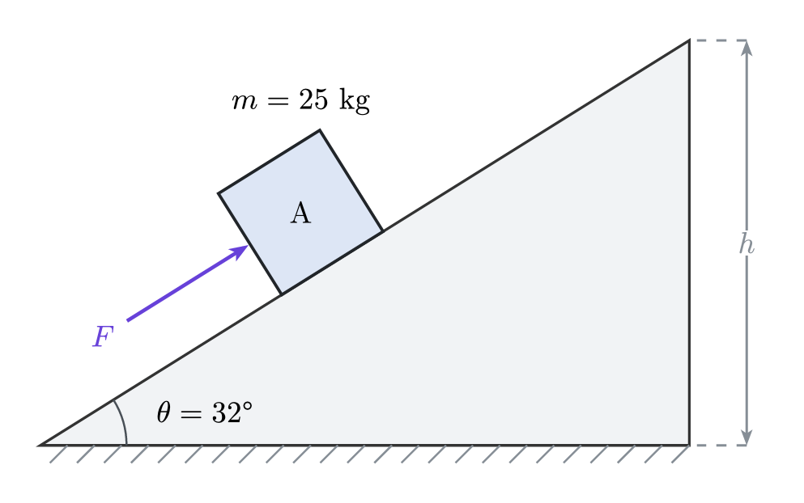
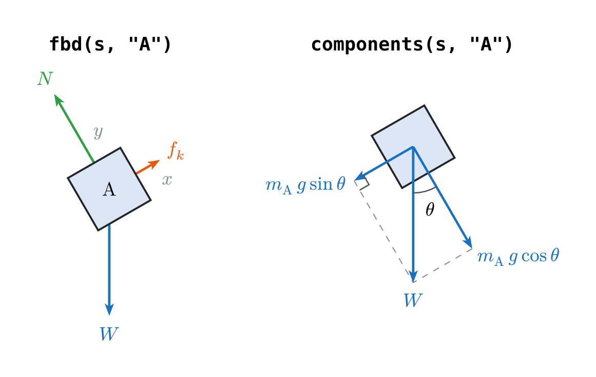
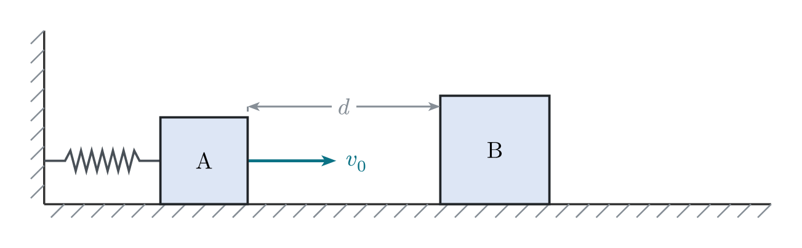
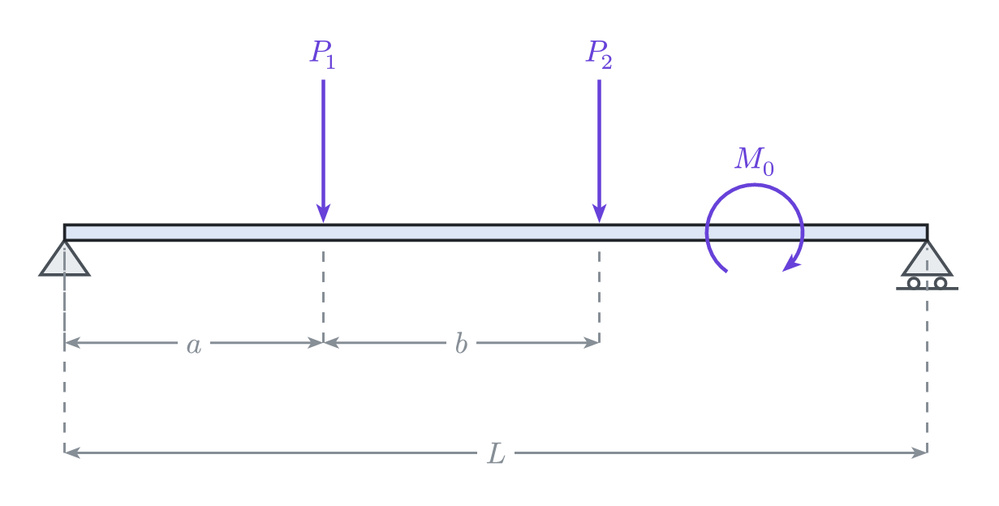
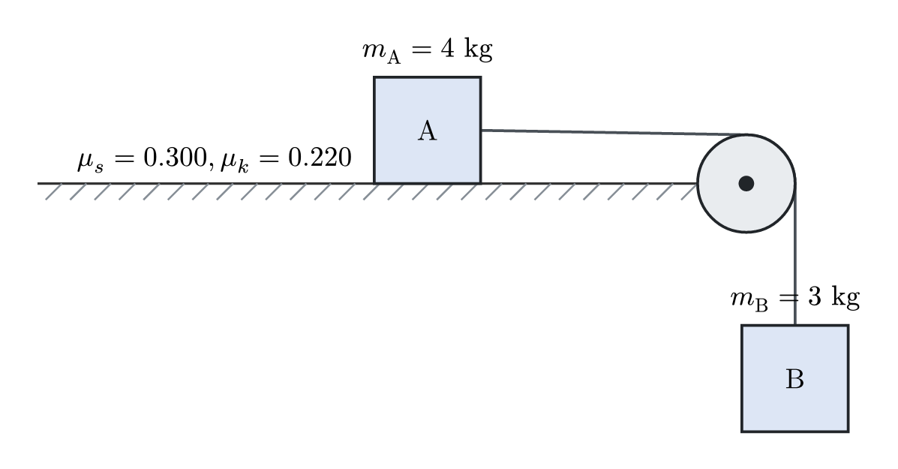
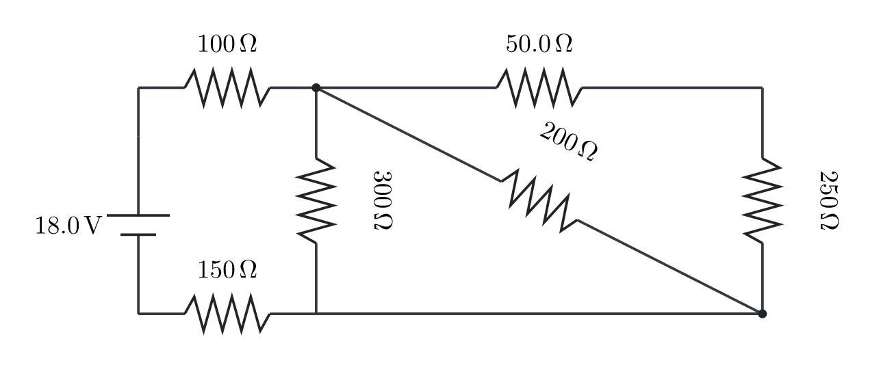

# typed-physics

A Typst drawing library that also understands physics.



```typst
#import "@preview/typed-physics:0.1.1": *

#let s = situation(
  ramp("incline", angle: 32deg, length: 8),
  block("A", mass: 25, on: "incline", at: 45%, size: 1.25, symbol: $m$),
  force(on: "A", magnitude: $F$, angle: 32deg),
)

#scene(s, labels: "both", angles: "both", dimensions: (
  dimension(from: "incline.apex", to: "incline.base",
    orientation: "vertical", side: "right", label: $h$),
))
```

Nothing takes coordinates. A body says which surface it rests on and how far
along it sits, a connector says which two points it spans, and a circuit says
what is in series and what is in parallel. Change `angle:` from 32° to 40° and
the hatching, the block, its rotation, the angle arc, the height dimension, and
the answer all move together.

Built on [CeTZ](https://typst.app/universe/package/cetz).

> `block` is this package's body constructor, so importing with `*` shadows
> Typst's own `block`. Reach for it as `std.block`, or import only the names you
> use.

## One declaration, four artifacts

The figure, the free-body diagram, the component decomposition, and the answer
are views of the same situation, so they cannot drift apart.

```typst
#let s = situation(
  ramp("incline", angle: 30deg, length: 7),
  block("A", mass: 4, on: "incline", at: 55%, mu: (s: 0.40, k: 0.30)),
)

#scene(s)
#fbd(s, "A")
#components(s, "A")
#solve(s)                    // a = 2.36 m/s², down the incline
#solve(s, find: "normal")    // N = 34.0 N
```



Because it knows mechanics, it can disagree with you:

```typst
#block("A", mass: 4, on: "incline", at: 95%)
```

```text
error: assertion failed: typed-physics: block "A" hangs off the end of
       "incline" by 0.150 — move it back with `at:` or shrink it with `size:`
```

And it decides the friction regime rather than assuming it:

```typst
#let answer = results(s)
#answer.regime            // "sliding"
#answer.required.value    // 19.6 — the friction the situation needs
#answer.available.value   // 13.6 — the most this contact can supply
```

## Examples

### A spring, a moving block, and a gap

```typst
#let s = situation(
  ground("floor", length: 10),
  wall("wall", side: left, height: 2.4),
  block("A", on: "floor", at: 22%, size: 1.2),
  block("B", on: "floor", at: 62%, size: 1.5),
  spring("s", from: (on: "wall"), to: "A.left", coils: 7),
  velocity(on: "A", angle: 0deg, label: $v_0$),
)

#scene(s, dimensions: (
  dimension(from: "A.right", to: "B.left",
    orientation: "horizontal", side: "above", label: $d$),
))
```

Because the wall attachment omits `at:`, the spring infers the height of the
body anchor and stays horizontal. Add an explicit wall ratio such as
`(on: "wall", at: 22%)` when the spring should use that exact point instead.



### A simply supported beam

```typst
#let s = situation(
  rod("beam", length: 9, label: none),
  support("A", at: "beam.start", kind: "pin"),
  support("B", at: "beam.end", kind: "roller"),
  force(on: "beam", at: 30%, magnitude: $P_1$, angle: -90deg, label: $P_1$),
  force(on: "beam", at: 62%, magnitude: $P_2$, angle: -90deg, label: $P_2$),
  torque(on: "beam", at: 80%, direction: "clockwise", radius: 0.5, label: $M_0$),
)

#scene(s, dimensions: (
  dimension(from: "beam.start", to: (on: "beam", at: 30%),
    side: "below", offset: 1.15, label: $a$),
  dimension(from: (on: "beam", at: 30%), to: (on: "beam", at: 62%),
    side: "below", offset: 1.15, label: $b$),
  dimension(from: "beam.start", to: "beam.end",
    side: "below", offset: 2.3, label: $L$),
))
```



### A rope over a pulley

```typst
#let s = situation(
  ground("floor", length: 8, mu: (s: 0.300, k: 0.220)),
  block("A", mass: 4, on: "floor", at: 55%, size: 1.2),
  pulley("wheel", at: "floor.end", radius: 0.55),
  block("B", mass: 3, hanging: "wheel.right", drop: 1.6, size: 1.2),
  rope("cord", from: "A.right", to: "B.top", over: "wheel"),
)

#scene(s, labels: "both", frictions: true)
```



### A DC circuit

Components take no coordinates, wire paths, or rotations. `route:` says how a
branch of a `parallel` travels between the split and join nodes, which is how a
network takes a shape.

```typst
#import "@preview/typed-physics:0.1.1": electricity as e

#let circuit = e.dc-circuit(
  e.voltage-source("V", voltage: 18),
  e.series(
    e.resistor("R100", resistance: 100),
    e.parallel(
      e.resistor("R300", resistance: 300, route: "under"),
      e.resistor("R200", resistance: 200, route: "direct"),
      e.series(
        e.resistor("R50", resistance: 50),
        e.resistor("R250", resistance: 250),
        route: "over",
      ),
    ),
    e.resistor("R150", resistance: 150),
  ),
)

#e.diagram(circuit, labels: "value")
```



A circuit is derived as well as drawn. Series resistances add, parallel
resistances add as reciprocals, and capacitances do the opposite. Your
declaration is already that tree, so every network `series` and `parallel` can
compose reduces:

```typst
#e.solve(circuit)                    // R_eq = 336 Ω
#e.solve(circuit, find: "current")   // I = 0.0536 A
#e.solve(circuit, "R200")            // V_R200 = 4.60 V
#e.component-table(circuit)
```

Quantities are the DC steady state, which is decided rather than assumed: a
capacitor carries no current, so one in series stops its whole branch, and the
voltage that branch does not drop across its resistors stands across its
capacitors instead, dividing as *Q/C*.

## Vocabulary

Surfaces and bodies:

```typst
#ground(length: 8, from: none, mu: none)
#wall(side: left, height: 4, from: none, mu: none)
#ceiling(length: 8, height: 4, from: none, mu: none)
#ramp("incline", angle: 30deg, length: 6, facing: right, symbol: auto)
#arc("loop", radius: 2, start-angle: -90deg, end-angle: 270deg, side: "outside")

#block("A", mass: none, on: none, at: 50%, touching: none, side: right,
  hanging: none, drop: 1.5, size: 1, mu: none, symbol: auto)
#ball("A", radius: 0.5)        // and every `block` argument
#point-mass("A", radius: 0.09)
#disk("A", radius: 0.6)
#ring("A", radius: 0.6)
```

Connectors, structures, loads, and motion:

```typst
#pulley("P", at: none, radius: 0.4)
#rope("r", from: none, to: none, over: none)
#spring("s", from: none, to: none, coils: 6, width: 0.28)

#rod("beam", from: none, to: none, length: 4, angle: 0deg, mass: none)
#pivot("O", at: none, radius: 0.12)
#support("A", at: none, kind: "pin", angle: 0deg, size: 0.5)
#pendulum("p", from: none, length: 3, angle: 20deg, mass: none)

#force(on: none, at: auto, magnitude: none, angle: 0deg, label: auto)
#torque(on: none, at: auto, magnitude: none, direction: "counterclockwise")
#velocity(on: none, magnitude: none, angle: 0deg, label: auto)
#angular-velocity(on: none, magnitude: none, direction: "counterclockwise")
```

Views, each taking the situation first:

```typst
#scene(s, labels: "name", angles: "value", loads: true, frictions: false,
  lengths: false, dimensions: (), forces: none, components: none, style: (:))
#fbd(s, name, axes: auto, outline: true, solve: true, style: (:))
#components(s, name, of: "weight", style: (:))
#draw(s)                      // CeTZ elements, to compose with your own

#solve(s, ..name, find: auto, direction: true, assume: auto)
#force-table(s, ..name, assume: auto)
#results(s, ..name, assume: auto)
#forces(s, name)
#model-of(s, ..name)
#solved-models()
```

`dimension(from:, to:, orientation:, side:, offset:, label:, ...)` builds the
annotations `scene(dimensions:)` takes.

Electrical names live under the `electricity` namespace:

```typst
#e.dc-circuit(source, network, style: (:))
#e.voltage-source("V", voltage: none, unit: auto, label: auto)
#e.resistor("R1", resistance: none, unit: auto, label: auto, route: auto)
#e.capacitor("C1", capacitance: none, unit: auto, label: auto, route: auto)
#e.series(..branches, route: auto)
#e.parallel(..branches, route: auto)

#e.diagram(circuit, labels: "both", fold: auto, style: (:))
#e.solve(circuit, ..name, find: auto)
#e.results(circuit)
#e.component-table(circuit)
```

## Numbers as far as they reach

Every answer is carried as far towards a value as the numbers you declared
allow. All numeric gives a number; a symbolic coefficient among numbers folds
the numbers in and leaves the coefficient standing; nothing numeric gives the
closed form.

```typst
#let s = situation(
  ramp("incline", angle: 30deg, length: 6),
  block("A", mass: $m$, on: "incline", at: 50%, mu: (s: $mu_s$, k: $mu_k$)),
)
#solve(s, find: "normal")     // N = 8.50 m N
#solve(s, assume: "sliding")  // a = 4.90 - 8.50 mu_k m/s², down the incline
```

A declared angle always carries its number, so `sin θ` and `cos θ` fold even
when everything around them is symbolic. The untouched closed form is still in
the tree `results()` hands back, and `tests/test.typ` prints it for every model
beside the formula a textbook gives.

Whether a body slides is a question about numbers. When a coefficient is
symbolic the package says so instead of guessing, and `assume:` is how you
answer it yourself.

## What gets solved

There is no general solver here, and that is a choice. A situation reaches an
answer in closed form when its unknowns can be ordered so each is determined by
ones already found, which holds whenever a body shares no unknown force with
anything else that can move. Two bodies joined by a rope share a tension; two
bodies in contact share a pair of contact forces; a body on a curved support
carries a centripetal acceleration no declaration states.

So mechanics is a named, finite list of models, and the list is the promise:

| Model | What it is |
| --- | --- |
| `single-contact-body` | One body with a `mass:` on a `ground`, `ramp`, `wall`, or `ceiling`, carrying only the loads it declares. Gives the normal force, the friction force, the regime, and the acceleration. |
| `hanging-body` | One body with a `mass:` hanging from a fixed attachment, with nothing else on its rope. Gives the tension. |

Anything else is declined by name, with the shared unknown that was found:

```text
typed-physics: no solved model matches "A": body "B" rests against it, and
two bodies in contact share a pair of contact forces that has to be found
together with their motion.
```

**No figure goes through a model.** A situation nothing solves still draws,
still shows its free-body diagram, and still lists the forces acting, with the
magnitudes a model would have supplied left blank.

Circuits are different: reduction is total over every network the grammar can
express, so a circuit is never declined. Only a quantity a circuit does not have
is, such as the resistance of a network no steady current passes through.

## Styling

A diagram style covers a whole figure. An element style covers one declared
thing and wins for that element alone.

```typst
#let s = situation(
  ramp("incline", angle: 30deg),
  block("A", mass: 4, on: "incline", at: 50%,
    style: block-style(fill: luma(230))),
  style: (body-fill: rgb("#DDE6F5"), scale: 0.9),
)
#scene(s, style: (force-colors: (applied: red)))
```

`block-style`, `surface-style`, `force-style`, and `connector-style` build the
sparse dictionaries a `style:` takes. `theme` is the exported dictionary of
every diagram-style default. An unknown key is an error, not a silent no-op.

## Documentation

The [user guide](https://github.com/GeronimoCastano/typed-physics/blob/ee8c812677f20e14aca8908d12223f3c68adbaba/docs/documentation.pdf)
documents every element, view, argument, and style key, with a runnable example
for each.

## License

MIT
