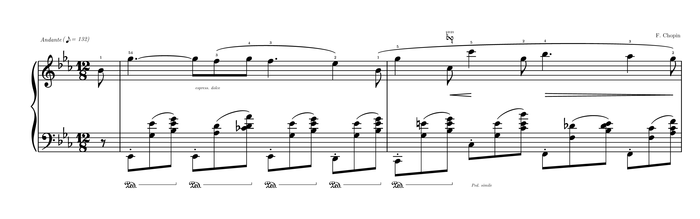
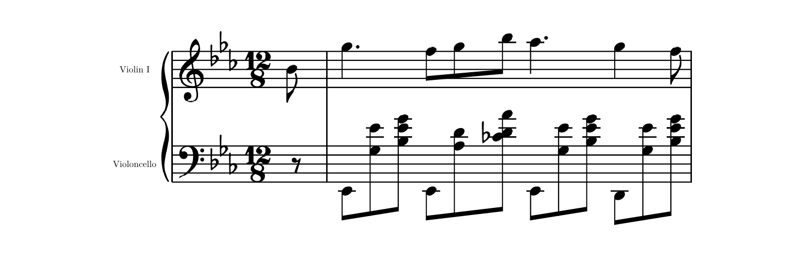
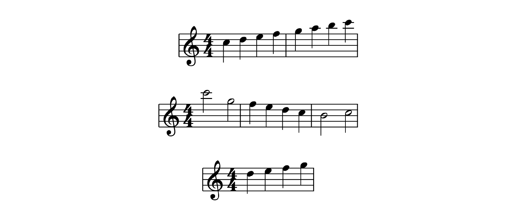

# typed-scores

See the [documentation](https://github.com/GeronimoCastano/typed-scores/blob/3ee50d55643a98825bd5bd2f7280d514d1c402b9/docs/documentation.pdf) for the complete reference.



`typed-scores` engraves western music notation directly in Typst. Compact event
strings are parsed by a Rust/WASM plugin; Typst and CeTZ lay out the resulting
score with bundled Bravura glyphs.

```typst
#import "@preview/typed-scores:0.1.0": *
```

## Quick start

`bar` is the quick one-staff, one-measure helper. It accepts only notes,
clef, key, and time.

```typst
#bar(
  "g4:e a4:e b4:e c5:e d5:e e5:e f#5:e g5:e",
  clef: "treble",
  key: "G",
  time: "4/4",
)
```

Use `score` for every complete score. A single staff needs no invented name:

```typst
#score(
  clef: "treble",
  time: "4/4",
  bars: (
    (notes: "c5:q d5:q e5:q f5:q"),
    (notes: "g5:h e5:h"),
  ),
)
```


Omitting `key` uses C major (`key: "C"`).

For multiple staves, declare stable staff IDs once. Each bar then supplies one
event string (or an array of simultaneous voice strings) for every ID. Add
`label` for a first-system staff name and
`short-label` for the optional abbreviation on later systems.

```typst
#score(
  staves: (
    upper: (clef: "treble", label: "Violin I", short-label: "Vln. I"),
    lower: (clef: "bass", label: "Violoncello", short-label: "Vc."),
  ),
  key: "Eb",
  time: "12/8",
  bars: (
    (
      partial: "1/8",
      upper: "bb4:e",
      lower: "r:e",
    ),
    (
      upper: "g5:q. f5:e g5:e bb5:e ab5:q. g5:q f5:e",
      lower: "eb2:e (g3 eb4):e (bb3 eb4 g4):e eb2:e (ab3 d4):e (cb4 d4 ab4):e eb2:e (g3 eb4):e (bb3 eb4 g4):e d2:e (g3 eb4):e (bb3 eb4 g4):e",
    ),
  ),
  beams: true,
)
```



Bar metadata belongs beside the staff content. `clef`, `key`, `time`, and
`tempo` persist from the bar where they appear; `partial` validates an
incomplete bar. For a multi-staff clef change, use a staff map such as
`clef: (lower: "treble")`. Mid-system clefs are reduced; the active clefs at a
new system are full-size.

For an engraved metronome mark, use named beat values instead of pasting a
musical character:

```typst
tempo: (text: [Andante], beat: "eighth", bpm: 132)
```

`beat` accepts `whole`, `half`, `quarter`, `eighth`, `sixteenth`, and
`thirty-second`; the package draws the matching Bravura note glyph.

## Harmony symbols

Use a bar's `harmony` field for chord symbols above the top staff. Its value is
a duration-bearing sequence of author-controlled symbols, so it can change
inside a bar. Each symbol is centered on the onset where its harmony becomes
active, including when a change falls between melody note onsets.

```typst
#score(
  time: "4/4",
  bars: (
    (
      notes: "c5:q d5:q e5:q f5:q",
      harmony: "Cmaj7:h A7:h",
    ),
    (
      notes: "g5:h e5:h",
      harmony: "Dm7:q G7:q Cmaj7:h",
    ),
  ),
)
```

Write each symbol as `symbol:duration`; the harmony sequence must fill the
active bar. Symbols such as `F#7(b9)`, `Bb/D`, and `N.C.` are rendered as
written.

## System layout

Multi-system scores justify their timed gaps to fill `width` by default. The
line breaker evaluates all complete-bar partitions and chooses balanced density,
rather than applying a fixed number of bars per system. One-system scores remain
at their natural width; use `ragged-right: false` to justify one too.
`ragged-last: true` leaves only the final system natural-width.

Use `indent` and `short-indent` (in staff spaces) to reserve left space for the
first system and later systems respectively; each indented system still reaches
the same right edge.

```typst
#score(
  time: "4/4",
  width: 36,
  indent: 3.5,
  ragged-last: true,
  bars: (
    (notes: "c5:q d e f"),
    (notes: "g5:q a b c6"),
    (notes: "c6:h g5:h"),
    (notes: "f5:q e d c"),
    (notes: "b4:h c5:h"),
    (notes: "d5:q e f g"),
  ),
)
```



## Barlines, navigation, and endings

Use `barline` for repeat marks and `ending` for first/second-ending brackets:

```typst
#score(
  clef: "treble",
  time: "2/4",
  bars: (
    (barline: (left: "repeat-start"), notes: "c5:q d5:q"),
    (ending: (label: "1.", start: true), notes: "e5:q f5:q"),
    (
      barline: (right: "repeat-end"),
      ending: (label: "1.", stop: true),
      notes: "g5:q a5:q",
    ),
    (ending: (label: "Final", start: true), notes: "b5:q a5:q"),
    (ending: (label: "Final", stop: true), notes: "g5:h"),
  ),
)
```


At one shared boundary, a repeat end and start combine into the conventional
double-sided repeat barline. Volta brackets continue across wrapped systems,
and their `label` is literal text such as `"1."`, `"2."`, or `"Final"`.
Right edges additionally accept `double`, `final`, and `dashed`. A bar can carry
a boxed `rehearsal` label and a `navigation` mark; `"segno"` and `"coda"` use
Bravura symbols while other values render literally. Coincident bar numbers
stay closest to the staff, and long boundary text reserves horizontal room
before the next bar. Set `bar-numbers` to
`"systems"` or `"all"`, and offset numbering with `first-bar-number`.

## Event language

| Syntax | Meaning |
|---|---|
| `c4:q` or `c4q` | C4 quarter note |
| `ce` or `c:e` | Relative C with an eighth-note duration |
| `c4:q d e f` | Four quarter notes using inherited register and duration |
| `bb4:e.` | B-flat dotted eighth |
| `c##5:q` / `dbb5:q` | Double-sharp / double-flat quarter note |
| `(a4 c e):h (f a c)` | Relative chord pitches and inherited duration |
| `r:q` | Quarter rest |
| `_` | Rest filling the remaining measure duration |
| `~` | Tie the preceding event to the next event |
| `/` | Break the automatic beam before the next event |
| `-` | Join the adjacent flagged events into one beam group |
| `tuplet 3:2 { c:e d e }` | Inline time-scaled music group |
| `acciaccatura { d:e } f:q` | Slashed single grace note resolving to F |
| `tremolo 16 { c:h g:h }` | Two-note alternating sixteenth tremolo |
| `(c e g):h[arpeggio=up]` | Upward arpeggio over a chord |
| `[s1(]` … `[s1)]` | Named slur |

Durations are `w`, `h`, `q`, `e`, `s`, and `t`; append `.` or `..` for dots.
An explicit duration becomes the current value for that staff; a note, chord,
or ordinary rest without one inherits it across barlines. The first omitted
duration defaults to `q`, while `_` does not change the current value. Omission
never stretches an event to fill a measure; incorrect totals remain errors.

Pitch letters are ASCII case-insensitive: `c4`, `C4`, and mixed-case input all
have identical pitch and octave semantics. Lowercase is the documented compact
style, while uppercase remains accepted. Compact `ce` and explicit `c:e` both
mean an eighth-note C; whitespace distinguishes that event from `c e`, which
means two notes. Case never selects an octave.

Pitches accept `#`, `b`, `##`, or `bb`. In lowercase, `bb4` is B-flat 4 and
`bbb4` is B-double-flat 4. After a single note spells an octave, later single
notes may omit it: `g4:e a b c` resolves to G4, A4, B4, C5, all
as eighth notes. The pitch anchor also continues independently across bars;
an explicit octave resets it. If a staff begins without an anchor, treble,
alto, and tenor use octave 4, while bass uses octave 3. Key signatures and
accidentals do not alter this register calculation.

Chords use LilyPond-style relative entry. Their first written pitch resolves
from the current staff anchor, and each remaining pitch resolves from the
preceding pitch inside that chord. Afterward, the chord's first written pitch
becomes the external anchor. Use explicit octaves whenever a voicing should
span a different octave than the nearest-pitch rule selects.

Tuplets stay inside the note string: `tuplet 3:2 { c5:e d e }` writes three
eighths in the time of two. By default, the centered numerator has no bracket
when a single visible beam spans the entire group; otherwise it receives one.
The italic numeral is optically centered through the interrupted bracket line,
using LilyPond's bracket weight and hook height.
Use `bracket=always`, `bracket=never`, `side=above`, or `side=below` in the
group header when an explicit engraving choice is needed, for example
`tuplet 3:2[bracket=always side=below] { c5:e d e }`. Groups may nest.

Grace notes also stay inside the string and consume no bar time. Use
`grace { ... }`, `acciaccatura { ... }`, or `appoggiatura { ... }`; the latter
two slur from the first grace event into the following principal note. Grace
stems and beams default upward and those slurs curve below, following
LilyPond's grace settings. Heads and flags use the smaller grace scale, while
stems retain normal weight and grace beams use their own engraving thickness.
A grace slur retains the normal slur weight rather than shrinking with its
noteheads.
A single flagged acciaccatura receives the customary slash; a multi-note
beamed acciaccatura omits it. Flagged grace groups beam independently.

Write repeated-note strokes as `c5:h[tremolo=16]`, and a two-note alternation as
`tremolo 16 { c5:h g5:h }`. For a single event, subdivisions 8, 16, 32, and 64
draw one, two, three, and four strokes respectively, independent of its written
duration. The strips use LilyPond's beam-weight thickness, vertical end edges,
and stem-tip-relative placement. Append `arpeggio`, `arpeggio=up`, or
`arpeggio=down` to a chord to draw a full-height wave immediately to its left,
with an arrow at the requested end for a directional form.

Annotations follow an event in square brackets: fingering (`f=4`),
articulations (`stacc`, `tenuto`, `accent`, `marcato`), dynamics (`dyn=pp`,
`dyn=mf`, `dyn=sfz`), fermatas, breath marks, text directions, turns, named
slurs, pedal spans, and hairpins. Ties must join adjacent events with the same
written pitch or chord and continue across wrapped systems.

For independent rhythms on one staff, make the staff content an array of two
to four strings. Voice 1 stems upward, voice 2 downward, and later voices
alternate. Coincident identical noteheads merge; colliding seconds and unisons
shift horizontally. Keep the same voice count for that staff in every bar.

For multiple staves, `group: "brace"`, `"bracket"`, `"line"`, or `"none"`
controls the system grouping symbol. The default `auto` chooses the customary
style from the number of staves. Key changes automatically print cancellation
naturals before the new signature when required.

## Current limitations

- One to four rhythmic voices per staff are supported; each staff's voice count
  is fixed across its bars.
- Lyrics and cross-staff notation are not yet in the public DSL.
- Grace groups exclude rests, tuplets, and nested ornamental groups.
- Arpeggio signs currently span a chord on one staff, not a cross-staff piano
  arpeggio.
- Pedals and hairpins do not split automatically at system breaks.
- Dense markings may need `staff-gap`, `note-spacing`, or `scale` adjustment.

See the [user guide](https://github.com/GeronimoCastano/typed-scores/blob/3ee50d55643a98825bd5bd2f7280d514d1c402b9/docs/documentation.pdf)
for the complete reference. The
[five-piece release showcase](https://github.com/GeronimoCastano/typed-scores/blob/ad89a0fc891f9eb71d67b83731af872992f5a56e/examples/showcase.pdf)
includes famous piano, string-score, solo-cello, and alto-saxophone excerpts;
its reusable [source fixtures and reference notes](https://github.com/GeronimoCastano/typed-scores/tree/ad89a0fc891f9eb71d67b83731af872992f5a56e/examples)
live alongside it.
