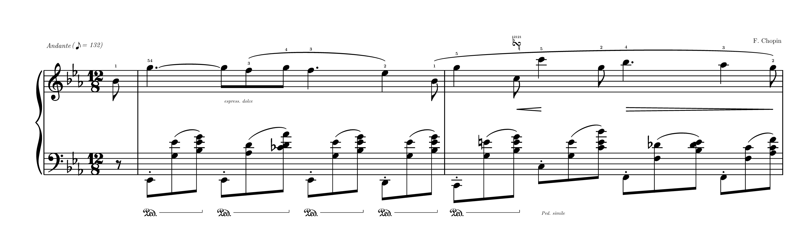
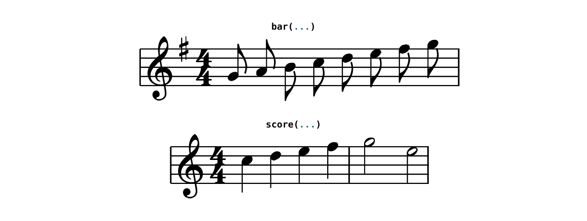
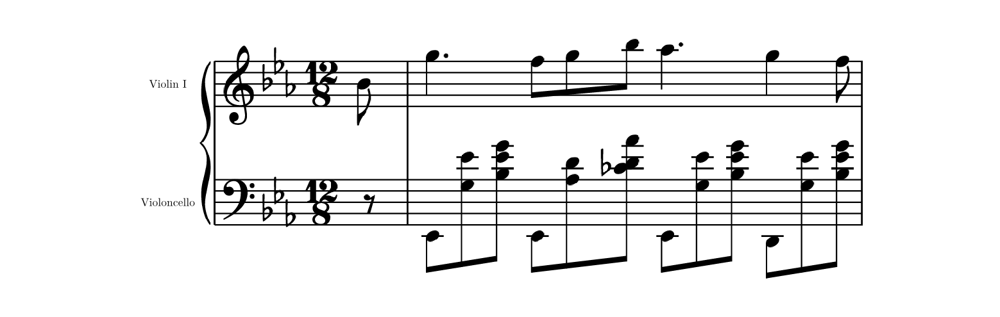
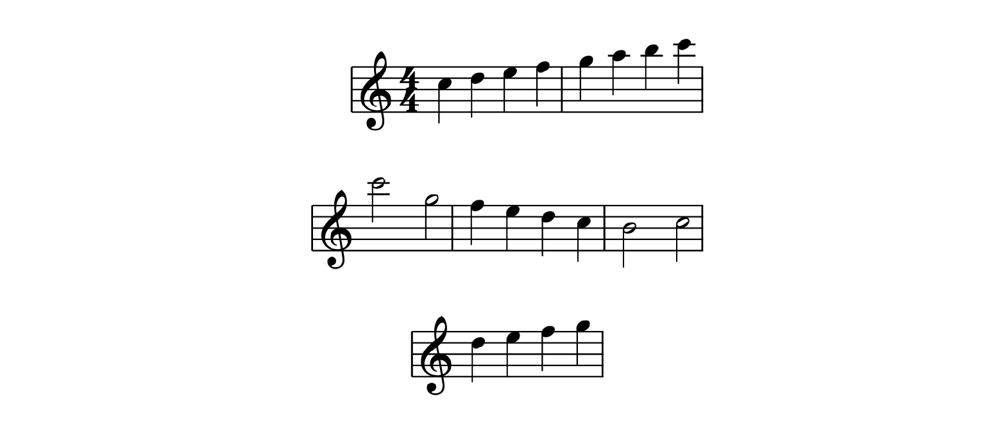
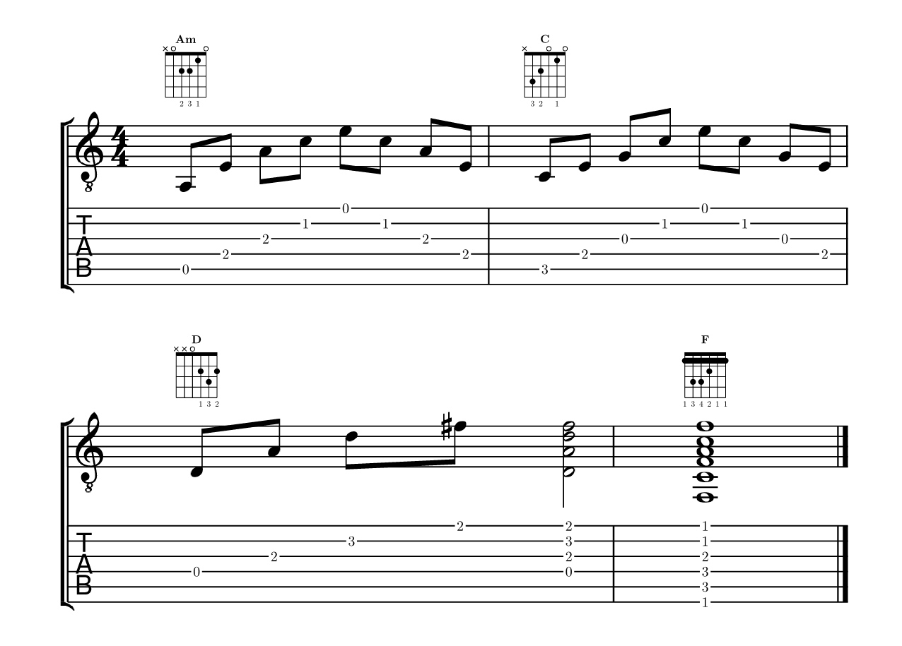

# typed-scores

See the [documentation](https://github.com/GeronimoCastano/typed-scores/blob/b74f43d77bb6e00ab9b737b87859c86beb395c7e/docs/documentation.pdf) for the complete reference.



`typed-scores` engraves western music notation directly in Typst. Compact event
strings are parsed by a Rust/WASM plugin; Typst and CeTZ lay out the resulting
score with bundled Bravura glyphs.

```typst
#import "@preview/typed-scores:0.6.0": *
```

## Quick start

`bar` is the quick one-staff, one-measure helper. It accepts notes, optional
lyrics, clef, key, and time.

```typst
#bar(
  "g4:e a4:e b4:e c5:e d5:e e5:e f#5:e g5:e",
  lyrics: "Sing __ through _ the _ night __",
  clef: "treble",
  key: "G",
  time: "4/4",
)
```

Use `score` for every complete score. A single staff needs no invented name:

```typst
#score(
  clef: "treble",
  time: "4/4",
  bars: (
    (notes: "c5:q d5:q e5:q f5:q"),
    (notes: "g5:h e5:h"),
  ),
)
```



Omitting `key` uses C major (`key: "C"`).

Notation uses `theme: "auto"` by default, following the surrounding solid
Typst text color. Set `theme: "light"` for black ink or `theme: "dark"` for
white ink; the setting recolors staff geometry and bundled Bravura glyphs
together. Because `auto` is resolved while Typst compiles, HTML integrations
that apply a dark theme only through later CSS should pass `theme: "dark"`.

For multiple staves, declare stable staff IDs once. Each bar then supplies one
event string (or an array of simultaneous voice strings) for every ID. Add
`label` for a first-system staff name and
`short-label` for the optional abbreviation on later systems.

```typst
#score(
  staves: (
    upper: (clef: "treble", label: "Violin I", short-label: "Vln. I"),
    lower: (clef: "bass", label: "Violoncello", short-label: "Vc."),
  ),
  key: "Eb",
  time: "12/8",
  bars: (
    (
      partial: "1/8",
      upper: "bb4:e",
      lower: "r:e",
    ),
    (
      upper: "g5:q. f5:e g5:e bb5:e ab5:q. g5:q f5:e",
      lower: "eb2:e (g3 eb4):e (bb3 eb4 g4):e eb2:e (ab3 d4):e (cb4 d4 ab4):e eb2:e (g3 eb4):e (bb3 eb4 g4):e d2:e (g3 eb4):e (bb3 eb4 g4):e",
    ),
  ),
  beams: true,
)
```



Bar metadata belongs beside the staff content. `clef`, `key`, `time`, and
`tempo` persist from the bar where they appear; `partial` validates an
incomplete bar. For a multi-staff clef change, use a staff map such as
`clef: (lower: "treble")`. Mid-system clefs are reduced; the active clefs at a
new system are full-size.

`clef: "percussion"` draws the neutral percussion clef. Its lines and spaces
read as a treble staff's do, so a drum kit writes the bass drum as `f4` and the
snare as `c5`. Percussion notes take no accidentals, and the staff shows no key
signature even when the other staves do.

Cymbals take X noteheads. Give the staff a drum map with `heads`, and every
note at a listed pitch takes that head; declared staves accept `heads` beside
their `clef`.

```typst
#score(
  clef: "percussion",
  heads: (g5: "x", a5: "circle-x"),
  time: "4/4",
  beams: true,
  bars: (
    (notes: (
      "g5:e g g g a5:q (g5 c5)",
      "f4:q c5 f4 c5",
    )),
  ),
)
```

A single note can also name its shape: `[x]`, `[circle-x]`, or `[normal]` after
a note, after a chord for every head, or after one pitch inside a chord, as in
`(g5[circle-x] c5):q`. A written shape wins over the map and works on any
staff.

For an engraved metronome mark, use named beat values instead of pasting a
musical character:

```typst
tempo: (text: [Andante], beat: "eighth", bpm: 132)
```

`beat` accepts `whole`, `half`, `quarter`, `eighth`, `sixteenth`, and
`thirty-second`; the package draws the matching Bravura note glyph.

## Harmony symbols

Use a bar's `harmony` field for chord symbols above the top staff. Its value is
a duration-bearing sequence of author-controlled symbols, so it can change
inside a bar. Each symbol is centered on the onset where its harmony becomes
active, including when a change falls between melody note onsets.

```typst
#score(
  time: "4/4",
  bars: (
    (
      notes: "c5:q d5:q e5:q f5:q",
      harmony: "Cmaj7:h A7:h",
    ),
    (
      notes: "g5:h e5:h",
      harmony: "Dm7:q G7:q Cmaj7:h",
    ),
  ),
)
```

Write each symbol as `symbol:duration`; the harmony sequence must fill the
active bar. Symbols such as `F#7(b9)`, `Bb/D`, and `N.C.` are rendered as
written.

## Transposition and parts

Type music at concert pitch and set `transpose` to draw a transposing
instrument's written part. The value is an interval from the pitches as typed
to the pitches as drawn, such as `M2` (B-flat clarinet or trumpet), `M6`
(alto saxophone), `P5` (F horn), or `-P8` (piccolo). Notes, key signatures,
and chord-symbol roots all move; relative octaves resolve as typed, before the
interval applies. Percussion pitches and drum-map entries keep their original positions.

```typst
#score(
  key: "D",
  time: "4/4",
  transpose: "M6",
  bars: (
    (notes: "F#4:q F# G A", harmony: "D:h A7:h"),
    (notes: "F#:q. E:e E:h", harmony: "D:h A:h"),
  ),
)
```

A part whose key would need more than six sharps or flats takes the
enharmonic key instead, so concert F-sharp major for alto saxophone is written
in E-flat major, with notes and chord symbols spelled to match.

`part` extracts one staff from a multi-staff score. Keep the score's arguments
in a dictionary, engrave the full score from it, and spread `part` into
another `score` call for each instrumental part:

```typst
#let duet = (
  staves: (
    sax: (clef: "treble", label: "Alto Sax"),
    cello: (clef: "bass", label: "Cello"),
  ),
  key: "D",
  time: "4/4",
  bars: (
    (sax: "F#4:q F# G A", cello: "D3:w"),
    (sax: "F#:q. E:e E:h", cello: "A2:w"),
  ),
)

#score(..duet)                                // concert score
#score(..part(duet, "sax"), transpose: "M6")  // alto sax part
```

The part keeps its staff's clef changes and lyrics plus every bar's key,
meter, tempo, harmony, barlines, endings, and marks; `staff-gap` and `group`
are dropped. A mirrored tab staff requires its notation source and cannot be extracted alone; extract that source or write independent tab content.

## Figured bass

Use a bar's `figures` field for continuo figures below the bottom staff. Like
harmony, it is a duration-bearing sequence that fills the bar. A token is one
figure (`6:q`), a stack written top to bottom (`(6 4):q`), or `_:q` for a
stretch without figures.

```typst
#score(
  clef: "bass",
  time: "4/4",
  bars: (
    (notes: "c3:h b2", figures: "_:h (6 4):q (5 3):q"),
    (notes: "a2:q g2 f2:h", figures: "(7 #):q (#6 5):q n:h"),
  ),
)
```

A figure is a number with an optional accidental (`#`, `b`, `n`, `##`, `bb`) or
`+` printed where it is written, so `#6` gives ♯6 and `6b` gives 6♭. An
accidental alone alters the third, and `_` inside a stack keeps an empty row.
Figures that change during a held bass note get their own onset column.


## Lyrics

Add `lyrics` beside a bar's notes. Syllables align to the main pitched events
of the staff's first voice and contribute to horizontal spacing, system
packing, vertical staff gaps, and system bounds.

```typst
#score(
  time: "4/4",
  bars: (
    (
      notes: "c5:q c d e",
      lyrics: "Twin -- kle twin -- kle",
    ),
  ),
)
```

`--` draws a hyphen without consuming a note, `__` consumes a note and extends
the preceding syllable, and `_` consumes a note as a silent lyric skip. An
array supplies multiple verses. In a multi-staff score, map declared staff IDs
to verse strings or arrays:

```typst
#score(
  staves: (
    soprano: (clef: "treble"),
    bass: (clef: "bass"),
  ),
  time: "4/4",
  bars: ((
    soprano: "c5:q d e f",
    bass: "c3:h g2:h",
    lyrics: (
      soprano: ("Hal -- le -- lu -- jah", "Praise _ the Lord"),
      bass: "Low __",
    ),
  ),),
)
```

Hyphens and extenders continue across barlines and wrapped systems. Customize
the lanes with `lyric-size`, `lyric-font`, `lyric-gap`, and `verse-gap`.

## System layout

Multi-system scores justify their timed gaps to fill `width` by default. The
line breaker evaluates all complete-bar partitions and chooses balanced density,
rather than applying a fixed number of bars per system. One-system scores remain
at their natural width within the requested width; use `ragged-right: false`
to justify one too. `ragged-last: true` leaves only the final system at natural
width, bounded by `width` when wrapping. Clefs and keys repeat at system starts;
time signatures appear only where the meter is first set or changes.

Use `indent` and `short-indent` (in staff spaces) to reserve left space for the
first system and later systems respectively; each indented system still reaches
the same right edge.

```typst
#score(
  time: "4/4",
  width: 36,
  indent: 3.5,
  ragged-last: true,
  bars: (
    (notes: "c5:q d e f"),
    (notes: "g5:q a b c6"),
    (notes: "c6:h g5:h"),
    (notes: "f5:q e d c"),
    (notes: "b4:h c5:h"),
    (notes: "d5:q e f g"),
  ),
)
```



## Barlines, navigation, and endings

Use `barline` for repeat marks and `ending` for first/second-ending brackets:

```typst
#score(
  clef: "treble",
  time: "2/4",
  bars: (
    (barline: (left: "repeat-start"), notes: "c5:q d5:q"),
    (ending: (label: "1.", start: true), notes: "e5:q f5:q"),
    (
      barline: (right: "repeat-end"),
      ending: (label: "1.", stop: true),
      notes: "g5:q a5:q",
    ),
    (ending: (label: "Final", start: true), notes: "b5:q a5:q"),
    (ending: (label: "Final", stop: true), notes: "g5:h"),
  ),
)
```


At one shared boundary, a repeat end and start combine into the conventional
double-sided repeat barline. Volta brackets continue across wrapped systems,
and their `label` is literal text such as `"1."`, `"2."`, or `"Final"`.
Right edges additionally accept `double`, `final`, and `dashed`. A bar can carry
a boxed `rehearsal` label and a `navigation` mark; `"segno"` and `"coda"` use
Bravura symbols while other values render literally. Coincident bar numbers
stay closest to the staff, and long boundary text reserves horizontal room
before the next bar. Set `bar-numbers` to
`"systems"` or `"all"`, and offset numbering with `first-bar-number`.

## Event language

| Syntax | Meaning |
|---|---|
| `c4:q` or `c4q` | C4 quarter note |
| `ce` or `c:e` | Relative C with an eighth-note duration |
| `c4:q d e f` | Four quarter notes using inherited register and duration |
| `bb4:e.` | B-flat dotted eighth |
| `c##5:q` / `dbb5:q` | Double-sharp / double-flat quarter note |
| `(a4 c e):h (f a c)` | Relative chord pitches and inherited duration |
| `r:q` | Quarter rest |
| `s:q` | Invisible spacer: takes a quarter's time, draws nothing |
| `_` | Rest filling the remaining measure duration |
| `c2:e g2 @upper e4 g4` | Draw the following events on staff `upper` |
| `(c3 g3 @upper e4 c5):h` | Split chord: one stem across two staves |
| `~` | Tie the preceding event to the next event |
| `/` | Break the automatic beam before the next event |
| `-` | Join the adjacent flagged events into one beam group |
| `tuplet 3:2 { c:e d e }` | Inline time-scaled music group |
| `cue { c:e d }` | Cue-sized notes that keep their rhythmic value |
| `acciaccatura { d:e } f:q` | Slashed single grace note resolving to F |
| `tremolo 16 { c:h g:h }` | Two-note alternating sixteenth tremolo |
| `(c e g):h[arpeggio=up]` | Upward arpeggio over a chord |
| `(c3 e3 g3):h[string=5,4,3]` | Tab strings for each pitch, in written order |
| `[s1(]` … `[s1)]` | Named slur |
| `(g5[x] c5):q` / `g5:q[circle-x]` | X or circled-X noteheads, per pitch or per event |
| `heads: (g5: "x")` | Staff drum map: noteheads by pitch |
| `[8va(]` … `[8va)]` | Ottava bracket over sounding pitches |

Durations are `w`, `h`, `q`, `e`, `s`, and `t`; append `.` or `..` for dots.
An explicit duration becomes the current value for that staff; a note, chord,
or ordinary rest without one inherits it across barlines. The first omitted
duration defaults to `q`, while `_` does not change the current value. Omission
never stretches an event to fill a measure; incorrect totals remain errors.

Pitch letters are ASCII case-insensitive: `c4`, `C4`, and mixed-case input all
have identical pitch and octave semantics. Lowercase is the documented compact
style, while uppercase remains accepted. Compact `ce` and explicit `c:e` both
mean an eighth-note C; whitespace distinguishes that event from `c e`, which
means two notes. Case never selects an octave.

Pitches accept `#`, `b`, `##`, or `bb`. In lowercase, `bb4` is B-flat 4 and
`bbb4` is B-double-flat 4. After a single note spells an octave, later single
notes may omit it: `g4:e a b c` resolves to G4, A4, B4, C5, all
as eighth notes. The pitch anchor also continues independently across bars;
an explicit octave resets it. If a staff begins without an anchor, treble,
alto, tenor, and percussion use octave 4, while bass uses octave 3. Key
signatures and accidentals do not alter this register calculation.

Chords use LilyPond-style relative entry. Their first written pitch resolves
from the current staff anchor, and each remaining pitch resolves from the
preceding pitch inside that chord. Afterward, the chord's first written pitch
becomes the external anchor. Use explicit octaves whenever a voicing should
span a different octave than the nearest-pitch rule selects.

Tuplets stay inside the note string: `tuplet 3:2 { c5:e d e }` writes three
eighths in the time of two. By default, the centered numerator has no bracket
when a single visible beam spans the entire group; otherwise it receives one.
The italic numeral is optically centered through the interrupted bracket line,
using LilyPond's bracket weight and hook height.
Use `bracket=always`, `bracket=never`, `side=above`, `side=below`, or
`number=never` in the group header when an explicit engraving choice is needed,
for example `tuplet 3:2[bracket=always side=below] { c5:e d e }`. The numeral
and bracket are controlled independently. Groups may nest.

`cue { ... }` draws notes, chords, and rests at the reduced grace-note size
while keeping their full rhythmic value, so a small tuplet upbeat such as
`cue { tuplet 3:2[number=never] { g4:t d5 d } }` still fills its measure.
Cue-sized and normal-sized notes never share a beam.

Grace notes also stay inside the string and consume no bar time. Use
`grace { ... }`, `acciaccatura { ... }`, or `appoggiatura { ... }`; the latter
two slur from the first grace event into the following principal note. Grace
stems and beams default upward and those slurs curve below, following
LilyPond's grace settings. Heads and flags use the smaller grace scale, while
stems retain normal weight and grace beams use their own engraving thickness.
A grace slur retains the normal slur weight rather than shrinking with its
noteheads.
A single flagged acciaccatura receives the customary slash; a multi-note
beamed acciaccatura omits it. Flagged grace groups beam independently.

Write repeated-note strokes as `c5:h[tremolo=16]`, and a two-note alternation as
`tremolo 16 { c5:h g5:h }`. For a single event, subdivisions 8, 16, 32, and 64
draw one, two, three, and four strokes respectively, independent of its written
duration. The strips use LilyPond's beam-weight thickness, vertical end edges,
and stem-tip-relative placement. Append `arpeggio`, `arpeggio=up`, or
`arpeggio=down` to a chord to draw a full-height wave immediately to its left,
with an arrow at the requested end for a directional form.

Annotations follow an event in square brackets: fingering (`f=4`),
articulations (`stacc`, `tenuto`, `accent`, `marcato`), dynamics (`dyn=pp`,
`dyn=mf`, `dyn=sfz`), fermatas, breath marks, text directions, ornaments
(`turn`, `inverted-turn`, `chromatic-turn`, `trill`, `mordent`,
`inverted-mordent`), named slurs, pedal spans, hairpins, and ottava brackets.
Ties must join adjacent events with the same written pitch or chord and
continue across wrapped systems.

An ottava span opens with `[8va(]` and closes with `[8va)]`; `8vb`, `15ma`, and
`15mb` work the same way. Notes are written at sounding pitch and drawn one or
two octaves nearer the staff, so `c6:q[8va(] d e f g6:q[8va)]` sits inside the
treble staff under a dashed `8va` bracket. Brackets cross barlines and continue
across system breaks with the bare numeral.

For independent rhythms on one staff, make the staff content an array of two
to four strings. Voice 1 stems upward, voice 2 downward, and later voices
alternate. Coincident identical noteheads merge; colliding seconds and unisons
shift horizontally. Keep the same voice count for that staff in every bar.

### Cross-staff notation

A voice belongs to the staff whose field holds its text, but `@staff` draws
the voice's following events on another staff, with that staff's clef, until
the next switch or the end of the bar. Switches reset at every bar, so each
bar reads on its own. A note drawn away from home points its stem back toward
its home staff, and the voice keeps its rhythm, beams, slurs, and dynamics. A
beam group that joins two staves becomes a kneed beam between them, and the
staves open far enough for it. Inside a chord, `@staff` sends the remaining
pitches to the neighboring staff under one shared stem, and an `arpeggio` on
such a split chord spans both staves. Use the spacer `s` to fill time on a
staff with no notes of its own.

```typ
#score(
  staves: (upper: (clef: "treble"), lower: (clef: "bass")),
  time: "2/4",
  beams: true,
  bars: (
    (upper: "s:h", lower: "c2:s g2 @upper e4 g4 c5 g4 @lower e3 c3"),
  ),
)
```

Slurs follow a phrase across the staves, and one whose notes lie on two staves
arches above them. Ties need both notes on the same staff. Accidentals hold
per staff for every voice drawn there.
`examples/beethoven-moonlight-coda.typ` sets the cross-staff coda of the
"Moonlight" Sonata's finale.

For multiple staves, `group: "brace"`, `"bracket"`, `"line"`, or `"none"`
controls the system grouping symbol. The default `auto` chooses the customary
style from the number of staves. Key changes automatically print cancellation
naturals before the new signature when required.

## Guitar notation

Guitar music pairs standard notation with tablature, and typed-scores writes
both from one event string. The `treble-8` clef (and `bass-8` for bass guitar)
takes the pitches the instrument sounds and prints them an octave up, as
guitar music is written. A staff with `clef: "tab"` draws tablature; `source`
makes it repeat another staff's music, so bars never write it twice.

```typst
#score(
  staves: (
    guitar: (clef: "treble-8"),
    tab: (clef: "tab", source: "guitar"),
  ),
  time: "4/4",
  chord-diagrams: guitar-chords,
  beams: true,
  bars: (
    (guitar: "a2:e e3 a3 c4 e4 c4 a3 e3", harmony: "Am:w"),
    (guitar: "c3:e e3 g3 c4 e4 c4 g3 e3", harmony: "C:w"),
    (guitar: "d3:e a3 d4 f#4 (d3 a3 d4 f#4):h", harmony: "D:w"),
    (guitar: "(f2 c3 f3 a3 c4 f4):w", harmony: "F:w"),
  ),
)
```



Each note takes the lowest fret that reaches it. Notes that start together
share out the strings, a note still ringing in another voice keeps its
string, and a tied note stays on the string it was tied from. Add
`[string=2]` to choose a string (1 is the highest), or `[string=5,4,3]` to
choose one per chord pitch in written order. A tab staff draws fret numbers,
leaving rests, stems, and marks to the notation it repeats. A tied note
reappears in parentheses only when it continues onto a new system, and tab
lines break around each number so they read on any page color.

`tuning` takes a preset (`"guitar"`, `"drop-d"`, `"dadgad"`, `"open-g"`,
`"bass"`, `"ukulele"`) or an array of open-string pitches from the lowest
string, such as `("d2", "a2", "d3", "g3", "b3", "e4")`. A tab staff with no
notation beside it prints the time signature itself.

`chord-diagram("x32010", name: "C", fingers: "032010")` draws a fretboard box
anywhere in a document. Shapes list the lowest string first; separate the
entries once frets reach 10 (`"x 7 9 9 9 7"`). A finger laid across several
strings draws a barre, and shapes above the fourth fret move the grid up with
a position label. In a score, `chord-diagrams` maps harmony symbols to shapes
and draws each diagram above its symbol. The bundled `guitar-chords` library
covers major, minor, 7, m7, and maj7 chords on every root, plus common sus and
add9 shapes; extend it with `guitar-chords + ("Cadd9/G": "332033")`, and map a
symbol to `none` to leave it without a diagram.

## Importing MusicXML and ABC

`import-score` engraves an existing MusicXML (`.musicxml`, `.xml`, or
compressed `.mxl`) or ABC 2.1 file with the same renderer as hand-written
input. Pass the file's contents, since a package cannot open files in your
project:

```typst
#import "@preview/typed-scores:0.6.0": import-score, read-score

#import-score(read("song.mxl", encoding: none))
#import-score(read("tunes.abc"), tune: 12, scale: 0.8, theme: "dark")
```

The format is detected from the contents, `tune` picks an ABC tune by its `X:`
number, and any other named argument overrides the imported `score()` option.
`read-score` returns the conversion instead: `arguments` for `score()`, the
`title`, `warnings` about notation that could not be reproduced, and `source`,
an equivalent Typst file whose bars are ordinary event strings you can copy and
edit.

```typst
#let song = read-score(read("song.musicxml", encoding: none))
#score(..song.arguments, scale: 0.8, bar-numbers: "all")
```

Parts become labeled staves (a piano part becomes an upper and a lower staff),
and MusicXML voices become voice strings, with cross-staff notes written as
`@staff` switches. The importer carries over:

- notes, chords, rests, ties, dots, tuplets, grace and cue notes, and the
  source beaming;
- clef, key, meter, and tempo changes, pickups and other short bars as
  `partial`, repeats, first and second endings, rehearsal marks, and
  segno/coda signs;
- slurs, dynamics, hairpins, pedal marks, articulations, ornaments, fermatas,
  fingerings, arpeggios, tremolo strokes, and text directions;
- chord symbols as `harmony`, and lyric verses with hyphens and extenders.

`read-score` lists every conversion loss in `warnings` and the header of `source`. `import-score` reports those losses as an error; inspect the conversion with `read-score` before explicitly rendering its reviewed `arguments`. Conversion losses include ties joining only part of a chord or crossing staves, lyrics
under a second voice, grace notes inside a tuplet, mid-bar clef changes (moved
to the next barline), and the separate key signatures of transposing parts.
Breves, notes shorter than a thirty-second, and a bar holding more music than
its meter stop the import with an error naming the bar. Imported scores use
`scale: 0.7`; lower `scale` or `note-spacing` if a dense bar does not fit. Malformed numeric fields, zero durations or denominators, invalid pitches,
and more than two dots report errors. A single duration may expand into at
most 256 tied note values; divide longer values across shorter measures.

## Current limitations

- One to four rhythmic voices per staff are supported; each staff's voice count
  is fixed across its bars.
- Cross-staff beams and split chords join two neighboring staves; stems cannot
  be flipped by hand, and ties cannot cross staves.
- Grace groups exclude rests, tuplets, and nested ornamental groups.
- Ottava requires a pitched notation staff; put octave markers on the notation source when mirroring tab.
- Tablature cannot show notehead maps or mirror unpitched percussion.
- Independent tab rejects notation annotations it cannot draw; place markings
  on the notation source staff. Tuning pitches use octaves -1 through 9.
- Tab staves draw fret numbers only (no rhythm stems, bends, slides, or
  hammer-ons yet), and automatic fretting picks the lowest position per onset
  rather than planning a phrase; use `string=` to hold a position.
- Pedals and hairpins do not split automatically at system breaks.
- Ottava spans stay on their voice's staff, figured bass sits under the bottom
  staff without continuation lines, and percussion staves have five lines.
- Dense markings or lyric verses may need `staff-gap`, `note-spacing`,
  `lyric-gap`, `verse-gap`, or `scale` adjustment.

See the [user guide](https://github.com/GeronimoCastano/typed-scores/blob/b74f43d77bb6e00ab9b737b87859c86beb395c7e/docs/documentation.pdf)
for the complete reference. The
[five-piece release showcase](https://github.com/GeronimoCastano/typed-scores/blob/b74f43d77bb6e00ab9b737b87859c86beb395c7e/examples/showcase.pdf)
includes famous piano, string-score, solo-cello, and alto-saxophone excerpts;
its reusable [source fixtures and reference notes](https://github.com/GeronimoCastano/typed-scores/tree/b74f43d77bb6e00ab9b737b87859c86beb395c7e/examples)
live alongside it.
