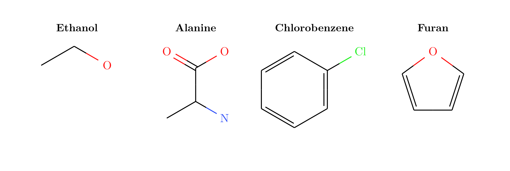
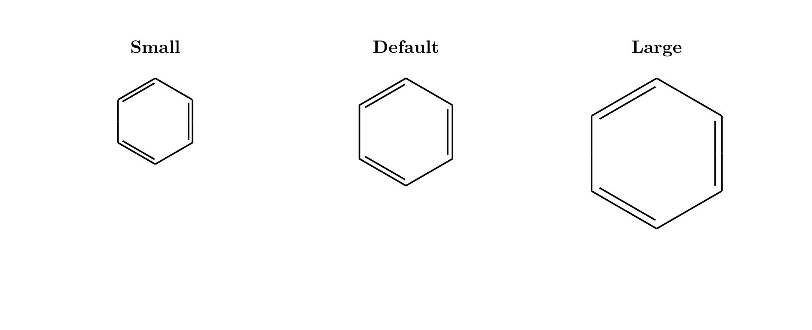
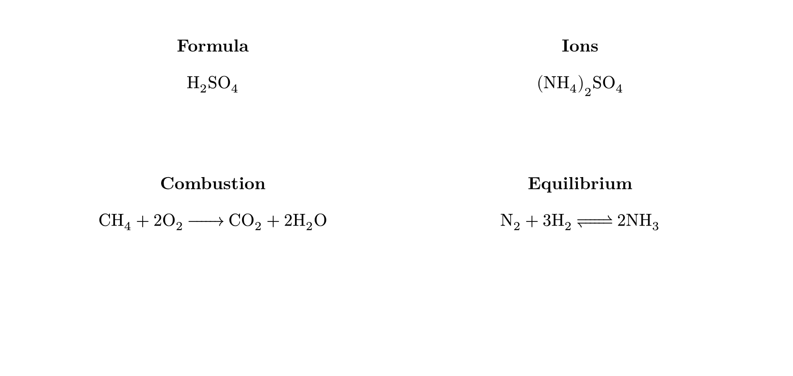
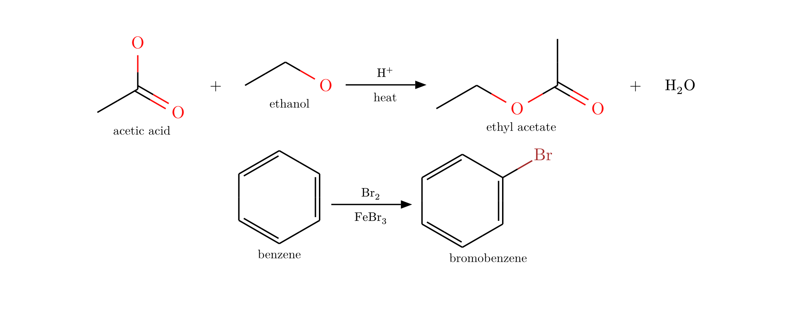
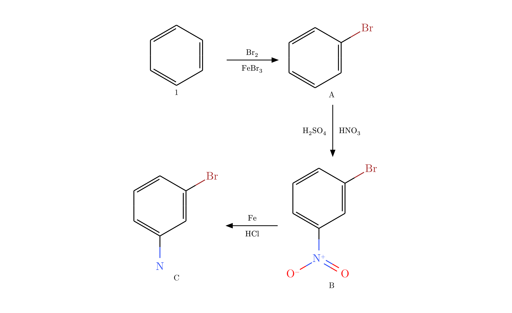
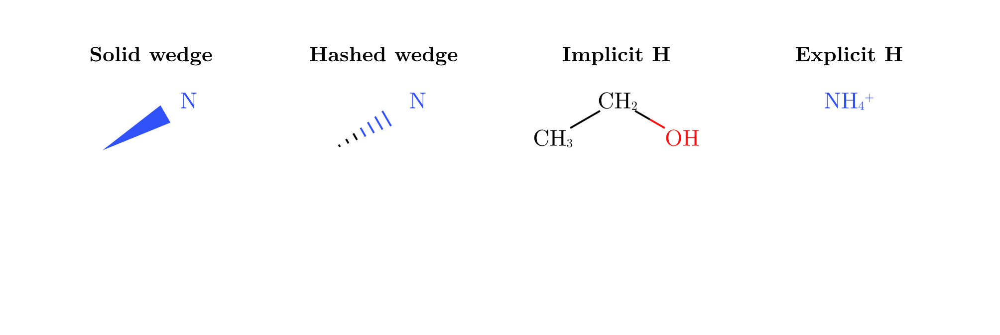

# typed-smiles

`typed-smiles` renders SMILES strings as clean 2D molecular diagrams in Typst.
It uses a small Rust/WASM plugin for parsing and layout, then draws the result
with CeTZ.

The package is meant for chemistry notes, reaction schemes, reports, and
teaching material where you want molecules to live directly in your Typst
source instead of copying diagrams from a separate editor.

## Basic molecule drawing

Start by importing `smiles`. Pass a SMILES string and the package will draw the
skeletal structure.

```typst
#import "@preview/typed-smiles:0.1.1": smiles

#grid(
  columns: (1fr, 1fr, 1fr, 1fr),
  gutter: 1.2em,
  align: center,

  [*Ethanol* \ #smiles("CCO")],
  [*Alanine* \ #smiles("CC(N)C(=O)O")],
  [*Chlorobenzene* \ #smiles("ClC1=CC=CC=C1")],
  [*Furan* \ #smiles("C1=CC=CO1")],
)
```



## Scaling

Use `bond-length` to scale diagrams. The scale is uniform, so the molecule keeps
its aspect ratio. Here is the same molecule drawn at three sizes:

```typst
#grid(
  columns: (1fr, 1fr, 1fr),
  gutter: 1.2em,
  align: center,

  [*Small* \ #smiles("C1=CC=CC=C1", bond-length: 0.8)],

  [*Default* \ #smiles("C1=CC=CC=C1")],

  [*Large* \ #smiles("C1=CC=CC=C1", bond-length: 1.4)],
)
```



## Chemical formulas and equations

`typed-smiles` re-exports `ce` from `chemformula`, so the same import can handle
ordinary formulas and text-based chemical equations. This is useful for salts,
small inorganic species, conditions, and equations where a full molecular
diagram would be unnecessary.

```typst
#import "@preview/typed-smiles:0.1.1": ce

#grid(
  columns: (1fr, 1fr),
  gutter: 1.2em,
  row-gutter: 1em,
  align: center,

  [*Formula* \ #ce("H2SO4")],
  [*Ions* \ #ce("(NH4)2SO4")],
  [*Combustion* \ #ce("CH4 + 2O2 -> CO2 + 2H2O")],
  [*Equilibrium* \ #ce("N2 + 3H2 <=> 2NH3")],
)
```



## Reaction schemes

For structural reaction schemes, use `reaction`, `rxn-arrow`, and `mol`. These
helpers let you combine SMILES-based molecule diagrams with `ce()` formulas,
plus signs, labels, and arrow conditions in one layout.

```typst
#import "@preview/typed-smiles:0.1.1": smiles, ce, rxn-arrow, mol, reaction

#reaction(
  mol(smiles("CC(=O)O"), label: text(size: 8pt)[acetic acid]),
  [+],
  mol(smiles("CCO"), label: text(size: 8pt)[ethanol]),
  rxn-arrow(above: ce("H+"), below: [heat]),
  mol(smiles("CCOC(=O)C"), label: text(size: 8pt)[ethyl acetate]),
  [+],
  ce("H2O"),
)

#reaction(
  mol(smiles("C1=CC=CC=C1"), label: text(size: 8pt)[benzene]),
  rxn-arrow(above: ce("Br2"), below: ce("FeBr3")),
  mol(smiles("BrC1=CC=CC=C1"), label: text(size: 8pt)[bromobenzene]),
)
```



## Multi-step mechanisms

Reaction arrows can point right, left, up, or down. This lets you write compact
wrap-around schemes without manually placing every molecule.

```typst
#reaction(
  mol(smiles("C1=CC=CC=C1"), label: text(size: 8pt)[1]),
  rxn-arrow(above: ce("Br2"), below: ce("FeBr3")),
  mol(smiles("BrC1=CC=CC=C1"), label: text(size: 8pt)[A]),
  rxn-arrow(dir: "down", above: ce("HNO3"), below: ce("H2SO4")),
  mol(smiles("BrC1=CC(=CC=C1)[N+](=O)[O-]"), label: text(size: 8pt)[B]),
  rxn-arrow(dir: "left", above: ce("Fe"), below: ce("HCl")),
  mol(smiles("BrC1=CC(=CC=C1)N"), label: text(size: 8pt)[C]),
)
```



## Wedges, dashed bonds, and hydrogens

Use `/` for a solid wedge and `\` for a hashed wedge. By default, carbon
hydrogens stay implicit, but `show-h: true` displays computed implicit
hydrogens. Explicit bracket hydrogens, such as `[NH4+]`, are always shown.

```typst
#grid(
  columns: (1fr, 1fr, 1fr, 1fr),
  gutter: 1.2em,
  align: center,

  [*Solid wedge* \ #smiles("C/N")],
  [*Hashed wedge* \ #smiles("C\\N")],
  [*Implicit H* \ #smiles("CCO", show-h: true)],
  [*Explicit H* \ #smiles("[NH4+]")],
)
```



## API

### `#smiles(smiles-str, bond-length, atom-font-size, color, rotation, show-h)`

Renders a SMILES string as a 2D skeletal molecular diagram.

| Parameter | Type | Default | Description |
|---|---|---|---|
| `smiles-str` | `str` | required | OpenSMILES string |
| `bond-length` | `float` | `1.0` | Uniform bond length scale factor; `1.0` equals 30pt per bond |
| `atom-font-size` | `length` | `11pt` | Atom label font size |
| `color` | `bool` | `true` | Apply Jmol CPK atom colors |
| `rotation` | `angle` | `0deg` | Rotate the molecule while keeping atom labels upright |
| `show-h` | `bool` | `false` | Show computed implicit hydrogens |

`#display-smiles` is an alias for `#smiles`.

### `#rxn-arrow(above, below, dir)`

Creates an arrow for `#reaction`.

| Parameter | Type | Default | Description |
|---|---|---|---|
| `above` | `content` | `none` | Label above a horizontal arrow, or right of a vertical arrow |
| `below` | `content` | `none` | Label below a horizontal arrow, or left of a vertical arrow |
| `dir` | `str` | `"right"` | One of `"right"`, `"left"`, `"down"`, or `"up"` |

### `#mol(content, label: none)`

Wraps a molecule or formula with an optional centered label below it.

### `#reaction(gap-h, gap-v, ..items)`

Lays out molecules, formulas, plus signs, and `rxn-arrow` values in a reaction
scheme. Directional arrows move the placement cursor, so multi-line schemes can
be written as a single sequence.

## SMILES support

The package uses the [`smiles-parser`](https://crates.io/crates/smiles-parser)
crate for parsing.

Current limitations:

- Aromatic lowercase atoms are not parsed by `smiles-parser` 0.4. Use Kekule
  forms such as `C1=CC=CC=C1` instead of `c1ccccc1`.
- Directional `/` and `\` bonds are rendered as wedge/hash bonds, but the
  package does not yet perform full stereochemical interpretation.
- Bridged bicyclics may have atom overlap; template matching is not implemented.
- Implicit hydrogen counts use a simple standard-valence model.

## Building

```sh
# Run native Rust tests
cargo test --manifest-path plugin/Cargo.toml

# Build the WASM plugin used by Typst
./build.sh

# Compile the visual test document
typst compile --root . tests/test.typ tests/test.pdf
```

## Architecture

```text
SMILES string -> Rust WASM plugin -> JSON layout -> CeTZ drawing in Typst
```

The Rust plugin handles parsing and 2D coordinates. The Typst layer is a thin
renderer plus reaction-scheme helpers.

## License

MIT
