# typed-smiles

`typed-smiles` renders SMILES strings as clean 2D molecular diagrams in Typst.
It uses a small Rust/WASM plugin for parsing and layout, then draws the result
with CeTZ.

The package is meant for chemistry notes, reaction schemes, reports, and
teaching material where you want molecules to live directly in your Typst
source instead of copying diagrams from a separate editor.

**Full documentation:** see `docs/documentation.pdf` in the typed-smiles repository for every argument, syntax extension, color option, and reaction-scheme feature with live examples.

## Examples

<table>
<tr>
  <td><a href="https://github.com/GeronimoCastano/typed-smiles/blob/228d5c1fd04e2764568ddbcea6b0884e3b1568eb/assets/readme/examples/ciprofloxacin.typ">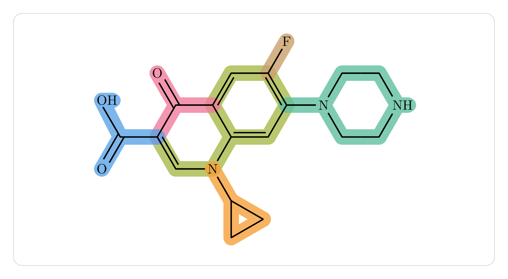</a></td>
  <td><a href="https://github.com/GeronimoCastano/typed-smiles/blob/228d5c1fd04e2764568ddbcea6b0884e3b1568eb/assets/readme/examples/coumarin.typ">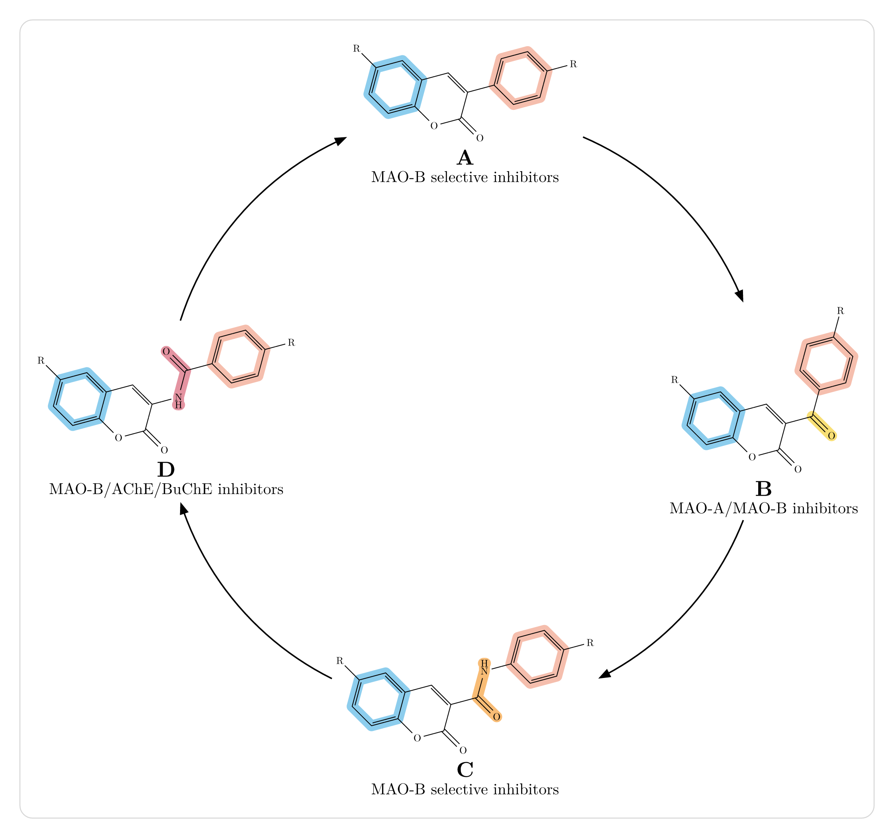</a></td>
</tr>
<tr>
  <td>Ciprofloxacin, with each functional region shaded</td>
  <td>Coumarin scaffold evolution with highlighted pharmacophores</td>
</tr>
<tr>
  <td><a href="https://github.com/GeronimoCastano/typed-smiles/blob/228d5c1fd04e2764568ddbcea6b0884e3b1568eb/assets/readme/examples/watson-crick.typ">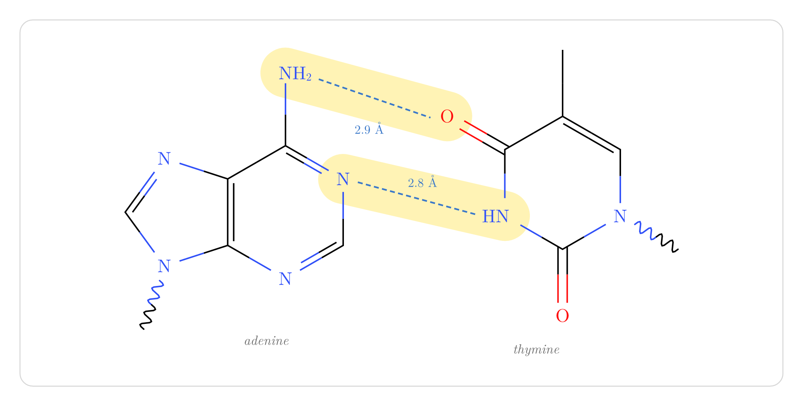</a></td>
  <td><a href="https://github.com/GeronimoCastano/typed-smiles/blob/228d5c1fd04e2764568ddbcea6b0884e3b1568eb/assets/readme/examples/dark-bromination.typ">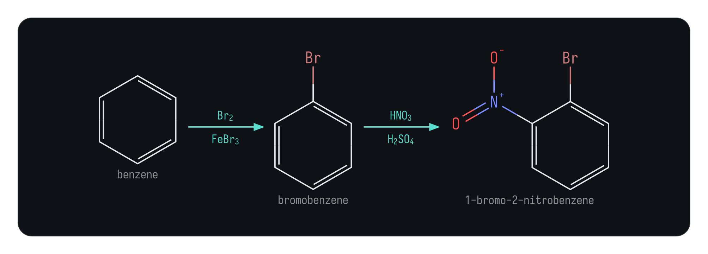</a></td>
</tr>
<tr>
  <td>Watson–Crick A–T pair drawn in CeTZ with <code>smiles-cetz</code></td>
  <td>Bromination then nitration on a dark card with neon arrows and reagents</td>
</tr>
</table>

*Click an example to see its source.*

---

## Quick start

```typst
#import "@preview/typed-smiles:0.13.0": *
```

A wildcard import gives you the molecule renderer, reaction helpers, and
mechanism helpers: `smiles`, `ce`, `mol`, `rxn-arrow`, `reaction`, `atom`,
`bond`, `lp`, `species`, `arrow`, `highlight`, and `brackets`, the series
helpers `align-molecules` and `molecule-grid`, plus the `molecules` library of
named SMILES strings.

## Basic molecule drawing

Pass a SMILES string to `#smiles()` and it draws the skeletal structure.
Aromatic rings can be written either in lowercase aromatic notation
(`c1ccccc1`) or in Kekulé form (`C1=CC=CC=C1`); aromatic input is kekulized
on parse and both render identically.

```typst
#import "@preview/typed-smiles:0.13.0": smiles

#table(
  columns: (1fr, 1fr, 1fr, 1fr),
  gutter: 0em, row-gutter: 0em,
  align: center + horizon,
  stroke: 0.4pt + rgb("#d8d8d8"),

  [*Ethanol*], [*Alanine*], [*Chlorobenzene*], [*Furan*],

  [#smiles("CCO")],
  [#smiles("CC(N)C(=O)O")],
  [#smiles("ClC1=CC=CC=C1")],
  [#smiles("C1=CC=CO1")],
)
```

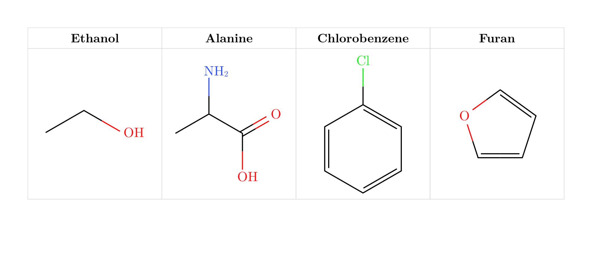

## Named molecules

`molecules` holds SMILES strings for over a hundred common molecules, bundled
with the package so it works offline: solvents, aromatics and heterocycles,
nucleobases, the 20 amino acids, sugars, common drugs and hormones, and
laboratory reagents. Type `molecules.` and the editor suggests the available
names.

```typst
#import "@preview/typed-smiles:0.13.0": smiles, molecules

#smiles(molecules.caffeine)
#smiles(molecules.alanine)
#smiles(molecules.aspirin)
#smiles(molecules.serotonin)
```

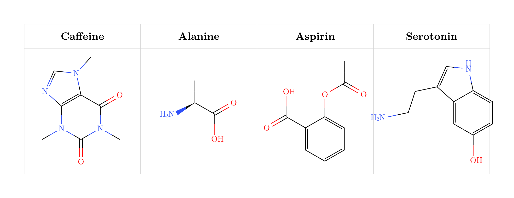

Each entry is a plain SMILES string, so it works anywhere a SMILES string does:
`mol(molecules.ethanol)`, `mol-weight(molecules.aspirin)`, or
`smiles(molecules.benzene, aromatic: "circle")`. Names are lowercase and
hyphenated (`molecules.acetic-acid`); use `molecules.at("acetic-acid")` for a
name stored in a variable. Stereocenters encode the natural or commonly sold
isomer, such as L amino acids and D sugars. The full list is in the
documentation.

## Scaling

`scale` resizes bond length, atom label size, and stroke together. Individual
overrides (`bond-length`, `font-size`, `bond-stroke`) let you tune one dimension
on its own.

```typst
#table(
  columns: (1fr, 1fr, 1fr),
  gutter: 0em, row-gutter: 0em,
  align: center + horizon,
  stroke: 0.4pt + rgb("#d8d8d8"),

  [*Small*], [*Default*], [*Large*],

  [#smiles("C1=CC=CC=C1", scale: 0.8)],
  [#smiles("C1=CC=CC=C1")],
  [#smiles("C1=CC=CC=C1", scale: 1.4)],
)
```

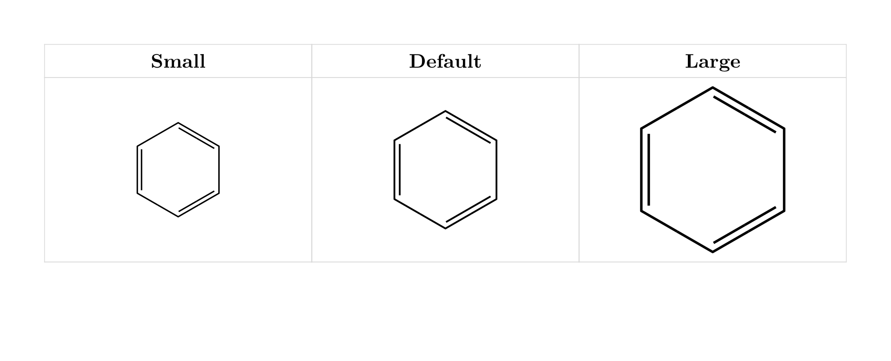

## Journal style presets

`style` fills in bond length, label size, line width, font, and monochrome
atom labels from a journal's published ChemDraw drawing settings — ACS 1996 (14.4 pt bonds,
10 pt labels), RSC (12.2 pt, 7 pt), Nature Portfolio (10.8 pt, 6 pt), and
Wiley/Angewandte (17 pt, 12 pt), all with a Helvetica/Arial stack. Explicit
arguments always win, `scale` multiplies the whole preset, and `"default"`
applies nothing. Pass `color: true` if you want a journal size preset with
CPK colors.

```typst
#smiles("CC(N)C(=O)O", style: "acs")
#smiles("CC(N)C(=O)O", style: "nature")
#smiles("CC(N)C(=O)O", style: "acs", color: true)
#smiles("CC(N)C(=O)O", style: "acs", font-size: 14pt)  // preset + override
```

## Mirroring

`mirror` reflects a molecule horizontally or vertically. Wedges and hashes are
exchanged whenever a single-axis reflection happens, keeping the depicted
stereochemistry intact. The mirror direction is resolved in the final drawing,
so `mirror: "vertical"` preserves left/right even when `rotation` is set. It
works per molecule inside `reaction()` via `mol("...", mirror: "horizontal")`.

```typst
#smiles("CC(=O)OC1=CC=CC=C1C(=O)O")
#smiles("CC(=O)OC1=CC=CC=C1C(=O)O", mirror: "horizontal")
#smiles("CC(=O)OC1=CC=CC=C1C(=O)O", mirror: "vertical")
```

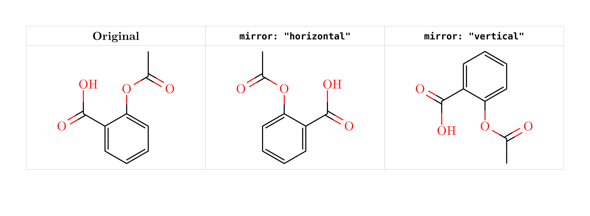

## Aromatic ring circles

Rings written in aromatic (lowercase) notation can draw as single bonds with
an inscribed circle instead of alternating double bonds. Each fully aromatic
ring of a fused system gets its own circle; Kekulé-written input keeps its
explicit bonds.

```typst
#smiles("c1ccccc1", aromatic: "circle")
#smiles("c1ccc2ccccc2c1", aromatic: "circle")
#smiles("Cc1ccncc1", aromatic: "circle")
```

## Hydrogens, labels, and fonts

Heteroatom hydrogens are shown by default; carbon hydrogens stay implicit.
Use `show-h: "all"` for carbon hydrogens, `[NH3]` bracket syntax for
explicit hydrogens, and `{label}` / `{label|style}` for custom group labels.
Use `show-h: "skeleton"` to draw every hydrogen as a separate `H` atom with
its own single bond, turning the molecule into a fully explicit 2D skeleton.
`rotation` and `mirror` transform the entire skeleton, including H positions and
their bonds, while atom labels stay upright.
Eligible unbranched heavy-atom chains become straight rows, with carbon-bound
hydrogens using clean horizontal/vertical displayed-formula directions. Lone
pairs influence non-carbon angles, so water remains bent and three-bond
centers are evenly spread in the 2D schematic. Rings, branches, unsaturated
paths, and stereochemical paths retain the normal heavy-atom layout. The
ordinary molecule layout is unchanged. In the default color mode, element
labels and bonds use the CPK palette and explicit skeleton hydrogens are gray.
Use `>` inside a custom label to choose the attachment glyph, e.g. `{>PPh3}`.
For the cleanest result, rotate the molecule so the bond approaches the chosen
glyph roughly perpendicular to the written label.
Use `_(...)` and `^(...)` for explicit label subscripts and superscripts:
`{PPh_(3)}`, `{NH_4^+}`, and `{SO_(4)^(2-)}`. When both follow one glyph,
they attach to that glyph, so `{NH_4^+}` renders the charge on H rather than 4,
with script sizing and placement matching `ce()` notation. A script at the very
start of a label is drawn ahead of the first glyph: `{^-O_2>C}` reads ⁻O₂C.
`font` sets the atom-label typeface.

```typst
#table(
  columns: (1fr, 1fr, 1fr, 1fr, 1fr),
  gutter: 0em, row-gutter: 0em,
  align: center + horizon,
  stroke: 0.4pt + rgb("#d8d8d8"),

  [*Default hetero H*], [*All H*], [*Explicit H*], [*Colored label*], [*Custom font*],

  [#smiles("CC(N)C(=O)O")],
  [#smiles("CCO", show-h: "all")],
  [#smiles("[NH3]")],
  [#smiles("{>PPh3|P}C=O")],
  [#smiles("CCN", font: "Libertinus Serif")],
)
```

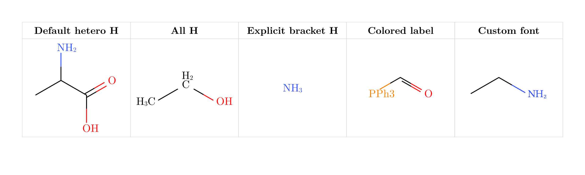

### Manual custom-label offsets

Use `offset=(x, y)` inside a `{label}` to nudge that one labelled atom after
automatic layout. Values are in bond-length units and follow page directions:
positive x moves right and positive y moves up, even on a rotated molecule.
The label and every bond endpoint connected to it move together; the other
automatically placed atoms remain unchanged.

```typst
#smiles("C{H|grey|offset=(0.1, 0.2)}")
#smiles(
  "C{>O|O|lp=2|offset=(-0.2, 0.15)}",
  lone-pairs: "dots",
)
```

Each named modifier has its own pipe-delimited field. To combine color, lone
pairs, and displacement, write
`{H|grey|lp=1|offset=(0.1, 0.1)}`. The optional style must come first; `lp=` and
`offset=` may be placed in either order after it. Large offsets can
intentionally create overlaps.

## Automatic abbreviations

Write the full structure and let `abbreviate` draw common terminal groups as
labels. Pass catalogue names, or `"all"` for every catalogue group that occurs.
In priority order:

| Name | Group | Labels |
|---|---|---|
| `"tBu"` | *tert*-butyl | tBu |
| `"CO2Et"` | ethyl ester, `C(=O)OCC` | CO₂Et / EtO₂C |
| `"CO2Me"` | methyl ester, `C(=O)OC` | CO₂Me / MeO₂C |
| `"OAc"` | acetoxy, `OC(C)=O` | OAc / AcO |
| `"NHAc"` | acetamido, `NC(C)=O` | NHAc / AcHN |
| `"SO3H"` | sulfonic acid, `S(=O)(=O)O` | SO₃H / HO₃S |
| `"CF3"` | trifluoromethyl | CF₃ / F₃C |
| `"NO2"` | nitro, `[N+](=O)[O-]` or `N(=O)=O` | NO₂ / O₂N |
| `"CO2H"` | carboxylic acid, `C(=O)O` | CO₂H / HO₂C |
| `"CO2-"` | carboxylate, `C(=O)[O-]` | CO₂⁻ / ⁻O₂C |
| `"CN"` | nitrile | CN / NC |
| `"CHO"` | aldehyde, `C=O` with one H | CHO / OHC |
| `"OEt"` | ethoxy | OEt / EtO |
| `"OMe"` | methoxy | OMe / MeO |
| `"Ac"` | acetyl, `C(C)=O` | Ac |

Groups are matched on the molecular structure, so every atom order of the same
molecule gives the same drawing. A label reads away from the molecule, and toward its bond when
that bond leaves to the right (MeO, F₃C).

```typst
#smiles("COc1ccc(C(F)(F)F)cc1", abbreviate: ("OMe", "CF3"))
#smiles("CC(=O)Nc1ccc(cc1)[N+](=O)[O-]", abbreviate: "all")
```

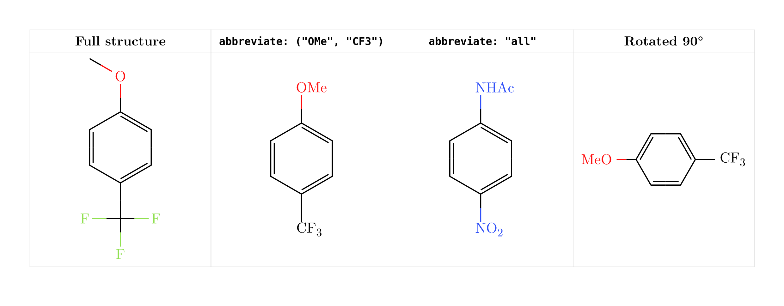

- Atom indices do not change. A label carries its attachment atom's index, so
  `atom(i)` on that atom highlights or targets the label. Referencing an atom
  hidden inside a label — through arrows, highlights, `atom-annotations`,
  `bond-customizations`, `show-h`, or a `highlight-smarts`/`highlight-groups`
  match — is an error; remove the group from `abbreviate` to address it.
- Groups carrying an isotope, an atom map, a stereo mark, an unexpected
  charge, a bracket hydrogen count, or a `{label}` stay expanded. Stereocenters next to a label
  keep their configuration.
- Overlapping candidates follow the catalogue order above, whatever order you
  list them in, so larger groups win: a methyl ester draws as CO₂Me rather
  than OMe, and an acetanilide as NHAc rather than Ac. A group never attaches
  to another automatic label. A group
  named explicitly must be drawn at least once, or the call fails.
- `mol-formula()` and `mol-weight()` always use the full structure.
  `atom-colors: ("{OMe}": purple)` colors an automatic label in both reading
  directions. `mol()`, `smiles-inline()`, and `smiles-cetz()` accept
  `abbreviate` too.

## Atom annotations and per-atom hydrogens

`atom-annotations` places small gray side labels on the emptiest side of an
atom — NMR numbering, Greek positions, footnote marks. Pass a tuple list where
each entry is `(index, content)` or `(index, content, offset)`. Values are
content, so wrap them in `text()` to restyle. `show-h` labels selected carbon
hydrogens with `show-h: 1` or `show-h: (1, 2)`, and labels every implicit
hydrogen with `show-h: "all"`. For a fully explicit drawing, use
`show-h: "skeleton"`:

```typst
#smiles(
  "N[C@@H](C)C(=O)O",
  atom-annotations: (
    (1, [$alpha$], (-0.4, -0.05)),
    (2, [$beta$]),
    (3, [$gamma$], (-0.05, -0.3)),
  ),
)
#smiles("CC(N)C(=O)O", show-h: 1)   // label just the central C-H
#smiles("CC(N)C(=O)O", show-h: "all") // label every implicit H
#smiles("CCO", show-h: "skeleton")   // draw every H with its own bond
```

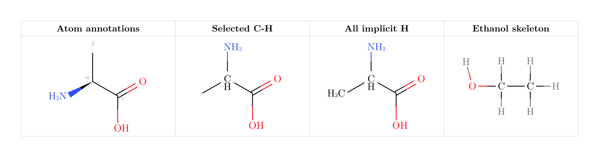

## Lone pairs

Set `lone-pairs` to `"dots"` or `"lines"` to annotate skeletal structures with
non-bonding electron pairs on common organic heteroatoms and charged atoms.

```typst
#smiles("CCO", lone-pairs: "dots")
#smiles("CCN", lone-pairs: "lines")
#smiles("CC(=O)N", lone-pairs: "dots")
```

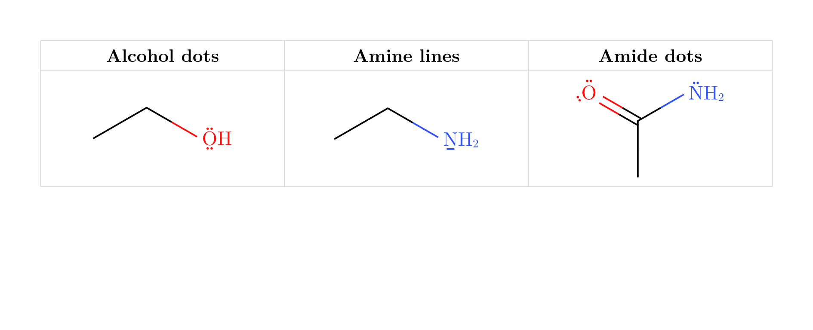

A `{label}` hides its internal bonds, so lone pairs are never inferred from its
text. Declare them explicitly with an inline `lp=N` modifier (1–4), placed after
the optional style field. The pairs are kept clear of the rest of the label and
the bonds, and follow the anchor glyph under rotation.

```typst
#smiles("{>PPh_3|P|lp=1}C=O", lone-pairs: "dots")
#smiles("{>Cl|Cl|lp=3}C", lone-pairs: "dots")
```

## Colors

Atoms are colored with the Jmol CPK palette. Use `atom-colors` to override
specific elements or labeled groups per call, or use `.with()` to set
project-wide defaults. Label colors in `{label|style}` accept 17 named colors
or any `#RRGGBB` hex code. See the documentation for the full color reference.

```typst
// Override an element and a specific label group:
#smiles("{>PPh3}C({OEt})=O",
  atom-colors: (O: rgb("#8B4513"), "{PPh3}": rgb("#7B2D8B")))

// Set defaults for the whole document in the preamble:
#let smiles = smiles.with(
  bond-length: 0.9,
  atom-colors: (O: rgb("#8B4513"), N: rgb("#008080")),
)

// Hex and extra named colors in labels:
#smiles("{Cat|teal}C(=O){Nuc|#E040FB}")
```

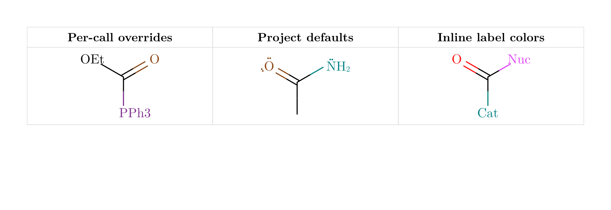

> **Note:** `color: false` is a hard override — it makes everything black
> regardless of any `atom-colors` entries or inline label styles.
> To selectively highlight a group in an otherwise black-and-white diagram,
> set `color: true` and drive everything through `atom-colors`.

## Dark mode and theming

Bond strokes and carbon labels follow `fg`, which defaults to `auto` and
inherits the surrounding text color. On a dark slide theme, `theme: auto`
switches to a dark CPK variant for hues that need more contrast.

```typst
#smiles("NC(Br)C(I)C(=O)O")

#block(fill: rgb("#1E1E24"), inset: 8pt, radius: 4pt)[
  #set text(fill: white)
  #smiles("NC(Br)C(I)C(=O)O")
]
```

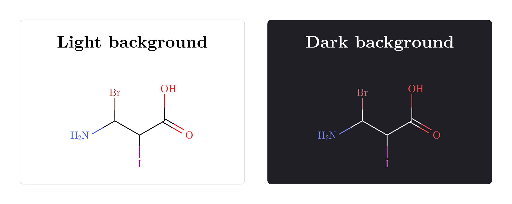

## Bond customizations and opacity

`bond-customizations` restyles individual bonds — color, width, or opacity —
keyed by the same `bond(i, j)` references used for mechanism arrows (turn on
`show-indices: true` while writing them). `opacity` fades a whole molecule,
labels and all, for ghost or de-emphasized species.

```typst
#smiles(
  "CC(=O)OCC",
  bond-customizations: (
    (bond(1, 3), (color: red, stroke: 1.4pt)),  // breaking bond
    (bond(3, 4), (opacity: 30%)),               // fading bond
  ),
)
#smiles("CCO", opacity: 30%)   // ghost molecule
```

Overrides apply to every part of a bond: both lines of a double bond, hash
lines, waves, and dashes. Both options also work per molecule inside
`reaction()` via `mol("...", opacity: 30%)`.

## Substructure highlighting

Highlight a group by its chemistry instead of looking up atom indices:

```typst
#smiles("CC(=O)OC1=CC=CC=C1C(=O)O", highlight-smarts: "C(=O)[OX2H1]")
// The same carboxylic acid group, using its name:
#smiles("CC(=O)OC1=CC=CC=C1C(=O)O", highlight-groups: "carboxylic acid")

#smiles("OCCO", highlight-groups: "alcohol",
  highlight-colors: (rgb("#FFE45C"), rgb("#BBE1FA")))
#smiles-inline("CCO", highlight-groups: "alcohol")
// Bond highlights without endpoint atom disks:
#smiles("Oc1ccccc1", aromatic: "circle",
  highlight-smarts: (pattern: "c1ccccc1", include-atoms: false))
#smiles("CC(=O)O", highlight-groups: (group: "carbonyl", include-atoms: false))
#reaction(
  mol("CC(=O)O", highlight-groups: "carboxylic-acid"),
  rxn-arrow(),
  mol("CC(=O)OC", highlight-groups: "ester"),
)
```

`highlight-smarts` and `highlight-groups` accept a string, a request dictionary,
or a tuple mixing both. Dictionaries use `pattern` for SMARTS and `group` for a
named group, with optional `include-atoms` (default: `true`) and
`include-hydrogens` (default: `auto`). For example,
`highlight-groups: ((group: "carbonyl", include-atoms: false), "alcohol")`
customizes one request while leaving the other at its default.
`include-hydrogens` shades the displayed H labels of selected heteroatoms. With
`auto`, a pattern shades the H of every selected heteroatom, and a named group
shades the H of its own atoms (for example the acid OH); `false` shades none,
and `true` shades every selected heteroatom's H.
Every distinct match shades its atoms and the bonds specified by the
pattern, using the existing disk/capsule highlight style.
Automatic highlights use `include-atoms: true`, joining bond capsules at their
endpoint atoms into a continuous highlight.
Set `include-atoms: false` in a request to shade only its trimmed bond capsules;
standalone matched atoms (including single-atom groups) are still highlighted.
Symmetric mappings of the same atoms **and bonds** count once; overlapping
matches are retained.
Matches are sorted by atom indices, then bonds. Colors cycle through a six-color
palette, or your `highlight-colors` tuple, across SMARTS requests followed by
named-group requests. A one-color tuple gives every match the same color. Shared
regions take the color of the later highlight; manual `highlight()` annotations
are drawn afterward. Rotation, mirroring, aromatic circles, hydrogen display,
inline scaling, raw `smiles-cetz()`, and both reaction rendering modes work with
these options.

An absent pattern/group gives a diagnostic naming the request and molecule.
Set `highlight-unmatched: "ignore"` to skip absent groups deliberately; invalid
or unsupported patterns still error. To inspect matches without rendering, use
`substructure-matches(smiles-str, pattern)`, which returns `()` when absent:

```typst
#let found = substructure-matches("CC(=O)O", "C(=O)[OX2H1]")
// ((atoms: (1, 2, 3), bonds: ((1, 2), (1, 3))),)
```

Named groups are `carboxylic-acid`, `carboxylate`, `alcohol`, `phenol`, `amine`,
`ester`, `amide`, `carbonyl`, `aldehyde`, `ketone`, `nitrile`, `ether`, `thiol`,
`nitro`, `alkene`, and `alkyne`. Spaces and letter case are accepted in names.
The exported `functional-groups` dictionary contains their exact SMARTS
definitions. Alcohol selects the neutral OH attached to a saturated carbon;
phenol selects OH attached to aromatic carbon. Amine selects neutral primary,
secondary, and tertiary amines, excluding amides, sulfonamides, amidines,
guanidines, and cyanamides. Ester means a carboxylic ester (including formates),
excluding anhydrides, carbonates, and carbamates. Carboxylic acid and carboxylate
likewise exclude carbonic and carbamic acids. Nitro requires a C–N attachment;
nitrate esters are a separate group. Nitrile excludes cyanamide.

Ether excludes ester oxygen. The general carbonyl pattern also finds carbonyls
in acids, esters, and amides, including aromatic carbonyl atoms in caffeine.
Amide selects each local O=C–N motif, including lactams, ureas, and carbamates;
urea therefore has two overlapping matches. Alcohol, phenol, amine, and thiol
select their O, N, or S atom and highlight its displayed attached hydrogens;
`SH`, `OH`, and `NH₂` labels are shaded together. Skeleton mode also shades the
corresponding H atoms and bonds. Carboxylic-acid OH, amide NH, and aldehyde H
receive the same treatment. Hydrogens stay hidden when the drawing omits them,
and bond-only requests leave endpoint atoms and their H unshaded. Ether selects
only O. Recursive neighboring atoms are context and are not shaded.

`substructure-matches` still returns only query atoms and bonds with stable
indices; named-group highlights add the displayed H fragments during drawing.
Raw SMARTS highlights follow their query atom/bond selection. For example:

```typst
#smiles("CCS", highlight-groups: "thiol",
  highlight-colors: (rgb("#BBE1FA"),))
#smiles("CCS", show-h: "skeleton", highlight-groups: "thiol",
  highlight-colors: (rgb("#BBE1FA"),))
```

These are structural definitions, without tautomer or
protonation normalization.

### Supported SMARTS subset

| Syntax | Meaning |
|---|---|
| `C`, `N`, `O`, `Cl`, …; `c`, `n`, `[nH]`, … | Element and aliphatic/aromatic state |
| `*`, `[#6]`, `a`, `A` | Any atom, atomic number, any aromatic/aliphatic atom |
| `[OH1]`, `[NX3]`, `[ND2]` | Total attached hydrogen count, total connectivity (including H), graph degree |
| `[N+]`, `[O-]`, `[N+2]`, `[O+0]` | Formal charge; omitted charge is unconstrained |
| `[R]`, `[R0]` | In a ring / outside all rings |
| `[O,N]`, `[O;H1]`, `[N&X3]`, `[!#6]` | OR, low-precedence AND, high-precedence AND (also juxtaposition), NOT |
| `[$(N-C=O)]`, `[!$(N-C=O)]` | Anchored recursive context / excluded context |
| `CC(=O)O`, `c1ccccc1`, `C%12CC%12`, `C.O` | Branches, ring closures, two-digit closures, disconnected components |
| `-`, `=`, `#`, `:`, `~` | Non-aromatic single/double/triple, aromatic, any bond |

An omitted bond matches single or aromatic bonds. `[H]` selects a real hydrogen
atom; `H1` in `[OH1]` counts attached hydrogens. Counts reuse the molecule's
implicit/bracket/folded-hydrogen representation and include retained hydrogen
neighbors. Display-only H fragments do not become independent query atoms.
`{label}` abbreviations and wildcards have no inferred element/composition;
use `*` to select them explicitly.

Lowercase aromatic input retains atom/bond aromaticity after Kekulé assignment,
so `c:c` matches independent of drawing style. Explicit uppercase Kekulé input
such as `C1=CC=CC=C1` has **no perceived aromaticity**: use lowercase input for
aromatic predicates, or patterns such as `[#6]~[#6]` when either notation should
match. The biphenyl `-` linker remains a non-aromatic single bond.

PubChem commonly exports uppercase Kekulé SMILES. Use a lowercase aromatic
representation for chemically classifying aromatic rings with named groups:
uppercase Kekulé phenol will not match `phenol`, and its explicit C=C bonds
can match `alkene`. This notation boundary also affects aromatic nitrogen.

This is a SMARTS subset, not full RDKit/Daylight compatibility. Stereo, isotope,
atom-map, implicit-H (`h`), valence/hybridization, ring-size/count, and bond
logical predicates are rejected with a diagnostic. Patterns are limited to
4096 bytes, 64 atoms per query, and 16 nesting levels. Searches stop with an
explicit error at 1,000,000 steps or 4096 distinct matches, returning no partial
highlight results.

## Inline molecules

`smiles-inline` scales a structure to a target height (default `1.4em`) and
baseline-aligns it so it reads inline without disturbing line spacing. Extra
arguments pass through to `smiles()`.

```typst
Dehydrating ethanol #smiles-inline("CCO") gives
ethylene #smiles-inline("C=C"); toluene
#smiles-inline("Cc1ccccc1", height: 1.2em) is a common solvent.
```

## CeTZ integration

`smiles-cetz` draws a molecule inside your own CeTZ canvas and registers
`atom-<i>`, `bond-<i>-<j>`, and `center` anchors, so any CeTZ drawing attaches
to real molecular positions — dashed hydrogen bonds between molecules,
distance labels, coupling arcs, custom arrows. Wrap the canvas in `context`
and use `length: 30pt` to match `#smiles()` sizing. CeTZ relative coordinates
offset endpoints: `(rel: (dx, dy), to: "A.atom-0")`. Here is a Watson–Crick
A–T base pair with its two hydrogen bonds nudged off the atom centers:

```typst
#align(center, context cetz.canvas(length: 30pt, {
  import cetz.draw: *

  smiles-cetz("Nc1ncnc2N(!s{})cnc12", name: "A")
  smiles-cetz("Cc1cN(!s{})c(=O)[nH]c1=O", name: "T", origin: (4.9, 0.42))

  let hb = (paint: rgb("#3A78C9"), thickness: 1pt, dash: "densely-dashed")
  let off(anchor, by) = (rel: by, to: anchor)
  line(off("A.atom-11", (0.4, -0.15)), off("T.atom-9", (-0.2, 0.06)), stroke: hb)
  line(off("A.atom-2", (0.15, 0)), off("T.atom-7", (-0.42, 0.02)), stroke: hb)

  content((rel: (0.2, 0.2), to: ("A.atom-11", 50%, "T.atom-9")), text(size: 7.5pt, fill: rgb("#3A78C9"))[2.9 Å])
  content((rel: (0, 0.28), to: ("A.atom-2", 50%, "T.atom-7")), text(size: 7.5pt, fill: rgb("#3A78C9"))[2.8 Å])
}))
```

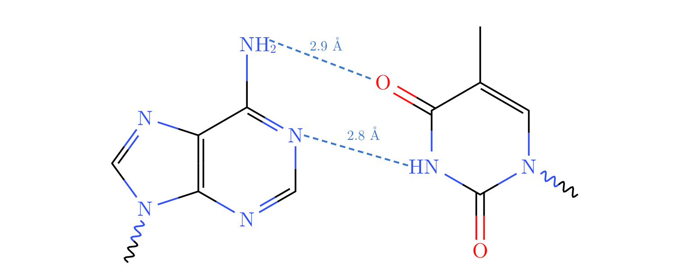

## Chemical formulas and equations

`ce` is re-exported from `chemformula`, so one import covers both structures
and formulas.

```typst
#import "@preview/typed-smiles:0.13.0": ce

#table(
  columns: (1fr, 1fr),
  gutter: 0em, row-gutter: 0em,
  align: center + horizon,
  stroke: 0.4pt + rgb("#d8d8d8"),

  [#stack(spacing: 0.35cm, strong[Formula], ce("H2SO4"))],
  [#stack(spacing: 0.35cm, strong[Ions], ce("(NH4)2SO4"))],
  [#stack(spacing: 0.35cm, strong[Combustion], ce("CH4 + 2O2 -> CO2 + 2H2O"))],
  [#stack(spacing: 0.35cm, strong[Equilibrium], ce("N2 + 3H2 <=> 2NH3"))],
)
```

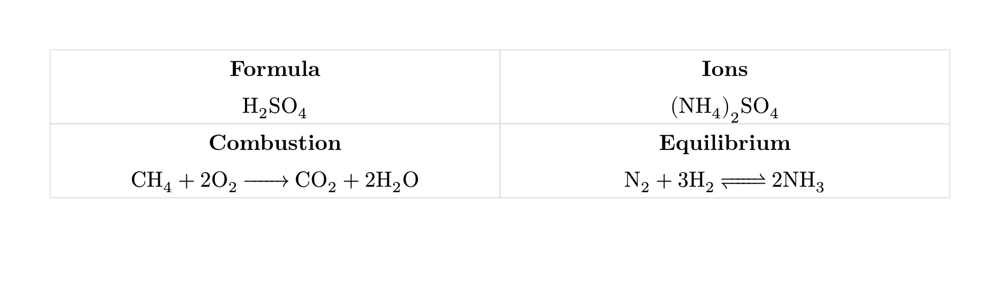

## Molecular weights

`mol-weight(smiles)` returns the molecular weight in g/mol as a float — the
sum of IUPAC standard atomic weights over every atom, including implicit and
explicit hydrogens. Dot-separated fragments (salts, hydrates) are summed
together.

```typst
#import "@preview/typed-smiles:0.13.0": mol-weight

Ethanol: #calc.round(mol-weight("CCO"), digits: 2) g/mol // 46.07
Caffeine: #calc.round(mol-weight("CN1C=NC2=C1C(=O)N(C(=O)N2C)C"), digits: 2) g/mol // 194.19
```

Inputs whose weight is undefined fail with a descriptive error: wildcard `*`
atoms, `{label}` abbreviations (no defined composition), and isotope-labeled
atoms such as `[2H]` (a nuclide mass, not a standard atomic weight, would be
needed).

## Reaction schemes

`reaction`, `rxn-arrow`, and `mol` compose molecules, formulas, and arrows into
schemes. `reaction(scale: 0.8)` shrinks the whole scheme uniformly. By default,
`reaction` is non-breakable — the entire block moves to the next page as a unit
if it does not fit.

```typst
#import "@preview/typed-smiles:0.13.0": smiles, ce, rxn-arrow, mol, reaction

#stack(
  spacing: 1cm,
  stack(
    spacing: 0.4cm,
    align(center, strong[Fischer esterification]),
    align(center, reaction(
      mol(smiles("CC(=O)O"), label: text(size: 8pt)[acetic acid]),
      [+],
      mol(smiles("CCO"), label: text(size: 8pt)[ethanol]),
      rxn-arrow(above: ce("H+"), below: [heat]),
      mol(smiles("CCOC(=O)C"), label: text(size: 8pt)[ethyl acetate]),
      [+],
      ce("H2O"),
    )),
  ),
  stack(
    spacing: 0.4cm,
    align(center, strong[Electrophilic aromatic bromination]),
    align(center, reaction(
      mol(smiles("C1=CC=CC=C1"), label: text(size: 8pt)[benzene]),
      rxn-arrow(above: ce("Br2"), below: ce("FeBr3")),
      mol(smiles("BrC1=CC=CC=C1"), label: text(size: 8pt)[bromobenzene]),
    )),
  ),
)
```

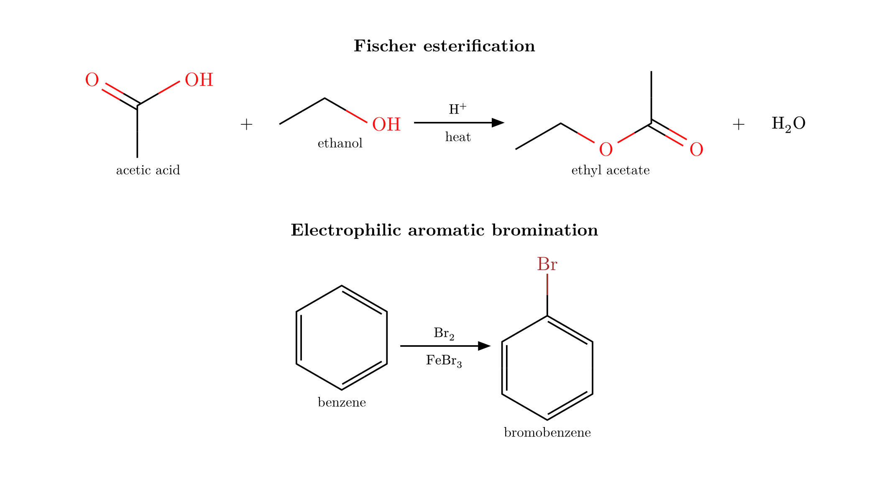

`rxn-arrow(kind: "equilibrium")` draws an open equilibrium arrow. Use
`kind: "equilibrium-filled"` for filled half-heads.

```typst
#reaction(
  ce("A"),
  rxn-arrow(kind: "equilibrium", above: ce("H+"), below: [heat]),
  ce("B"),
  rxn-arrow(kind: "equilibrium-filled", above: [cat.]),
  ce("C"),
)
```

`fit: "width"` shrinks a scheme that is wider than the page or container it sits
in, uniformly and without enlarging it. It applies after `scale:`. The default,
`fit: none`, keeps the natural size and can run past the edge.

```typst
#reaction(fit: "width",
  mol(smiles("C1=CC=CC=C1")),
  rxn-arrow(above: ce("Br2"), below: ce("FeBr3")),
  mol(smiles("BrC1=CC=CC=C1")),
)
```

## Multi-step mechanisms

Reaction arrows can point right, left, up, or down for compact wrap-around
schemes.

```typst
#stack(
  spacing: 1.2em,
  align(center, strong[Bromination, nitration, and reduction sequence]),
  align(center, reaction(
    mol(smiles("C1=CC=CC=C1"), label: text(size: 8pt)[1]),
    rxn-arrow(above: ce("Br2"), below: ce("FeBr3")),
    mol(smiles("BrC1=CC=CC=C1"), label: text(size: 8pt)[A]),
    rxn-arrow(dir: "down", above: ce("HNO3"), below: ce("H2SO4")),
    mol(smiles("BrC1=CC=C(C=C1)[N+](=O)[O-]"), label: text(size: 8pt)[B]),
    rxn-arrow(dir: "left", above: ce("Fe"), below: ce("HCl")),
    mol(smiles("BrC1=CC=C(C=C1)N"), label: text(size: 8pt)[C]),
  )),
)
```

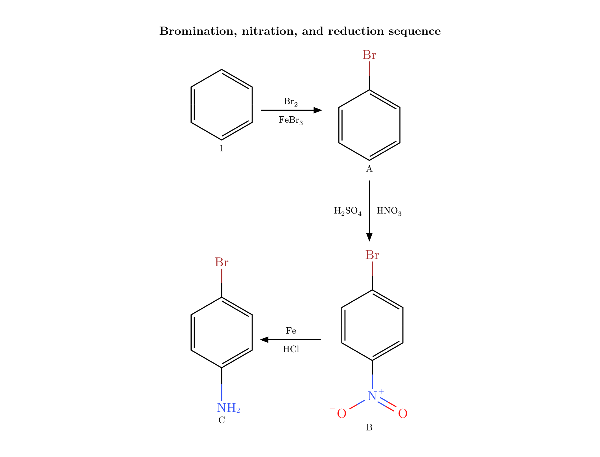

## Electron-pushing mechanisms

`reaction()` also draws curly-arrow mechanisms. Atoms are referenced by their
writing-order index (0-based), so the SMILES string is never modified — pass
`show-indices: true` to read the numbers off the diagram while you write arrows.
Species indices count every `mol()` and every content item in written order,
including a plain `[+]` between reagents; arrows and their labels are not
counted.
On large mechanisms, `reaction(show-indices: true)` applies that overlay to all
string `mol("...")` molecules in the reaction, with per-molecule opt-out via
`mol("...", show-indices: false)`.
Pass a SMILES *string* to `mol(...)` (not `smiles(...)`) so the reaction renders it
itself and its atoms become addressable; `offset:` nudges a species in page
coordinates, so `(0.5, 0)` always moves it right even in vertical flows. A curly
`arrow()` or `highlight()` switches `reaction()` from a grid into one shared
canvas — plain schemes are unaffected.

`highlight()` shades bond endpoints by default, so bond highlights join into one
continuous region. It also shades the displayed H of selected heteroatoms, such
as the H of an N–H or O–H. **Migration:** `highlight()` now shades bond endpoints
and those H by default; pass `include-atoms: false` for bond-only capsules and
`include-hydrogens: false` to keep the H unshaded. `radius` sets the
half-width of the highlighted band in bond-length units: bond capsules, endpoint
disks, and label capsules all share that width. With the default `radius: auto`,
a bond band keeps its usual width and its endpoint disks match it.
Translucent highlights are painted as one shape per fill color by default
(`highlight-overlap: "merge"`), so a bond meeting its atom disks, or two bonds
sharing an atom, keep one tint; `highlight-overlap: "stack"` paints each piece
separately, which darkens those overlaps. The option is accepted by `smiles()`,
`mol()`, and `reaction()`.

```typst
#smiles(
  "N1CCN(CC1)C(C(F)=C2)=CC(=C2C4=O)N(C3CC3)C=C4C(=O)O",
  highlight((bond(0, 5), bond(5, 4), bond(4, 3), bond(3, 6), bond(6, 10), bond(10, 11), bond(11, 15), bond(15, 19), bond(19, 20), bond(20, 21), bond(21, 23)), fill: rgb(150, 191, 13), include-atoms: true),
  highlight((bond(15, 16), bond(16, 18), bond(18, 17), bond(17, 16)), fill: rgb(242, 148, 1), include-atoms: true),
  highlight((bond(3, 2), bond(2, 1), bond(1, 0)), fill: rgb(137, 199, 168), include-atoms: true),
  highlight((bond(6, 7), bond(7, 8), bond(7, 9), bond(9, 12)), fill: rgb(201, 143, 75), include-atoms: true),
  highlight((bond(11, 12), bond(12, 13), bond(13, 20), bond(13, 14)), fill: rgb(236, 119, 137), include-atoms: true),
  highlight((bond(21, 22)), fill: rgb(0, 134, 203), include-atoms: true),
  color: false,
  rotation: 90deg,
  bond-stroke: 0.8pt,
  scale: 0.5,
)

#reaction(
  mol("[OH-]", lone-pairs: "dots", offset: (0, 1)),
  mol("C(I)(C)C"),
  arrow(from: lp(0, 0, offset:(0.1, -0.2)), to: atom(1, 0, offset : (0.1, -0.1)),
        bend: "right", color : black),
)

#reaction(
  mol("N", lone-pairs: "dots"),
  brackets(
    mol("C=O"),
    rxn-arrow(kind: "equilibrium"),
    mol("{C^+}O"),
    sup: [+],
  ),
  arrow(from: atom(0, 0), to: atom(1, 0)),
)
```

References: `atom(s, i)`, `bond(s, i, j)`, `lp(s, i)` (the species index `s` is
optional inside a single `smiles()`), and `species(k)` for a whole `ce()`/content
item. A `lp()` also resolves lone pairs declared on a `{label}` via `lp=N`. Every
reference takes an optional `offset: (dx, dy)`. Curly arrows accept
`heads: "end"/"both"/"none"` and `style: "solid"/"dashed"/"wavy"`, all working
with `bend` — e.g. a double-headed dashed interaction arrow or a wavy
photochemical one. They default to a black shaft with a small, thin triangle tip;
`head-length` and `head-width` resize the tip when a bolder head is wanted.

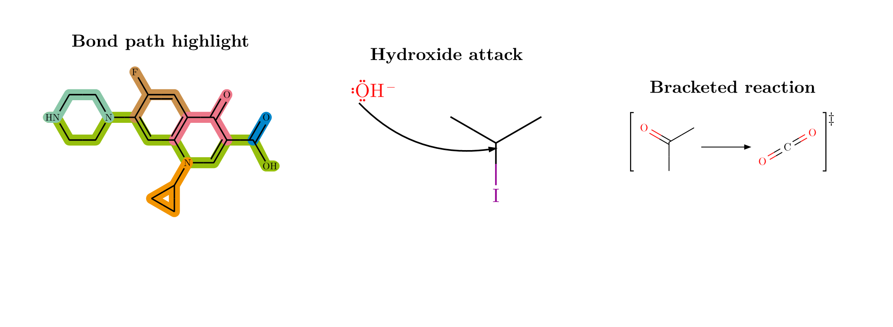

In mechanism mode `reaction(scale:)` scales the complete canvas uniformly,
including molecular bonds, reaction arrows, curly arrows, labels, bracket
strokes, and lengths. Each `mol(scale:)` additionally resizes that species, so
molecules in one mechanism can be sized individually. A `mol()` item placed in a `rxn-arrow(above:/below:)`
slot draws a molecule over or under the arrow; in mechanism mode it also becomes
a species of its own, counted in written order at the arrow's position (`above`
before `below`), so curly arrows can connect it to any other species:

```typst
#reaction(
  mol("C=C"),
  rxn-arrow(above: mol("BrBr", scale: 0.8), below: [CCl#sub[4]]),
  mol("BrC(Br)C"),
  arrow(from: bond(0, 0, 1), to: atom(1, 0), color: red),
  arrow(from: atom(1, 0), to: atom(1, 1), color: red, bend: "right"),
)
```

## Catalytic cycles

`cycle` arranges species on a circle with arc arrows between them. Items
alternate species and `step()`s, like `reaction()` alternates molecules and
arrows, but the sequence closes into a ring. `step(label:)` names a
transformation, `step(into:)` adds a reagent merging in, and `step(out:)` a
product leaving. `cycle(reagent-bend:)` sets the default side-arrow curvature
and `cycle(arc-gap:)` how close the arc arrows sit to the species; per step,
`bend:` overrides the curvature, `merge: true` fuses the side arrow tangentially
with the main arc, `rotation:` rotates the step label (`"straight"`, `"auto"`,
or an angle), and `label-offset:`/`into-offset:`/`out-offset:` nudge pieces like
a `mol` offset.

```typst
#import "@preview/typed-smiles:0.13.0": cycle, step, mol, ce

#let cplx(body) = box(inset: 2pt, body)

#cycle(
  radius: 4.3,
  reagent-bend: 0.06,
  mol(cplx(ce("RhCl(PPh3)3"))),
  step(label: ce("-PPh3 + S")),
  mol(cplx(ce("RhCl(PPh3)2S"))),
  step(label: [oxidative addition], into: ce("H2"), bend: 0.02),
  mol(cplx(ce("RhH2Cl(PPh3)2"))),
  step(label: [coordination], into: ce("RHC=CH2"), rotation: "auto"),
  mol(cplx(ce("RhH2Cl(PPh3)2(\"alkene\")"))),
  step(label: [migratory insertion]),
  mol(cplx(ce("RhHCl(CH2CH2R)(PPh3)2"))),
  step(label: [reductive elimination], out: ce("RCH2CH3"), bend: 0.03),
)
```

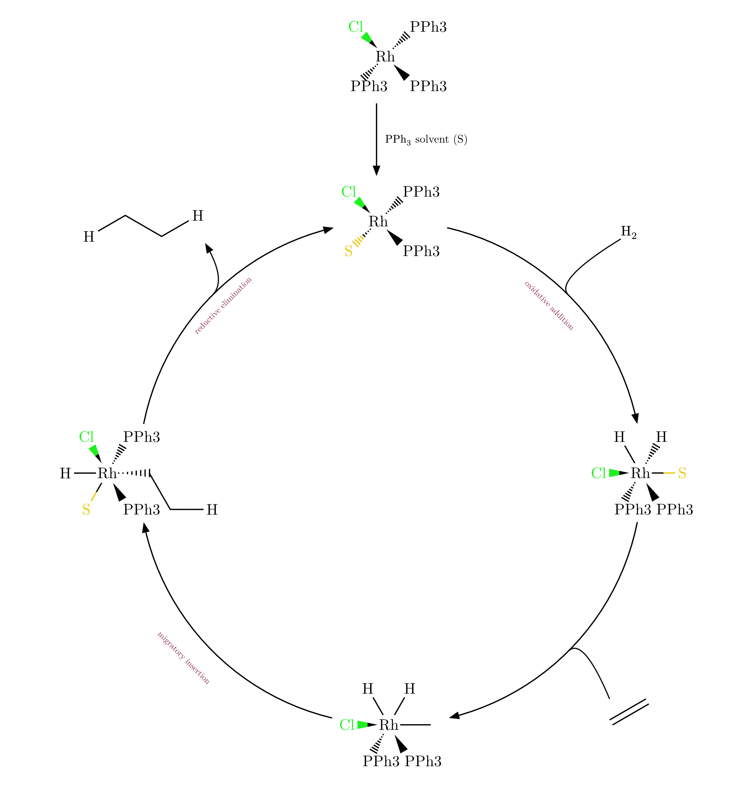

## Aligned molecule series

`align-molecules` orients a series of molecules so a shared scaffold keeps the
reference molecule's orientation, which makes before/after reactions and
compound series comparable at a glance. Pass the results wherever a SMILES
string is accepted: `smiles()`, `mol()`, `reaction()`, `cycle()`,
`smiles-inline()`, `smiles-cetz()`, and `molecule-grid()`.

`molecule-grid` lays out a series in equal-width columns at one shared bond
length, so small molecules are never enlarged to fill their cells. Captions
from `mol(label: ...)` start on one line per row, and page breaks fall only
between rows.

```typst
#import "@preview/typed-smiles:0.13.0": *

#let aligned = align-molecules(
  ("CC(=O)c1ccccc1", "CC(O)c1ccccc1"),
  scaffold: "c1ccccc1",
)

#reaction(
  mol(aligned.at(0)),
  rxn-arrow(above: [NaBH#sub[4]]),
  mol(aligned.at(1)),
)

#molecule-grid(
  columns: 4,
  scale: 0.5,
  scaffold: "c1ccccc1C(=O)O",
  mol("c1ccccc1C(=O)O", label: [*1* Benzoic acid]),
  mol("O=C(O)c1ccccc1O", label: [*2* Salicylic acid]),
  mol("Nc1ccc(C(=O)O)cc1", label: [*3* PABA]),
  mol("OC(=O)c1ccc(cc1)[N+](=O)[O-]", label: [*4* 4-Nitrobenzoic acid]),
)
```

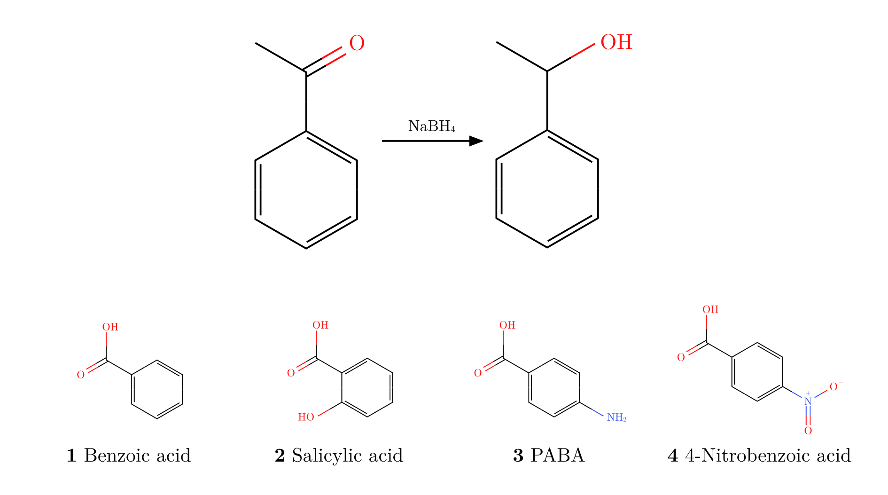

A scaffold is a SMARTS pattern that must occur in every molecule. Symmetric
scaffolds keep substituents on the reference's side; when a scaffold occurs at
chemically distinct places in one molecule, alignment stops with an error
listing them. Select one with `atoms:`, one entry per molecule: for the series
`("Clc1ccccc1", "c1ccccc1-c1ccc(Cl)cc1")` with scaffold `"c1ccccc1"`,
`atoms: (auto, (6, 7, 8, 9, 11, 12))` picks the chlorinated ring. Without a
scaffold, `atoms:` arrays give an exact atom-by-atom correspondence.

Alignment rotates, and if it fits better mirrors, each molecule's own layout;
it does not redraw the scaffold. Ring cores coincide, but chain scaffolds drawn
with different zigzags keep a residual mismatch, reported in each result's
`deviation` field (bond lengths). Mirroring exchanges wedges and hashes, so
stereochemistry is preserved. Orient the whole series with
`align-molecules(rotation:, mirror:)`; an aligned molecule rejects its own
`rotation`, `mirror`, and `abbreviate`. In a grid, `sizing: "fixed"` (the default) reports a
molecule wider than its column, while `sizing: "fit"` scales the whole series
by one common factor so the widest molecule fills its column.

## Stereochemistry and drawing extensions

`[C@H]` / `[C@@H]` mark tetrahedral centers; `/` and `\` describe cis/trans
geometry. `!w` forces a solid wedge, `!h` a hashed wedge, `!s` a wavy
(squiggly) bond for unspecified stereochemistry or attachment points, and `!d`
a dashed bond for hydrogen bonds, partial bonds, and coordination. `!c` repeats
the preceding skeletal turn instead of alternating the zigzag, curling an
acyclic chain while preserving its ideal 120° bond angle. It combines with the
style extensions and bond orders, for example `!c!w` or `!c=`. For an s-cis
1,3-diene, put the curl on the second double bond: `C=CC!c=C` draws both termini
on the same side of the central bond, while `C=CC=C` is drawn s-trans.

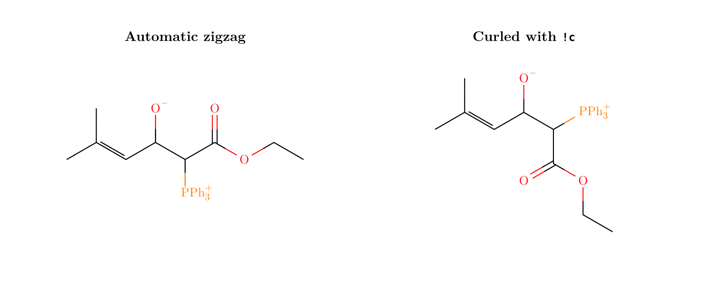

```typst
#table(
  columns: (1fr, 1fr, 1fr, 1fr, 1fr, 1fr),
  gutter: 0em, row-gutter: 0em,
  align: center + horizon,
  stroke: 0.4pt + rgb("#d8d8d8"),

  [*Manual wedge*], [*Manual hash*], [*Wavy*], [*Dashed*],
  [*Tetrahedral @@*], [*trans alkene*],

  [#smiles("C!wN")],
  [#smiles("C!hN")],
  [#smiles("C!sN")],
  [#smiles("C!dN")],
  [#smiles("N[C@@H](C)C(=O)O", scale: 0.7)],
  [#smiles("F/C=C/F", scale: 0.7)],
)
```

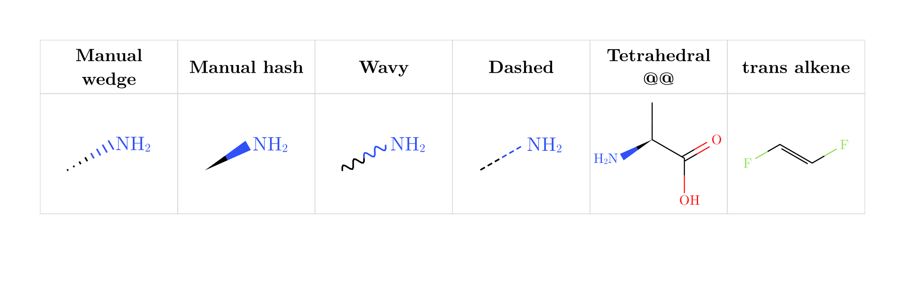

The narrow end of each wedge sits on the stereocenter it describes. Centers
with three neighbors and a lone pair, such as sulfoxides (`C[S@](=O)c1ccccc1`)
and phosphines, are drawn with wedges too.

Some written stereochemistry cannot be drawn faithfully: trigonal-bipyramidal
(`@TB`), octahedral (`@OH`), and allene (`@AL`) centers, `@` on an atom that is
not a stereocenter (`[C@H2]`), and geometry the layout cannot place, such as a
trans double bond in an eight-membered ring. These are errors by default, so a
figure never drops stereochemistry silently. Pass `undepicted-stereo: "omit"`
to draw the structure without it, or set it document-wide:

```typst
#let smiles = smiles.with(undepicted-stereo: "omit")
```

## Atom maps

A number after a colon in a bracket atom is an OpenSMILES atom class, used as an
atom map in reactions: `[CH3:7]`. Maps never change the structure or atom
indices. `show-maps: true` labels mapped atoms; an `atom-annotations` entry for
a mapped atom replaces its label.

```typst
#reaction(
  mol("[CH3:1][C:2](=[O:3])[OH:4]", show-maps: true),
  [+],
  mol("[CH3:5][OH:6]", show-maps: true),
  rxn-arrow(above: [H#super[+]]),
  mol("[CH3:1][C:2](=[O:3])[O:6][CH3:5]", show-maps: true),
  [+],
  mol("[OH2:4]", show-maps: true),
)
```

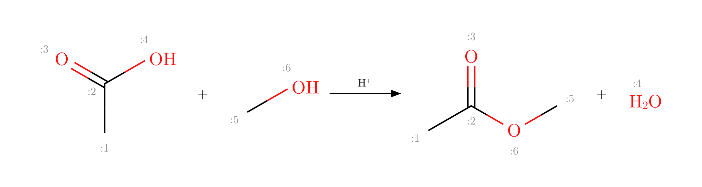

## API summary

### `#smiles(smiles-str, …)`

| Parameter | Default | Description |
|---|---|---|
| `smiles-str` | required | OpenSMILES string |
| `style` | `"default"` | Journal preset: `"acs"`, `"rsc"`, `"nature"`, `"wiley"`; explicit arguments win |
| `scale` | `1.0` | Balanced scale for bond length, labels, and stroke |
| `bond-length` | `none` | Bond length only (`1.0` = 30 pt per bond) |
| `font-size` | `none` | Atom-label size only |
| `font` | `auto` | Atom-label font; `auto` is "New Computer Modern" or the preset's font |
| `bond-stroke` | `none` | Bond width only |
| `color` | `auto` | CPK colors for `"default"`; monochrome for journal presets |
| `fg` | `auto` | Foreground for bonds/carbon labels; `auto` inherits the text color |
| `theme` | `auto` | CPK palette variant; `auto` goes dark when `fg` is light |
| `rotation` | `0deg` | Rotate molecule; labels stay upright |
| `mirror` | `none` | Optional `"horizontal"` or `"vertical"` reflection |
| `show-h` | `()` | Label selected implicit hydrogens; use `"all"` for compact labels or `"skeleton"` for separate H atoms and bonds |
| `aromatic` | `"kekule"` | Lowercase-aromatic rings as doubles or `"circle"` |
| `atom-annotations` | `()` | Small gray side labels as `(index, content)` or `(index, content, offset)` tuples |
| `opacity` | `100%` | Fade the whole drawing (ghost molecules) |
| `bond-customizations` | `()` | Per-bond `color`, `stroke`, `opacity` keyed by `bond(i, j)` |
| `lone-pairs` | `none` | Draw lone pairs as `"dots"` or `"lines"` |
| `atom-colors` | `(:)` | Color overrides: element key `O: red` or label key `"{PPh3}": blue` |
| `show-indices` | `false` | Stamp atom indices for writing arrow references |
| `abbreviate` | `none` | Catalogue group names (`"OMe"`, `"CF3"`, …) or `"all"` to draw as labels |
| `highlight-smarts` | `()` | SMARTS string, `(pattern:, include-atoms:, include-hydrogens:)` dictionary, or tuple mixing both |
| `highlight-groups` | `()` | Group name, `(group:, include-atoms:, include-hydrogens:)` dictionary, or tuple mixing both |
| `highlight-colors` | `auto` | Non-empty color tuple; cycle through matches |
| `highlight-unmatched` | `"error"` | `"error"` for absent matches, or explicitly `"ignore"` |
| `highlight-overlap` | `"merge"` | `"merge"` paints each translucent color as one shape; `"stack"` paints every piece separately |
| `show-maps` | `false` | Label mapped atoms such as `[CH3:7]` with `:7` |
| `undepicted-stereo` | `"error"` | Stereochemistry the drawing cannot show: report it, or `"omit"` it |
| `…annotations` | — | `arrow()` / `highlight()` items on this molecule |

SMILES string extensions:

| Syntax | Meaning |
|---|---|
| `{label}` | Literal upright label at an atom position |
| `{>label}` | Label anchored at the glyph after `>`; the marker is not shown |
| `{label_(sub)^(sup)}` | Explicit label subscript and superscript; either group may be one character without parentheses |
| `{label\|N}` | Label and bonds colored like element N |
| `{label\|red}` | Label colored with a named color (17 names supported) |
| `{label\|#RRGGBB}` | Label colored with a hex code |
| `!w` | Force a solid wedge on the next single bond |
| `!h` | Force a hashed wedge on the next single bond |
| `!s` | Force a wavy (squiggly) bond on the next single bond |
| `!d` | Force a dashed bond on the next single bond |
| `!c` | Repeat the preceding turn instead of alternating the zigzag |
| `!c!w`, `!c!h`, `!c!s`, `!c!d` | Curl while applying a single-bond drawing style |
| `!c=`, `!c#` | Curl into a double or triple bond |

### `#reaction(gap-h, gap-v, scale, breakable, show-indices, flow, fit, …items)`

Lays out a scheme (grid) or, when any curly `arrow()`/`highlight()` is present,
an electron-pushing mechanism (shared canvas).

| Parameter | Default | Description |
|---|---|---|
| `gap-h` | `1.5em` | Horizontal gap between items |
| `gap-v` | `1.5em` | Vertical gap between rows |
| `scale` | `1.0` | Uniform scale applied to the entire scheme |
| `breakable` | `false` | Allow splitting across pages |
| `flow` | `"right"` | Writing direction: `"right"`, `"left"`, `"up"`, `"down"`; `"left"`/`"up"` reflect the scheme so branches emerging left/bottom read naturally |
| `show-indices` | `false` | Default atom-index overlay for string SMILES molecules in this reaction |
| `fit` | `none` | `"width"` shrinks the scheme uniformly to the available width after `scale`; never enlarges |
| `highlight-overlap` | `"merge"` | Default highlight painting for this reaction (`"merge"` or `"stack"`); a `mol()` can set its own |

For vertical flows, ordinary non-arrow items stack vertically too, so
`reaction(flow: "down", mol("A"), [+], mol("B"))` reads top-to-bottom.

A `flow: "left"` (or `"up"`) sub-`reaction()` inside a cycle's `step(out:)`
grows a branch that reads away from the ring, while the outer reaction keeps
its own direction — so a main reaction can embed a cycle whose branch runs its
own sub-reaction, then continue.

### `#rxn-arrow(above, below, dir, kind, scale, color, stroke)`

| Parameter | Default | Description |
|---|---|---|
| `above` | `none` | Label above a horizontal arrow (or right of vertical); content or a `mol()` item |
| `below` | `none` | Label below a horizontal arrow (or left of vertical); content or a `mol()` item |
| `dir` | `auto` | `"right"`, `"left"`, `"down"`, `"up"`, or `auto` (follows `reaction(flow:)`) |
| `kind` | `"single"` | `"single"`, `"equilibrium"`, `"equilibrium-filled"`, `"dashed"`, or `"wavy"` |
| `scale` | `1.0` | Uniform arrow scale, including condition labels |
| `color` | `auto` | Arrow color; `auto` inherits the surrounding text color |
| `stroke` | `auto` | Shaft width before scaling; `auto` matches the default 0.9pt molecule bond |

`scale` resizes the complete arrow component proportionally, including the
shaft width, arrowhead, spacing, and `above`/`below` labels. Explicit `stroke`
values scale too.

### `#mol(spec, label: none, offset: (0,0), …opts)`

A reaction item. `spec` is any content (`smiles(...)`, `ce(...)`, text), a SMILES
*string*, or an `align-molecules()` result — a string or aligned molecule lets
`reaction()` render it with addressable atoms. `offset`
nudges it in page coordinates, in bond-length units: positive x moves right and
positive y moves up regardless of `reaction(flow:)`. String molecules accept
common drawing options such as `scale`, `font-size`, `font`, `bond-stroke`, `color`, `rotation`, `show-h`,
`lone-pairs`, `opacity`, `bond-customizations`, `atom-colors`,
`show-indices`, `abbreviate`, `show-maps`, and `undepicted-stereo`, and the four
`highlight-*` options above; `reaction(scale: ...)` uniformly resizes the complete reaction,
and each `mol(scale: ...)` additionally resizes that molecule. Positional
`arrow()` and `highlight()` items inside `mol()` use local references, so
`mol("C=O", arrow(from: bond(0, 1), to: atom(0)))` does not require a species
index. A `mol()` item
also works inside `rxn-arrow(above:/below:)` slots.
In ordinary schemes, the offset also updates the reaction's layout bounds, so
wrappers such as `brackets()` follow a shifted edge.

### `#cycle(radius: auto, start: 90deg, clockwise: true, scale: 1.0, reagent-bend: 0.12, arc-gap: 0.15, …items)`

Arranges species on a circle with arc arrows for catalytic cycles. Items
alternate species (`mol()`/content) and
`step(label:, into:, out:, bend:, merge:, rotation:, label-offset:, into-offset:, out-offset:)`s;
the sequence closes into a ring. `arc-gap` tunes arrow-to-species clearance;
`step(merge: true)` fuses a side arrow with the arc; the `*-offset` arguments
nudge pieces; `step(out:)` accepts any content, so a nested `reaction()` grows
a branch out of a released molecule. Incoming content attaches by the last
upstream item; outgoing content attaches by the first downstream item.
`step(rotation: "auto")` angles labels along the circle while keeping them upright;
an explicit angle such as `rotation: 45deg` is also accepted.

### `#align-molecules(molecules, scaffold: none, atoms: none, reference: 0, rotation: 0deg, mirror: none, allow-reflection: true)`

Returns one aligned molecule per SMILES string in `molecules`, oriented so the
`scaffold` (or the `atoms` correspondence) overlays the `reference` molecule's.
`rotation` and `mirror` orient the whole series; `allow-reflection: false`
forbids mirrored results. Each result exposes `smiles`, `rotation`, `mirror`,
`atoms` (its atoms matching the reference's atoms position by position), and
`deviation`.

### `#molecule-grid(columns: auto, scale: 1.0, bond-length: none, sizing: "fixed", scaffold: none, column-gutter: 1.5em, row-gutter: 1.5em, label-gap: 0.6em, breakable: true, …items)`

Lays out SMILES strings, aligned molecules, and `mol()` items at one shared
bond length with row-aligned captions. `columns: auto` uses one column per
molecule, up to four. `sizing: "fit"` scales the series by one common factor to
fill the columns; `scaffold:` aligns string molecules onto the first one.
Per-item `scale` and `bond-length` are rejected.

### Mechanism helpers

| Helper | Purpose |
|---|---|
| `atom(i)` / `atom(s, i)` | Atom center reference |
| `bond(i, j)` / `bond(s, i, j)` | Midpoint of the visible, label-trimmed bond stroke; curved arrows attach outside the facing line of a multiple bond |
| `lp(i)` / `lp(s, i)` | Lone-pair reference (`pair: n` to select) |
| `species(k)` | Bounding-box edge of a whole item |
| `arrow(from:, to:, label:, color:, stroke:, bend:, angle:, half:, heads:, style:)` | Curly electron arrow; `stroke: auto` matches molecule bonds and scales with the drawing; `heads: "end"/"both"/"none"`, `style: "solid"/"dashed"/"wavy"` |
| `highlight(ref, fill:, stroke:, radius:, include-atoms:, include-hydrogens:)` | Shade an atom (disk) or bond (capsule); `include-atoms` defaults to `true` for bonds; `include-hydrogens` (`auto`) shades the H of selected heteroatoms; `radius` sets the band half-width |
| `brackets(body, sup:, sub:)` | Square brackets around content |
| `brackets(..reaction-items, sup:, sub:)` | Reference-transparent brackets on an enclosing reaction canvas |

All references accept an `offset: (dx, dy)` nudge.

### `#ce(chem, font: none, font-size: none, …)`

Re-exports `chemformula`'s `ch`. Accepts `font` and `font-size` for local
styling; other arguments pass through to chemformula.

### `#mol-weight(smiles-str)`

Molecular weight in g/mol as a `float`. Errors on wildcards, abbreviations,
and isotopes.

### `#mol-formula(smiles-str)`

Computes and renders the Hill-ordered molecular formula, including implicit and
explicit hydrogens. Dot-separated fragments are combined and their formal
charges are summed. Errors on wildcards, abbreviations, and isotopes.

```typst
#mol-formula("CCO")                         // C₂H₆O
#mol-formula("CC(=O)[O-].[Na+]")            // C₂H₃NaO₂
#mol-formula("CN1C=NC2=C1C(=O)N(C(=O)N2C)C") // C₈H₁₀N₄O₂
```

### `molecules`

A dictionary from lowercase, hyphenated names to SMILES strings for about a
hundred common molecules. Access entries as `molecules.caffeine` or
`molecules.at("caffeine")`; a misspelled name is a compile error.

### `#substructure-matches(smiles-str, pattern)`

Every distinct match of a SMARTS pattern as an array of `(atoms:, bonds:)`
dictionaries holding atom indices and bond index pairs. Returns `()` when the
pattern is absent; invalid or unsupported SMARTS is a compile error.

### `functional-groups`

A dictionary from the names accepted by `highlight-groups` to their SMARTS
definitions, such as `functional-groups.carboxylic-acid`.

### `#smiles-inline(smiles-str, height: 1.4em, baseline: auto, …args)`

A molecule scaled to `height` and baseline-aligned for running text. The scale
is capped so flat molecules stay compact; extra arguments pass through to
`smiles()`.

### `#smiles-cetz(smiles-str, name:, origin: (0,0), fg: black, theme: "light", …opts)`

The molecule as CeTZ draw elements with named anchors (`atom-<i>`,
`bond-<i>-<j>`, `center`) for composing custom CeTZ diagrams. Use inside
`context cetz.canvas(length: 30pt, ...)`; `…opts` are `smiles()` drawing
options.

## SMILES support

typed-smiles reads OpenSMILES with its own parser. Invalid input produces an
editor-visible error that names the character position and the correction,
for example `ring closure 1 at character 3 closes on the atom that opened it`
for `C11`. Besides syntax errors, it rejects ring closures that bond an atom to
itself or repeat a bond (`C12C12`), different bond symbols on the two ends of
one ring closure (`C=1CCCCC-1`), a bond or `.` with no atom after it (`CC=`),
charges outside -15 to +15, and whitespace.

Aromatic lowercase notation (`c1ccccc1`, `c1cc[nH]c1`, …) is kekulized on
parse following OpenSMILES; rings that cannot be kekulized are reported as
errors.

Ring closures written next to branch points are supported, including forms like
`C1=CCCC(=O)1` where the closure digit follows the carbonyl branch.

Dot-disconnected SMILES (`CC(=O)[O-].[Na+]`) draw each fragment separately,
side by side in writing order — salts, counterions, and hydrates render
without a spurious bond between fragments.

Current limitations:

- `@`/`@@` and `/`/`\` stereochemistry is depicted but R/S and E/Z descriptors are not computed.
- Square-planar `@SP1`–`@SP3` centers are depicted exactly (the geometry is
  planar); quadruple bonds (`$`) render as four parallel lines.
- Trigonal-bipyramidal (`@TB`), octahedral (`@OH`), and allene (`@AL`)
  stereochemistry is not drawn and is reported unless
  `undepicted-stereo: "omit"` is set.
- A trans double bond (`/` and `\` markers) inside a ring needs a ring of at
  least nine atoms; in a smaller ring it is reported the same way.
- Some three-dimensional skeletons, such as triptycene, cannot be drawn flat
  without one ring overlapping another.
- Reaction SMILES (`A>>B`), dative arrows (`->`), and `%(nnn)` ring numbers are
  not read; draw reactions with `reaction()`.

## Chemical verification

The named functional groups are checked against a pinned
[PubChem corpus](https://github.com/GeronimoCastano/typed-smiles/blob/b031c16c2ae451d46fcd06114449066d91a9e39a/tests/fixtures/substructure-pubchem.json)
of 63 compounds covering all 16 groups. Each group's selected atoms and bonds
match an independent RDKit search. The
[fixture notes](https://github.com/GeronimoCastano/typed-smiles/blob/b031c16c2ae451d46fcd06114449066d91a9e39a/tests/fixtures/README.md)
list the sources and scope.

SMILES reading and stereochemistry are checked against a categorized
[conformance corpus](https://github.com/GeronimoCastano/typed-smiles/blob/1912d865eb1f514c64a1e99f9ed8f8b7e0d698c6/tests/fixtures/smiles-conformance.json)
of aromatic systems, salts, isotopes, atom maps, ring closures, stereochemistry,
cages, and macrocycles. RDKit rebuilds each accepted molecule from the drawing
alone (coordinates, bond orders, wedges, charges, and hydrogens) and must
recover the input's stereochemistry, including for random atom orders.

## License

MIT
