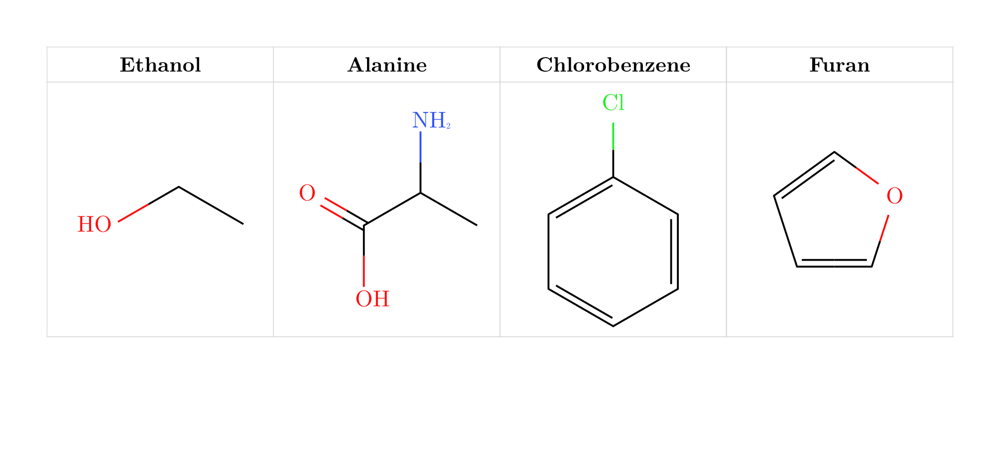
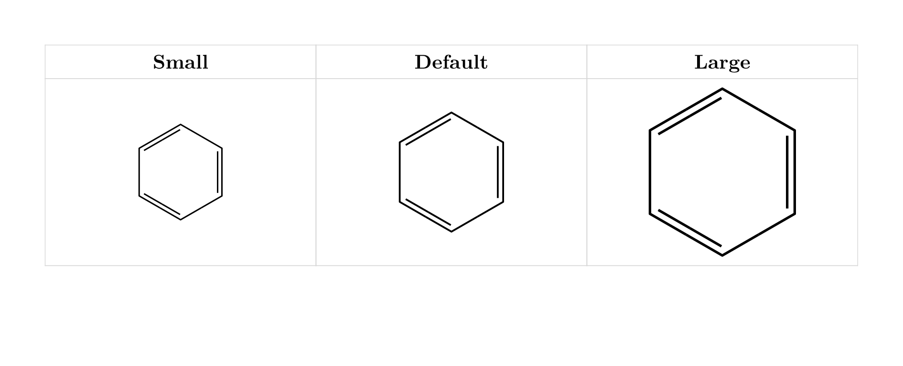
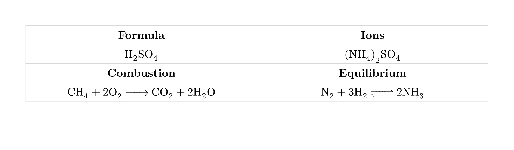
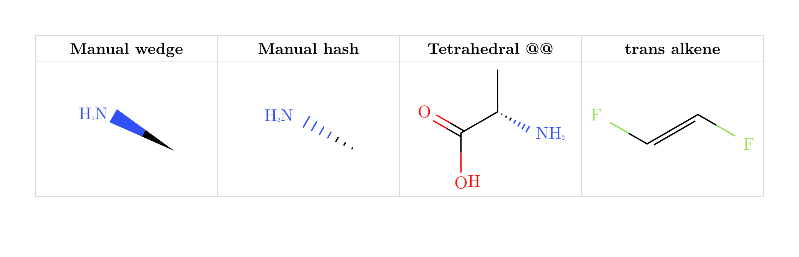

# typed-smiles

`typed-smiles` renders SMILES strings as clean 2D molecular diagrams in Typst.
It uses a small Rust/WASM plugin for parsing and layout, then draws the result
with CeTZ.

The package is meant for chemistry notes, reaction schemes, reports, and
teaching material where you want molecules to live directly in your Typst
source instead of copying diagrams from a separate editor.

## Basic molecule drawing

Start by importing `smiles`. Pass a SMILES string and the package will draw the
skeletal structure.

```typst
#import "@preview/typed-smiles:0.2.0": smiles

#table(
  columns: (1fr, 1fr, 1fr, 1fr),
  gutter: 0em,
  row-gutter: 0em,
  align: center + horizon,
  stroke: 0.4pt + rgb("#d8d8d8"),

  [*Ethanol*],
  [*Alanine*],
  [*Chlorobenzene*],
  [*Furan*],

  [#smiles("CCO")],
  [#smiles("CC(N)C(=O)O")],
  [#smiles("ClC1=CC=CC=C1")],
  [#smiles("C1=CC=CO1")],
)
```



## Scaling

Use `scale` to enlarge or shrink a diagram while keeping bond length, atom label
size, and bond stroke balanced. You can still override `bond-length`,
`font-size`, or `bond-stroke` individually when a figure needs manual tuning.
Here is the same molecule drawn at three sizes:

```typst
#table(
  columns: (1fr, 1fr, 1fr),
  gutter: 0em,
  row-gutter: 0em,
  align: center + horizon,
  stroke: 0.4pt + rgb("#d8d8d8"),

  [*Small*],
  [*Default*],
  [*Large*],

  [#smiles("C1=CC=CC=C1", scale: 0.8)],
  [#smiles("C1=CC=CC=C1")],
  [#smiles("C1=CC=CC=C1", scale: 1.4)],
)
```



## Hydrogens and labels

By default, `typed-smiles` follows the usual skeletal drawing convention:
hydrogens on heteroatoms are shown, while carbon hydrogens stay implicit. This
means ordinary SMILES such as `CC(N)C(=O)O` produces the expected `NH2` and
`OH` labels without bracket syntax. Use `show-all-h: true` when you also want
carbon hydrogens, bracket syntax for explicit hydrogens, and `{label}` for
custom upright group labels. Use `{label|style}` to color a label and its bonds
by element symbol or named color. Atom labels can also use a custom typeface
with `font`.

```typst
#table(
  columns: (1fr, 1fr, 1fr, 1fr, 1fr),
  gutter: 0em,
  row-gutter: 0em,
  align: center + horizon,
  stroke: 0.4pt + rgb("#d8d8d8"),

  [*Default hetero H*],
  [*All H*],
  [*Explicit bracket H*],
  [*Colored label*],
  [*Custom font*],

  [#smiles("CC(N)C(=O)O")],
  [#smiles("CCO", show-all-h: true)],
  [#smiles("[NH3]")],
  [#smiles("{PPh3|P}C=O")],
  [#smiles("CCN", font: "Libertinus Serif")],
)
```


## Chemical formulas and equations

`typed-smiles` re-exports `ce` from `chemformula`, so the same import can handle
ordinary formulas and text-based chemical equations. It also accepts `font` and
`font-size` for local formula styling; use a math-capable font for formulas and
equations. This is useful for salts, small inorganic
species, conditions, and equations where a full molecular diagram would be
unnecessary.

```typst
#import "@preview/typed-smiles:0.2.0": ce

#table(
  columns: (1fr, 1fr),
  gutter: 0em,
  row-gutter: 0em,
  align: center + horizon,
  stroke: 0.4pt + rgb("#d8d8d8"),

  [#stack(spacing: 0.35cm, strong[Formula], ce("H2SO4"))],
  [#stack(spacing: 0.35cm, strong[Ions], ce("(NH4)2SO4"))],
  [#stack(spacing: 0.35cm, strong[Combustion], ce("CH4 + 2O2 -> CO2 + 2H2O"))],
  [#stack(spacing: 0.35cm, strong[Equilibrium], ce("N2 + 3H2 <=> 2NH3"))],
)
```



## Reaction schemes

For structural reaction schemes, use `reaction`, `rxn-arrow`, and `mol`. These
helpers let you combine SMILES-based molecule diagrams with `ce()` formulas,
plus signs, labels, and arrow conditions in one layout.

```typst
#import "@preview/typed-smiles:0.2.0": smiles, ce, rxn-arrow, mol, reaction

#stack(
  spacing: 1cm,
  stack(
    spacing: 0.4cm,
    align(center, strong[Fischer esterification]),
    align(center, reaction(
      mol(smiles("CC(=O)O"), label: text(size: 8pt)[acetic acid]),
      [+],
      mol(smiles("CCO"), label: text(size: 8pt)[ethanol]),
      rxn-arrow(above: ce("H+"), below: [heat]),
      mol(smiles("CCOC(=O)C"), label: text(size: 8pt)[ethyl acetate]),
      [+],
      ce("H2O"),
    )),
  ),
  stack(
    spacing: 0.4cm,
    align(center, strong[Electrophilic aromatic bromination]),
    align(center, reaction(
      mol(smiles("C1=CC=CC=C1"), label: text(size: 8pt)[benzene]),
      rxn-arrow(above: ce("Br2"), below: ce("FeBr3")),
      mol(smiles("BrC1=CC=CC=C1"), label: text(size: 8pt)[bromobenzene]),
    )),
  ),
)
```


## Multi-step mechanisms

Reaction arrows can point right, left, up, or down. This lets you write compact
wrap-around schemes without manually placing every molecule.

```typst
#stack(
  spacing: 1.2em,
  align(center, strong[Bromination, nitration, and reduction sequence]),
  align(center, reaction(
    mol(smiles("C1=CC=CC=C1"), label: text(size: 8pt)[1]),
    rxn-arrow(above: ce("Br2"), below: ce("FeBr3")),
    mol(smiles("BrC1=CC=CC=C1"), label: text(size: 8pt)[A]),
    rxn-arrow(dir: "down", above: ce("HNO3"), below: ce("H2SO4")),
    mol(smiles("BrC1=CC(=CC=C1)[N+](=O)[O-]"), label: text(size: 8pt)[B]),
    rxn-arrow(dir: "left", above: ce("Fe"), below: ce("HCl")),
    mol(smiles("BrC1=CC(=CC=C1)N"), label: text(size: 8pt)[C]),
  )),
)
```


## Stereochemistry and drawing extensions

`typed-smiles` treats SMILES stereochemistry as chemistry: `[C@H]` and
`[C@@H]` mark tetrahedral centers, while `/` and `\` describe cis/trans
geometry around double bonds. For intentionally manual drawings, use
typed-smiles extensions: `!w` forces a solid wedge and `!h` forces a hashed
wedge on the following single bond. Bracket atoms such as `[N]` remain real
SMILES bracket atoms; use `{N}` for a literal label.

```typst
#table(
  columns: (1fr, 1fr, 1fr, 1fr),
  gutter: 0em,
  row-gutter: 0em,
  align: center + horizon,
  stroke: 0.4pt + rgb("#d8d8d8"),

  [*Manual wedge*],
  [*Manual hash*],
  [*Tetrahedral @@*],
  [*trans alkene*],

  [#smiles("C!wN")],
  [#smiles("C!hN")],
  [#smiles("N[C@@H](C)C(=O)O")],
  [#smiles("F/C=C/F")],
)
```



## API

### `#smiles(smiles-str, scale, bond-length, font-size, font, bond-stroke, color, rotation, show-all-h)`

Renders a SMILES string as a 2D skeletal molecular diagram.

| Parameter | Type | Default | Description |
|---|---|---|---|
| `smiles-str` | `str` | required | OpenSMILES string |
| `scale` | `float` | `1.0` | Balanced scale for bond length, atom labels, and bond stroke |
| `bond-length` | `float` | `scale` | Bond length scale factor; `1.0` equals 30pt per bond |
| `font-size` | `length` | `11pt * scale` | Atom label font size |
| `font` | `str` | `"New Computer Modern"` | Atom label font |
| `bond-stroke` | `length` | `0.9pt * scale` | Bond stroke width |
| `color` | `bool` | `true` | Apply Jmol CPK atom colors |
| `rotation` | `angle` | `0deg` | Rotate the molecule while keeping atom labels upright |
| `show-all-h` | `bool` | `false` | Show computed implicit hydrogens on all atoms, including carbon |

Explicit `bond-length`, `font-size`, and `bond-stroke` values override the
corresponding value derived from `scale`.

typed-smiles extensions inside `smiles-str`:

| Syntax | Meaning |
|---|---|
| `{label}` | Literal upright label at an atom position |
| `{label\|N}` | Literal label and bonds colored like an element, here nitrogen |
| `{label\|red}` | Literal label and bonds colored with a named color |
| `!w` | Force a solid wedge on the next single bond |
| `!h` | Force a hashed wedge on the next single bond |

### `#ce(chem, font: none, font-size: none, ..args)`

Re-exports `chemformula`'s `ch` function as `ce`. Passes through the usual
`chemformula` arguments and adds optional `font` and `font-size` arguments for
local formula styling. Formula fonts should support math rendering.

### `#rxn-arrow(above, below, dir)`

Creates an arrow for `#reaction`.

| Parameter | Type | Default | Description |
|---|---|---|---|
| `above` | `content` | `none` | Label above a horizontal arrow, or right of a vertical arrow |
| `below` | `content` | `none` | Label below a horizontal arrow, or left of a vertical arrow |
| `dir` | `str` | `"right"` | One of `"right"`, `"left"`, `"down"`, or `"up"` |

### `#mol(content, label: none)`

Wraps a molecule or formula with an optional centered label below it.

### `#reaction(gap-h, gap-v, ..items)`

Lays out molecules, formulas, plus signs, and `rxn-arrow` values in a reaction
scheme. Directional arrows move the placement cursor, so multi-line schemes can
be written as a single sequence.

## SMILES support

The package uses the [`smiles-parser`](https://crates.io/crates/smiles-parser)
crate for parsing.

Current limitations:

- Aromatic lowercase atoms are not parsed by `smiles-parser` 0.4. Use Kekule
  forms such as `C1=CC=CC=C1` instead of `c1ccccc1`.
- Tetrahedral `@`/`@@` and alkene `/`/`\` stereochemistry are depicted for
  common acyclic cases, but the package does not compute or validate R/S or E/Z
  descriptors.
- Allene, square-planar, trigonal-bipyramidal, octahedral, and complex ring
  stereochemistry are not yet supported.
- Bridged bicyclics may have atom overlap; template matching is not implemented.
- Implicit hydrogen counts use a simple standard-valence model.

## Building

```sh
# Run native Rust tests
cargo test --manifest-path plugin/Cargo.toml

# Build the WASM plugin used by Typst
./build.sh

# Compile the visual test document
typst compile --root . tests/test.typ tests/test.pdf
```

## Architecture

```text
SMILES string -> Rust WASM plugin -> JSON layout -> CeTZ drawing in Typst
```

The Rust plugin handles parsing and 2D coordinates. The Typst layer is a thin
renderer plus reaction-scheme helpers.

## License

MIT
