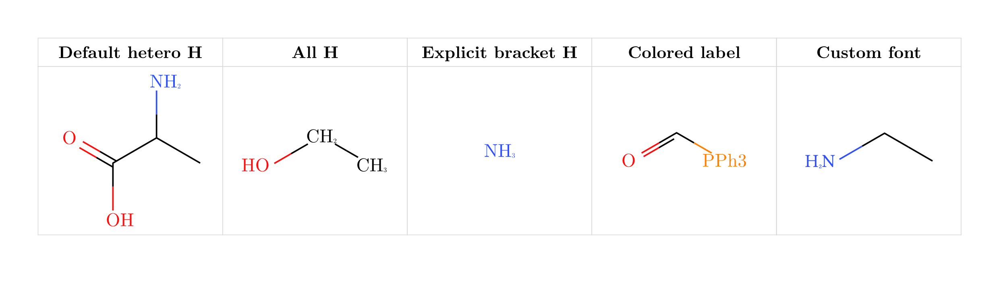
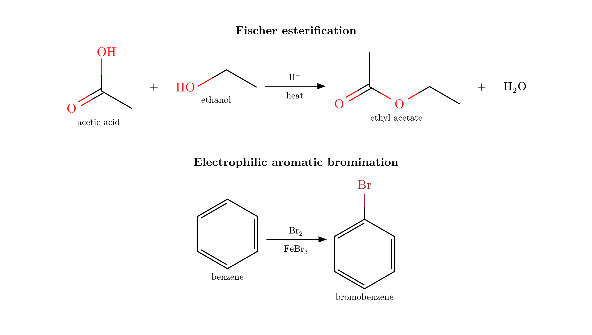
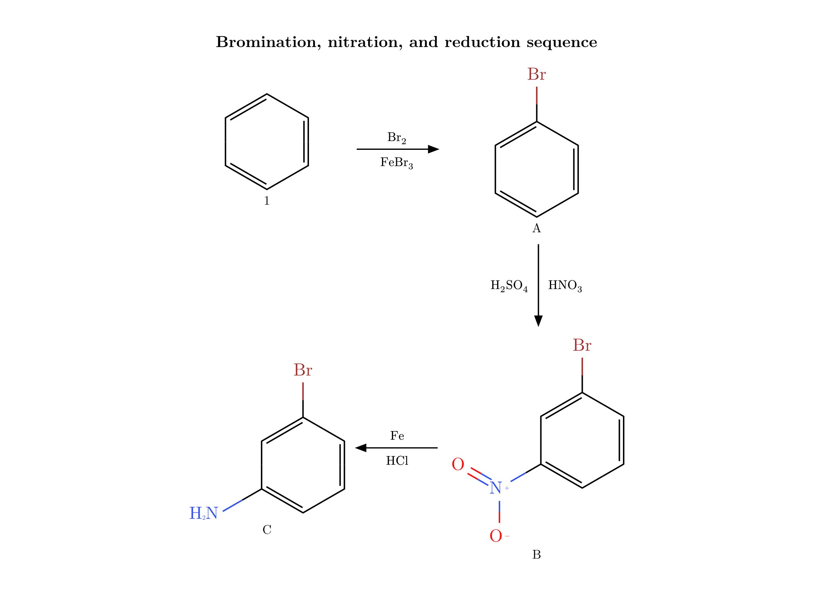
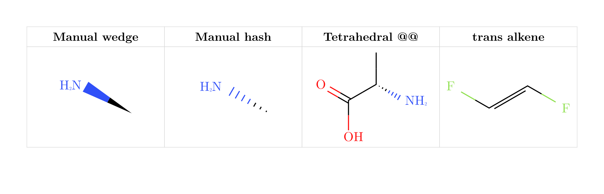

# typed-smiles

`typed-smiles` renders SMILES strings as clean 2D molecular diagrams in Typst.
It uses a small Rust/WASM plugin for parsing and layout, then draws the result
with CeTZ.

The package is meant for chemistry notes, reaction schemes, reports, and
teaching material where you want molecules to live directly in your Typst
source instead of copying diagrams from a separate editor.

**Full documentation:** [`docs/documentation.pdf`](docs/documentation.pdf) — covers every argument, syntax extension, color options, and reaction-scheme feature with live examples.

---

## Quick start

```typst
#import "@preview/typed-smiles:0.3.0": *
```

A wildcard import gives you all five public symbols: `smiles`, `ce`, `mol`,
`rxn-arrow`, and `reaction`.

## Basic molecule drawing

Pass a SMILES string to `#smiles()` and it draws the skeletal structure.

```typst
#import "@preview/typed-smiles:0.3.0": smiles

#table(
  columns: (1fr, 1fr, 1fr, 1fr),
  gutter: 0em, row-gutter: 0em,
  align: center + horizon,
  stroke: 0.4pt + rgb("#d8d8d8"),

  [*Ethanol*], [*Alanine*], [*Chlorobenzene*], [*Furan*],

  [#smiles("CCO")],
  [#smiles("CC(N)C(=O)O")],
  [#smiles("ClC1=CC=CC=C1")],
  [#smiles("C1=CC=CO1")],
)
```


## Scaling

`scale` resizes bond length, atom label size, and stroke together. Individual
overrides (`bond-length`, `font-size`, `bond-stroke`) let you tune one dimension
on its own.

```typst
#table(
  columns: (1fr, 1fr, 1fr),
  gutter: 0em, row-gutter: 0em,
  align: center + horizon,
  stroke: 0.4pt + rgb("#d8d8d8"),

  [*Small*], [*Default*], [*Large*],

  [#smiles("C1=CC=CC=C1", scale: 0.8)],
  [#smiles("C1=CC=CC=C1")],
  [#smiles("C1=CC=CC=C1", scale: 1.4)],
)
```


## Hydrogens, labels, and fonts

Heteroatom hydrogens are shown by default; carbon hydrogens stay implicit.
Use `show-all-h: true` for carbon hydrogens, `[NH3]` bracket syntax for
explicit hydrogens, and `{label}` / `{label|style}` for custom group labels.
`font` sets the atom-label typeface.

```typst
#table(
  columns: (1fr, 1fr, 1fr, 1fr, 1fr),
  gutter: 0em, row-gutter: 0em,
  align: center + horizon,
  stroke: 0.4pt + rgb("#d8d8d8"),

  [*Default hetero H*], [*All H*], [*Explicit H*], [*Colored label*], [*Custom font*],

  [#smiles("CC(N)C(=O)O")],
  [#smiles("CCO", show-all-h: true)],
  [#smiles("[NH3]")],
  [#smiles("{PPh3|P}C=O")],
  [#smiles("CCN", font: "Libertinus Serif")],
)
```



## Colors

Atoms are colored with the Jmol CPK palette. Use `atom-colors` to override
specific elements or labeled groups per call, or use `.with()` to set
project-wide defaults. Label colors in `{label|style}` accept 17 named colors
or any `#RRGGBB` hex code. See the documentation for the full color reference.

```typst
// Override an element and a specific label group:
#smiles("{PPh3}C({OEt})=O",
  atom-colors: (O: rgb("#8B4513"), "{PPh3}": rgb("#7B2D8B")))

// Set defaults for the whole document in the preamble:
#let smiles = smiles.with(
  bond-length: 0.9,
  atom-colors: (O: rgb("#8B4513"), N: rgb("#008080")),
)

// Hex and extra named colors in labels:
#smiles("{Cat|teal}C(=O){Nuc|#E040FB}")
```

> **Note:** `color: false` is a hard override — it makes everything black
> regardless of any `atom-colors` entries or inline label styles.
> To selectively highlight a group in an otherwise black-and-white diagram,
> keep `color: true` and drive everything through `atom-colors`.

## Chemical formulas and equations

`ce` is re-exported from `chemformula`, so one import covers both structures
and formulas.

```typst
#import "@preview/typed-smiles:0.3.0": ce

#table(
  columns: (1fr, 1fr),
  gutter: 0em, row-gutter: 0em,
  align: center + horizon,
  stroke: 0.4pt + rgb("#d8d8d8"),

  [#stack(spacing: 0.35cm, strong[Formula], ce("H2SO4"))],
  [#stack(spacing: 0.35cm, strong[Ions], ce("(NH4)2SO4"))],
  [#stack(spacing: 0.35cm, strong[Combustion], ce("CH4 + 2O2 -> CO2 + 2H2O"))],
  [#stack(spacing: 0.35cm, strong[Equilibrium], ce("N2 + 3H2 <=> 2NH3"))],
)
```


## Reaction schemes

`reaction`, `rxn-arrow`, and `mol` compose molecules, formulas, and arrows into
schemes. `reaction(scale: 0.8)` shrinks the whole scheme uniformly. By default,
`reaction` is non-breakable — the entire block moves to the next page as a unit
if it does not fit.

```typst
#import "@preview/typed-smiles:0.3.0": smiles, ce, rxn-arrow, mol, reaction

#stack(
  spacing: 1cm,
  stack(
    spacing: 0.4cm,
    align(center, strong[Fischer esterification]),
    align(center, reaction(
      mol(smiles("CC(=O)O"), label: text(size: 8pt)[acetic acid]),
      [+],
      mol(smiles("CCO"), label: text(size: 8pt)[ethanol]),
      rxn-arrow(above: ce("H+"), below: [heat]),
      mol(smiles("CCOC(=O)C"), label: text(size: 8pt)[ethyl acetate]),
      [+],
      ce("H2O"),
    )),
  ),
  stack(
    spacing: 0.4cm,
    align(center, strong[Electrophilic aromatic bromination]),
    align(center, reaction(
      mol(smiles("C1=CC=CC=C1"), label: text(size: 8pt)[benzene]),
      rxn-arrow(above: ce("Br2"), below: ce("FeBr3")),
      mol(smiles("BrC1=CC=CC=C1"), label: text(size: 8pt)[bromobenzene]),
    )),
  ),
)
```



## Multi-step mechanisms

Reaction arrows can point right, left, up, or down for compact wrap-around
schemes.

```typst
#stack(
  spacing: 1.2em,
  align(center, strong[Bromination, nitration, and reduction sequence]),
  align(center, reaction(
    mol(smiles("C1=CC=CC=C1"), label: text(size: 8pt)[1]),
    rxn-arrow(above: ce("Br2"), below: ce("FeBr3")),
    mol(smiles("BrC1=CC=CC=C1"), label: text(size: 8pt)[A]),
    rxn-arrow(dir: "down", above: ce("HNO3"), below: ce("H2SO4")),
    mol(smiles("BrC1=CC(=CC=C1)[N+](=O)[O-]"), label: text(size: 8pt)[B]),
    rxn-arrow(dir: "left", above: ce("Fe"), below: ce("HCl")),
    mol(smiles("BrC1=CC(=CC=C1)N"), label: text(size: 8pt)[C]),
  )),
)
```



## Stereochemistry and drawing extensions

`[C@H]` / `[C@@H]` mark tetrahedral centers; `/` and `\` describe cis/trans
geometry. `!w` forces a solid wedge and `!h` a hashed wedge.

```typst
#table(
  columns: (1fr, 1fr, 1fr, 1fr),
  gutter: 0em, row-gutter: 0em,
  align: center + horizon,
  stroke: 0.4pt + rgb("#d8d8d8"),

  [*Manual wedge*], [*Manual hash*], [*Tetrahedral @@*], [*trans alkene*],

  [#smiles("C!wN")],
  [#smiles("C!hN")],
  [#smiles("N[C@@H](C)C(=O)O")],
  [#smiles("F/C=C/F")],
)
```



## API summary

### `#smiles(smiles-str, …)`

| Parameter | Default | Description |
|---|---|---|
| `smiles-str` | required | OpenSMILES string |
| `scale` | `1.0` | Balanced scale for bond length, labels, and stroke |
| `bond-length` | `none` | Bond length only (`1.0` = 30 pt per bond) |
| `font-size` | `none` | Atom-label size only |
| `font` | `"New Computer Modern"` | Atom-label font |
| `bond-stroke` | `none` | Bond width only |
| `color` | `true` | Apply Jmol CPK atom colors |
| `rotation` | `0deg` | Rotate molecule; labels stay upright |
| `show-all-h` | `false` | Label carbon implicit hydrogens |
| `atom-colors` | `(:)` | Color overrides: element key `O: red` or label key `"{PPh3}": blue` |

SMILES string extensions:

| Syntax | Meaning |
|---|---|
| `{label}` | Literal upright label at an atom position |
| `{label\|N}` | Label and bonds colored like element N |
| `{label\|red}` | Label colored with a named color (17 names supported) |
| `{label\|#RRGGBB}` | Label colored with a hex code |
| `!w` | Force a solid wedge on the next single bond |
| `!h` | Force a hashed wedge on the next single bond |

### `#reaction(gap-h, gap-v, scale, breakable, …items)`

| Parameter | Default | Description |
|---|---|---|
| `gap-h` | `1.5em` | Horizontal gap between items |
| `gap-v` | `1.5em` | Vertical gap between rows |
| `scale` | `1.0` | Uniform scale applied to the entire scheme |
| `breakable` | `false` | Allow splitting across pages |

### `#rxn-arrow(above, below, dir)`

| Parameter | Default | Description |
|---|---|---|
| `above` | `none` | Label above a horizontal arrow (or right of vertical) |
| `below` | `none` | Label below a horizontal arrow (or left of vertical) |
| `dir` | `"right"` | `"right"`, `"left"`, `"down"`, or `"up"` |

### `#mol(content, label: none)`

Wraps a molecule with an optional centered caption below it.

### `#ce(chem, font: none, font-size: none, …)`

Re-exports `chemformula`'s `ch`. Accepts `font` and `font-size` for local
styling; other arguments pass through to chemformula.

## SMILES support

The package uses the [`smiles-parser`](https://crates.io/crates/smiles-parser)
crate for parsing.

Current limitations:

- Aromatic lowercase atoms are not parsed (`c1ccccc1` → use `C1=CC=CC=C1`).
- `@`/`@@` and `/`/`\` stereochemistry is depicted but R/S and E/Z descriptors are not computed.
- Bridged bicyclics may overlap; template matching is not implemented.
- Allene, square-planar, and octahedral stereochemistry are not supported.

## Building

```sh
cargo test --manifest-path plugin/Cargo.toml   # Rust tests
./build.sh                                      # build WASM plugin
typst compile --root . tests/test.typ tests/test.pdf       # visual test
typst compile --root . docs/documentation.typ docs/documentation.pdf  # user guide
```

## Architecture

```text
SMILES string → Rust WASM plugin → JSON layout → CeTZ drawing in Typst
```

## License

MIT
