# typed-smiles

`typed-smiles` renders SMILES strings as clean 2D molecular diagrams in Typst.
It uses a small Rust/WASM plugin for parsing and layout, then draws the result
with CeTZ.

The package is meant for chemistry notes, reaction schemes, reports, and
teaching material where you want molecules to live directly in your Typst
source instead of copying diagrams from a separate editor.

**Full documentation:** see `docs/documentation.pdf` in the typed-smiles repository for every argument, syntax extension, color option, and reaction-scheme feature with live examples.

---

## Quick start

```typst
#import "@preview/typed-smiles:0.5.0": *
```

A wildcard import gives you the molecule renderer, reaction helpers, and
mechanism helpers: `smiles`, `ce`, `mol`, `rxn-arrow`, `reaction`, `atom`,
`bond`, `lp`, `species`, `arrow`, `highlight`, and `brackets`.

## Basic molecule drawing

Pass a SMILES string to `#smiles()` and it draws the skeletal structure.
Aromatic rings can be written either in lowercase aromatic notation
(`c1ccccc1`) or in Kekulé form (`C1=CC=CC=C1`); aromatic input is kekulized
on parse and both render identically.

```typst
#import "@preview/typed-smiles:0.5.0": smiles

#table(
  columns: (1fr, 1fr, 1fr, 1fr),
  gutter: 0em, row-gutter: 0em,
  align: center + horizon,
  stroke: 0.4pt + rgb("#d8d8d8"),

  [*Ethanol*], [*Alanine*], [*Chlorobenzene*], [*Furan*],

  [#smiles("CCO")],
  [#smiles("CC(N)C(=O)O")],
  [#smiles("ClC1=CC=CC=C1")],
  [#smiles("C1=CC=CO1")],
)
```

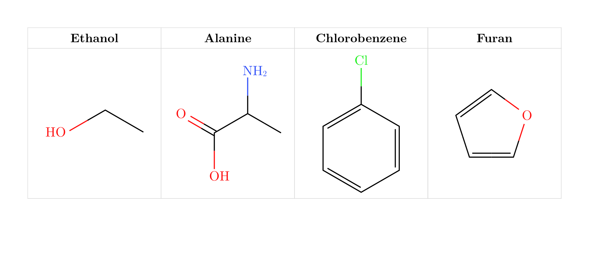

## Scaling

`scale` resizes bond length, atom label size, and stroke together. Individual
overrides (`bond-length`, `font-size`, `bond-stroke`) let you tune one dimension
on its own.

```typst
#table(
  columns: (1fr, 1fr, 1fr),
  gutter: 0em, row-gutter: 0em,
  align: center + horizon,
  stroke: 0.4pt + rgb("#d8d8d8"),

  [*Small*], [*Default*], [*Large*],

  [#smiles("C1=CC=CC=C1", scale: 0.8)],
  [#smiles("C1=CC=CC=C1")],
  [#smiles("C1=CC=CC=C1", scale: 1.4)],
)
```

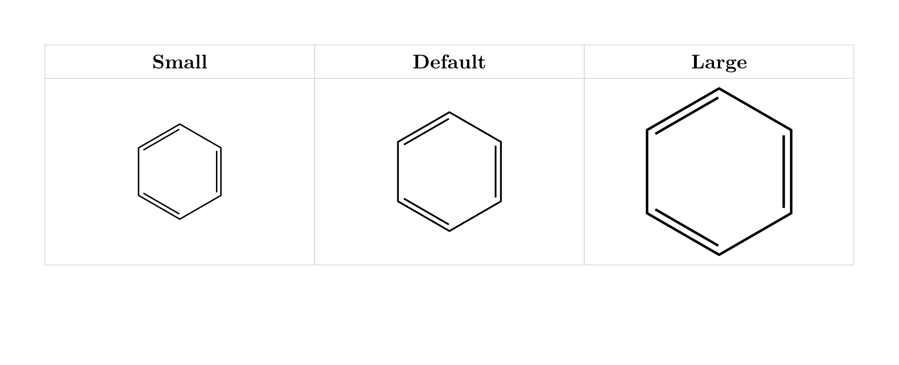

## Mirroring

`mirror` reflects a molecule across an axis — something no rotation can do —
so you can face a reacting group toward a reaction arrow. Wedges and hashes
are exchanged in the same pass, keeping the depicted stereochemistry intact
(an unswapped flip would silently draw the enantiomer). Mirroring is applied
before `rotation`, and works per molecule inside `reaction()` via
`mol("...", mirror: "horizontal")`.

```typst
#smiles("CC(=O)OC1=CC=CC=C1C(=O)O")
#smiles("CC(=O)OC1=CC=CC=C1C(=O)O", mirror: "horizontal")
#smiles("CC(=O)OC1=CC=CC=C1C(=O)O", mirror: "vertical")
```

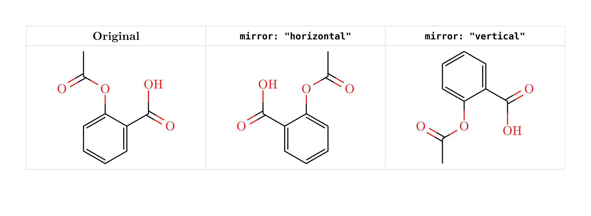

## Aromatic ring circles

Rings written in aromatic (lowercase) notation can draw as single bonds with
an inscribed circle instead of alternating double bonds. Each fully aromatic
ring of a fused system gets its own circle; Kekulé-written input keeps its
explicit bonds.

```typst
#smiles("c1ccccc1", aromatic: "circle")
#smiles("c1ccc2ccccc2c1", aromatic: "circle")
#smiles("Cc1ccncc1", aromatic: "circle")
```

## Hydrogens, labels, and fonts

Heteroatom hydrogens are shown by default; carbon hydrogens stay implicit.
Use `show-h: "all"` for carbon hydrogens, `[NH3]` bracket syntax for
explicit hydrogens, and `{label}` / `{label|style}` for custom group labels.
Use `>` inside a custom label to choose the attachment glyph, e.g. `{>PPh3}`.
For the cleanest result, rotate the molecule so the bond approaches the chosen
glyph roughly perpendicular to the written label.
`font` sets the atom-label typeface.

```typst
#table(
  columns: (1fr, 1fr, 1fr, 1fr, 1fr),
  gutter: 0em, row-gutter: 0em,
  align: center + horizon,
  stroke: 0.4pt + rgb("#d8d8d8"),

  [*Default hetero H*], [*All H*], [*Explicit H*], [*Colored label*], [*Custom font*],

  [#smiles("CC(N)C(=O)O")],
  [#smiles("CCO", show-h: "all")],
  [#smiles("[NH3]")],
  [#smiles("{>PPh3|P}C=O")],
  [#smiles("CCN", font: "Libertinus Serif")],
)
```

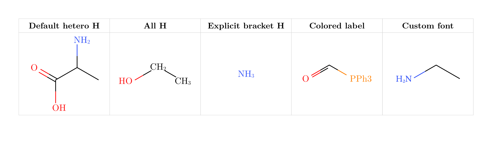

## Atom annotations and per-atom hydrogens

`atom-annotations` places small gray side labels on the emptiest side of an
atom — NMR numbering, Greek positions, footnote marks. Pass a tuple list where
each entry is `(index, content)` or `(index, content, offset)`. Values are
content, so wrap them in `text()` to restyle. `show-h` labels selected carbon
hydrogens with `show-h: 1` or `show-h: (1, 2)`, and labels every implicit
hydrogen with `show-h: "all"`.

```typst
#smiles(
  "N[C@@H](C)C(=O)O",
  atom-annotations: (
    (1, [$alpha$], (-0.4, -0.05)),
    (2, [$beta$]),
    (3, [$gamma$], (-0.05, -0.3)),
  ),
)
#smiles("CC(N)C(=O)O", show-h: 1)   // label just the central C-H
```

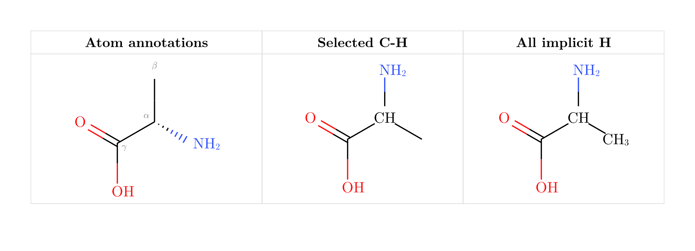

## Lone pairs

Set `lone-pairs` to `"dots"` or `"lines"` to annotate skeletal structures with
non-bonding electron pairs on common organic heteroatoms and charged atoms.

```typst
#smiles("CCO", lone-pairs: "dots")
#smiles("CCN", lone-pairs: "lines")
#smiles("CC(=O)N", lone-pairs: "dots")
```

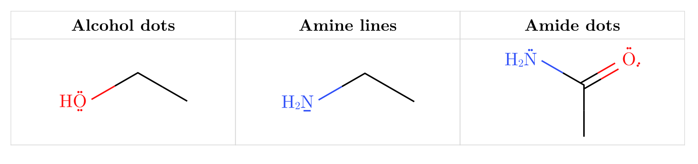

## Colors

Atoms are colored with the Jmol CPK palette. Use `atom-colors` to override
specific elements or labeled groups per call, or use `.with()` to set
project-wide defaults. Label colors in `{label|style}` accept 17 named colors
or any `#RRGGBB` hex code. See the documentation for the full color reference.

```typst
// Override an element and a specific label group:
#smiles("{>PPh3}C({OEt})=O",
  atom-colors: (O: rgb("#8B4513"), "{PPh3}": rgb("#7B2D8B")))

// Set defaults for the whole document in the preamble:
#let smiles = smiles.with(
  bond-length: 0.9,
  atom-colors: (O: rgb("#8B4513"), N: rgb("#008080")),
)

// Hex and extra named colors in labels:
#smiles("{Cat|teal}C(=O){Nuc|#E040FB}")
```

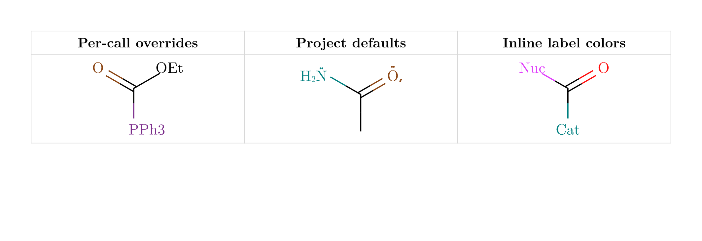

> **Note:** `color: false` is a hard override — it makes everything black
> regardless of any `atom-colors` entries or inline label styles.
> To selectively highlight a group in an otherwise black-and-white diagram,
> keep `color: true` and drive everything through `atom-colors`.

## Dark mode and theming

Bond strokes and carbon labels follow `fg`, which defaults to `auto` and
inherits the surrounding text color. On a dark slide theme, `theme: auto`
switches to a dark CPK variant for hues that need more contrast.

```typst
#smiles("NC(Br)C(I)C(=O)O")

#block(fill: rgb("#1E1E24"), inset: 8pt, radius: 4pt)[
  #set text(fill: white)
  #smiles("NC(Br)C(I)C(=O)O")
]
```

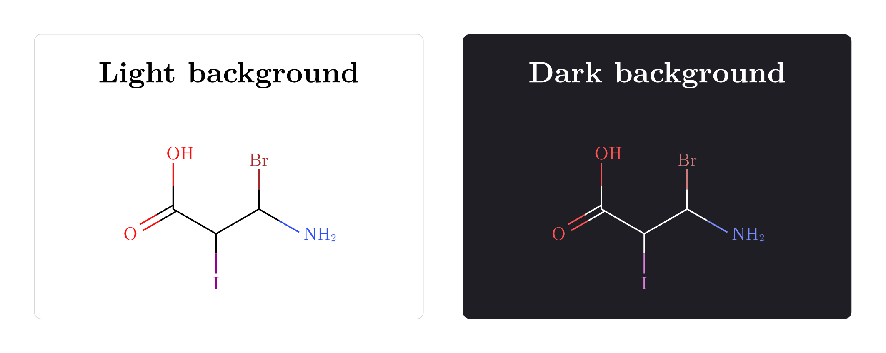

## Chemical formulas and equations

`ce` is re-exported from `chemformula`, so one import covers both structures
and formulas.

```typst
#import "@preview/typed-smiles:0.5.0": ce

#table(
  columns: (1fr, 1fr),
  gutter: 0em, row-gutter: 0em,
  align: center + horizon,
  stroke: 0.4pt + rgb("#d8d8d8"),

  [#stack(spacing: 0.35cm, strong[Formula], ce("H2SO4"))],
  [#stack(spacing: 0.35cm, strong[Ions], ce("(NH4)2SO4"))],
  [#stack(spacing: 0.35cm, strong[Combustion], ce("CH4 + 2O2 -> CO2 + 2H2O"))],
  [#stack(spacing: 0.35cm, strong[Equilibrium], ce("N2 + 3H2 <=> 2NH3"))],
)
```

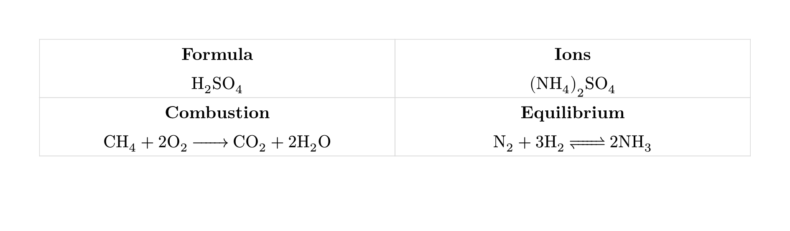

## Molecular weights

`mol-weight(smiles)` returns the molecular weight in g/mol as a float — the
sum of IUPAC standard atomic weights over every atom, including implicit and
explicit hydrogens. Dot-separated fragments (salts, hydrates) are summed
together.

```typst
#import "@preview/typed-smiles:0.5.0": mol-weight

Ethanol: #calc.round(mol-weight("CCO"), digits: 2) g/mol // 46.07
Caffeine: #calc.round(mol-weight("CN1C=NC2=C1C(=O)N(C(=O)N2C)C"), digits: 2) g/mol // 194.19
```

Inputs whose weight is undefined fail with a descriptive error: wildcard `*`
atoms, `{label}` abbreviations (no defined composition), and isotope-labeled
atoms such as `[2H]` (a nuclide mass, not a standard atomic weight, would be
needed).

## Reaction schemes

`reaction`, `rxn-arrow`, and `mol` compose molecules, formulas, and arrows into
schemes. `reaction(scale: 0.8)` shrinks the whole scheme uniformly. By default,
`reaction` is non-breakable — the entire block moves to the next page as a unit
if it does not fit.

```typst
#import "@preview/typed-smiles:0.5.0": smiles, ce, rxn-arrow, mol, reaction

#stack(
  spacing: 1cm,
  stack(
    spacing: 0.4cm,
    align(center, strong[Fischer esterification]),
    align(center, reaction(
      mol(smiles("CC(=O)O"), label: text(size: 8pt)[acetic acid]),
      [+],
      mol(smiles("CCO"), label: text(size: 8pt)[ethanol]),
      rxn-arrow(above: ce("H+"), below: [heat]),
      mol(smiles("CCOC(=O)C"), label: text(size: 8pt)[ethyl acetate]),
      [+],
      ce("H2O"),
    )),
  ),
  stack(
    spacing: 0.4cm,
    align(center, strong[Electrophilic aromatic bromination]),
    align(center, reaction(
      mol(smiles("C1=CC=CC=C1"), label: text(size: 8pt)[benzene]),
      rxn-arrow(above: ce("Br2"), below: ce("FeBr3")),
      mol(smiles("BrC1=CC=CC=C1"), label: text(size: 8pt)[bromobenzene]),
    )),
  ),
)
```

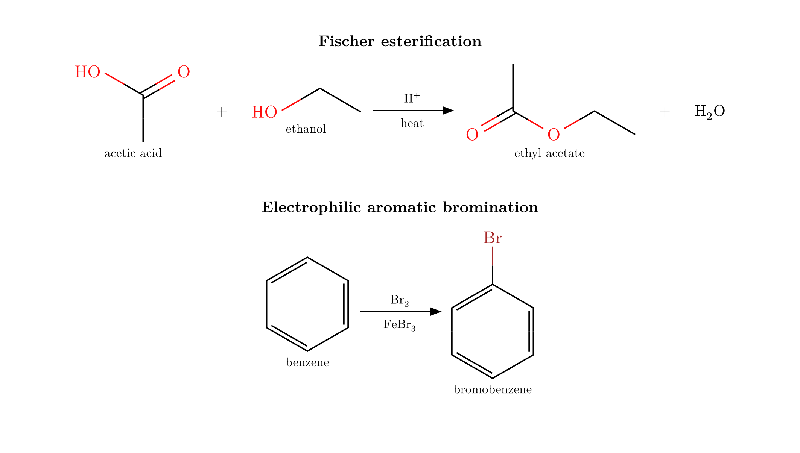

`rxn-arrow(kind: "equilibrium")` draws an open equilibrium arrow. Use
`kind: "equilibrium-filled"` for filled half-heads.

```typst
#reaction(
  ce("A"),
  rxn-arrow(kind: "equilibrium", above: ce("H+"), below: [heat]),
  ce("B"),
  rxn-arrow(kind: "equilibrium-filled", above: [cat.]),
  ce("C"),
)
```

## Multi-step mechanisms

Reaction arrows can point right, left, up, or down for compact wrap-around
schemes.

```typst
#stack(
  spacing: 1.2em,
  align(center, strong[Bromination, nitration, and reduction sequence]),
  align(center, reaction(
    mol(smiles("C1=CC=CC=C1"), label: text(size: 8pt)[1]),
    rxn-arrow(above: ce("Br2"), below: ce("FeBr3")),
    mol(smiles("BrC1=CC=CC=C1"), label: text(size: 8pt)[A]),
    rxn-arrow(dir: "down", above: ce("HNO3"), below: ce("H2SO4")),
    mol(smiles("BrC1=CC(=CC=C1)[N+](=O)[O-]"), label: text(size: 8pt)[B]),
    rxn-arrow(dir: "left", above: ce("Fe"), below: ce("HCl")),
    mol(smiles("BrC1=CC(=CC=C1)N"), label: text(size: 8pt)[C]),
  )),
)
```

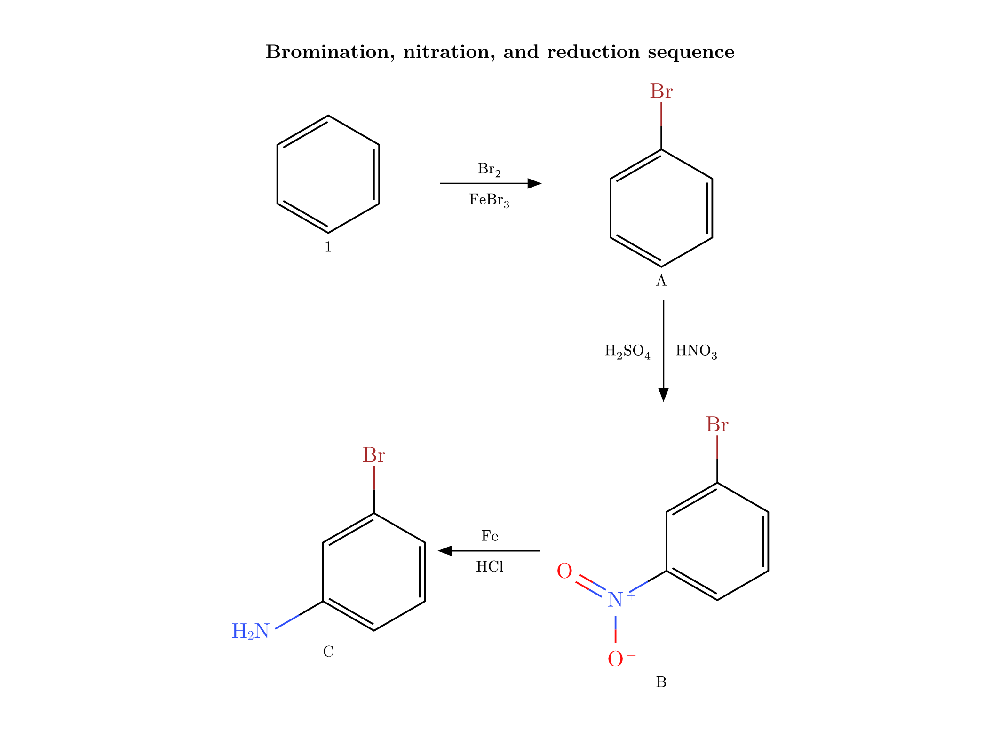

## Electron-pushing mechanisms

`reaction()` also draws curly-arrow mechanisms. Atoms are referenced by their
writing-order index (0-based), so the SMILES string is never modified — pass
`show-indices: true` to read the numbers off the diagram while you write arrows.
On large mechanisms, `reaction(show-indices: true)` applies that overlay to all
string `mol("...")` molecules in the reaction, with per-molecule opt-out via
`mol("...", show-indices: false)`.
Pass a SMILES *string* to `mol(...)` (not `smiles(...)`) so the reaction renders it
itself and its atoms become addressable; `offset:` nudges a species so arrows read
cleanly. A curly `arrow()` or `highlight()` (or any `offset:`) switches `reaction()`
from a grid into one shared canvas — plain schemes are unaffected.

```typst
#smiles(
  "N1CCN(CC1)C(C(F)=C2)=CC(=C2C4=O)N(C3CC3)C=C4C(=O)O",
  highlight((bond(0, 5), bond(5, 4), bond(4, 3), bond(3, 6), bond(6, 10), bond(10, 11), bond(11, 15), bond(15, 19), bond(19, 20), bond(20, 21), bond(21, 23), bond(23, 25)), fill: rgb(150, 191, 13), include-atoms: true),
  highlight((bond(15, 16), bond(16, 18), bond(18, 17), bond(17, 16)), fill: rgb(242, 148, 1), include-atoms: true),
  highlight((bond(3, 2), bond(2, 1), bond(1, 0)), fill: rgb(137, 199, 168), include-atoms: true),
  highlight((bond(6, 7), bond(7, 8), bond(7, 9), bond(9, 12)), fill: rgb(201, 143, 75), include-atoms: true),
  highlight((bond(11, 12), bond(12, 13), bond(13, 20), bond(13, 14)), fill: rgb(236, 119, 137), include-atoms: true),
  highlight((bond(21, 22)), fill: rgb(0, 134, 203), include-atoms: true),
  color: false,
  rotation: 90deg,
  bond-stroke: 0.8pt,
  scale: 0.5,
)

#reaction(
  mol("[OH-]", lone-pairs: "dots", offset: (1.5, 1)),
  mol("C(I)(C)C"),
  arrow(from: lp(0, 0, offset:(-0.3, -0.2)), to: atom(1, 0, offset : (0.1, -0.1)),
        bend: "right", color : black),
)

#brackets(
  [#reaction(smiles("CC(=O)C"), rxn-arrow(), smiles("O=C=O"), scale: 0.55)],
  sup: [‡],
)
```

References: `atom(s, i)`, `bond(s, i, j)`, `lp(s, i)` (the species index `s` is
optional inside a single `smiles()`), and `species(k)` for a whole `ce()`/content
item. Every reference takes an optional `offset: (dx, dy)`.

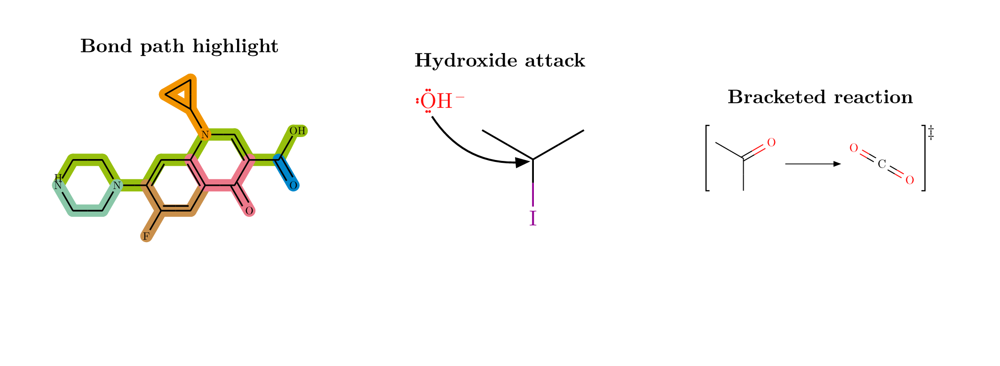

## Stereochemistry and drawing extensions

`[C@H]` / `[C@@H]` mark tetrahedral centers; `/` and `\` describe cis/trans
geometry. `!w` forces a solid wedge, `!h` a hashed wedge, `!s` a wavy
(squiggly) bond for unspecified stereochemistry or attachment points, and `!d`
a dashed bond for hydrogen bonds, partial bonds, and coordination.

```typst
#table(
  columns: (1fr, 1fr, 1fr, 1fr, 1fr, 1fr),
  gutter: 0em, row-gutter: 0em,
  align: center + horizon,
  stroke: 0.4pt + rgb("#d8d8d8"),

  [*Manual wedge*], [*Manual hash*], [*Wavy*], [*Dashed*],
  [*Tetrahedral @@*], [*trans alkene*],

  [#smiles("C!wN")],
  [#smiles("C!hN")],
  [#smiles("C!sN")],
  [#smiles("C!dN")],
  [#smiles("N[C@@H](C)C(=O)O")],
  [#smiles("F/C=C/F")],
)
```

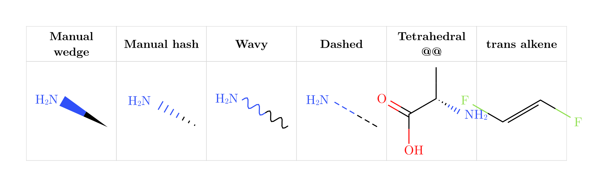

## API summary

### `#smiles(smiles-str, …)`

| Parameter | Default | Description |
|---|---|---|
| `smiles-str` | required | OpenSMILES string |
| `scale` | `1.0` | Balanced scale for bond length, labels, and stroke |
| `bond-length` | `none` | Bond length only (`1.0` = 30 pt per bond) |
| `font-size` | `none` | Atom-label size only |
| `font` | `"New Computer Modern"` | Atom-label font |
| `bond-stroke` | `none` | Bond width only |
| `color` | `true` | Apply Jmol CPK atom colors |
| `fg` | `auto` | Foreground for bonds/carbon labels; `auto` inherits the text color |
| `theme` | `auto` | CPK palette variant; `auto` goes dark when `fg` is light |
| `rotation` | `0deg` | Rotate molecule; labels stay upright |
| `mirror` | `none` | Reflect `"horizontal"` or `"vertical"` (before `rotation`); wedges and hashes swap so the depicted stereochemistry is preserved |
| `show-h` | `()` | Label selected implicit hydrogens; use `"all"` for every atom |
| `aromatic` | `"kekule"` | Lowercase-aromatic rings as doubles or `"circle"` |
| `atom-annotations` | `()` | Small gray side labels as `(index, content)` or `(index, content, offset)` tuples |
| `lone-pairs` | `none` | Draw lone pairs as `"dots"` or `"lines"` |
| `atom-colors` | `(:)` | Color overrides: element key `O: red` or label key `"{PPh3}": blue` |
| `show-indices` | `false` | Stamp atom indices for writing arrow references |
| `…annotations` | — | `arrow()` / `highlight()` items on this molecule |

SMILES string extensions:

| Syntax | Meaning |
|---|---|
| `{label}` | Literal upright label at an atom position |
| `{>label}` | Label anchored at the glyph after `>`; the marker is not shown |
| `{label\|N}` | Label and bonds colored like element N |
| `{label\|red}` | Label colored with a named color (17 names supported) |
| `{label\|#RRGGBB}` | Label colored with a hex code |
| `!w` | Force a solid wedge on the next single bond |
| `!h` | Force a hashed wedge on the next single bond |
| `!s` | Force a wavy (squiggly) bond on the next single bond |
| `!d` | Force a dashed bond on the next single bond |

### `#reaction(gap-h, gap-v, scale, breakable, show-indices, …items)`

Lays out a scheme (grid) or, when any curly `arrow()`/`highlight()` or `mol(offset:)`
is present, an electron-pushing mechanism (shared canvas).

| Parameter | Default | Description |
|---|---|---|
| `gap-h` | `1.5em` | Horizontal gap between items |
| `gap-v` | `1.5em` | Vertical gap between rows |
| `scale` | `1.0` | Uniform scale applied to the entire scheme |
| `breakable` | `false` | Allow splitting across pages |
| `show-indices` | `false` | Default atom-index overlay for string SMILES molecules in this reaction |

### `#rxn-arrow(above, below, dir, kind)`

| Parameter | Default | Description |
|---|---|---|
| `above` | `none` | Label above a horizontal arrow (or right of vertical) |
| `below` | `none` | Label below a horizontal arrow (or left of vertical) |
| `dir` | `"right"` | `"right"`, `"left"`, `"down"`, or `"up"` |
| `kind` | `"single"` | `"single"`, `"equilibrium"`, `"equilibrium-filled"`, `"dashed"`, or `"wavy"` |
| `color` | `auto` | Arrow color; `auto` inherits the surrounding text color |

### `#mol(spec, label: none, offset: (0,0), …opts)`

A reaction item. `spec` is any content (`smiles(...)`, `ce(...)`, text) or a SMILES
*string* — a string lets `reaction()` render it with addressable atoms. `offset`
nudges it in bond-length units. String molecules accept common drawing options
such as `font-size`, `font`, `bond-stroke`, `color`, `rotation`, `show-h`,
`lone-pairs`, `atom-colors`, and `show-indices`; use `reaction(scale: ...)` to
resize a shared mechanism canvas.

### Mechanism helpers

| Helper | Purpose |
|---|---|
| `atom(i)` / `atom(s, i)` | Atom center reference |
| `bond(i, j)` / `bond(s, i, j)` | Bond-midpoint reference |
| `lp(i)` / `lp(s, i)` | Lone-pair reference (`pair: n` to select) |
| `species(k)` | Bounding-box edge of a whole item |
| `arrow(from:, to:, label:, color:, bend:, angle:, half:)` | Curly electron arrow |
| `highlight(ref, fill:, stroke:, radius:)` | Shade an atom (disk) or bond (capsule) |
| `brackets(body, sup:, sub:)` | Square brackets with optional corner marks |

All references accept an `offset: (dx, dy)` nudge.

### `#ce(chem, font: none, font-size: none, …)`

Re-exports `chemformula`'s `ch`. Accepts `font` and `font-size` for local
styling; other arguments pass through to chemformula.

### `#mol-weight(smiles-str)`

Molecular weight in g/mol as a `float`. Errors on wildcards, abbreviations,
and isotopes.

## SMILES support

The package uses the [`smiles-parser`](https://crates.io/crates/smiles-parser)
crate for parsing.

Aromatic lowercase notation (`c1ccccc1`, `c1cc[nH]c1`, …) is kekulized on
parse following OpenSMILES; rings that cannot be kekulized are reported as
errors.

Dot-disconnected SMILES (`CC(=O)[O-].[Na+]`) draw each fragment separately,
side by side in writing order — salts, counterions, and hydrates render
without a spurious bond between fragments.

Current limitations:

- `@`/`@@` and `/`/`\` stereochemistry is depicted but R/S and E/Z descriptors are not computed.
- Square-planar `@SP1`–`@SP3` centers are depicted exactly (the geometry is
  planar); quadruple bonds (`$`) render as four parallel lines.
- Trigonal-bipyramidal (`@TB`), octahedral (`@OH`), and allenal (`@AL`)
  centers are accepted and drawn with correct connectivity, but without
  stereo wedges.
- Bridged bicyclics may overlap; template matching is not implemented.

## Building

```sh
cargo test --manifest-path plugin/Cargo.toml   # Rust tests
./build.sh                                      # build WASM plugin
typst compile --root . tests/test.typ tests/test.pdf       # visual test
typst compile --root . docs/documentation.typ docs/documentation.pdf  # user guide
```

## Architecture

```text
SMILES string → Rust WASM plugin → JSON layout → CeTZ drawing in Typst
```

## License

MIT
