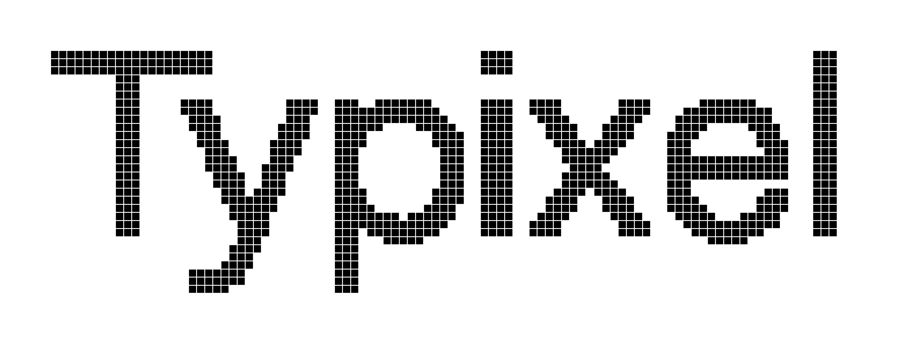
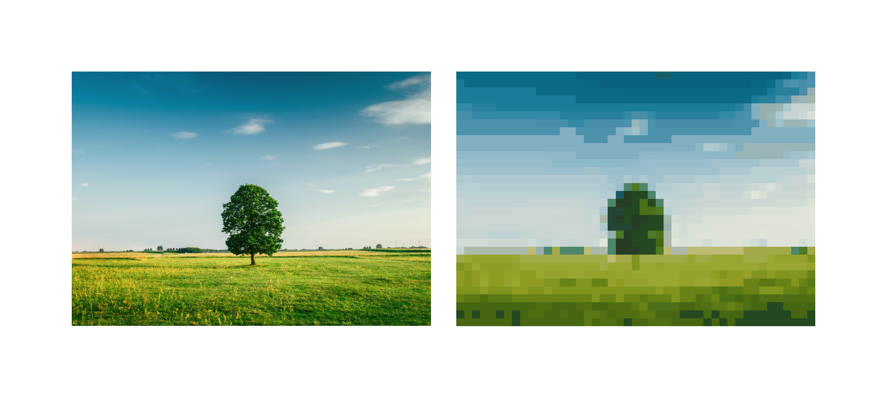

# Typixel



A Typst package for creating pixel art directly in your documents. Convert images to pixel art or design custom pixel graphics using simple text maps.

## Usage

### Image to Pixel Art

```typ
#import "@preview/typixel:0.1.0": *
#set page(width: auto, height: auto, margin: 1cm)

#grid(
  columns: 2,
  gutter: 10pt,
  image("gahag.jpg", width: 5cm),
  pixel-image(
    read("gahag.jpg", encoding: none),
    rows: 32,
    shape: square-shape,
    width: 5cm,
  )
)
```



### Text-based Pixel Map

```typ
#import "@preview/typixel:0.1.0": *
#set page(width: auto, height: auto, margin: 1cm)

#pixel-map(
  "
  ....XXX....
  ...XXXXX...
  ..XXXXXXX..
  .XXXXXXXXX.
  XXXXXXXXXXX
  ",
  palette: ("X": red, ".": none),
  pixel-size: 10pt
)
```


## API Reference

### `pixel-image()`

Convert raw image data to pixel art.

**Parameters:**
- `image-data` (bytes): Raw image data (e.g. from `read("path", encoding: none)`)
- `columns` (int, default: auto): Number of pixel columns
- `rows` (int, default: auto): Number of pixel rows
- `scale` (float, default: auto): Scale factor for image
- `colors` (int, default: 64): Number of colors in palette
- `transparency-char` (string, default: "."): Character representing transparency
- `pixel-size` (length, default: 5pt): Size of each pixel
- `width` (length, default: auto): Total width (overrides pixel-size)
- `shape` (function, default: square-shape): Shape function for pixels
- `gap` (length, default: 0pt): Gap between pixels

**Example:**
```typ
#pixel-image(
  read("logo.png", encoding: none),
  columns: 48,
  colors: 32,
  pixel-size: 6pt,
  gap: 1pt,
  shape: circle-shape
)
```

### `pixel-map()`

Create pixel art from a text grid.

**Parameters:**
- `map` (string): Multi-line string defining the pixel grid
- `palette` (dictionary): Mapping of characters to colors
- `pixel-size` (length, default: 10pt): Size of each pixel
- `width` (length, default: auto): Total width (overrides pixel-size)
- `shape` (function/dictionary, default: square-shape): Shape(s) for pixels
- `gap` (length, default: 0pt): Gap between pixels

**Example:**
```typ
#pixel-map(
  "
  .OOOOO.
  O.....O
  O.O.O.O
  O.....O
  .OOOOO.
  ",
  palette: (
    "O": black,
    ".": white
  ),
  pixel-size: 15pt
)
```

## Available Shapes

### Built-in Shape Functions

- `square-shape` - Standard square pixels
- `circle-shape` - Circular pixels
- `rounded-shape` - Rounded corner squares (customizable radius)
- `diamond-shape` - Diamond/rotated square pixels
- `star-shape` - Five-pointed star pixels
- `cross-shape` - X-shaped pixels (customizable thickness)
- `heart-shape` - Heart-shaped pixels

### Using Shapes

**Single shape for all pixels:**
```typ
#pixel-map(map, palette: palette, shape: circle-shape)
```

**Different shapes per character:**
```typ
#pixel-map(
  map,
  palette: ("X": red, "O": blue),
  shape: (
    "X": star-shape,
    "O": circle-shape
  )
)
```

**Custom shape parameters:**
```typ
#pixel-map(
  map,
  palette: palette,
  shape: (w, h, f) => rounded-shape(
    width: w,
    height: h,
    fill: f,
    radius: 30%
  )
)
```

## Advanced Examples

### Rainbow Gradient

```typ
#import "@preview/typixel:0.1.0": *
#set page(width: auto, height: auto, margin: 1cm)

#pixel-map(
  "ROYGBIV\n" * 7,
  palette: (
    "R": red,
    "O": orange,
    "Y": yellow,
    "G": green,
    "B": blue,
    "I": rgb("#4B0082"),
    "V": rgb("#8F00FF")
  ),
  width: 200pt,
  shape: circle-shape
)
```


### Mixed Shapes

````typ
#import "@preview/typixel:0.1.0": *
#set page(width: auto, height: auto, margin: 1cm)

#pixel-map(
  "
  SSSSS
  CDCDC
  HHHHH
  ",
  palette: (
    "S": red,
    "C": blue,
    "D": green,
    "H": purple
  ),
  shape: (
    "S": star-shape,
    "C": circle-shape,
    "D": diamond-shape,
    "H": heart-shape
  ),
  pixel-size: 20pt,
  gap: 2pt
)
````


### Custom Shape Definition

```typ
#import "@preview/typixel:0.1.0": *
#set page(width: auto, height: auto, margin: 1cm)

// 1. Define your custom shape
#let octagon-shape(width: 0pt, height: 0pt, fill: black) = {
  let c = 29.29% 
  box(width: width, height: height,
    polygon(
      fill: fill,
      (c, 0%), (100% - c, 0%),
      (100%, c), (100%, 100% - c),
      (100% - c, 100%), (c, 100%),
      (0%, 100% - c), (0%, c)
    )
  )
}

// 2. Use it in pixel-map
#pixel-map(
  "
  ..A..
  .AAA.
  AAAAA
  .AAA.
  ..A..
  ",
  palette: ("A": blue, ".": none),
  pixel-size: 20pt,
  shape: octagon-shape
)
```


## Limitations

When converting images using `pixel-image`, the final output height may not **exactly** match the original image's height.

This occurs because:
1. Pixel art requires an **integer number of rows**, so the height must be rounded to the nearest whole pixel.
2. Pixels are forced to be **square** (width = height).

## License

This project is distributed under the MIT License. See [LICENSE](LICENSE) for details.

The example image `gahag.jpg` is based on an image from [GAHAG](https://gahag.net/000312-tree-landscape/) and is licensed under CC0.