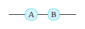

# typograph

**[Full documentation →](https://bencichos.github.io/typograph/)**

`typograph` is a neutral diagram engine for Typst: nodes, edges, Bézier
curve controls, wire clipping to true silhouettes, ports, reusable
fragments, and layered style resolution — with no built-in visual language
of its own. No CeTZ, no LaTeX/TikZ dependency.

It has no opinion about what a node should look like. A document supplies
that itself through per-call `style:` dictionaries, or through a theme —
see [`typograph-zx`](https://github.com/BenCichos/typograph-zx) for a
complete, ready-to-use one (ZX-calculus and continuous-variable ZX-calculus
notation), built entirely on this package's public API.

## Install and import

```typ
#import "@preview/typograph:0.1.0" as typ
```

## Quick start

Diagram coordinates use the mathematical convention: `x` increases to the
right, `y` increases upward.

```typ
#typ.diagram({
  let a = typ.node(0, 0, label: [A], style: (
    shape: typ.shapes.circle, shape-labelled: typ.shapes.stadium,
    fill: aqua.lighten(70%), stroke: 0.6pt + teal, min-size: 12pt, inset: 4pt,
  ))
  let b = typ.node(1, 0, label: [B], style: (
    shape: typ.shapes.circle, shape-labelled: typ.shapes.stadium,
    fill: aqua.lighten(70%), stroke: 0.6pt + teal, min-size: 12pt, inset: 4pt,
  ))
  typ.edge(a, b)
  typ.edge(a, (-1, 0))
  typ.edge(b, (2, 0))
})
```

<p align="center">
    
<p/>

An edge automatically contributes the nodes at its endpoints. See the
[full documentation](https://bencichos.github.io/typograph/) for the
complete guide: drawing nodes and edges, shape builders, curve controls and
waypoints, writing a theme, configuration, fragments, and the exhaustive
API reference.

## Testing

```bash
bash tests/run.sh
```

Runs the unit/API/contract/negative test suite, an outline-geometry
snapshot, and a documentation-figure staleness check. See
[Testing](https://bencichos.github.io/typograph/dev/testing.html) for what
each part covers.

## License

MIT — see [LICENSE](LICENSE).
