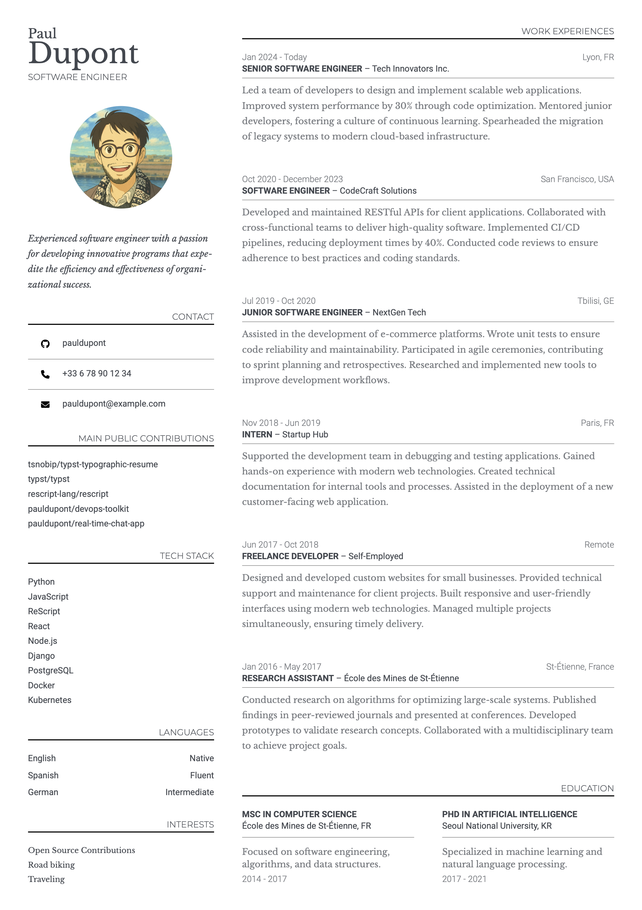

# Typographic-Resume

A stylish and customizable résumé template for Typst, designed with elegant typographic variations.

<a href="thumbnail.webp">
    
</a>

## Usage

### Fonts

The default fonts are ["Libre Baskerville"](https://fonts.google.com/specimen/Libre+Baskerville),
["Roboto"](https://fonts.google.com/specimen/Roboto) and ["Montserrat"](https://fonts.google.com/specimen/Montserrat).

You can also copy paste the whole [fonts folder](https://github.com/tsnobip/typst-typographic-resume/tree/main/fonts) in your project.

Make sure they're installed on your system, or change them in [Theme](#theme).

### From Typst app

Create a new project based on the template [typographic-resume](https://typst.app/universe/package/typographic-resume).

### Locally

Copy the [template](https://raw.githubusercontent.com/tsnobip/typst-typographic-resume/main/template/main.typ) to your Typst project.

### From a blank project

Import the library :

```typst
#import "@preview/typographic-resume:0.1.0": *
```

Show the root `resume` function :

```typst
#show: resume.with(
  theme: (),
  first-name: "Your first name",
  last-name: "Your last name",
  profession: "Your profession",
  bio: "Your bio",
  profile-picture: "link to your profile picture",
  aside: [
    ASIDE CONTENT
  ]
)

MAIN CONTENT
```

Several content functions are available.

**Section**

```typst
#section(
  theme: (),
  "TITLE_CONTENT",
  "BODY_CONTENT",
)
```

**contact-entry**

```typst
#contact-entry(
  theme: (),
  "Contact category or icon",
  "contact information",
)
```

**language-entry**

```typst
#language-entry(
  theme: (),
  "Language",
  "Level",
)
```

**work-entry**

```typst
#work-entry(
  theme: (),
  timeframe: "Time period of this work experience",
  title: "Your job title",
  organization: "The name of the organization your worked for",
  location: "Work location",
  "Description of this work experience"
)
```

**education-entry**

```typst
#education-entry(
  theme: (),
  timeframe: "Time period of this education experience",
  title: "Your job title",
  institution: "The name of the institution where you studied",
  location: "Work location",
  "Description of this education experience"
)
```

## Theme

Customize the theme by specifying the `theme` parameter and overriding 1 or more keys.

### Function `cv`

| Key                     | Type     | Default               |
| ----------------------- | -------- | --------------------- |
| `margin`                | relative | `26pt`                |
| `font`                  | str      | `"Libre Baskerville"` |
| `font-size`             | relative | `8pt`                 |
| `font-secondary`        | str      | `"Roboto"`            |
| `font-tertiary`         | str      | `"Montserrat"`        |
| `text-color`            | color    | `rgb("#3f454d")`      |
| `gutter-size`           | relative | `4em`                 |
| `main-width`            | relative | `6fr`                 |
| `aside-width`           | relative | `3fr`                 |
| `profile-picture-width` | relative | `55%`                 |

### Function `section`

| Key           | Type     | Default |
| ------------- | -------- | ------- |
| `space-above` | relative | 1fr     |
| `align-title` | relative | end     |

### Function `contact-entry`

| Key              | Type     | Default    |
| ---------------- | -------- | ---------- |
| `gutter-size`    | relative | inherit    |
| `font-secondary` | str      | `"Roboto"` |
| `font-size`      | relative | inherit    |

### Function `language-entry`

| Key              | Type     | Default    |
| ---------------- | -------- | ---------- |
| `font-secondary` | str      | `"Roboto"` |
| `font-size`      | relative | inherit    |

### Function `work-entry`

| Key              | Type     | Default    |
| ---------------- | -------- | ---------- |
| `space-above`    | relative | 1fr        |
| `font-secondary` | str      | `"Roboto"` |
| `font-size`      | relative | inherit    |

### Function `education-entry`

| Key              | Type     | Default    |
| ---------------- | -------- | ---------- |
| `font-secondary` | str      | `"Roboto"` |
| `font-size`      | relative | inherit    |
