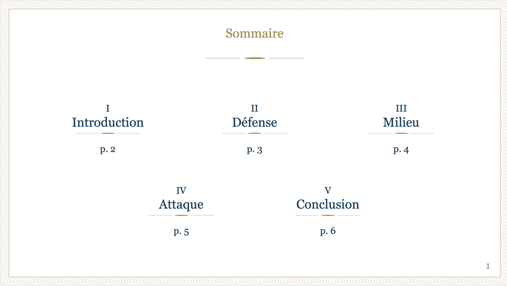
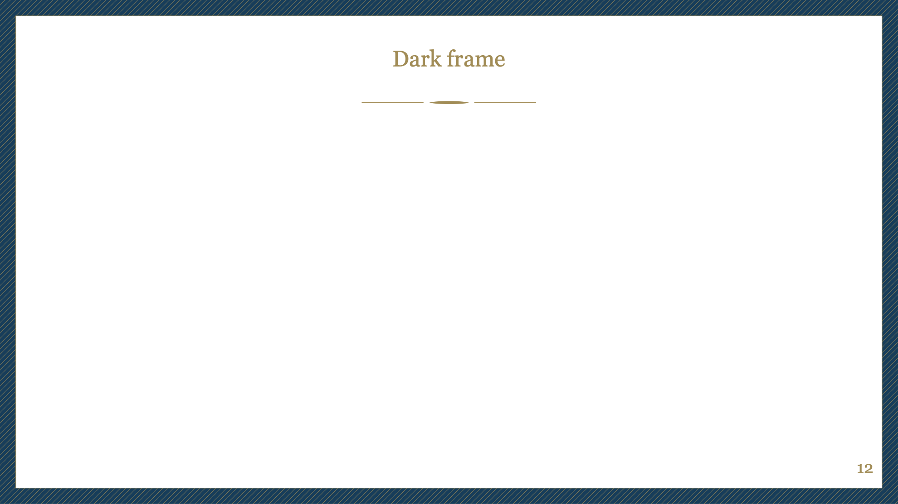

# Typst Polytechnique slide template

A Typst template for Polytechnique student oral presentations.

> [!warning]
> The original Polytechnique template uses the **Georgia font**. This is a copyrighted font, so it could not be included directly within the template. For better results, **you are encouraged to [download](https://font.download/font/georgia-2) it** and add it to the project (simply upload the font files on the web app). In case of issue, see [font management in Typst](https://typst.app/docs/reference/text/text#parameters-font).

## Settings overview

The template can by applied while specifying the following settings:

- `frame-theme`: "light" or "dark" (default: "light")
- `h1-theme`: "light", "ligh-dark", "dark-light" or "dark" (default: "dark-light")
- `ratio`: a float (default: 16 / 9)

## Features

### Cover page

You can generate a cover page using the `#template.cover` command. It takes the following arguments:

- `title`
- `speaker`
- `date`
- `background-image`: this should be an image object, with `width: 100%, height: 100%` like `image("path/to/custom/image.png", width: 100%, height: 100%)` (default: a photo of the lake and Grand Boncourt).

Example:

```typ
#cover(title: "Soutenance de stage", speaker: "Big BRother", date: "22/08/2025")
```


### Outline

You can generate a fancy table of contents using the classic `#outline` command:

```typ
#outline(title: "Sommaire")
```

This will generate one of the outline pages below, according to the number of sections you have. Note that if you have less than two sections, or strictly more than six sections, the outline will default on a classic table of contents.

|                           Two sections                            |                            Three sections                             |                            Four sections                            |                            Five sections                            |                           Six sections                            |
| :---------------------------------------------------------------: | :-------------------------------------------------------------------: | :-----------------------------------------------------------------: | :-----------------------------------------------------------------: | :---------------------------------------------------------------: |
|  |  |  |  |  |

### Logo in background

If you want to display the "armes" of Polytechnique in the background of a slide, use `#show: template.armes` **right after the slide title**.

```typ
== A slide with armes
#show: template.armes

#lorem(100)
```


### Section titles

Section title slides come in four flavors: `light`, `light-dark`, `dark-light`, `dark`.

|                  `light`                  |                    `light-dark`                     |                    `dark-light`                     |                 `dark`                  |
| :---------------------------------------: | :-------------------------------------------------: | :-------------------------------------------------: | :-------------------------------------: |
|  |  |  |  |

### Frame themes

The fancy frame comes in two flavors: `light` or `dark`.

|                     `light`                     |                    `dark`                     |
| :---------------------------------------------: | :-------------------------------------------: |
|  |  |

### Color palette

The template exposes the color palette.

|                        `PALETTE.blue`                        |                        `PALETTE.gold`                        |                        `PALETTE.gray`                        |                        `PALETTE.lighter-blue`                        |
| :----------------------------------------------------------: | :----------------------------------------------------------: | :----------------------------------------------------------: | :------------------------------------------------------------------: |
|  |  |  |  |
