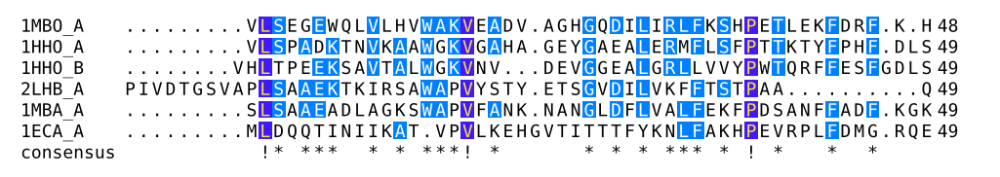
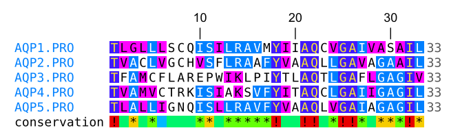
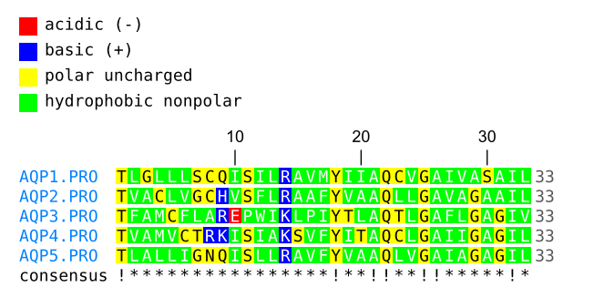
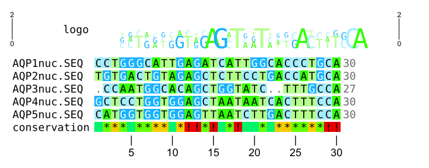

# Typshade



Typshade is a Typst package for visualizing multiple sequence alignments in bioinformatics.

It provides a Typst-native interface centered on `shade(...)`, offering a readable and composable way to render alignments, add annotations, and incorporate logos, structure tracks, and graph tracks.

Inspired by [TeXshade](https://ctan.org/pkg/texshade), Typshade rethinks alignment visualization with a focus on clarity, composability, and a Typst-native user experience.

## Why Typshade?

TeXshade is powerful, but its UI reflects TeX: many global commands, implicit state, and order-sensitive setup before the alignment is rendered. Typshade keeps the feature set while making the source read like a figure specification.

TeXshade style:

```latex
\begin{texshade}{alignment.msf}
  \shadingmode[similar]{identical}
  \shadingcolors{blues}
  \residuesperline{45}
  \setends{1}{80..125}
  \showruler{top}{1}
  \rulersteps{10}
  \showconsensus{bottom}
  \showsequencelogo{top}
  \shaderegion{1}{NPA}{White}{BrickRed}
  \feature{top}{1}{NXX[ST]N}{box[Yellow]}{motif}
\end{texshade}
```

Typshade style:

```typst
#let alignment = read("alignment.msf", encoding: none)

#shade(
  alignment,
  format: "msf",
  figure: publication(
    similarity: "blues",
    region: "80..125",
    logo: "charge",
    motifs: (
      "NPA": (bg: "BrickRed", text: "active site"),
      "NXX[ST]N": "motif",
    ),
  ),
)
```

The lower-level helpers are still available through `commands:` when you need precise control, but new documents can usually start from the kind of figure you want: publication figure, motif map, structure map, or logo analysis.

## Quick Start

```typst
#import "@preview/typshade:0.1.3": *

#let alignment = read("alignment.msf", encoding: none)

#shade(
  alignment,
  format: "msf",
  theme: "screen",
  figure: motif-map(auto),
)
```

`read(..., encoding: none)` remains supported on Typst 0.15 and later. On Typst 0.15 or later, you can additionally pass a resolved project path and let Typshade read the source inside the package:

```typst
#shade(path("alignment.msf"), format: "msf", figure: motif-map(auto))
```

## Preview

Protein alignment with similarity shading, motif annotations, a ruler,
a conservation track, and a legend:



Protein alignment with hydropathy-based functional coloring:



Nucleotide alignment with DNA coloring, a sequence logo, a conservation track,
and a ruler:



## Typst-Native Helpers

- `shade(...)`: Named-option alignment renderer for new documents.
- `figure:`: Purpose-level recipe slot for complete figure designs.
- `publication`, `motif-map`, `structure-map`, `logo-analysis`, `overview`: High-level recipes.
- `similar`, `identical`, `diverse`, `functional`, `lines`, `window`, `ruler`, `consensus`, `logo`, `legend`: Compact command helpers; `lines(auto)` and `fit: "container"` fit the current Typst container.
- `auto-layout(...)`, `auto-page(...)`, and `fit: "page"`: Typst-aware line length and page-aware block splitting for long figures.
- `color-scheme`, `scoring-mode`, `sequence-window`: Small, readable option helpers.
- `ruler-track`, `consensus-track`, `sequence-logo`, `subfamily-logo`, `legend-track`: Track helpers.
- `structure-tracks(...)`: Adds topology/secondary-structure tracks from sidecar files.
- `shade-preset("publication" | "overview" | "logo" | "functional" | "structure")`: Reusable command bundles.
- `shade-theme("classic" | "print" | "screen" | "warm" | "nature")` and `visual-theme(...)`: Color/style bundles.
- `highlight`, `tint`, `emphasize`, `mark`, `motif`, `graph`: Readable command builders for common annotations; graph metrics include conservation, entropy, gap-fraction, coverage, identity, hydrophobicity, molecular weight, and charge.
- `select-range`, `select-motif`, `select-metric`, `select-and`, `select-or`, `select-not`, and `select-pad`: Composable Selection DSL values for windows, highlights, marks, graphs, and analysis helpers.
- `cell-style(ctx => ...)`: Data-driven per-cell styling with Typst functions.
- `pdb-point`, `pdb-line`, `pdb-plane`: Safer constructors for PDB selections.
- `alignment-position("left" | "center" | "right")`: Overrides the default left-aligned block placement.
- `alignment-summary(...)`, `alignment-debug(...)`, `cell-inspect(...)`, and `selection-preview(...)`: In-document inspection helpers.
- `sequence-list(...)` and `selection-table(...)`: Typst tables for data-aware reports.
- `percent-identity(...)`, `percent-similarity(...)`, and `similarity-table(...)`: Pairwise identity/similarity analysis.
- `alignment-data(...)` and `parse-alignment(...)`: Data access helpers for custom Typst logic.

## TeXshade To Typshade

| TeXshade idea | Typshade API |
|---|---|
| `texshade` environment | `shade(read("alignment.msf", encoding: none), format: "msf", figure: publication(...))`, or `shade(path("alignment.msf"), format: "msf", ...)` on Typst 0.15+ |
| `shadingmode`, `shadingcolors`, `threshold` | `similar`, `identical`, `diverse`, `functional`, or `scoring-mode`, `color-scheme`, `threshold` |
| `residuesperline`, `setends` | `lines`, `window`, `fit`, `auto-layout`, `auto-page`, or Selection DSL values with `sequence-window` |
| `shownames`, `shownumbering`, `showconsensus`, `showruler` | `names`, `numbers`, `consensus`, `ruler`, or the fine-grained track helpers |
| `showsequencelogo`, `showsubfamilylogo`, `showlegend` | `logo`, `subfamily-logo`, `legend` |
| `shaderegion`, `tintregion`, `emphregion`, `feature` | `highlight`, `tint`, `emphasize`, `mark`, `motif`, `graph` |
| `includeDSSP`, `includeSTRIDE`, `includeHMMTOP`, `includePHD*` | `structure-tracks`, `dssp-track`, `stride-track`, `hmmtop-track`, `phd-topology-track`, `phd-secondary-track` |
| font and spacing macros | `text-family`, `text-weight`, `text-posture`, `text-size`, `block-gap`, `feature-slot-space` |

See the [full documentation](https://github.com/rice8y/typshade/blob/v0.1.3/docs/documentation.pdf) for the full guide and a larger correspondence table.

## Smart Recipes

Recipes inspect the alignment before rendering. For example, `motif-map(auto)` detects common motifs for the sequence type, focuses the region around them, chooses a readable line length, adds conservation when useful, and enables a logo only when the figure stays readable. Override any option when you need exact control.

## Fine-Grained Control

Macro-style command names are intentionally not part of the public API. Use Typst-shaped command helpers when you need detailed control:

- Scoring: `threshold`, `weight-table`, `set-weight`, `gap-penalty`, `residue-style`, `functional-group`.
- Tracks: `names-track`, `numbering-track`, `consensus-name`, `consensus-symbols`, `ruler-name`, `ruler-marker`, `logo-color`.
- Sequence layout: `start-number`, `sequence-length`, `domain`, `hide-sequence`, `sequence-order`, `separation-line`.
- Features and structure: `feature-rule`, `feature-text-label`, `backtranslation-label`, `show-structure-types`, `structure-appearance`, `stride-track`, `dssp-track`, `hmmtop-track`, `phd-topology-track`, `phd-secondary-track`.
- Typography and spacing: `text-family`, `text-weight`, `text-posture`, `text-size`, `character-stretch`, `line-stretch`, `block-gap`, `feature-slot-space`.

## Custom Control

Use recipes when you know the purpose of the figure:

```typst
#let alignment = read("alignment.msf", encoding: none)

#shade(
  alignment,
  format: "msf",
  figure: publication(
    region: "80..125",
    logo: "charge",
    motifs: (
      "NPA": (bg: "BrickRed", text: "active site"),
      "NXX[ST]N": "glycosylation",
    ),
  ),
)
```

Use `commands:` when you want to assemble visible parts yourself:

```typst
#let alignment = read("alignment.msf", encoding: none)

#shade(
  alignment,
  format: "msf",
  preset: "publication",
  theme: "screen",
  commands: (
    similar(colors: "blues", threshold: 45),
    lines(45),
    window(1, "80..125"),
    ruler("top", sequence: 1, every: 10),
    consensus("bottom", name: "conservation"),
    logo("top", colors: "charge"),
    legend(),
    highlight(1, "NPA", bg: "BrickRed"),
    motif(1, "NXX[ST]N", text: "motif"),
    graph("bottom", 1, "all", "conservation", kind: "color", options: ("ColdHot",)),
  ),
)
```

You can also mix recipe output with explicit, reproducible helper lists:

```typst
#let alignment = read("alignment.msf", encoding: none)

#shade(
  alignment,
  format: "msf",
  figure: publication(region: "80..125"),
  commands: (
    highlight(1, "NXX[DE][KR]XXQ", fg: "White", bg: "BrickRed"),
    sequence-logo(position: "top"),
  ),
)
```

# License

This project is distributed under the GPL v2 License. See [LICENSE](LICENSE) for details.
