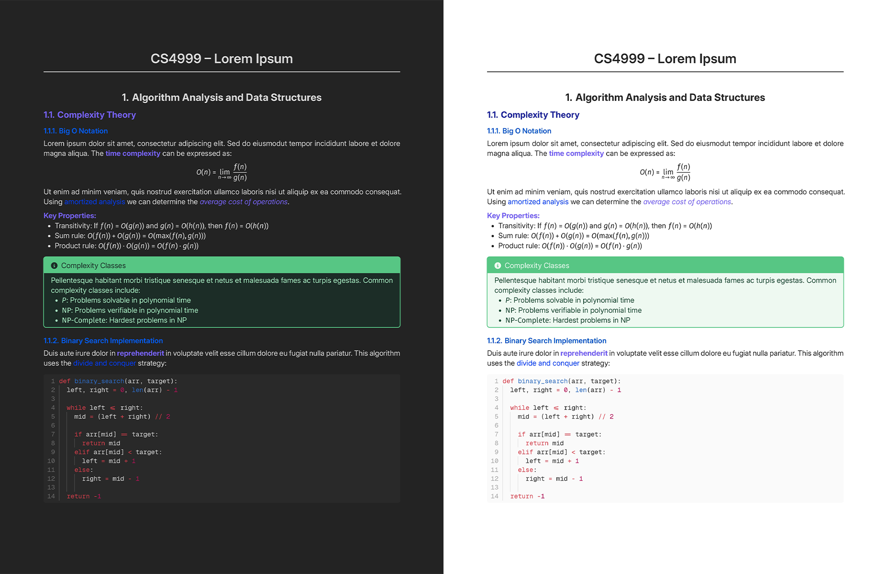

# Typsidian

Obsidian-inspired Typst template for note taking, outlines, and knowledge management.



_Left: `theme: "dark"`, Right: `theme: "light"`_

## Usage

```typst
#import "@preview/typsidian:0.0.1": *
#show: typsidian.with(
  theme: "light",
  title: "My Document",
  course: "CS4999",
  show-index: true,
  index-entry-list: (
    (
      key: "example",
      short: "An example index entry"
    ),
  )
)
```

### Options

- `title` - Document title
- `author` - Document author
- `course` - Course name or subtitle
- `text-args` - Text arguments for main and mono text styles
  - `main` - Main text style
    - `font` - Font family (default: "Inter 24pt")
    - `weight` - Font weight (default: "regular")
    - `size` - Font size (default: 10pt)
  - `mono` - Monospaced text style
    - `font` - Font family (default: "GeistMono NFP")
    - `weight` - Font weight (default: "regular")
    - `size` - Font size (default: 1.1em)
- `show-index` - Whether to show the [index](https://typst.app/universe/package/glossarium/) (default: false)
- `index-entry-list` - List of index entries (default: empty array)
- `theme` - Theme, either "light" or "dark" (default: "light")
- `show-heading-colors` - Whether to show heading colors (default: true)
- `show-bold-color` - Whether to show bold text color (default: true)
- `show-italic-color` - Whether to show italic text color (default: true)
- `standalone` - True for standalone documents, false for use with my [Typst for Obsidian plugin](https://github.com/k0src/Typst-for-Obsidian)

### Functions

- `make-title(show-outline: true, show-underline: true, centered: true)`:
  - Generates the title page.
  - `show-outline` - Whether to show the outline around the title box (default: true)
  - `show-underline` - Whether to show the underline below the title (default: true)
  - `centered` - Whether to center the title box vertically on the page (default: true)
- `bbox(title, body, show-title: true)`:
  - Creates a plain boxed section with an optional title.
  - `title` - Title of the box
  - `body` - Content of the box
  - `show-title` - Whether to show the title (default: true)
- `info(title, body, show-title: true)`, `important(title, body, show-title: true)`, `example(title, body, show-title: true)`, `aside(title, body, show-title: true)`:
  - Creates a colored boxed section with an icon and an optional title.
  - `title` - Title of the box
  - `body` - Content of the box
  - `show-title` - Whether to show the title (default: true)

### With Typst for Obsidian Plugin

1. Install the [Typst for Obsidian plugin](https://github.com/k0src/Typst-for-Obsidian)
2. Create a new Typst file in Obsidian and import the template with desired options:

```typst
#import "@local/typsidian:0.0.1": *
#show: typsidian.with(
  theme: "dark",
  title: "My Document",
  course: "CS4999",
  standalone: false // Disables page functions
)
```

4. Use `#make-title(show-outline: true)` to generate the title page.
5. Write your document content below the title.

## Dependencies

### Fonts

- [Inter 24pt](https://fonts.google.com/specimen/Inter)
- [GeistMono NFP](https://github.com/ryanoasis/nerd-fonts/releases/)
- [Fira Math](https://github.com/firamath/firamath/releases/)

### Packages

- [zebraw](https://typst.app/universe/package/zebraw)
- [itemize](https://typst.app/universe/package/itemize)
- [showybox](https://typst.app/universe/package/showybox)
- [glossarium](https://typst.app/universe/package/glossarium/)
- [fontawesome](https://typst.app/universe/package/fontawesome)

## License

[MIT License](./LICENSE)
