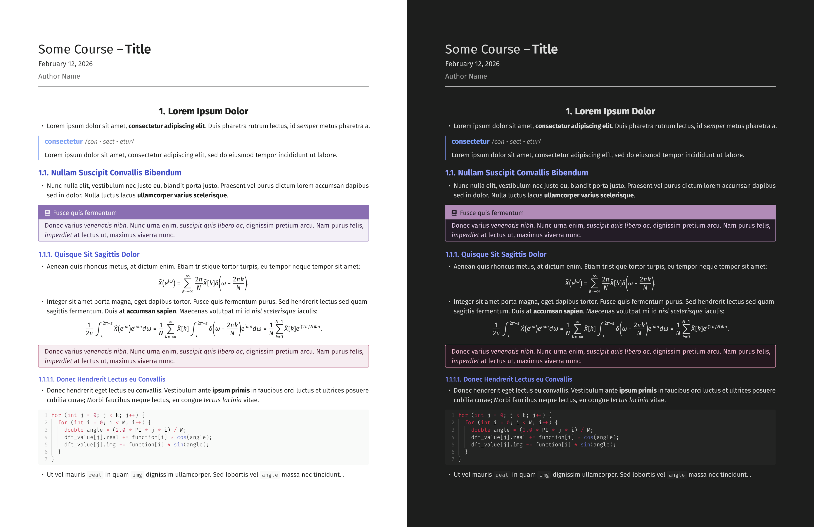

# Typsidian

Obsidian-inspired Typst template for note taking, outlines, and knowledge management.



_Left: `theme: "light"`, Right: `theme: "dark"`_

## Usage

```typst
#import "@preview/typsidian:0.0.3": *
#show: typsidian.with(
  theme: "light",
  title: "My Document",
  course: "My Course",
  show-index: true,
  index-entry-list: (
    (
      key: "example",
      short: "An example index entry"
    ),
  )
)
```

### Options

- `title` - Document title.
- `author` - Document author.
- `course` - Course name or subtitle.
- `text-args` - Custom text styling arguments for main, mono, headings, and math text.
  - <details>
    <summary>Parameters</summary>

    Dictionary with the following optional properties:
    - `main` - Main text styling. Takes a dictionary with `font` (string), `weight` (string), and `size` (length).
    - `mono` - Monospace/code text styling. Takes a dictionary with `font` (string), `weight` (string), and `size` (length).
    - `headings` - Heading text styling. Takes a dictionary with `font` (string), `numbering` (string), `weights`, `sizes`, `aligns`, and `small-caps`.
    - `math` - Math equation styling. Takes a dictionary with `font` (string), `size` (length), and `weight` (number).

    </details>

- `show-index` - Whether to show the [index](https://typst.app/universe/package/glossarium/) at the end. Default: `false`.
- `index-entry-list` - List of glossary entries for the index.
- `theme` - Color theme for the document. Takes a string, either "light" or "dark". Default: `"light"`.
- `show-heading-colors` - Whether to colorize headings using theme colors. Takes a boolean. Default: `true`.
- `show-bold-color` - Whether to colorize bold text using theme colors. Takes a boolean. Default: `false`.
- `show-italic-color` - Whether to colorize italic text using theme colors. Takes a boolean. Default: `false`.
- `standalone` - True for standalone documents, false for use with my [Typst for Obsidian plugin](https://github.com/k0src/Typst-for-Obsidian). Default: `true`

### Functions

- `c(code, lang)` - Inline code with background color.
  - <details>
    <summary>Parameters</summary>

    - `code` - The code text to display.
    - `lang` - Language for syntax highlighting. Default: `"text"`.

    </details>

- `make-title(show-outline, show-underline: true, show-author, justify)` - Generates title heading.
  - <details>
    <summary>Parameters</summary>

    - `show-outline` - Whether to display the document outline below the title.
    - `show-underline` - Whether to show an underline under the title.
    - `show-author` - Whether to display the author name and date.
    - `justify` - Alignment of the title. Takes a string: `"center"`, `"left"`, or `"right"`. Default: `"center"`.

    </details>

- `section-title(title: "", subtitle: none, justify: "center", underline: false, icon: none)` - Generates a section title.
  - <details>
    <summary>Parameters</summary>

    - `title` - The main section title text.
    - `subtitle` - Optional subtitle text below the main title.
    - `justify` - Alignment of the section title. Takes a string: `"center"`, `"left"`, or `"right"`. Default: `"center"`.
    - `underline` - Whether to show underline.
    - `icon` - Optional Font Awesome icon to display before the title.

    </details>

- `box(theme, title, breakable, body, box-radius, box-thickness, icon, footer, inset)` - Creates a themed callout box.
  - <details>
    <summary>Parameters</summary>

    - `theme` - Box theme. Takes a string: `"basic"`, `"info"`, `"important"`, `"example"`, `"aside"`, `"definition"`, `"frame"`, or `"highlight"`. Default: `"basic"`
    - `title` - Optional title for the box header.
    - `breakable` - Whether the box can break across pages. Default: `false`
    - `body` - The content in the box,
    - `box-radius` - Border radius.
    - `box-thickness` - Thickness of the box border.
    - `icon` - Optional Font Awesome icon for the box title.
    - `footer` - Optional footer content at bottom of box.
    - `inset` - Inset of the box.

    </details>

- `hr(pad, dash, cap)` - Generates horizontal rule.
  - <details>
    <summary>Parameters</summary>
    
    - `pad` - Vertical padding above and below the line.
    - `dash` - Line style pattern. Takes a string: `"solid"`, `"dotted"`, `"densely-dotted"`, `"loosely-dotted"`, `"dashed"`, `"densely-dashed"`, or `"loosely-dashed"`. Default: `"solid"`
    - `cap` - Line end cap style. Takes a string: `"round"`, `"square"`, or `"butt"`. Default: `"round"`

    </details>

- `term(word, definition, pronunciation)` - Creates a term and definition block.
  - <details>
    <summary>Parameters</summary>

    - `word` - The word text.
    - `definition` - The definition text.
    - `pronunciation` - Optional pronunciation for the word.

    </details>

- `note(icon, color, body)` - Creates quick note box with custom icon.
  - <details>
    <summary>Parameters</summary>

    - `icon` - Font Awesome icon to display at the start of the note. Default: `fa-note-sticky()`
    - `color` - Color of the note's accent.
    - `body` - The content of the note.

    </details>

- `qa(question, answer)` - Question and answer pair block.
  - <details>
    <summary>Parameters</summary>
    
    - `question` - The question text.
    - `answer` - The answer text.

    </details>

### With Typst for Obsidian Plugin

1. Install the [Typst for Obsidian plugin](https://github.com/k0src/Typst-for-Obsidian)
2. Create a new Typst file in Obsidian and import the template with desired options:

```typst
#import "@local/typsidian:0.0.3": *
#show: typsidian.with(
  theme: "dark",
  title: "My Document",
  course: "CS4999",
  standalone: false
)
```

4. Use `#make-title(show-outline: true)` to generate the title page.
5. Write your document content below the title.

## Dependencies

### Fonts

- [Fira Sans](https://fonts.google.com/specimen/Fira+Sans)
- [Fira Code](https://fonts.google.com/specimen/Fira+Code)
- [Fira Math](https://github.com/firamath/firamath/releases/)

### Packages

- [zebraw](https://typst.app/universe/package/zebraw)
- [itemize](https://typst.app/universe/package/itemize)
- [showybox](https://typst.app/universe/package/showybox)
- [glossarium](https://typst.app/universe/package/glossarium/)
- [fontawesome](https://typst.app/universe/package/fontawesome)

## License

[MIT License](./LICENSE)
