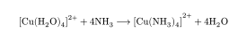

# Typst Chemical Formula Package

A Typst package (alpha) for typesetting chemical formulas, currently working on inorganic.

## Features

- Typeset chemical formulas with ease
- Reactions and equations, including reversible reactions
- Support for complex reaction conditions (e.g. temperature (T=), pressure (P=), etc.)

## Usage

To use Typsium, you need to include the package in your document:

```typst
#import "@preview/typsium:0.1.0": ce
#ce("[Cu(H2O)4]^(2+) + 4NH3 -> [Cu(NH3)4]^(2+) + 4H2O")
```



## TODO

- [x] Subscript and superscript notation in boundary cases
- [x] Enhanced support for complex reaction conditions
- [x] Optimize reversible reaction arrow styles
- [x] Add support to brackets and parentheses (testing)
- [x] Add support to oxidation states
- [ ] Improve organic chemistry structure support
- [ ] Add documentation and examples
- [ ] Open an repo for this packages

## License

This project is licensed under the MIT License. See the [LICENSE](LICENSE) file for details.
