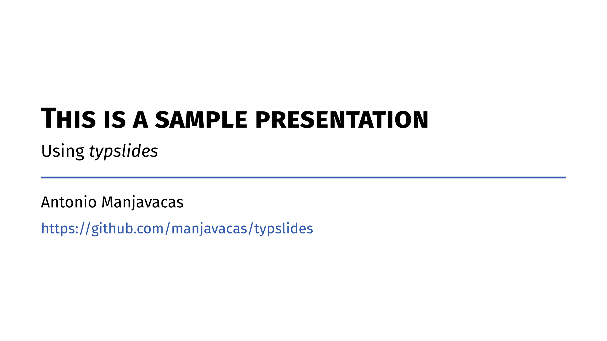
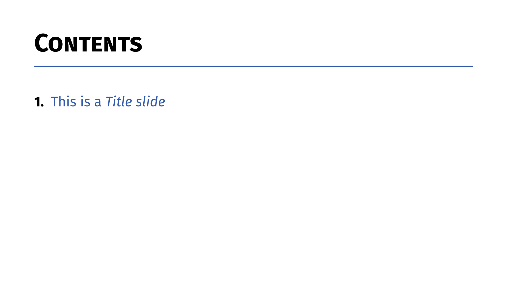
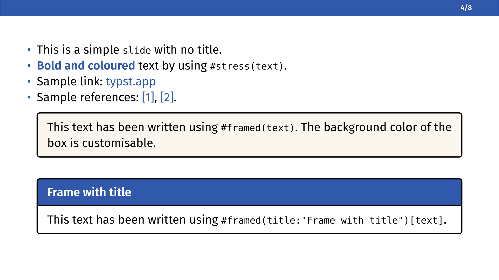
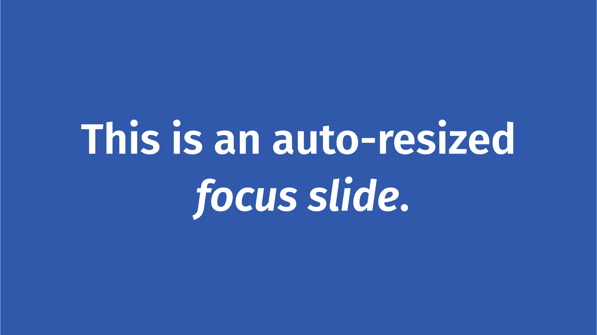
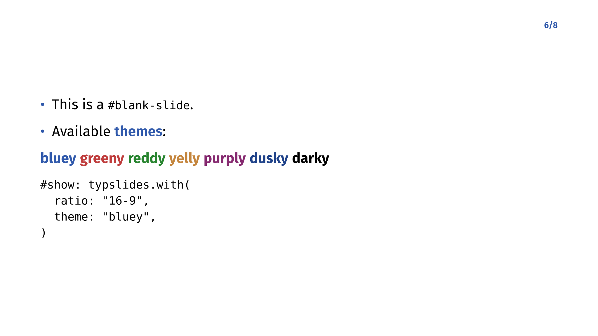
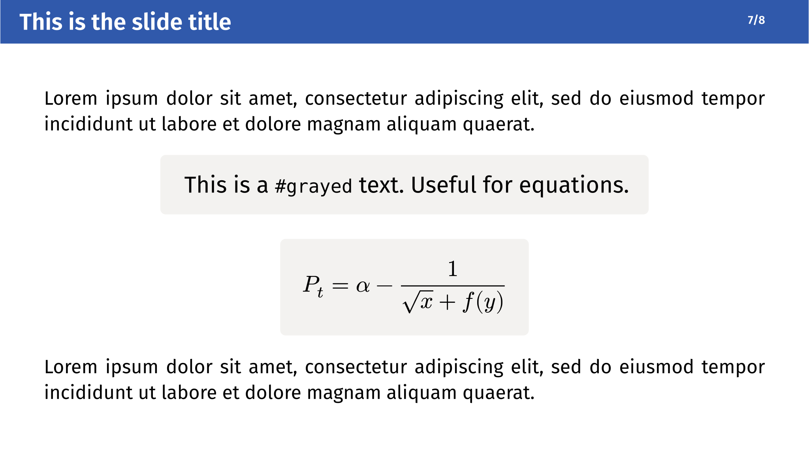
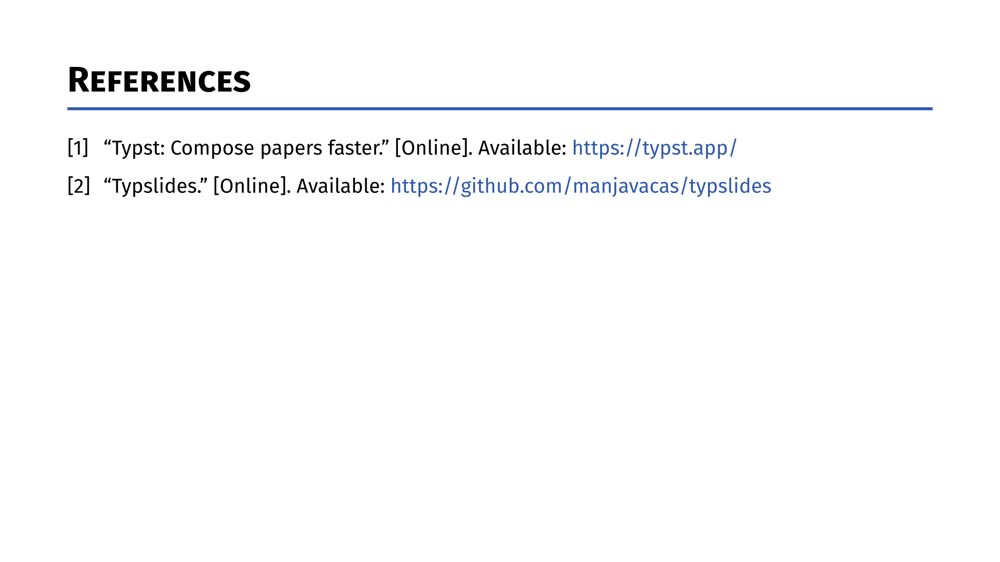

<p align="center">
    
</p>


[]()
[]()


_Minimalistic [typst](https://typst.app/) slides!_

# Quickstart

This is a simple usage example:

```typst
#import "@preview/typslides:1.2.1": *

// Project configuration
#show: typslides.with(
  ratio: "16-9",
  theme: "bluey",
)

// The front slide is the first slide of your presentation
#front-slide(
  title: "This is a sample presentation",
  subtitle: [Using _typslides_],
  authors: "Antonio Manjavacas",
  info: [#link("https://github.com/manjavacas/typslides")],
)

// Custom outline
#table-of-contents()

// Title slides create new sections
#title-slide[
  This is a _Title slide_
]

// A simple slide
#slide[
  - This is a simple `slide` with no title.
  - #stress("Bold and coloured") text by using `#stress(text)`.
  - Sample link: #link("typst.app")
  - Sample references: @typst, @typslides.

  #framed[This text has been written using `#framed(text)`. The background color of the box is customisable.]

  #framed(title: "Frame with title")[This text has been written using `#framed(title:"Frame with title")[text]`.]
]

// Focus slide
#focus-slide[
  This is an auto-resized _focus slide_.
]

// Blank slide
#blank-slide[
  - This is a `#blank-slide`.

  - Available #stress[themes]:

  #text(fill: rgb("3059AB"), weight: "bold")[bluey]
  #text(fill: rgb("BF3D3D"), weight: "bold")[greeny]
  #text(fill: rgb("28842F"), weight: "bold")[reddy]
  #text(fill: rgb("C4853D"), weight: "bold")[yelly]
  #text(fill: rgb("862A70"), weight: "bold")[purply]
  #text(fill: rgb("1F4289"), weight: "bold")[dusky]
  #text(fill: black, weight: "bold")[darky]
]

// Slide with title
#slide(title: "This is the slide title")[
  #lorem(20)
  #grayed([This is a `#grayed` text. Useful for equations.])
  #grayed($ P_t = alpha - 1 / (sqrt(x) + f(y)) $)
  #lorem(20)
]

// Bibliography
#bibliography-slide("bibliography.bib")
```

# Sample slides

<kbd></kbd> <kbd></kbd> <kbd></kbd> <kbd></kbd> <kbd></kbd> <kbd></kbd> <kbd></kbd> <kbd></kbd>