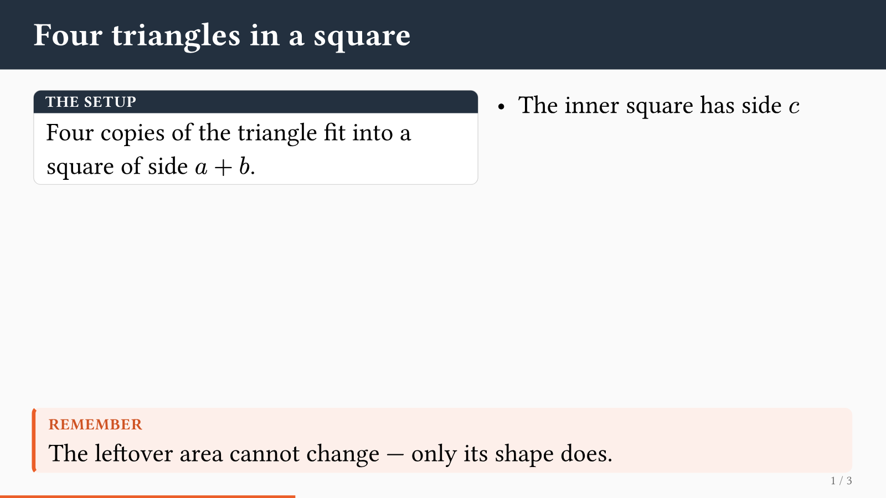
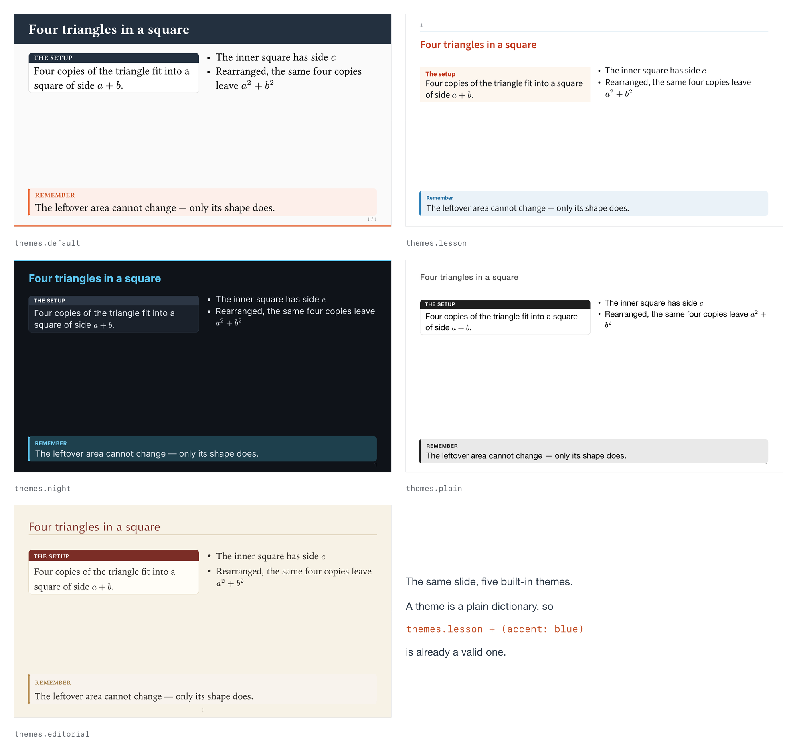
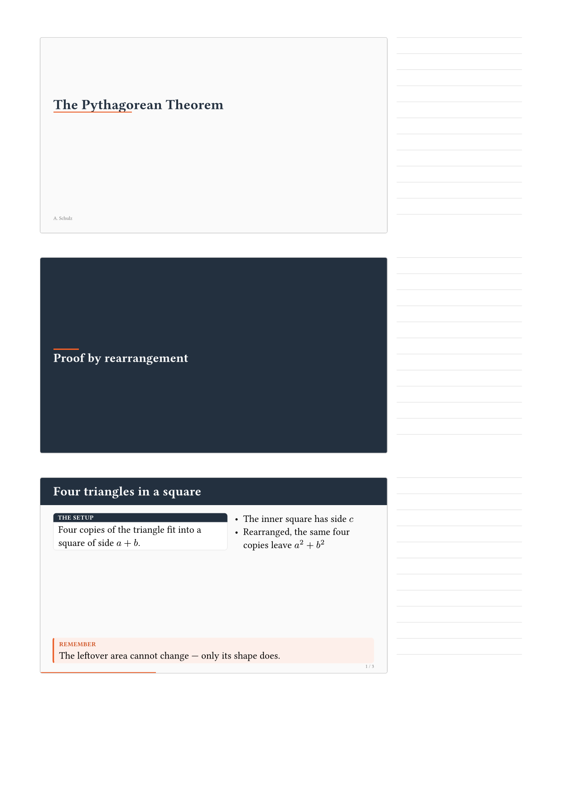

# typstage

**Animated HTML presentations from a single Typst file, and the slide set and
the handout as PDF from that same file.**

[](https://loewe1000.github.io/typstage/)
[](https://loewe1000.github.io/typstage/beispiele/en.html)
[](CHANGELOG.md)


```bash
typst compile deck.typ deck.html --format html --features html   # the animated talk
typst compile deck.typ deck.pdf                                  # slides and handout
typst watch   deck.typ deck.html --format html --features html   # live on :3000
```



**Try it without installing anything:** [example decks and handouts](https://loewe1000.github.io/typstage/beispiele/en.html), as browser presentations and printable PDFs. They are written as talks somebody might actually give rather than as feature demos — a school lesson, a night of rolling deployments, John Snow's cholera map, a Fermi question worked through in four bursts. Each one links its source.

## Typst sets, the browser moves

The usual route from Typst to a presentation is a PDF in which every step
occupies a page of its own; nothing ever moves. Typst's own HTML export goes
the other way and leaves the arrangement to the browser, which loses exactly
what Typst is used for.

typstage takes a third route. Every slide is typeset by Typst and written into
the HTML **as SVG**, so what stands in the browser stands there the way Typst
set it, to the point, and it is the same layout the PDF shows. Only then does anything
move: whatever should stir is announced in the source, and a small runtime
moves it with the Web Animations API.

One source, three outputs:

| | |
| --- | --- |
| **Animated talk** | a single self-contained `.html`: reveals, magic move, slide transitions, video, embedded documents. Double-click it; no server, no network, nothing to install alongside |
| **Slide set** | one PDF page per slide rather than one per step, with every tracked element in its final state |
| **Handout** | `handout: 3` puts the same slides on A4, speaker notes or ruled lines beside them |

## A complete deck

This file compiles, as it stands, with both commands above.

```typ
#import "@preview/typstage:0.1.2": *

#show: presentation.with(
  title: [The Pythagorean Theorem],
  author: [A. Schulz],
  transition: "slide",
)

= Proof by rearrangement

== Four triangles in a square

#side-by-side(
  card(title: [The setup])[
    Four copies of the triangle fit into a square of side $a + b$.
  ],
  stagger[
    - The inner square has side $c$
    - Rearranged, the same four copies leave $a^2 + b^2$
  ],
)

#v(1fr)

#callout(title: [Remember])[
  The leftover area cannot change. Only its shape does.
]

== The claim

#align(center, morph(<pythagoras>, $a^2 + b^2$))

==

#place(center + horizon,
       morph(<pythagoras>, text(size: 2.6em)[$a^2 + b^2 = c^2$]))
```

`=` opens a section slide and `==` a slide; a bare `==` with nothing after it
is a slide without a title band and without a running header. `stagger` reveals
a list point by point, and the same `morph(<pythagoras>)` on two slides makes
the formula fly from the one place to the other, growing on the way. Nothing
carries a step number: `at` is `auto` by default and means *the next free
step*, so consecutive reveals number themselves. Names are labels or strings:
`morph(<pythagoras>, …)` and `morph("pythagoras", …)` are the same thing.

For a slide that simply unfolds, nothing needs wrapping at all:

```typ
== A slide that unfolds

First this.

#pause

Then that.
```

`slide-level:` moves the cut: with `slide-level: 3` a `=` and a `==` are both
section slides and `===` is the slide, so a semester fits into one file with
its transition slides falling out by themselves. `info().levels` and
`info().outline` hand the structure back for an agenda of your own.

The built-in `contents()` turns that structure into a linked agenda in both
HTML and PDF. Use `layout: "1x2"` for balanced columns or
`layout: "1x2-fill"` to fill the first column before flowing into the second.
Long agendas can be split across slides with inclusive, one-based `from:` and
`to:` ranges:

```typ
== Contents 1
#contents(layout: "1x2-fill", from: 1, to: 8)

== Contents 2
#contents(layout: "1x2-fill", from: 9, to: 16)
```

The `number` and `title` parameters replace the complete number and linked
title cells, so their typography and appearance can be controlled as a whole.
Use `number: none` to remove the number cell entirely.
Section slide titles carry no number unless asked:
`presentation.with(section-numbering: "1.")` puts one there, and a function
gives a prefix of your own.
Each section slide carries a link back to the contents;
`presentation.with(section-back: [Back to the agenda])` words it differently,
`section-back: none` takes it away, and a function receives the contents slide's
location and number along with the section it stands on.

Slides may also be handed over as arguments, `presentation(title-slide(…),
section([…]), slide([Title])[…])`, for decks that are generated rather than
written.

## Installation

Nothing to install. Import it and Typst fetches the package on the first
compile:

```typ
#import "@preview/typstage:0.1.2": *
```

To work on the package itself, clone it under the local package path. A clone
that sits there is found before the published one, so the same
`@preview/typstage` import reaches your working tree:

```bash
git clone https://github.com/Loewe1000/typstage \
  ~/Library/Application\ Support/typst/packages/preview/typstage/0.1.2
```

On Linux that path is `~/.local/share/typst/packages/preview/…`, on Windows
`%APPDATA%\typst\packages\preview\…`. The build script does the same thing
for itself, so `build-site.sh` needs no clone at all.

Needs Typst 0.15. The HTML target additionally needs `--features html`; nothing
else, no Node, no bundler.

## The building blocks

| | |
| --- | --- |
| `presentation` | builds the deck: slides as arguments, or a show-rule body split at its headings |
| `bundle` | writes talk, slide set and handout in a single compile |
| `slide`, `section`, `title-slide` | the three kinds of slide |
| `contents` | a linked agenda with configurable layout, ranges and cell renderers |
| `anim`, `stagger`, `pause`, `alternatives` | reveal one thing, a series of things, everything after this point, one thing after another in the same place; `anim(after: "dimmed")` lets a point stay muted once its range is over, and `stagger(dim: true)` walks a list that way, the current point lit and the earlier ones quiet |
| `build` | a CeTZ drawing or a lilaq diagram that comes into being step by step: the drawing is written once and set once per stage, and a piece that is not due yet stands there as air — alpha 0, invisible but still holding its room, so the picture never shifts |
| `scene`, `scene-layer` | a drawing as a function of a value, plus the values at which the talk stops: Typst renders every stop and the frames in between, and a keypress pulls the picture from one stop to the next — manim's `ValueTracker` in the step model of a talk. `scene-layer` puts a sentence or a formula on the step of one particular stop |
| `morph`, `pin` | magic move across slides; `pin` names a glyph so the pairing follows the name rather than the shape |
| `camera` | move in on one detail of the slide and back out again, as a step of the talk. It aims at a `pin` and looks its rectangle up while the talk runs, so the deck names a name and never a coordinate. The slide's furniture stays put; on paper there is no camera and the slide is set whole |
| `card`, `callout`, `side-by-side`, `tiles`, `statement` | layouts inside a slide; `tiles` staggers itself, and `side-by-side(equal: true)` makes its columns the same height |
| `fit` | scales one block down to the room it has, for a wide table or a generated chart; no reveal may sit inside it |
| `overflow:` | a checking pass, off by default: `"error"` builds the deck and then names every slide whose body runs over its room, with the step; `"record"` files the same as queryable metadata |
| `drift:` | the second checking pass, and this one is on: every `scene` measures its frames and the ones that come out different sizes are named, because a drawing is as large as what it holds and a wider frame puts it somewhere else in its box. `scene(steady: false)` says the frames of one scene are meant to differ |
| `cue`, `cue-layer` | reveal points in the order a class calls them out; the digits `1` to `9` choose, and anything hung on the same step travels with the point |
| `info` | what the deck knows about itself: title, slide and step number, section, and with `slide-level` the whole outline — for a footer, a running head or an agenda of your own |
| `transition`, `speaker-note` | how this slide comes in, and what only you see |
| `themes`, `theme` | the five built-in looks, and the builder behind them |
| `bleed` | content over the whole canvas, edge to edge: a photograph under the slide, with places counted from the corner the text begins at and the chrome left off, in the handout too. A `style` hook that pads the body pads the bleed as well, and runs twice on such a slide |
| `palettes`, `palette:`, `invert` | colour separately from design: five bundled palettes that compose with every theme, a partial override on `presentation`, and one slide set in the palette turned around |
| `contrast`, `palette-report` | the WCAG contrast of two colours, and the seven pairs the bundled palettes are held to |
| `video`, `embed`, `flipbook` | media, arbitrary web content in a sandboxed frame, and animation drawn frame by frame by Typst |
| `bridge-job`, `bridge-targets` | send step jobs into an embedded document, which is how a companion package drives an applet |
| `geogebra`, `ggb-run`, `ggb-set`, `ggb-show`, `ggb-hide`, `ggb-style`, `ggb-view`, `ggb-animate`, `ggb-tween` | a GeoGebra applet on the slide and the jobs that drive it step by step; the applet itself is fetched from `geogebra.org` at run time |
| `slide-width`, `slide-height`, `slide-margin`, `dark`, `accent`, `paper`, `muted` | the defaults behind `width:`, and the four colour constants of the default look |
| `runtime-version`, `runtime-files` | the CSS and the JS, for `assets: "split"` and for CDNs |

Every one of them is documented in full, with examples, in the manual
(`docs/content.typ`, see below).

Twelve slide transitions (`fade`, `slide`, `push`, `cover`, `uncover`, `zoom`,
`blur`, `iris`, `wipe`, `flip`, `cube`, `none`), set for the deck or for a
single slide, each of them a true reversal when you page backwards. Entrances
(`enter:`) work the same way: paging back takes the entrance away again.

Eleven entrances, one of which is not a fade: `enter: "draw"` traces every
stroked path of an element, so a circuit or a pair of axes comes into being
line by line. Text keeps to the fade -- Typst sets glyphs as filled shapes with
no outline to travel along -- and an element on which nothing can be traced
says so instead of quietly fading. `easing:` names the curve an element moves
on, from the Web Animations API plus a handful of named ones; an unknown name
is an error, not a silent default.

## Themes

```typ
#show: presentation.with(theme: themes.night)
#show: presentation.with(theme: themes.lesson + (accent: blue))
#show: presentation.with(theme: themes.lesson, palette: palettes.dark)
```



A theme is a dictionary: colours, fonts, sizes, and one word each for the few
built shapes (`header`, `footer`, `progress`, `box`). That is why `+` is enough
to bend one, and `theme(…)` builds a new one from scratch. Only the title slide
and the section slide are functions in it: they are whole pictures, not
variations of one another.

## Palettes and the contrast contract

Colour is a thing of its own. `palette:` overwrites *partially*, so
`palette: (accent: blue)` moves the accent alone. Five ship with the package,
and each composes with each theme: darkness is a palette rather than a design,
and `themes.lesson` under `palettes.dark` is still the lesson design, only dark.

The five bundled palettes, and their inverted forms with them, are held to a
**measured contrast contract**: real WCAG 2 arithmetic over seven pairs,
enforced by an assertion that runs when the package is loaded. Your own
palettes face no such gate, and neither do the bundled *themes* — the manual
lists which of them fall short of which pair, and why those colours were left
alone. `palette-report(…)` hands the same measurement back for any palette.

## In the browser

The runtime counts in **steps**, not slides: a slide with three reveals has
three steps, and `→` goes to the next one wherever it is.

| key | |
| --- | --- |
| `→` `←`, space, page keys | one step on, one step back |
| `Home`, `End` | first and last step, without motion |
| `o`, `Esc` | overview of all slides |
| `f` | full screen |
| `1`…`9` | that many minutes as a clock on the slide; `0` ends it |
| `n` | open the speaker view in a second window |
| `?` | a line with the main keys |

Clicking the left quarter of the window goes back, anywhere else forward. On a
phone or tablet the same works with a finger, and so does swiping: right to
left brings the next slide, the other way the previous one. The address bar
carries the current step (`#12`), so a reloaded window stands where it stood.

Where the operating system asks for **reduced motion**, the deck obliges:
opacity stays, travel goes. Entrances and slide transitions become plain
cross-fades of the same length, the magic move does not fly, and a flip book
stands still on one frame. Dimming stays as it is, and a video keeps playing.
The setting is read afresh on every step, so it takes effect at once; there is
nothing to configure and no way for a deck to overrule it. See "Less motion" in
the manual.

## The speaker view

`n` opens the same file a second time, with `#speaker` on the address, in a
second window. Put that one on your laptop and the first one on the projector.
The two talk to each other with `postMessage`, which works between two local
files as well, so this needs no server either.

It is a lectern made of tiles: the running slide across the top, under it the
note and beside the note the next **step** — not the next slide, because a deck
that counts in steps has to answer what the next keypress does —, and under
those elapsed time, slide and step, the planned length and the clock the class
sees. The seam between slide and note is a handle: drag it to give either more
room.

You can draw on the running slide, and the strokes appear on the projected one;
`m` swaps the pen for a pointer, and then a lit dot follows your mouse across
the wall. `b` blacks the room out, `e` freezes the projected image while you
page ahead in private, and `t` puts a clock on the wall for the break or the
group work.
Steering works from either window, and either one may be reloaded: they find
each other again and the strokes come back.

A deck can order less of it:

```typ
#show: presentation.with(speaker-view: (
  clock: false,                              // no class clock
  pen: (colors: (red, green, blue)),         // your own pen colours
))
```

A tile that is switched off takes its keys with it, and they leave the key bar
with them.

Set `speaker-view: (shortcuts: false)` to start with the shortcut bar hidden;
`h` or the `?` button toggles it during the talk. Drag the divider between notes
and the next slide to set their widths. This ratio stays fixed when the stage
height changes and survives a reload.

The presenter shows playback buttons and a timeline for video and audio.
`k` plays/pauses; `j` and `l` seek ten seconds backward/forward. Light/dark now
uses `Shift+L`. The media keys and `h` are reserved and cannot be sound keys.

Automatic reveals (`anim`, `stagger`, `cue`, `alternatives`, `tiles`, `build`
and `scene`) now start no earlier than step 2. Step 1 shows only static content.
Use an explicit `at: 1` or `start: 1` when a reveal should already be visible on
entry. Existing automatic chains may gain an initial step; check numbered cues
and step references when updating a deck.

## What reaches the room

`speaker-view` says what only the speaker sees; `room` says what reaches the
class. The clock is the one they share: `1` to `9` start it in whichever window
has the keyboard, so a single machine at a beamer needs no second window at all.

```typ
#show: presentation.with(room: (
  clock: (step: 5),                          // the clock reads in five-second steps
  sounds: (a: "airhorn.mp3"),                // a key, a sound, played in the hall
  bell: "08:15",                             // when the lesson begins
  pointer: (color: red, size: 4%),           // the pointer's dot on the wall
))
```

`step` calms a clock that would otherwise jump every second while the class is
working; the last five seconds still count down singly. A sound file travels
beside the HTML like any other media, and the package ships none of its own;
the example decks bring a horn synthesised for them, with the command in
`examples/medien/PROVENANCE.md`. And
`bell` is what a `video(ends-at: auto)` ends on: the runtime reads the video's
length and starts it far enough in that its last frame falls on that minute, so
the music before the lesson stops as the lesson starts.

`pointer` is the dot, on by default in the accent colour at 2.2% of the slide
width; `size` is a ratio between 0.8% and 6%, and the colour need not contrast
with the slide, because a light ring and a dark one around the core do that on
any ground. `pointer: false` takes the dot away and leaves embedded frames
operable, which is the pointer mode's other half.

### Audio and timer signals

`audio` accepts a file path relative to the exported HTML or a direct HTTP(S)
audio URL (not a streaming service's webpage):

```typ
#audio("medien/music.mp3")
#audio("https://example.org/music.mp3", loop: true)
```

It defaults to manual playback with stage controls. The presenter also controls
it through the media toolbar and `j`/`k`/`l`. Options include `autoplay: true`,
`controls: false`, `muted`, `loop`, `width`, `height` and `at`. Revealed audio
starts only when visible and pauses when hidden; PDF output shows a placeholder.

Audio, video and YouTube accept the same clip parameters, in seconds:

```typ
#audio("music.mp3", start: 30, end: 75, loop: true)
#video("film.mp4", start: 30, end: 75, loop: true)
#embed(url: "https://www.youtube.com/embed/M7lc1UVf-VE",
       start: 30, end: 75, loop: true)
```

`start` defaults to zero and `end: none` uses the source's duration. `end` must
be greater than `start`; fractional seconds are supported. An end beyond the
source duration is clamped to it. With `loop: true`, only the selected segment
repeats; otherwise it pauses at its end. Playing again restarts that segment.
The presenter timeline and `j`/`l` stay within the segment and display original
source timestamps. Existing YouTube URL parameters remain supported; explicit
Typst parameters take precedence. Other embed providers do not support these
options. For `video(ends-at: ...)`, scheduling uses the segment's duration.

YouTube frames use their actual displayed size (including the browser's native
pixel density), rather than magnifying a smaller player. The stage's YouTube
controls are hidden by default; add `?controls=1` to the embed URL to restore
them. Presenter controls remain available. YouTube still controls titles,
branding, recommendations and adaptive stream quality; hiding every overlay
or forcing a particular HD/Retina stream is not supported by the public API.


An optional signal plays once on the stage when the class timer reaches zero:

```typ
#show: presentation.with(room: (
  clock: (step: 5, sound: "medien/gong.mp3"),
))
```

`sound` also accepts a direct audio URL; omit it or use `none` for silence.
Cancelling a timer or restoring one that has already expired does not ring it.
Browser playback permissions still apply: allow audio on the stage before the
talk. Files must accompany the HTML; URLs require network access.

## On paper

The PDF has one page per slide in the size of the canvas. Everything that moves
in the browser stands there in its final state. What belongs to the motion
alone, the notes, the transitions, the jobs for embedded elements, produces no
output and falls away by itself. Where a frame or an applet stands in the browser, `embed` takes
a `fallback` (any content at all, a CeTZ drawing, an image) and a `link` that is
clickable in the PDF.

Or one page per step, so the paper turns the way the talk does:

```typ
#show: presentation.with(pages: "step")
```

Everything that reveals takes part -- `#pause`, `anim`, `stagger`, `tiles`,
`alternatives`, `build`, `cue` and `scene`, which gets a page per stop rather
than per tween frame. A piece not yet due keeps its space, so nothing shifts
from page to page. A camera move gets no page of its own: on paper there is no
camera, and its page would stand there twice. Expect two to three pages per
slide.

One argument turns the slide set into a handout:

```typ
#show: presentation.with(handout: 3)   // three slides per A4 page
```



`handout` takes `true` (two per page) or a number from 1 to 6, and only affects
the PDF; the HTML ignores it. The slides are not re-set, only shrunk, so the
handout cannot drift away from what stood on the screen. Beside or below each
slide stands its `speaker-note`; where a slide has none, ruled lines take its
place.

### All three in one run

Typst 0.15 can write several files from one compile, which suits a package
where talk, slide set and handout come from the same source:

```bash
typst compile --features bundle,html --format bundle talk.typ out
```

`bundle(…)` takes the deck and the names of the outputs, and the counters start
again for each one. Bundle export is experimental in Typst and a file that
calls `bundle` can only be compiled with `--format bundle`; the manual shows
how to keep both routes open.

## Canvas and runtime files

```typ
#show: presentation.with(width: 800pt, height: 600pt)   // 4:3 instead of 16:9
#show: presentation.with(assets: "split")               // css and js beside the html
```

16:9 on an A4-width canvas by default, so a slide and a handout page carry text
at the same physical size. Everything the theme draws is measured on that canvas
and scales with the width, so a narrower deck looks the same, only smaller.

`assets: "inline"` (the default) puts stylesheet and runtime into the HTML: one
file that can be mailed, put on a stick and opened without a network. `"split"`
links them beside it and `(cdn: "…")` under an address of your own, which is
worth it where many decks are published together — the browser then caches the
runtime once for all of them. The manual has the numbers.

## What it cannot do

- **Typst's HTML export is experimental.** Every HTML run needs
  `--features html` and prints a warning, and the export may change under you
  from one Typst release to the next. That is Typst's building site, not this
  package's, but you stand on it. The PDF side uses no experimental features.
- **The slides are SVG outlines, not text.** Glyphs go into the file as paths,
  so nothing in the browser is selectable, searchable or reflowable, screen
  readers see nothing, and the file grows with the deck. Measured: the little
  deck above weighs 582 kB, the seventeen example decks between 0.70 and
  6.22 MB, and `tour` holds 295 SVG trees with 13 985 glyph references across
  48 slides. In exchange no font has to load and the layout cannot drift.
- **`#pause` is read at the top level of a slide body only.** Inside a grid
  cell, a table or a figure it is not seen, so reach for `anim` there.
- **GeoGebra and Desmos are not in the box.** A typeset applet is an empty frame
  that fetches GeoGebra from `geogebra.org` when the page is shown. Without a
  network it stays empty, the viewer's browser talks to that host, and what
  runs in the frame is under GeoGebra's terms rather than this package's MIT
  licence. `codebase` points the frame somewhere else, at a local copy for
  instance. Desmos rides the same bridge and adds one condition of its own: its
  script is handed out only against an API key, which you pass as `api-key` and
  which travels into the page. The PDF fetches nothing in either case.
- **German in places.** The manual is fuller in German than in English, and
  the API comments are mixed German and English. The two strings the runtime shows for itself,
  the `?` help line and the note of a slide that has none, follow the
  document language and exist in German, English and French; anything else
  falls back to English. A deck that reads from the right -- `#set text(lang:
  "fa")` before the show rule -- is mirrored throughout, from the title in its
  band to the progress bar; the manual has a section on it.
- **Five themes, not a theme ecosystem.** They differ in colour, type and the
  shape of header, footer and progress bar, not in slide layouts. Anything
  further is a dictionary entry, a `style:` wrapper, or plain Typst.
- **The contrast contract binds the bundled palettes only.** A palette written
  in a deck is never checked and never recoloured, and no colour is inferred
  from the lightness of another: a muted sage such as `#aebdb3` reads as
  "light" to a luminance rule, yet white on it measures 1.96 to 1.

## Next to the other slide packages

A hundred and seventeen packages on Universe carry the `presentation`
category, and most of them are themes on top of two frameworks. The line that
matters runs somewhere else: through the output.

**Nearly all of them write a PDF.** [Touying][t] is the large one,
[Polylux][p] the older one, and [Mosaic][m], [Slydekit][s] and a long tail of
others sit beside them. There a reveal is another page — a slide with three
steps becomes three pages that differ in what is drawn on them. Nothing moves
between two pages, and nothing has to: the file opens wherever a PDF opens,
outlives a dead network and needs no browser. Between them Touying and Polylux
carry years of work and most of those hundred community themes. That is a real
advantage this package does not have and will not have soon.

**Three of us write HTML.** [touying-exporter][te] renders one SVG per slide
and packages them with impress.js. [slipst][sl] follows slipshow: instead of
slides of a fixed size, "slips" that scroll from top to bottom — a genuinely
different idea of what a presentation is, and one that frees the talk from a
slide's dimensions. typstage keeps the fixed slide, writes one SVG per *state*
rather than per slide, and moves between them.

That last part is the difference worth naming. Typst's layout goes into the
file to the point and the browser only moves it; a name given to two shapes
makes one fly to the other, glyph by glyph, between slides and within one. I
know of no other Typst package that does that, and I would rather be told than
go on believing it. Counting in steps instead of pages is also what lets one
source give the HTML talk, a PDF with one page per slide, and a handout, in a
single run.

The price stands in the list above: an experimental export, files measured in
megabytes, outlines instead of text, five themes rather than a hundred, and a
version number that begins with a zero. Mosaic is at 0.0.1 and this at 0.1.2;
neither of us has earned a habit yet.

`examples/` holds three decks adapted from Mosaic's own, so that part of the
comparison is on the screen rather than in my prose.

[t]: https://typst.app/universe/package/touying
[p]: https://typst.app/universe/package/polylux
[m]: https://typst.app/universe/package/mosaic
[s]: https://typst.app/universe/package/slydekit
[te]: https://github.com/touying-typ/touying-exporter
[sl]: https://typst.app/universe/package/slipst
[n]: https://typst.app/universe/package/navigator

**And one that builds on it.** [navigator][n] adds a transition roadmap and a
miniframes-style navigation bar, and ships examples for both against typstage.
Getting there turned up something worth knowing for anyone writing a companion
package: typstage renders each slide inside an `html.frame`, and in there a
`location` collapses to page 1 at (0, 0) while `target()` still reports
`"paged"`. Anything that groups headings by page therefore sees one group for
the whole deck. `info()` and `deck-outline()` sidestep that — they carry the
deck's structure themselves rather than reading it back out of Typst.

## Documentation

The [manual](https://loewe1000.github.io/typstage/) covers steps, magic move,
transitions, media, the bridge and a full API reference. It is published from
this repository, together with the [example decks](https://loewe1000.github.io/typstage/beispiele/en.html).
The German source is `docs/content.typ`, the English one `docs/content-en.typ`.

| | Website | PDF |
| --- | --- | --- |
| English | [en.html](https://loewe1000.github.io/typstage/en.html) | [typstage-en.pdf](https://loewe1000.github.io/typstage/typstage-en.pdf) |
| German | [index](https://loewe1000.github.io/typstage/) | [typstage.pdf](https://loewe1000.github.io/typstage/typstage.pdf) |

The site build also writes [llms.txt](https://loewe1000.github.io/typstage/llms.txt),
one line per chapter with its title and first sentence, in both languages,
generated from the built pages so its anchors cannot go stale.

**Every example in the manual is compiled on every build** — 236 of them, plus
fifteen that are checked for failing as they should. The example decks are then
driven through a real browser, step by step, and compared against recorded
values.
[`CONTRIBUTING.md`](https://github.com/Loewe1000/typstage/blob/5b125f417960679cf4d6e4b9d1b5bed115562f03/CONTRIBUTING.md)
describes how, and how to build the manual and the site yourself.

## GeoGebra

```typ
#geogebra(width: 100%, height: 330pt)

#ggb-run("a=1", "f(x)=a*x^2")
#ggb-style("f", color: accent, thickness: 6)
#ggb-tween("a", at: 2, to: 2.5, duration: 950)
```

GeoGebra builds the construction, the slides supply the dramaturgy: jobs sit on
steps, so a value changes, an object appears or the viewport moves when the
presenter pages. `ggb-run`, `-set`, `-show`, `-hide`, `-style`, `-view`,
`-animate` and `-tween` all take the same step selector as `anim`. From the
speaker view the applet in front of you is the live one, and the projected copy
follows what your hand does to it.

**Where the applet comes from.** This package does not ship GeoGebra. `geogebra`
puts a frame on the slide, and the browser fetches what runs inside it from
`codebase`, `https://www.geogebra.org/apps/` by default. So: without a network
the frame stays empty; the viewer's browser talks to `geogebra.org`; and the
applet is under **GeoGebra's own licence and terms of use**, not under this
package's MIT licence — for commercial use those are the ones to read. Where
that is unwanted, `codebase` points the frame at a local copy instead. On paper
nothing is fetched at all: `fallback` and `link` stand there instead.

The chapter *GeoGebra* in the manual has the rest, and the
[two example decks](https://loewe1000.github.io/typstage/beispiele/en.html) are on the
site with the others.

## License

MIT, for this package. A GeoGebra applet loaded at run time is GeoGebra's and
carries GeoGebra's terms.

### YouTube im Presenter steuern

```typst
#embed(
  url: "https://www.youtube.com/embed/M7lc1UVf-VE",
  width: 480pt, height: 270pt,
)
```

Auch `https://www.youtube-nocookie.com/embed/VIDEO_ID` wird unterstützt.
Play/Pause und Zeitleiste im Presenter sowie `k` und `j`/`l` (−/+ 10 Sekunden)
steuern das Bühnenvideo. Die Presenter-Vorschau folgt stumm. Beim Verlassen der
Folie oder Ausblenden des Elements pausiert das Video.

Die YouTube IFrame API wird extern und erst beim ersten sichtbaren YouTube-Embed
geladen; sie wird nicht ins Paket eingebaut. Internetzugang ist erforderlich.
Das HTML über HTTP(S) öffnen (z. B. mit `python3 -m http.server` im Exportordner),
da YouTube bei `file://` wegen des fehlenden Referers Fehler 153 melden kann.
Wenn der Browser Autoplay blockiert, einmal Play im Bühnenplayer anklicken.
Andere Embed-Anbieter erhalten dadurch keine automatische Mediensteuerung.
