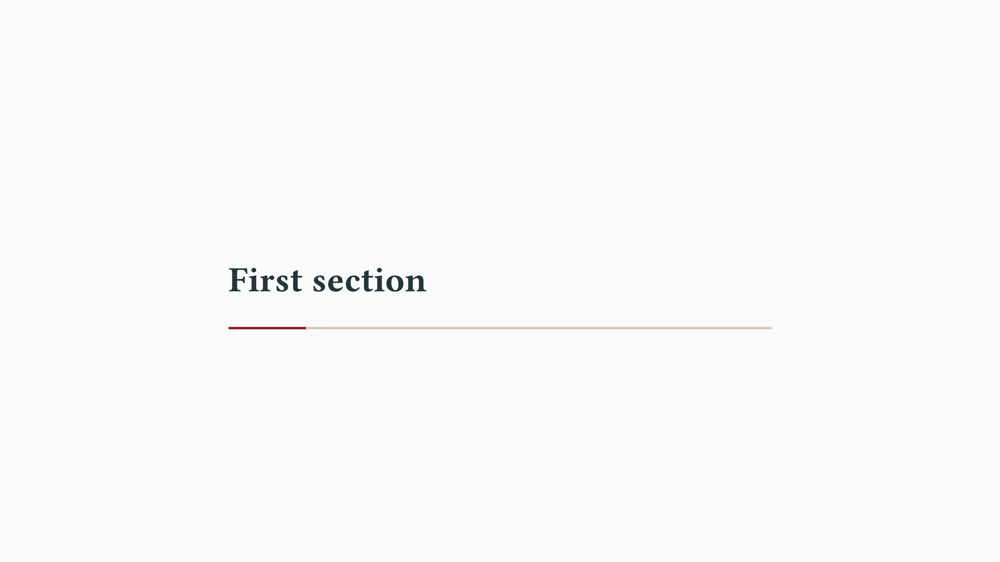
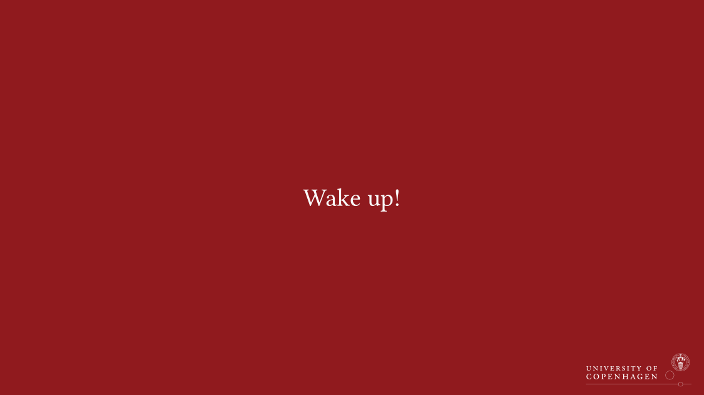

# `ucph-nielsine-touying`
<div align="center">Version 0.1.0</div>

Slide template built on Touying for the University of Copenhagen.

_This theme is **NOT** affiliated with the University of Copenhagen. The logo is the property of the University of Copenhagen._

**ucph-nielsine-touying** is a [Touying](https://github.com/touying-typ/touying) theme for creating presentation slides in [Typst](https://github.com/typst/typst), adhering to the core principles of the [style guide of the University of Copenhagen, Denmark](https://designguide.ku.dk/) (Danish). It is an **unofficial** theme and it is **NOT** affiliated with the University of Copenhagen.

This theme was partly created using components from [typslides](https://github.com/manjavacas/typslides) and [touying-unistra-pristine](https://github.com/spidersouris/touying-unistra-pristine).

## Getting Started

These instructions will get you a copy of the project up and running on the typst web app. 

```typ
#import "@preview/ucph-nielsine-touying:0.1.0" as uc
#import "@preview/touying:0.6.1" as ty

#show: uc.ucph-metropolis-theme.with(ty.config-info(
  title: [Title],
  subtitle: [Subtitle],
  author: [Authors],
  date: datetime.today(),
  institution: [University of Copenhagen],
  logo: image("assets/ucph-1-seal.svg"),
))

#uc.title-slide()

= First section

== First slide
Wow, this is a slide.
```

<kbd></kbd><kbd></kbd><kbd></kbd>


## Usage

It is strongly recommended to explore the [documentation](https://touying-typ.github.io/) of the `touying` package to learn more about the functionality. This includes, but is not limited to, animations and compatibility with other Typst packages like [`pinit`](https://typst.app/universe/package/pinit/). A more extensive example of the slide template is available [here](https://github.com/jorgenhost/ucph-nielsine-touying/tree/main/examples).

```typ
#import "@preview/ucph-nielsine-touying:0.1.0" as uc
#import "@preview/touying:0.6.1" as ty
#import "@preview/pinit:0.2.2" as pi

#show: uc.ucph-metropolis-theme.with(
  header-right: align(right, image("assets/ucph-1-seal.svg", height: 1.1cm)),
  ty.config-info(
    title: [Title],
    subtitle: [Subtitle],
    author: [Authors],
    date: datetime.today(),
    institution: [University of Copenhagen],
    logo: image("assets/ucph-1-seal.svg"),
  ),
  // ty.config-common(
  //   handout: true
  // )
)

#uc.title-slide()

// If you want a table of contents
// #uc.components.adaptive-columns(outline(indent: 1em))

= First section

== First slide
Wow, this is a slide.

== Second slide
The music experience has been #pi.pin(1)cancelled#pi.pin(2).

#pi.pinit-highlight(1, 2)

#pi.pinit-point-from(2)[This quote is from the Severance TV-show]

== Animations
#uc.slide[
  Touying equation with pause:

  $
    f(x) & = #ty.pause x^2 + 2x + 1 \
         & = #ty.pause (x + 1)^2    \
  $

  #ty.meanwhile

  Touying equation is very simple.
]

== Complex Animations
#uc.slide(
  repeat: 3,
  self => [
    #let (uncover, only, alternatives) = ty.utils.methods(self)

    At subslide #self.subslide, we can

    use #uncover("2-")[`#uncover` function] for reserving space,

    use #only("2-")[`#only` function] for not reserving space,

    #alternatives[call `#only` multiple times \u{717}][use `#alternatives` function #sym.checkmark] for choosing one of the alternatives.
  ],
)

== Third slide
#uc.slide(align: center + horizon, composer: (1fr, 1fr))[
  First column.
][
  Second column. #cite(<schelling1971dynamic>, form: "prose")#footnote("a footnote")
]


= The OLS estimator
== Derivation of the OLS estimator
#uc.slide(align: left)[
  #align(center + top)[
    #uc.framed(title: "The OLS estimator", block-width: 60%)[
      $
        hat(bold(beta)) = (bold(X)^T bold(X))^(-1) bold(X)^T bold(y)
      $
    ]]

  - This is very important.
  - Remember this.
]


#uc.focus-slide()[
  Wake up!
]

#let my-gradient = gradient.linear(uc.colors.ucph-dark.red, uc.colors.ucph-dark.blue, angle: 45deg)

#uc.focus-slide(fill: my-gradient)[
  Wake up with a gradient!
]

== References
#set text(size: 14pt)
#bibliography("bibliography.bib", style: "harvard-cite-them-right", title: none)
```

<kbd></kbd><kbd></kbd><kbd></kbd>

<kbd></kbd><kbd></kbd>

## Working locally
Follow the initial steps from the official [repo](https://github.com/typst/typst) to install Typst on your machine. Open your terminal and type:

```
typst init @preview/ucph-nielsine-touying
```
This will create a directory with the template name on your current path.

## Development

```
$ git clone https://github.com/jorgenhost/ucph-nielsine-touying
$ cd ucph-nielsine-touying
```

## Why "nielsine"?
Nielsine Nielsen was the first female to get a degree in medicine in Denmark on Friday 23rd January 1885, paving the way for other females to follow in her footsteps. The reply (by royal decree) to her application read: _"Women are hereby allowed to obtain an academic degree at the University of Copenhagen."_ That is pretty cool. Read more [here](https://news.ku.dk/nielsine-nielsen/).