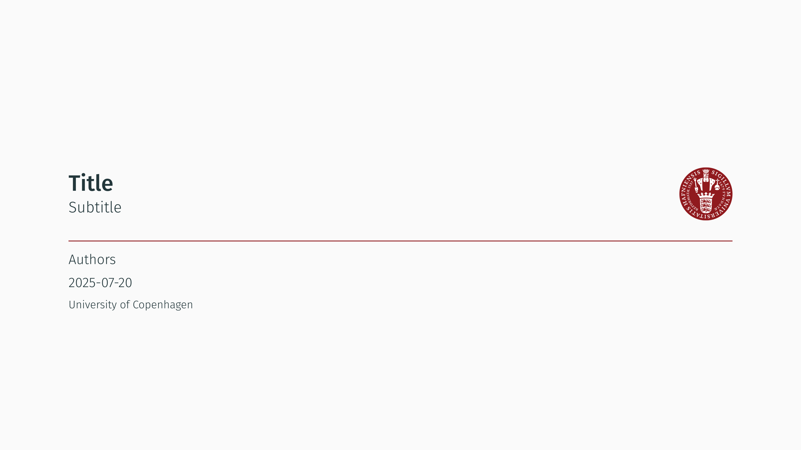
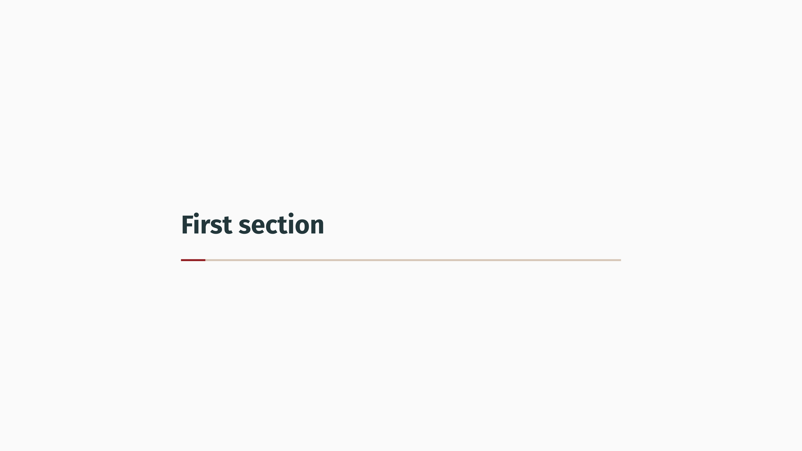
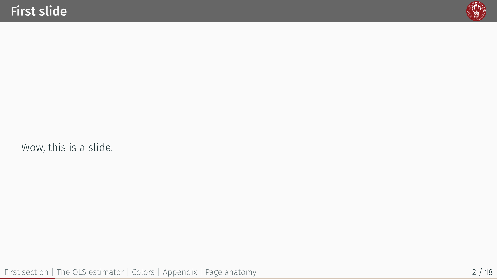
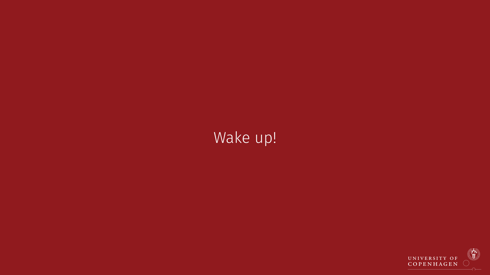
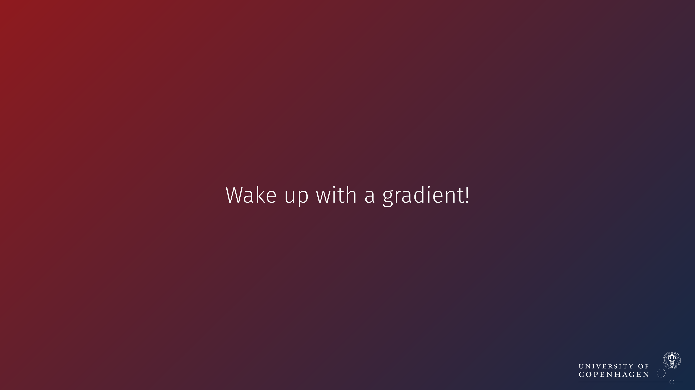
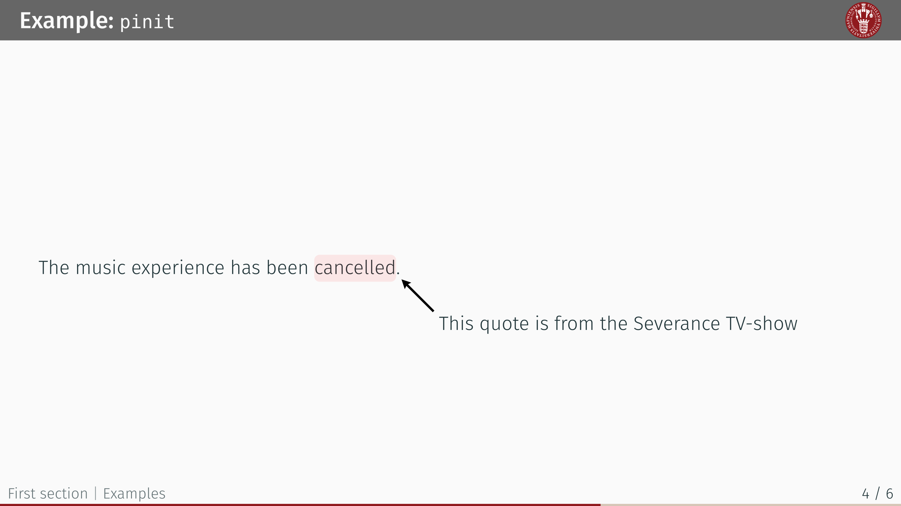
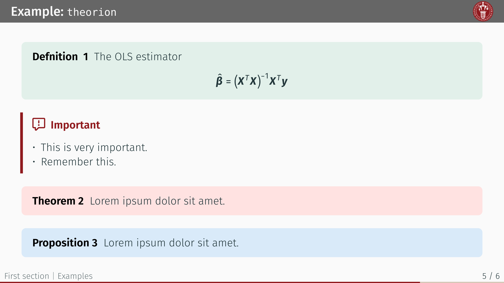
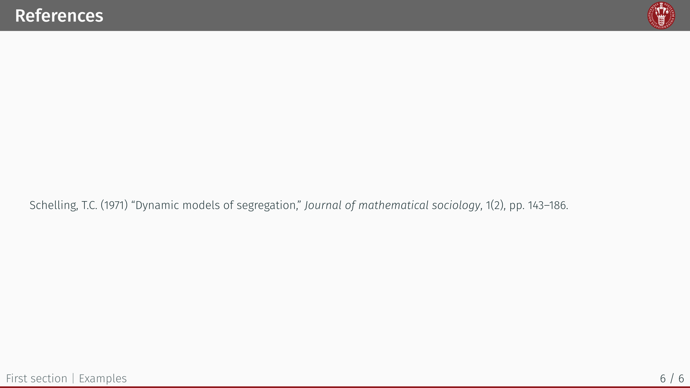

# `ucph-nielsine-touying`

Slide template built on Touying for the University of Copenhagen.

_This theme is **NOT** affiliated with the University of Copenhagen. The logo is the property of the University of Copenhagen._

**ucph-nielsine-touying** is a [Touying](https://github.com/touying-typ/touying) theme for creating presentation slides in [Typst](https://github.com/typst/typst), adhering to the core principles of the [style guide of the University of Copenhagen, Denmark](https://designguide.ku.dk/) (Danish). It is an **unofficial** theme.

This theme was partly created using components  [touying-unistra-pristine](https://github.com/spidersouris/touying-unistra-pristine) and [typslides](https://github.com/manjavacas/typslides).

## Getting Started

These instructions will get you a copy of the project up and running on the typst web app. 

```typ
#import "@preview/ucph-nielsine-touying:0.1.1" as uc
#import "@preview/touying:0.6.1" as ty

// Font settings
#set text(font: "Fira Sans", weight: "light")
#show math.equation: set text(font: "Fira Math")

#show: uc.ucph-metropolis-theme.with(
  language: "en", // or "dk"
  ty.config-info(
    title: [Title],
    subtitle: [Subtitle],
    author: [Authors],
    date: datetime.today(),
    institution: [University of Copenhagen],
    logo: uc.logos.seal,
  ),
)

#uc.title-slide()

= First section
== First slide
Wow, this is a slide.

#uc.focus-slide("Wake up!")
```

<kbd></kbd><kbd></kbd>

<kbd></kbd>
<kbd></kbd>


## Usage

Configuration is done via `Touying`'s `config-xxx` options which is then passed to the `ucph-metropolis` function. It is strongly recommended to explore the [documentation](https://touying-typ.github.io/) of the `touying` package to learn more about the core functionality that this template is built around. This includes, but is not limited to, bibliography/references, animations and compatibility with other Typst packages like [`pinit`](https://typst.app/universe/package/pinit/) and [`theorion`](https://typst.app/universe/package/theorion/). Check out the example below to learn more about the functionality:

```typ
#import "@preview/ucph-nielsine-touying:0.1.1" as uc
#import "@preview/theorion:0.3.3" as th
#import th.cosmos.clouds as thc
#import "@preview/touying:0.6.1" as ty
#import "@preview/pinit:0.2.2" as pi

// Font settings
#set text(font: "Fira Sans", weight: "light")
#show math.equation: set text(font: "Fira Math")

// Settings for theorion package
#show: th.show-theorion
#th.set-inherited-levels(0)

#show: uc.ucph-metropolis-theme.with(language: "en", ty.config-info(
  title: [Title],
  subtitle: [Subtitle],
  author: [Authors],
  date: datetime.today(),
  institution: [University of Copenhagen],
  logo: uc.logos.seal,
))

#uc.title-slide()


= First section

== First slide
_Wow, this is a slide._

#cite(<schelling1971dynamic>, form: "prose") proposed a model to describe segregation dynamics that has a striking proposition: Despite "tolerant" attitudes towards people of different types, patterns of segregation will still persist.

= Examples
== Example: `pinit`
The music experience has been #pi.pin(1)cancelled#pi.pin(2).

#pi.pinit-highlight(1, 2)

#pi.pinit-point-from(2)[This quote is from the Severance TV-show]


== Example: `theorion`
#thc.definition()[
  The OLS estimator
  $
    hat(bold(beta)) = (bold(X)^T bold(X))^(-1) bold(X)^T bold(y)
  $
]
#th.important-box(fill: uc.colors.ucph-dark.red)[
  - This is very important.
  - Remember this.
]
#thc.theorem()[
  #lorem(5)
]
#thc.proposition()[
  #lorem(5)
]

#let my-gradient = gradient.linear(uc.colors.ucph-dark.red, uc.colors.ucph-dark.blue, angle: 45deg)

#uc.focus-slide(fill: my-gradient)[
  Please pay attention!
]

== References
#set text(size: 14pt)
#bibliography("bibliography.bib", style: "harvard-cite-them-right", title: none)
```
A more extensive example of the slide template is available [here](https://github.com/jorgenhost/ucph-nielsine-touying/tree/main/examples). 


<kbd></kbd><kbd></kbd>

<kbd></kbd><kbd></kbd>

## Working locally
Follow the initial steps from the official [repo](https://github.com/typst/typst) to install Typst on your machine. Open your terminal and type:

```
typst init @preview/ucph-nielsine-touying
```
This will create a directory with the template name on your current path. Note that you may need to install the [*Fira Sans*](https://fonts.google.com/specimen/Fira+Sans) and and [*Fira Math*](https://github.com/firamath/firamath) fonts used in this theme. 

## Development
Clone the following repository:

```
$ git clone https://github.com/jorgenhost/ucph-nielsine-touying
$ cd ucph-nielsine-touying
```

## Why "nielsine"?
Nielsine Nielsen was the first female to get a degree in medicine in Denmark on Friday 23rd January 1885, paving the way for other females to follow in her footsteps. The reply (by royal decree) to her application read: _"Women are hereby allowed to obtain an academic degree at the University of Copenhagen."_ That is pretty cool. Read more [here](https://news.ku.dk/nielsine-nielsen/).