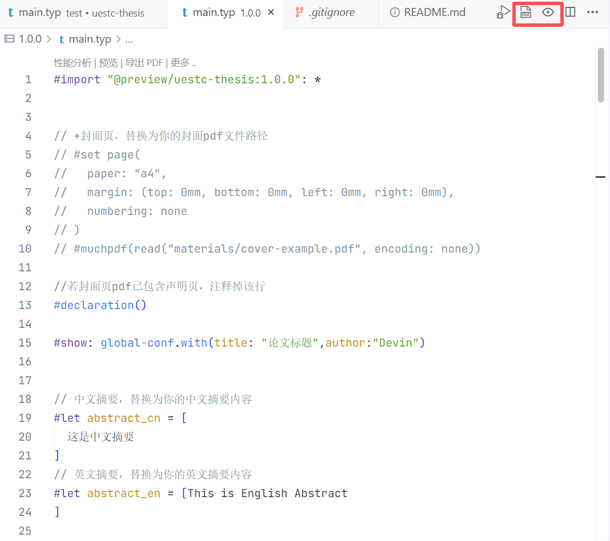

# 电子科技大学论文模板

电子科技大学（UESTC）专业硕士学位论文的 Typst 模板，按照《电子科技大学研究生学位论文规范》的硕士论文模板编写，[欢迎fork，提交 issue和PR](https://github.com/pldxxm/uestc-thesis/issues)
！该模板非官方模板，具有不被学校认可的风险。

## 适用人群：

习惯使用 markdown 等标记语言，熟悉函数式编程，对 typst 有一定了解。

## 版本变更记录

| 版本号 | 日期       | 变更内容 |
| ------ | ---------- | -------- |
| 1.0    | 2025-09-01 | 在线发布版本 |

## 功能特色

- 实现了封装样式的图、表格组件
- 可以实现分章节编写正文再 #include 引入

## 需求规划

- 包括本科和博士论文版本
- 实现双面打印版本
- 其他官方规范中要求但尚未注意和实现的要求

## 缺陷列表

- 暂未实现封面页和声明页的完美复刻，需要手动导入 pdf


## 使用方法

**(1) vscode  + tinymist插件(推荐）**
无需下载typst，可实时预览
1. 在 VS Code 中安装`Tinymist Typst`插件，**插件对应的typst需要0.13 及之后版本**
  

2. 按下 `Ctrl + Shift + P` 打开命令面板，输入 `Typst: Show available Typst templates (gallery)`，打开 Tinymist 提供的模板库。找到 `uestc-thesis`，点击 ❤ 收藏，并点击 + 号（需在空文件夹下），即可创建对应论文模板。

3. 用 VS Code 打开生成的目录，打开 `main.typ` 文件，按下 `Ctrl + K V` 进行实时编辑和预览


4. material 目录下准备封面pdf文件(可包含声明页），然后在main文件下取消注释 ```
#set page(...)
#muchpdf(read("materials/cover.pdf", encoding: none))```将文件名改为你的封面pdf命名。

5. 开始编辑。


**(2) CLI方式**
**提前下载typst CLI工具，typst0.13 及之后版本**
```
// 初始化一个新模板
typst init "@preveiw/uestc-thesis:1.0.0"
// 将源文件导出为pdf 
typst compile main.typ
```

## 主要函数说明

| 函数名          | 类别     | 说明           | 参数                                       |
| --------------- | -------- | -------------- | ------------------------------------------ |
| thesis-figure   | 组件函数 | 插入图         | 图片路径，图名称                           |
| thesis-table    | 组件函数 | 插入表格       | 表名，表头，表体，列宽                     |
| toc             | 页面函数 | 插入目录       | 无                                         |
| list-of-figures | 页面函数 | 插入图目录     | 无                                         |
| list-of-tables  | 页面函数 | 插入表目录     | 无                                         |
| abstract        | 页面函数 | 插入中英文摘要 | 中文关键词，英文关键词，中文摘要，英文摘要 |
| acknowledgment  | 页面函数 | 插入致谢页     | 致谢内容                                   |
| reference       | 页面函数 | 插入参考文献   | 自定义 bib 文件路径                        |
| appendix        | 页面函数 | 插入附录       | 附录内容                                   |


### 封面导入

```
#muchpdf(read("materials/cover-example.pdf", encoding: none))
```

### 图函数

```
#thesis-figure(
image("/images/image-example.svg",width: 100%),
caption: [DORA指标],
)
```

### 表格函数

```
#thesis-table(
    title:[表格名称],
    header:([姓名], [年龄], [性别]),
    body: (
      [张三],[20], [男],
      [李四], [21], [女]
      )，
    // 调节列宽比例
    columns:(1fr,1fr,1fr)
    notes:[表格备注]
)
```
