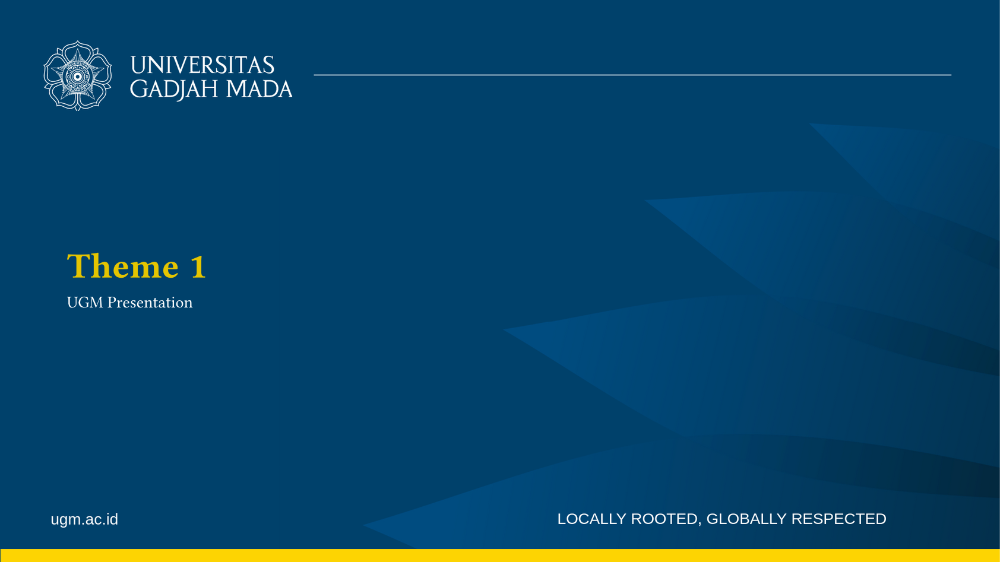
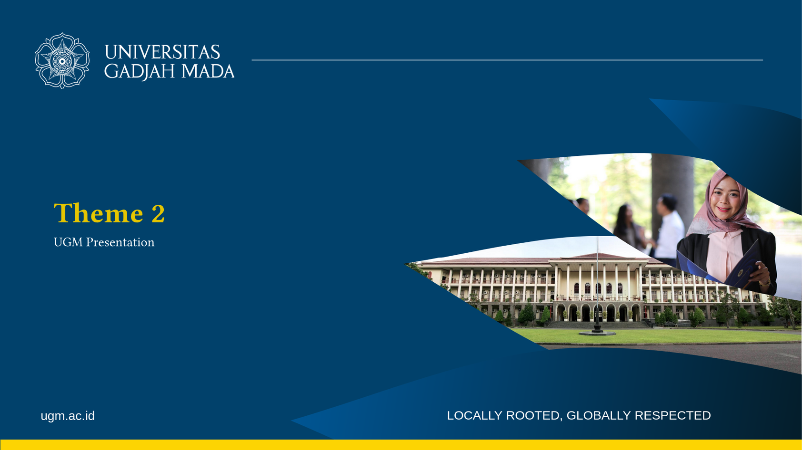
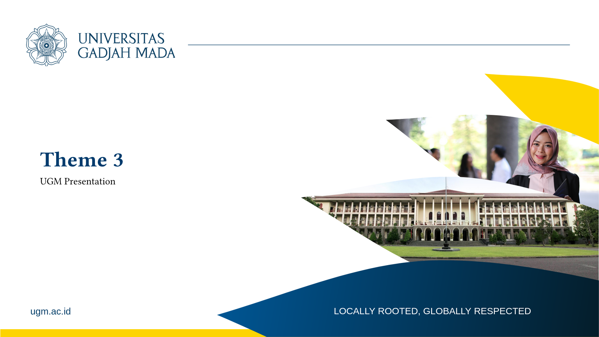
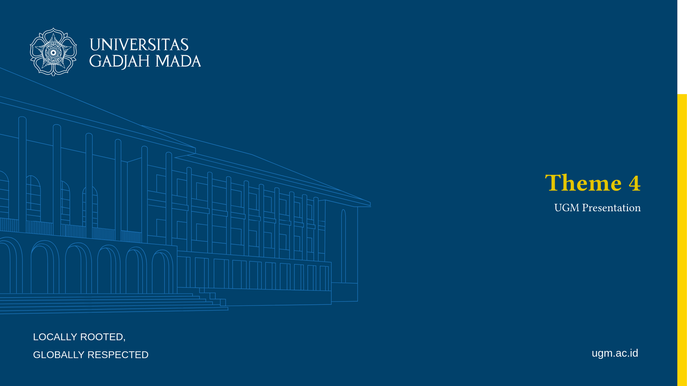
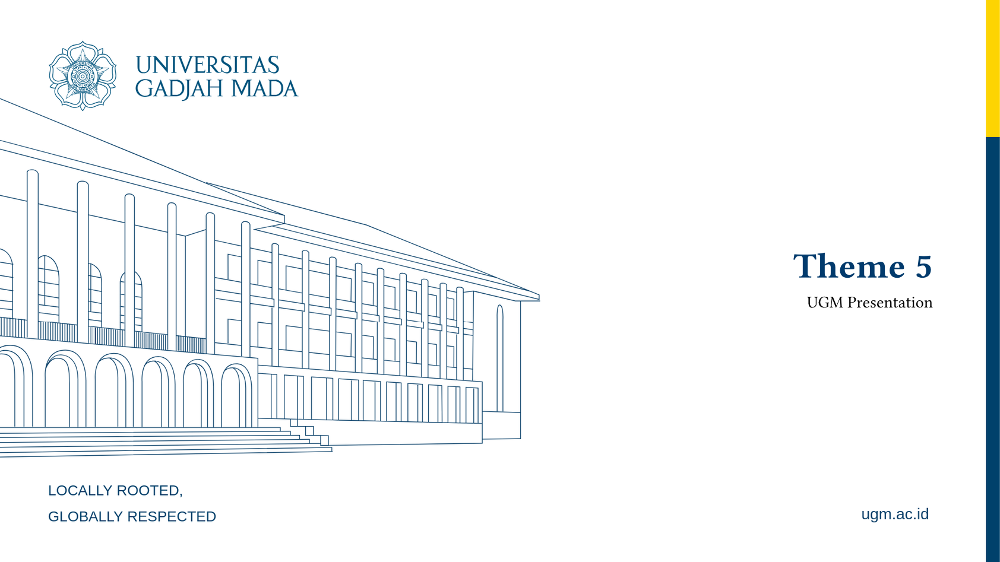
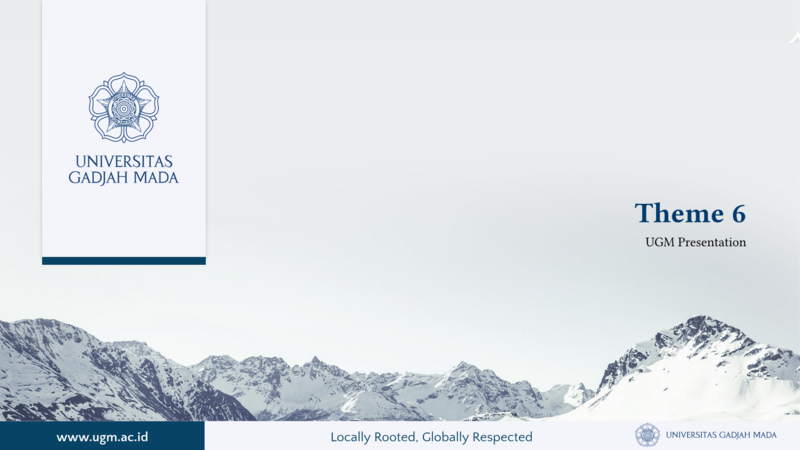

# ugm-presentation-unofficial

An unofficial presentation template for Universitas Gadjah Mada (UGM) built with Typst.

## Installation

```typst
#import "@preview/ugm-presentation-unofficial:0.1.0": conf, title, section, slide, quote
```

## Usage

```typst
#show: doc => conf(
  num: 2,  // choose theme 1-6
  doc
)
```

## Functions

- `conf(num, doc)` - Configure document with theme
- `title(content)` - Title slide
- `section(content)` - Section divider
- `slide(content)` - Content slide
- `quote(content)` - Quote slide

## Theme Previews

| Theme | Preview |
|-------|---------|
| 1 |  |
| 2 |  |
| 3 |  |
| 4 |  |
| 5 |  |
| 6 |  |

## License

MIT License
