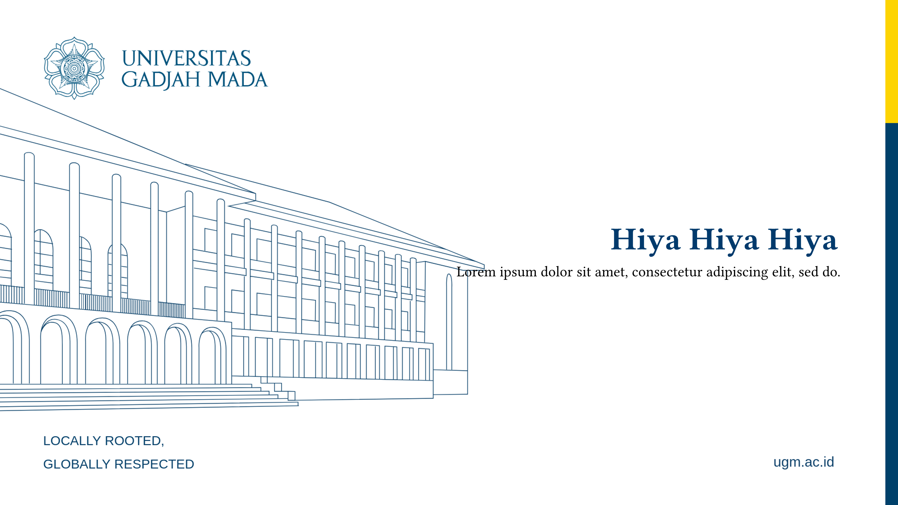

# ugm-presentation-unofficial

An unofficial presentation template for Universitas Gadjah Mada (UGM) built with Typst.

## Features

- 6 unique slide themes with UGM-inspired backgrounds
- Customizable slide types: title, section, content, and quote slides
- Automatic heading styling
- Grid layout support for two-column content
- Code syntax highlighting

## Installation

```typst
#import "@preview/ugm-presentation-unofficial:0.1.0": conf, title, section, slide, quote
```

## Theme Previews

Each theme offers a distinct visual style for your presentation:

| Theme | Style | Description |
|-------|-------|-------------|
| **1** |  | Yellow/white text on colored background |
| **2** | Title + Quote variants | Dark text with colored accents |
| **3** | Clean minimal | White background, centered content |
| **4** | Right-aligned | Colored background, right-aligned text |
| **5** | Section style | Section divider with branded backgrounds |
| **6** | Quote centered | Quote-focused layout with centered content |

## Usage

### Basic Setup

```typst
#import "@preview/ugm-presentation-unofficial:0.1.0": conf, title, section, slide, quote

#show: doc => conf(
  num: 2,  // choose theme 1-6
  doc
)
```

### Slide Functions

#### `conf(num, doc)`

Configures the document. Must be used with `#show: doc => conf(...)`.

| Parameter | Type   | Description                    |
|-----------|--------|--------------------------------|
| `num`     | integer | Theme number (1-6)            |
| `doc`     | content | Document content               |

#### `title(content)`

Creates a title slide with the selected theme background.

```typst
#title[
  = Presentation Title
  Subtitle or Author Name
]
```

#### `section(content)`

Creates a section divider slide.

```typst
#section[
  == Section Name
]
```

#### `slide(content)`

Creates a content slide with the selected theme background.

```typst
#slide[
  === Slide Heading
  Your content here...
  
  #lorem(20)
]
```

#### `quote(content)`

Creates a quote slide with centered content.

```typst
#quote[
  "Your quote text here"
  
  - Attribution
]
```

### Full Example

```typst
#import "@preview/ugm-presentation-unofficial:0.1.0": conf, title, section, slide, quote

#show: doc => conf(
  num: 2,
  doc
)

#title[
  = Presentation Title
  Subtitle
]

#section[
  == Introduction
]

#slide[
  === Overview
  #grid[
    - Point one with some description
    - Point two with more details
  ][
    - Another point
    - Final point
  ]
]

#quote[
  "An inspiring quote here"
  
  - Author Name
]

#section[
  == Conclusion
]

#slide[
  === Summary
  Key takeaways from the presentation.
]
```

## Theme Details

- **Theme 1-2**: Yellow/white text on colored backgrounds
- **Theme 3**: Clean minimal style
- **Theme 4**: Right-aligned content with colored backgrounds
- **Theme 5**: Section divider with branded backgrounds
- **Theme 6**: Quote-focused layout with centered content

## License

MIT License - Feel free to use and modify for your presentations.
