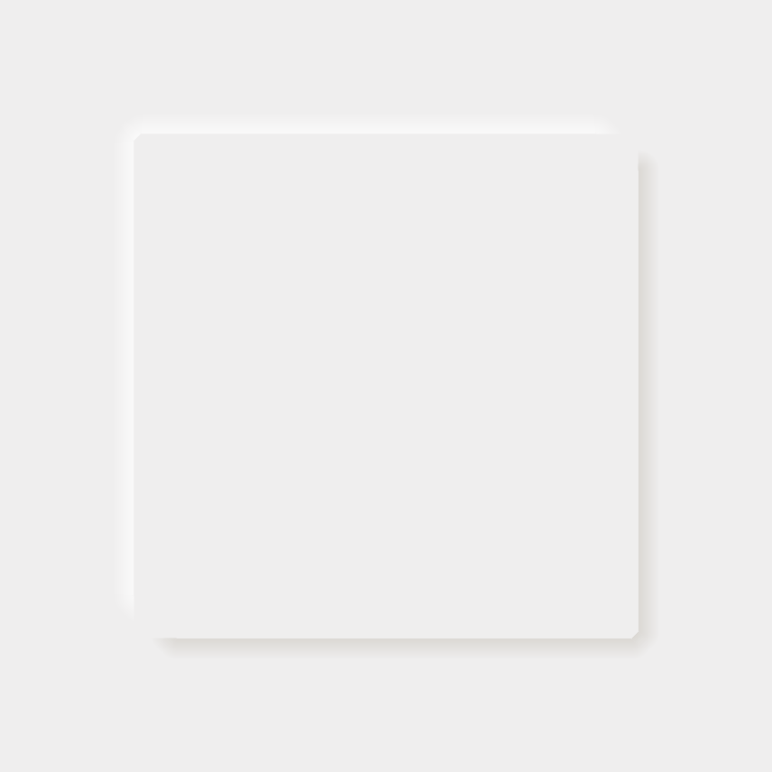
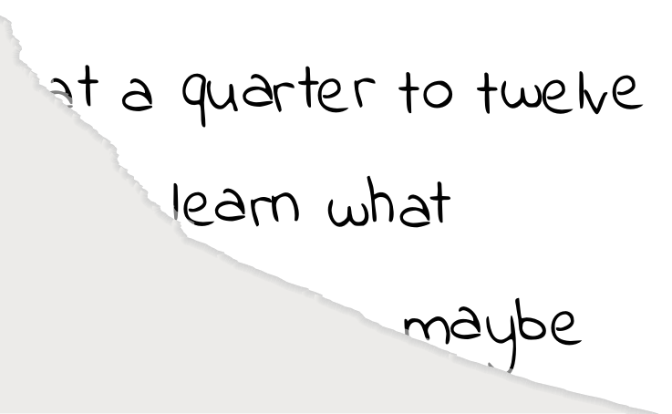

# Umbra

Umbra is a library for drawing basic gradient shadows in [typst](https://typst.app). It currently provides only one function for drawing a shadow along one edge of a path.

## Examples
<!-- img width is set so the table gets evenly spaced by GitHubs css -->
### Basic Shadow
<a href="gallery/basic.typ">
  
</a>

### Neumorphism
<a href="gallery/neumorphism.typ">
  
</a>

### Torn Paper
<a href="gallery/torn-paper.typ">
  
</a>

*Click on the example image to jump to the code.*

## Usage

The following code creates a very basic square shadow:
```
#import "@preview/umbra:0.1.0": shadow-path

#shadow-path((10%, 10%), (10%, 90%), (90%, 90%), (90%, 10%), closed: true)
```

The function syntax is similar to the normal path syntax. The following arguments were added:

* `shadow-radius` (default `0.5cm`): The shadow size in the direction normal to the edge
* `shadow-stops` (default `(gray, white)`): The colours to be used in the shadow, passed directly to `gradient`
* `correction` (default `5deg`): A small correction factor to be added to round shadows at corners. Otherwise, there will be a small gap between the two shadows

### Vertex Order

The order of the vertices defines the direction of the shadow. If the shadow is the wrong way around, just reverse the vertices.

### Transparency

This package is designed in such a way that it should support transparency in the gradients (i.e. corners define shadows using a path which approximates the arc, instead of an entire circle). However, typst doesn't currently support transparency in gradients. ([issue](https://github.com/typst/typst/issues/2546)).

In addition, the aforementioned correction factor would likely cause issues with transparent gradients.