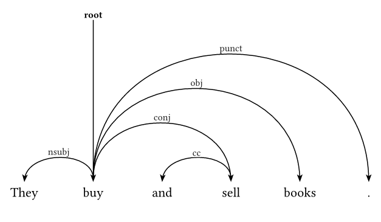
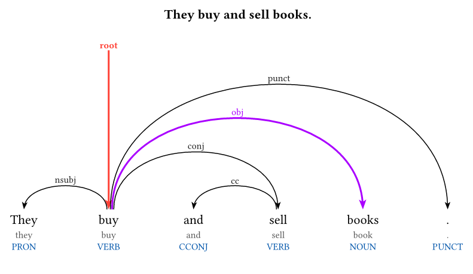
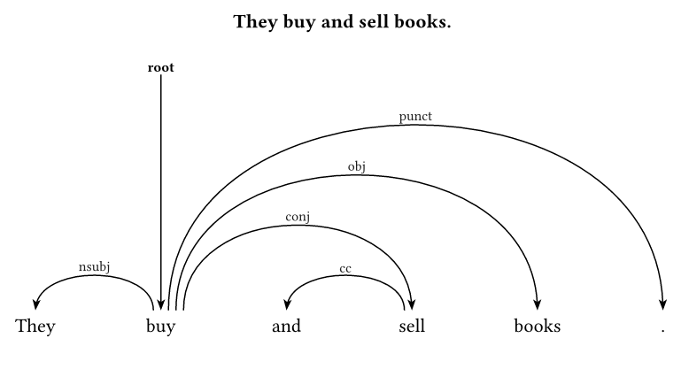

# unidep

A fast, beautiful, and highly customizable Typst package for rendering Universal Dependencies (CoNLL-U) trees, powered by Rust/WASM and [CeTZ](https://github.com/johannes-wolf/cetz).

This package provides an elegant way to visualize dependency parsing results, syntax trees, and enhanced dependency graphs directly in Typst without relying on external Python scripts or LaTeX's `tikz-dependency`.

## Usage

Import the package and use the `dependency-tree` function. Pass your CoNLL-U text to it.

````typ
#import "@preview/unidep:0.1.4": dependency-tree
#set page(width: auto, height: auto, margin: 3mm)

#let sample-conllu = ```
# sent_id = 1
# text = They buy and sell books.
1	They	they	PRON	PRP	_	2	nsubj	_	_
2	buy	buy	VERB	VBP	_	0	root	_	_
3	and	and	CCONJ	CC	_	4	cc	_	_
4	sell	sell	VERB	VBP	_	2	conj	_	_
5	books	book	NOUN	NNS	_	2	obj	_	_
6	.	.	PUNCT	.	_	2	punct	_	_
```.text

#dependency-tree(sample-conllu)
````



## Advanced Usage & Highlighting

You can display the original sentence text, lemmas, and part-of-speech tags (UPOS, XPOS) directly around the words. Additionally, you can highlight specific dependency arcs by targeting the dependent's ID using the `highlights` dictionary.

```typ
#dependency-tree(
  sample-conllu, 
  show-text: true,
  word-spacing: 2.5, 
  text-gap: 0.35em,
  sentence-gap: 0.75em,
  show-upos: true,
  show-lemma: true,
  tail-offset: 0.0,
  tail-spacing: 0.05,
  highlights: (
    "2": red,          // Highlight the ROOT arrow pointing to 'buy'
    "5": rgb("aa00ff") // Highlight the arc pointing to 'books'
  )
)
```



## Arc Geometry

When multiple arcs meet around the same token, `tail-spacing` fans out the non-arrowhead side of each arc while keeping the arrowhead anchored to the token.

```typ
#dependency-tree(
  sample-conllu,
  show-text: true,
  word-spacing: 2.5,
  tail-offset: 0.0,
  tail-spacing: 0.15,
)
```



The default `tail-angle`, `head-angle`, and `tail-offset` already produce upright joins. Adjust them only when you want a softer or steeper look.

## API Reference

### `dependency-tree(conllu-text, ..args)`

Renders one or more sentences from a CoNLL-U formatted string.

**Parameters:**

- `conllu-text` (String): The raw text in CoNLL-U format.
- `word-spacing` (Float): Horizontal distance between words. Default: `2.0`.
- `level-height` (Float): Vertical height increment for each arc level. Default: `1.0`.
- `arc-roundness` (Float): Controls the curvature of the bezier arcs. Lower values make arcs boxier; higher values make them more elliptical. Default: `0.18`.
- `tail-spacing` (Float/None): Horizontal spacing step for non-arrowhead endpoints on the same token side. Lower arcs are placed farther out and higher arcs farther in so clustered starts avoid crossing. Default: `none`, which resolves to `0.0`.
- `head-spacing` (Float/None): Horizontal spacing step for arrowhead endpoints on the same token side. Default: `none`, which resolves to `0.0`.
- `tail-angle` (Angle/Float/None): Connection angle for the non-arrowhead side of each arc. Default: `90deg`.
- `head-angle` (Angle/Float/None): Connection angle for the arrowhead side of each arc. Default: `90deg`.
- `tail-offset` (Float): Vertical offset for the tail (start point) of the dependency arc. Useful for fine-tuning the join near the source token. Default: `0.1`.
- `head-offset` (Float): Vertical offset for the head (end point/arrowhead) of the dependency arc. Useful for fine-tuning the gap between the arrowhead and the token. Default: `0.0`.
- `text-gap` (Relative Length): Vertical gap between the optional sentence text (`# text = ...`) and the dependency tree. Default: `0.5em`.
- `sentence-gap` (Relative Length): Vertical gap inserted after each rendered sentence. Default: `1em`.
- `show-text` (Bool): If `true`, displays the sentence text (extracted from `# text = ...` metadata) above the parsed tree. Default: `false`.
- `show-upos` (Bool): If `true`, displays the Universal POS tag (column 4) below the word. Default: `false`.
- `show-xpos` (Bool): If `true`, displays the language-specific POS tag (column 5) below the word. Default: `false`.
- `show-lemma` (Bool): If `true`, displays the lemma (column 3) below the word. Default: `false`.
- `show-enhanced-as-dashed` (Bool): If `true`, arcs derived from the `DEPS` column (enhanced graph) are drawn as blue dashed lines to distinguish them from the basic tree. Default: `true`.
- `show-root` (Bool): If `true`, renders a vertical root arrow centered on the token. Default: `true`.
- `highlights` (Dictionary): A dictionary of `("ID": color)` pairs to apply custom stroke colors and thicker lines to specific arcs. The key must be the ID of the dependent token (e.g., `"4"`). Default: `(:)`.

## License

This project is distributed under the MIT License. See [LICENSE](LICENSE) for details.
