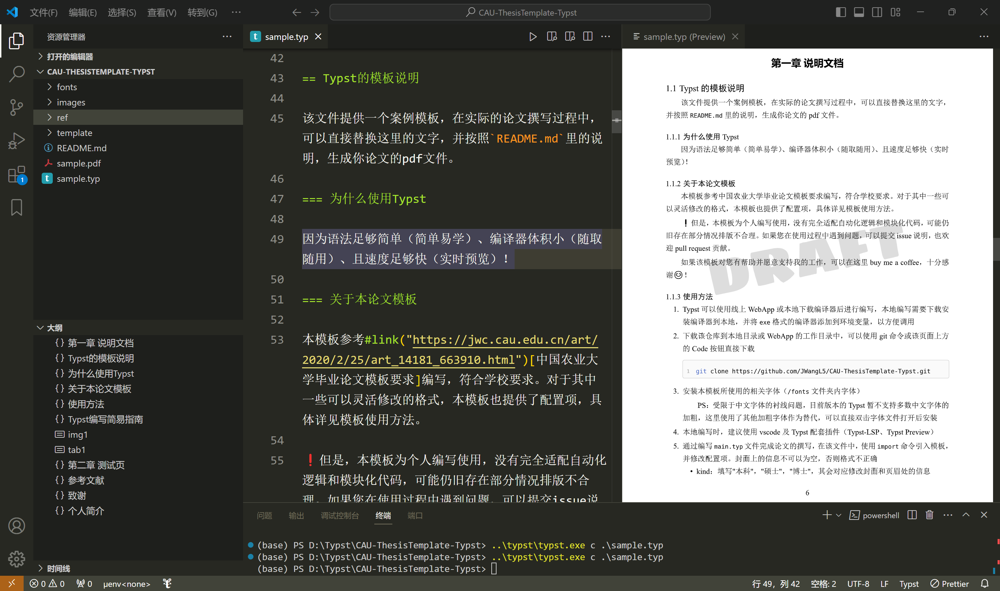

### 为什么使用Typst

因为语法足够简单（简单易学）、编译器体积小（随取随用）、且速度足够快（实时预览）！



### 关于本论文模板

本模板参考[中国农业大学毕业论文模板要求](https://jwc.cau.edu.cn/art/2020/2/25/art_14181_663910.html)编写，符合学校要求。对于其中一些可以灵活修改的格式，本模板也提供了配置项，具体详见模板使用方法。模板的效果见`sample.pdf`文件：[点击直达](https://github.com/JWangL5/CAU-ThesisTemplate-Typst/blob/master/sample.pdf)

⚠️ 但是，本模板为个人编写使用，没有完全适配自动化逻辑和模块化代码，可能仍旧存在部分情况排版不合理。如果您在使用过程中遇到问题，可以提交issue说明，也欢迎pull request贡献。

如果该模板对您有帮助并愿意支持我的工作，可以在这里[buy me a coffee](https://www.buymeacoffee.com/jwangl5)，十分感谢😊！

### 使用方法

1. Typst可以使用[线上WebApp](https://typst.app/)或本地下载编译器后进行编写，本地编写需要[下载安装编译器](https://github.com/typst/typst/releases)到本地，并将`exe`格式的编译器添加到环境变量，以方便调用

2. 下载该仓库到本地目录或WebApp的工作目录中，可以使用git命令或该页面上方的Code按钮直接下载

    ```git
    git clone https://github.com/JWangL5/CAU-ThesisTemplate-Typst.git
    ```

3. 安装本模板所使用的相关字体（`/fonts`文件夹内字体）

    PS：受限于中文字体的衬线问题，目前版本的Typst暂不支持多数中文字体的加粗，这里使用了其他加粗字体作为替代，可以直接双击字体文件打开后安装

4. 本地编写时，建议使用[vscode](https://code.visualstudio.com/)及Typst配套插件（Typst-LSP、Typst Preview）

5. 通过编写`main.typ`文件完成论文的撰写，在该文件中，使用`import`命令引入模板，并修改配置项
   - kind：填写`"本科"`，`"硕士"`，`"博士"`，其会对应修改封面和页眉处的信息
   - title：论文标题，填写在括号`[text]`内，使用`\`换行
   - abstract：论文摘要，需要手动写关键词
   - authors：论文作者姓名，可以`[text]`，也可以`"text"`
   - teacher：指导教师的姓名
   - degree：申请学位门类级别，比如`[理学硕士]`
   - college, major, field：封面上的内容，学院、专业和研究方向
   - signature：你的电子签名文件路径，是论文独创性声明处的签字
   - classification & security：论文在图书馆收录时的[中图法分类](https://www.clcindex.com/)和保密级别
   - student_ID：学号
   - year, month, day：论文封面和诚信声明页上的日期
   - draft：填写`true`时添加草稿水印，用以区分是否为最终版本，填写`false`时去除水印并添加论文章
   - blindReview：填写为`true`时隐藏封面上的相关信息，以及致谢和作者介绍

6. 使用`typst`命令生成pdf格式文件，或直接使用vscode的实时预览插件（默认快捷键`ctrl+k v`）

    ```cmd
    typst compile ./sample.typ
    ```


### Typst编写简易指南

> 如果在使用Typst时遇到任何问题，都可以参考[官方帮助文档](https://typst.app/docs/)，下面是简要的使用方法及与本模板相关的配套设置，可以参考的示例文档`sample.typ`

- 关于标题：Typst使用`=`作为标题的指示符。本模板中，一级标题需要手动编号，二、三级标题则不需要

    ```typst
    = 第一章 一级标题
    == 二级标题
    === 三级标题
    ```

- 段落的编写：直接输入文本即可编写内容，使用两个回车另起一段

    ```typst
    这是内容的第一段，
    这仍旧是第一段的内容
    
    多一个换行符号后另起为第二段
    ```

- 文字内容的基础格式：使用`*text*`包括住的文字可以加粗，使用`_text_`包括住的文字可以斜体文字，使用`#u[text]`包括住的文字可以实现下划线，使用`#sub[text]`包括住的文字修改为下标，使用`#super[text]`包括住的文字修改为上标
    ```typst
    这里是*加粗文字*内容，
    这里是_斜体文字_内容，
    这里是#u[下划线文字]内容，
    这里是#sub[下标文字]内容，
    这里是#super[上标文字]内容
    ```

- 使用`#highlight(fill: red)[text]`高亮文字标记，使用`fill`参数修改高亮颜色

    ```typst
    这一段文字#highlight[还需要修改]
    ```

- 使用`#link("your link here")[text]`标记超链接

    ```typst
    这里是#link("https://typst.app/home")[Typst官方网站]
    ```

- 使用`-`或`+`使用无序列表或有序列表，使用`Tab`缩进为二级列表

    ```typst
    - 无序列表1
        + 有序列表1
        + 有序列表2
    - 无序列表2
    ```

- 使用`#h(2em)`或`#v(1em)`来添加水平或垂直的空白缩进，括号中的参数为需要空出的距离，其单位可以使用`%`（页面百分比），`pt`（点，印刷行业的绝对长度单位，相当于1/72英寸），`em`（字符长度，相对于当前字符大小）等

    ```typst
    #h(2em)默认格式会首行缩进两字符，额外添加会再次缩进
    ```

- 模板支持自动汇总图表目录，可以使用`#figure(image())`命令来添加图片或使用`#booktab()`添加表格，在填写既定的配置项后可成功渲染并自动汇总目录页，可以使用`@`引用图表

    ```typst
    #figure(
        image('./image/path.jpg', width: 90%),
        kind: image, 
        supplement: [图],
        caption: [图片的标题],
    )<img1>
    
    #booktab(
        width:60%,
        columns: (20%, 1fr, 2fr, 3fr),
        caption: [这里填写表格名称],
        kind: table, 
        [1], [2], [3], [4],
        [a], [b], [c], [d],
        [e], [f], [g], [h],
        [i], [j], [k], [l]
    )<tab1>
    ```

- 使用`$`编写数学公式，`$`符紧跟内容时为行内公式，添加空格后为行间公式，公式的具体规则和[符号](https://typst.app/docs/reference/symbols/sym/)可以查[帮助文档](https://typst.app/docs/reference/math/)
    ```typst
    泰勒展开式（行内）：
    $f(x)= sum_(n=0)^(infinity) (f^(n)(x_0))/(n!) (x-x_0)^n$
    
    欧拉公式（行间）：
    $ e^(i theta) = cos theta + i sin theta \ e^i pi + 1 = 0 $
    ```

- 使用` ```code```  `标识符输入代码，Typst可以渲染、显示代码框，如果指定了语言类型，可以根据其语法格式进行风格渲染；使用单个符号使用行内代码
    ```typst
      ```python
        print("hello world");
      ```
    同样支持行内代码`hello world`
    ```
    
- 修改`ref\acronyms.json`文件添加缩略词表，并使用`#acro("keyword1")`命令在文中引入缩略词全称，在引入后会自动根据json文件中信息，排序后添加到缩略词表中
    ```json
    {
        "keyword1":["英文缩写1", "英文全称1", "中文翻译1"],
        "keyword2":["英文缩写2", "英文全称2", "中文翻译2"]
    }
    ```
    ```typst
    在正文中可以使用`#acro`命令引入缩略词（#acro("ac")）。
    ```
- 使用`#[bibliography]()`添加参考文献，括号中需要填写`.bib`格式的参考文献列表，在文中使用`@citationKey`引用，具体的信息见[帮助文档](https://typst.app/docs/reference/model/bibliography/)
  
    PS：可以使用`zotero+Better BibTex`自动导出/更新`.bib`格式的参考文献列表

    PS：在添加bib的代码后面，隐藏了一个heading，请不要删除这一行，否则参考文献的页眉会出错

    PS：根据学院要求默认使用EmboJ的格式，如果需要其他格式，只要下载到格式说明`.csl`文件修改参数即可

- 当文本内容仅有1页时，有时页眉标题会出错，可以添加一个空白标题进行修正

  ```typst
  #heading(level: 6, numbering: none, outlined: false)[]
  ```

### 致谢

本模板在编写过程中参考并学习了Typst模板的部分代码，在这里统一致谢。
