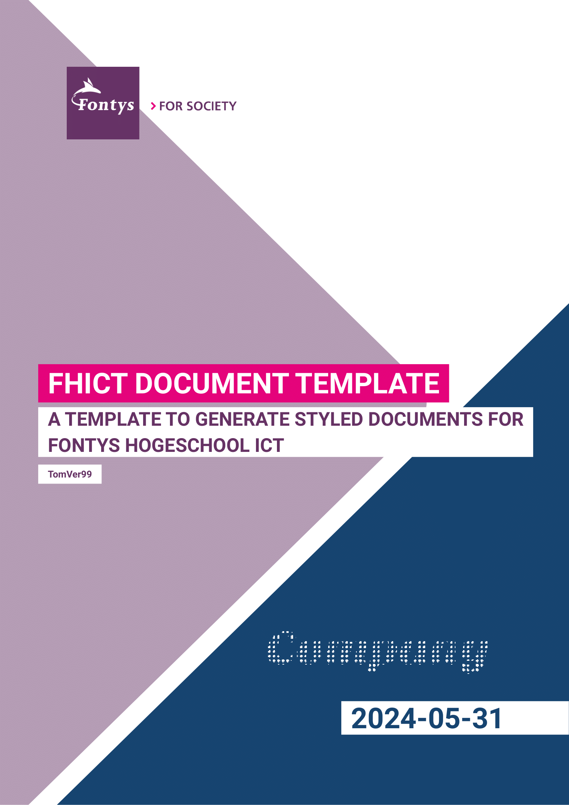

<!-- markdownlint-disable MD033 -->

# FHICT Document Template

This is a document template for creating professional-looking documents with Typst, tailored for FHICT (Fontys Hogeschool ICT).

## Introduction

Creating well-structured and visually appealing documents is crucial in academic and professional settings. This template is designed to help FHICT students and faculty produce professional looking documents.

## Requirements

- Roboto font installed on your system (is optional but without it the style is not whole)
- Typst builder installed on your system (Explained in `Getting Started`).

## Features

- Consistent formatting for titles, headings, subheadings, and paragraphs.
- Clean and professional document layout.
- FHICT Style.
- Configurable document options.
- Helper functions.

## Getting Started

To get started with this Typst document template, follow these steps:

1. **Check for the roboto font**: Check if you have the roboto font installed on your system. If you don't, you can download it from [Google Fonts](https://fonts.google.com/specimen/Roboto).
2. **Install Typst**: I recommend to use VSCode with the [Typst LSP Extension](https://marketplace.visualstudio.com/items?itemName=nvarner.typst-lsp). You will also need a PDF viewer in VSCode if you want to view the document live.
3. **Import the template**: Import the template into your own typst document. `#import "@preview/unofficial-fhict-document-template:0.10.0": *`
4. **Set the available options**: Set the available options in the template file to your liking.
5. **Start writing**: Start writing your document.

## Helpful Links / Resources

- The manual contains a list of all available options and helper functions. It can be found [here](https://github.com/TomVer99/FHICT-typst-template/blob/main/documentation/manual.pdf) or attached to the latest release.
- The [Typst Documentation](https://typst.app/docs/) is a great resource for learning how to use Typst.
- The bibliography file is written in [BibTeX](http://www.bibtex.org/Format/). You can use [BibTeX Editor](https://truben.no/latex/bibtex/) to easily create and edit your bibliography.
- You can use sub files to split your document into multiple files. This is especially useful for large documents.

## Contributing

I welcome contributions to improve and expand this document template. If you have ideas, suggestions, or encounter issues, please consider contributing by creating a pull request or issue.

## Disclaimer

This template / repository is not endorsed by, directly affiliated with, maintained, authorized or sponsored by Fontys Hogeschool ICT. It is provided as-is, without any warranty or guarantee of any kind. Use at your own risk.

The author was/is a student at Fontys Hogeschool ICT and created this template for personal use. It is shared publicly in the hope that it will be useful to others.

The use of the Fontys logo is done according to the Fontys guidelines, see [NOTICE](https://github.com/TomVer99/FHICT-typst-template/blob/main/template/assets/NOTICE).
