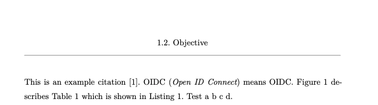
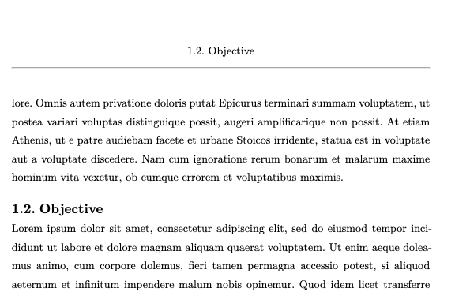
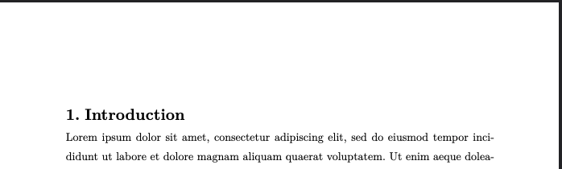

# Typst Template HKA

This is a thesis template written in [Typst](https://typst.app/),
based on the [template of the TU Munich](https://github.com/ls1intum/thesis-template-typst).

## Usage

You can use this template in the Typst web app by clicking "Start from template"
on the dashboard and searching for `unofficial-hka-thesis`.

Locally, you can use the following command to start with this templates:

```bash
typst init @preview/unofficial-hka-thesis:1.0.2
```

### Features

## Metadata

In the file `settings/metadata.typ` you can enter all metadata (title, author, submission date, ...). The data is automatically referenced in the exposé and the thesis.

## Settings

Some important global settings are located in `settings/settings.typ`. You can adapt them here as you wish and they are automatically changed in the exposé and the thesis.

## Pre-defined Pages

The template supports the following pages out-of-the-box:

- Titlepage
- Declaration of Originality
- Abstract, both in English and German
- Table of Contents
- List of Figures
- List of Tables
- List of Listings
- List of Abbreviations (for instructions refer to [glossarium](https://github.com/typst/packages/tree/main/packages/preview/glossarium/0.2.6))
- Bibliography

# **Usage of official Titlepage**

In the intranet you can download the official titlepage. As Typst is not able to include PDFs, you must manually exchange the current titlepage with the official in the final PDF file. Be aware, that you must adapt the numbering of the PDF itself, so that you view page `5` instead of `V` if you want to jump to page `5`.

## Header

Every header includes the heading of the current chapter, section or subsection.


If a new section or subsection starts at the current page this one is chosen.


If a new chapter starts at the current page, no header will be shown.


The numbering is shown thanks to the inspiration from [hydra](https://github.com/tingerrr/hydra) (Hydra didn't work flawlessly, therefore I had to write my own solution).

## Footer

Every footer is divided by a line from the main body. The footer contains the page numbering in the following format `1 / 3`.

## 💡 Feedback

**Anything Missing?** Please [create an issue](https://github.com/AnsgarLichter/unofficial-hka-thesis/issues/new) or open a Pull Request right away.

**Have Questions?** Please [open a discussion](https://github.com/AnsgarLichter/unofficial-hka-thesis/discussions).
