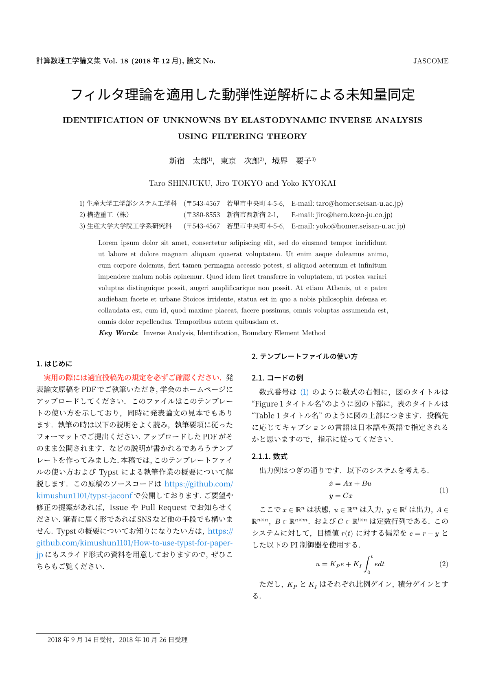

# Typst JASCOME

Unofficial Typst template for JASCOME.



## Usage

```typst
#import "@preview/unofficial-jascome-34j:1.0.4": jascome

// デフォルト値でよい引数は省略可能
#show: jascome.with(
  title: [フィルタ理論を適用した動弾性逆解析による未知量同定],
  title-en: [IDENTIFICATION OF UNKNOWNS BY ELASTODYNAMIC INVERSE ANALYSIS \
    USING FILTERING THEORY],
  authors: ([新宿 太郎], [東京 次郎], [境界 要子]),
  authors-en: ([Taro SHINJUKU], [Jiro TOKYO], [Yoko KYOKAI]),
  authors-affiliation: (
    (
      "生産大学工学部システム工学科",
      "543-4567",
      "若里市中央町4-5-6",
      "taro@homer.seisan-u.ac.jp",
    ),
    (
      "構造重工（株）",
      "380-8553",
      "新宿市西新宿2-1",
      "jiro@hero.kozo-ju.co.jp",
    ),
    (
      "生産大学大学院工学系研究科",
      "543-4567",
      "若里市中央町4-5-6",
      "yoko@homer.seisan-u.ac.jp",
    ),
  ),
  keywords: ("Inverse Analysis", "Identification", "Boundary Element Method"),
  abstract: [#lorem(100)],
  date-submit: datetime(year: 2018, month: 9, day: 14),
  date-accept: datetime(year: 2018, month: 10, day: 26),
  date-publish: datetime(year: 2018, month: 12, day: 1),
  volume: 18,
  number: none,
)
```
