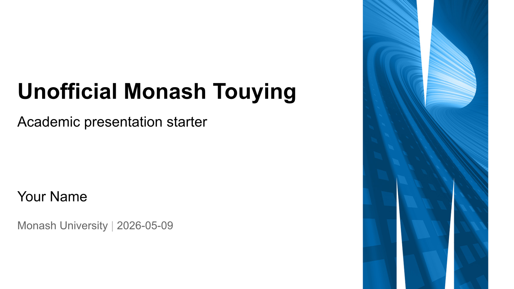
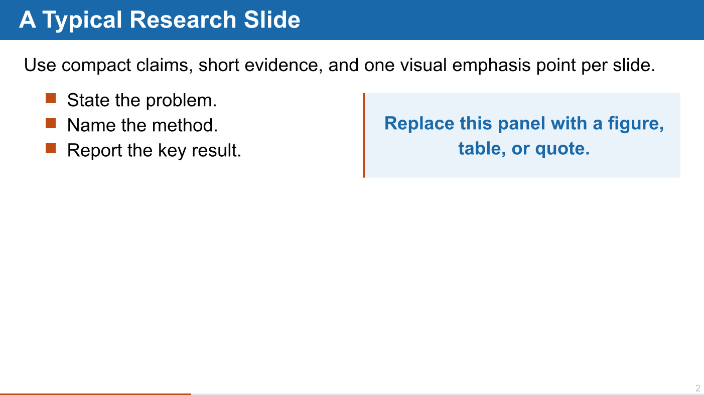
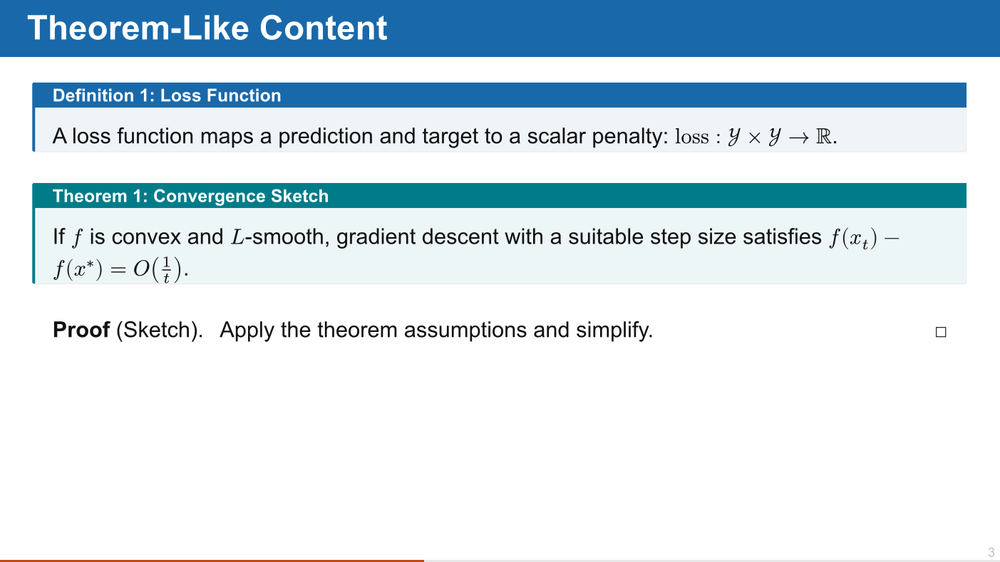

# Unofficial Monash Touying

An unofficial Monash-inspired presentation package for Typst. It wraps Touying's
slide authoring system behind this package's public import, while supplying a
theme aligned with the `quarto-monash/presentation` Typst template,
theorem-like environments styled with `frame-it`, and Monash-inspired code
blocks powered by `zebraw`.

## Preview

The package ships with both a starter template and a full example deck:

- `template/main.typ` is the minimal starter used by `typst init`.
- `example/main.typ` is a fuller feature showcase and usage guide.
- `thumbnail.png` is the template preview image used by the package manifest.

| Title slide | Content slide | Academic frames |
| --- | --- | --- |
|  |  |  |

## Usage

Create a deck from the template:

```sh
typst init @preview/unofficial-monash-touying:0.1.2 my-slides
```

Or import the package directly in an existing presentation deck:

````typst
#import "@preview/unofficial-monash-touying:0.1.2": *

#let monash-titlegraphic = image(
  "assets/monash-presentation/background/bg-02.png",
  width: 100%,
  height: 100%,
  fit: "cover",
)

#show: monash-theme.with(
  titlegraphic: monash-titlegraphic,
  config-info(
    title: [Presentation Title],
    short-title: [Short Title],
    subtitle: [Subtitle],
    author: [Your Name],
    institution: [Monash University],
    date: datetime.today(),
  ),
)

#show: show-monash-frames

#title-slide()

= Section

== Slide Title

Use normal slide content.

- Bullets receive Quarto Monash square markers.
  - Nested bullets use triangle markers.

=== Content Heading

Level-three headings use Monash blue bold text.

#definition[Term][
  A definition can be placed directly inside a slide.
]

```py
def mse(y, pred):
    return ((y - pred) ** 2).mean()
```
````

## Exports

- `monash-theme`
- `show-monash-frames`
- `monash-frame-style`
- `monash-accent-rule`
- `slide`
- `title-slide`
- `pause`
- `uncover`
- `only`
- `meanwhile`
- `config-info`
- `config-page`
- `config-common`
- `config-colors`
- `config-methods`
- `config-store`
- `definition`
- `theorem`
- `proof`
- `lemma`
- `corollary`
- `remark`
- `note`
- `warning`

The package wraps the common Touying authoring API so users only need to import
`@preview/unofficial-monash-touying`. Use headings, `#slide`, `#pause`,
composers, and other exported presentation features directly.
`#title-slide()` creates a table of contents after the title slide by default;
set `toc: false` in `monash-theme.with(...)` if a deck should start directly
with the first section.
Frame environments are numbered independently by environment type by default.
Use `#show: show-monash-frames.with(numbering: false)` in the preamble to hide
frame numbers.

For detailed API documentation, compile `docs/reference.typ`. The reference is
generated from Typst doc comments with `@preview/tidy:0.4.3`.

## Local Development

Run:

```sh
./scripts/check.sh
```

The harness compiles the starter template, the example deck, the generated
`tidy` reference, and refreshes the thumbnail.

## Design Notes

The default visual language follows the Typst implementation from
`quarto-monash/presentation`: a full-page title graphic, full-width Monash blue
slide title bars, orange square list markers, a light footer baseline, orange
footer progress, and a small grey slide number. The template vendors a
logo-free background PNG derived from that design under
`template/assets/monash-presentation/`.

Code blocks use the locked Typst Universe package `@preview/zebraw:0.6.1` with
a Monash light code block style, and continue to work through ordinary fenced
raw blocks.

The starter deck does not bundle Monash logos, crests, or wordmarks. Users with
appropriate rights can pass their own logo through
`monash-theme.with(logo: ...)`. The `titlegraphic` defaults to
`assets/monash-presentation/background/bg-02.png`, a logo-free variant used for
Quarto Monash visual alignment.

## Credits

This project is an unofficial community package and is not affiliated with or
endorsed by Monash University.

The visual direction and bundled logo-free presentation background asset are
based on the Quarto Monash presentation template:
<https://github.com/quarto-monash/presentation>. That project is distributed
under the CC0 1.0 Universal public domain dedication. Monash names, logos,
crests, wordmarks, and marks remain associated with Monash University and should
be used according to the relevant brand guidance.

## Typst Universe Submission Notes

Typst Universe packages are submitted through a pull request to
`typst/packages` under `packages/preview/<package-name>/<version>`. The package
manifest must include the package metadata, and template packages must define
`[template]` with `path`, `entrypoint`, and `thumbnail`.

For template packages, the template entrypoint must compile out of the box after
`typst init`; in particular, it should import this package with an absolute
package import such as `@preview/unofficial-monash-touying:0.1.2` rather than a
relative path like `../lib.typ`.

Before submitting, run `./scripts/check.sh`. The script compiles the starter
template and example deck through a temporary local package path so the
absolute package imports are tested before publication.
