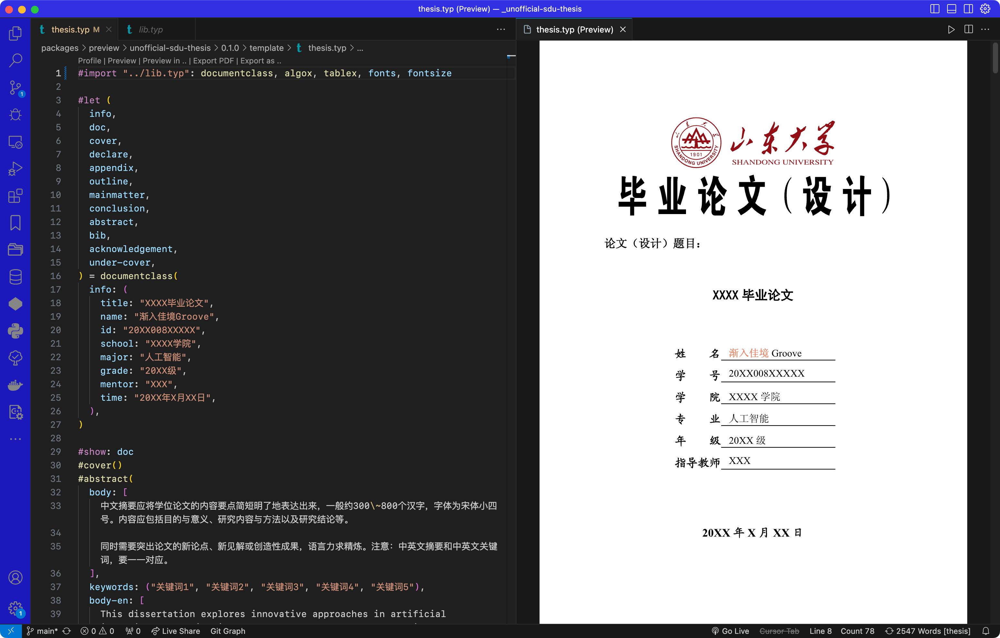

# 山东大学本科毕业论文（设计）typst模板

> 山东大学本科毕业论文（设计）typst模板，带来超越word与tex的体验，助你轻松编辑，简洁书写。
> 本项目借鉴了[modern-nju-thesis](https://typst.app/universe/package/modern-nju-thesis)，在此表示感谢。

- Typst 非官方中文交流群:793548390
- **如遇到任何问题或需求，请联系GG:** _`groovewjh@foxmail.com`_，或提交[issue](https://github.com/GrooveWJH/unofficial-sdu-thesis/issues)

## 开发预览



## 使用

快速预览，请参考[此项目库](https://github.com/GrooveWJH/unofficial-sdu-thesis)

- [thesis.pdf](https://github.com/GrooveWJH/unofficial-sdu-thesis/blob/main/template/thesis.pdf)
- [thesis.typ](https://github.com/GrooveWJH/unofficial-sdu-thesis/blob/main/template/thesis.typ)

实际上，理想的情况下，你几乎只需要修改 `thesis.typ`文件即可完成你的工作。

## 简洁示例

> 此示例未包含正文之后的部分及图表应用，具体仍请参考[thesis.typ](https://github.com/GrooveWJH/unofficial-sdu-thesis/blob/main/template/thesis.typ)

```typst
#import "@preview/unofficial-sdu-thesis:0.1.0": documentclass, algox, tablex, fonts, fontsize

#let (
  info,
  doc,
  cover,
  declare,
  appendix,
  outline,
  mainmatter,
  conclusion,
  abstract,
  bib,
  acknowledgement,
  under-cover,
) = documentclass(
  info: (
    title: "XXXX毕业论文",
    name: "渐入佳境Groove",
    id: "20XX008XXXXX",
    school: "XXXX学院",
    major: "人工智能",
    grade: "20XX级",
    mentor: "XXX",
    time: "20XX年X月XX日",
  ),
)

#show: doc
#cover()
#abstract(
  body: [
    摘要
  ],
  keywords: ("关键词1", "关键词2"),
  body-en: [
    dissertation
  ],
  keywords-en: ("dissertation", "dissertation format"),
)
#outline()

#set heading(numbering: "1.1")
#counter(page).update(1)
#show: mainmatter

= 绪#h(2em)论

== 二级标题
山東大學本科畢業論文（設計）Typst模板。

=== 三级标题
本文...

=== 三级标题
许多年后奥雷里亚诺·布恩迪亚上校站在行刑队面前，准会想起父亲带他去见识冰块的那个遥远的下午。

Many years later, as he faced the firing squad, Colonel Aureliano Buendía was to remember that distant afternoon when his father took him to discover ice.
= 本科毕业论文写作规范

== 二级标题
本组织...

=== 三级标题
本文将...
```

## 特性 / 路线图

- 模板
  - [X] 本科生模板
  - [X] 封面
  - [X] 中文摘要
  - [X] 英文摘要
  - [X] 目录页
  - [ ] 插图目录
  - [ ] 表格目录
  - [ ] 符号表
  - [X] 致谢
  - [ ] 引用
- 编号
  - [X] 正文-关联章节图表编号
  - [ ] 附录-无关联图表编号
- 全局配置
  - [X] 类似 LaTeX 中的 documentclass 的全局信息配置
  - [ ] 盲审模式，将个人信息替换成小黑条，并且隐藏致谢页面，论文提交阶段使用
  - [ ] 双面模式，会加入空白页，便于打印
  - [X] 自定义字体配置，可以配置「宋体」、「黑体」与「楷体」等字体对应的具体字体
  - [X] 数学字体配置：模板不提供配置，用户可以自己使用 #show math.equation: set text(font: "Fira Math").
