# Unified Academic Presentation Themes (Sorbonne & IPLESP)

A non-official structured presentation template for Typst, providing two institutional themes: [**Sorbonne University**](https://www.sorbonne-universite.fr/) and [**IPLESP**](https://www.iplesp.fr/). Built on top of the [presentate](https://typst.app/universe/package/presentate) and [navigator](https://typst.app/universe/package/navigator) packages.

---

> **Note:** The institutional logos in this unofficial version have been replaced by generic placeholders. You can easily replace them with your own assets using the `logo` parameters.


## Overview

This package offers customizable, academic-ready slide decks with a shared core engine. Whether you are presenting for a Sorbonne Faculty or the IPLESP institute, you benefit from the same powerful features:

- **Institutional Identities**: Pre-configured colors and logos for both institutions.
- **Dark Mode**: Full support for dark-themed slides via the `dark-mode` parameter.
- **Smart Navigation**: Automatic breadcrumbs, transition slides with roadmaps, and flexible hierarchy mapping.
- **Dynamic Content**: Seamless integration of `pause`, `uncover`, and `only` for step-by-step reveals.

## Sorbonne Theme Presets

Switch between Sorbonne University faculties using the `faculty` and `dark-mode` parameters.

| Mode | Univ | Sante | Sciences | Lettres |
|:---:|:---:|:---:|:---:|:---:|
| **Light** | 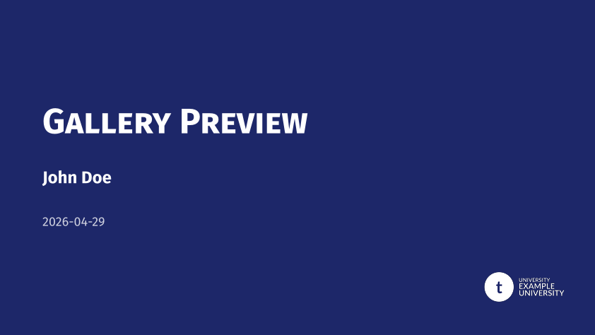 | 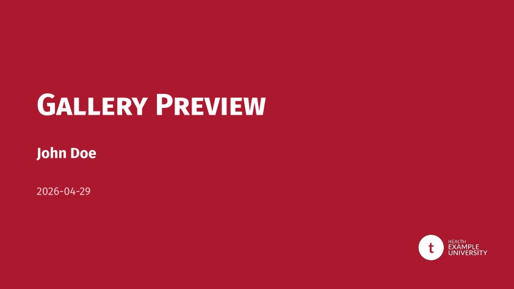 | 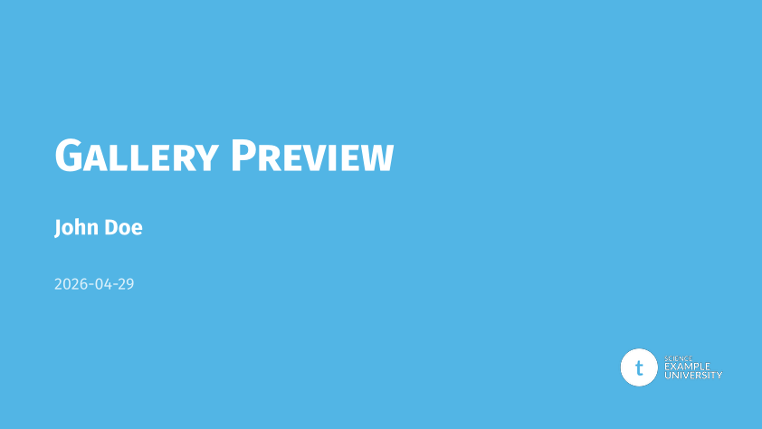 | 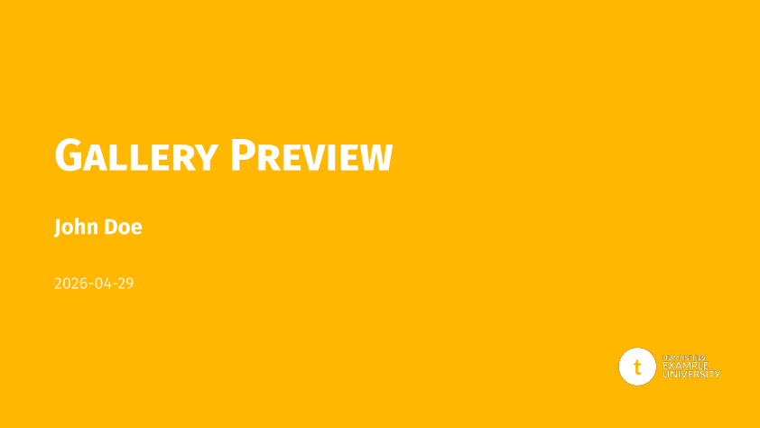 |
| **Dark** | 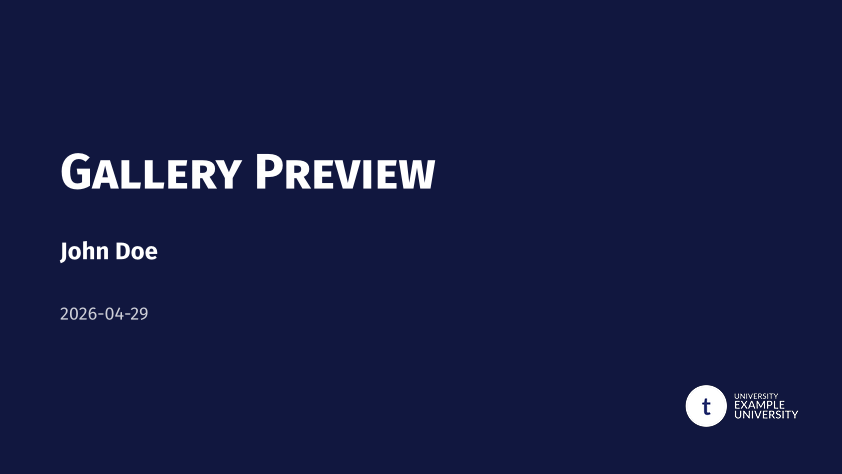 | 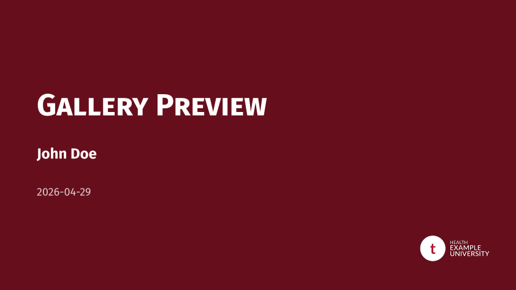 | 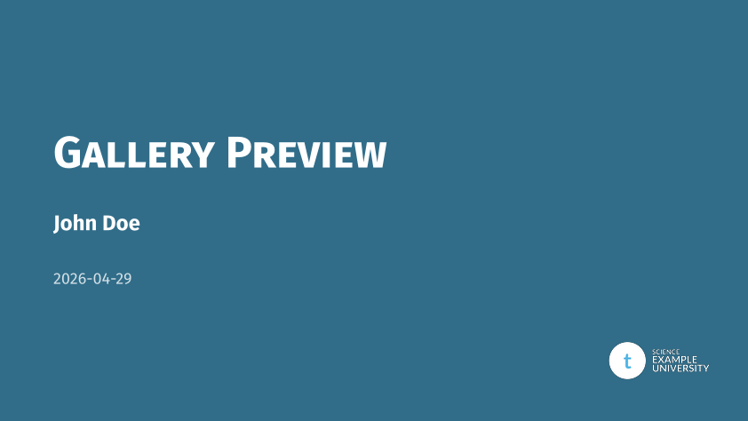 | 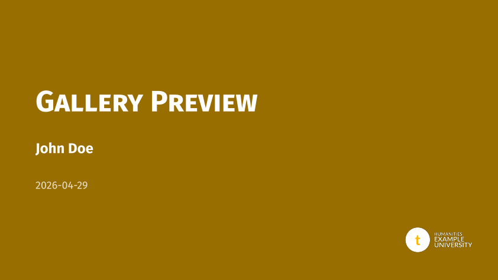 |

- `univ`: Sorbonne Blue (University-wide)
- `sante`: Sorbonne Red (Faculty of Health)
- `sciences`: Sorbonne Light Blue (Faculty of Science & Engineering)
- `lettres`: Sorbonne Yellow/Ocre (Faculty of Humanities)

---

## IPLESP Theme Presets

The IPLESP theme provides multiple color variants via the `theme` parameter. It features a modern header with a logo bar (Inserm, IPLESP, Sorbonne Health).

| Mode | Blue | Red | Green | Purple |
|:---:|:---:|:---:|:---:|:---:|
| **Light** | 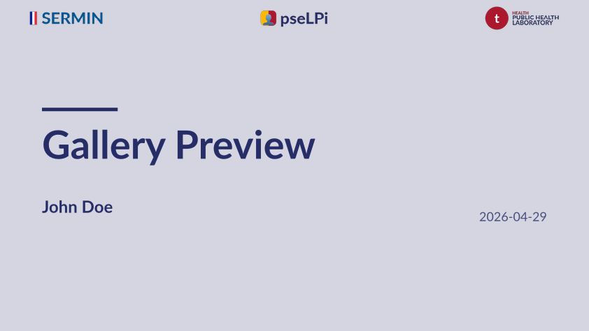 | 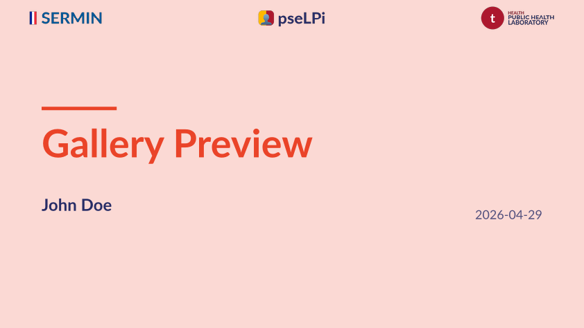 | 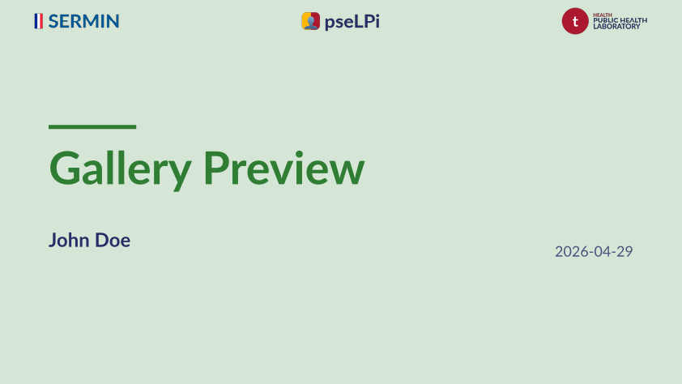 | 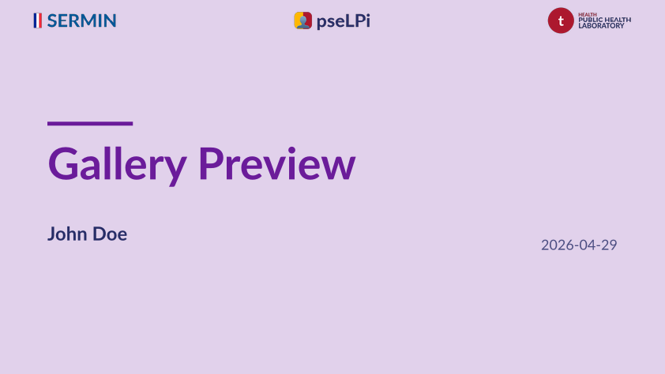 |
| **Dark** | 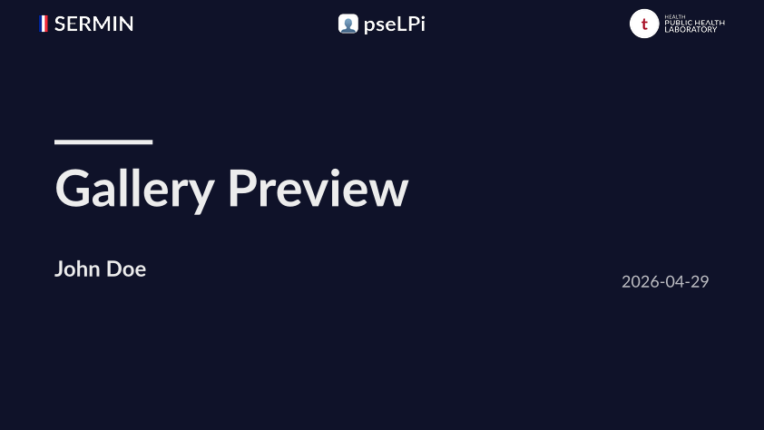 | 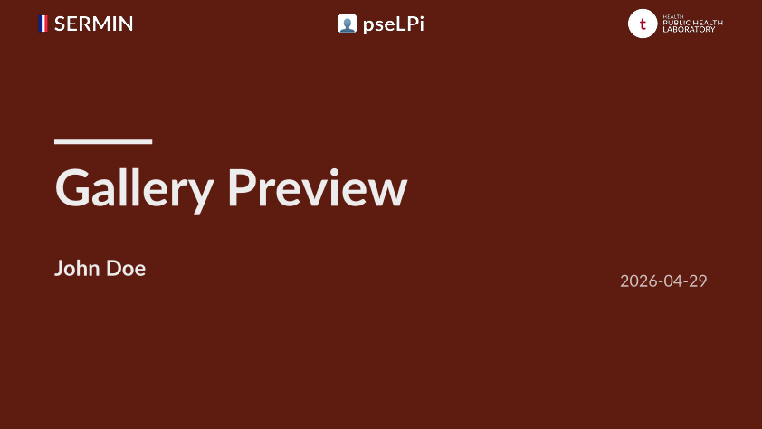 | 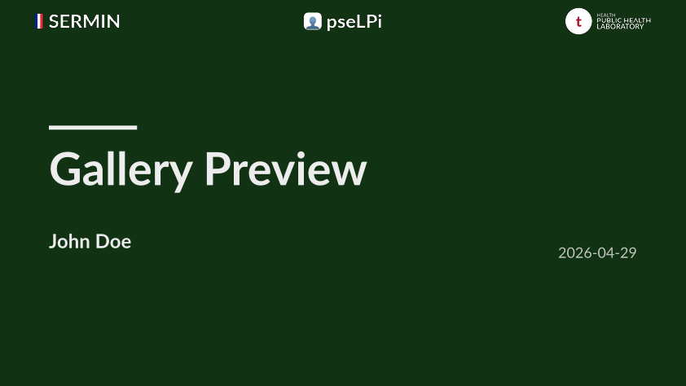 | 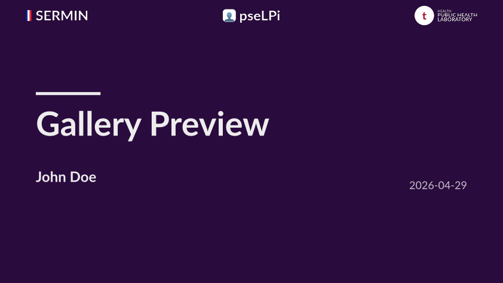 |

*Other available colors: `yellow`, `teal`, `orange`, `slate`.*

---

## Quick Start

### For Sorbonne University
```typ
#import "@preview/unofficial-sorbonne-presentation:0.4.0": sorbonne-template, slide

#show: sorbonne-template.with(
  title: [Academic Discovery],
  author: [John Doe],
  faculty: "sciences",
)

= Introduction
#slide[
  - High performance Typst engine
  #show: pause
  - Custom Sorbonne styling
]
```

### For IPLESP
```typ
#import "@preview/unofficial-sorbonne-presentation:0.4.0": iplesp-template, slide

#show: iplesp-template.with(
  title: [Epidemiological Study],
  author: [Jane Smith],
  theme: "teal",
)

= Methodology
#slide[
  Research conducted at Laboratory...
]
```

---

## Documentation & Demo

The [**`examples/demo.typ`**](examples/demo.typ) file serves as both a comprehensive feature gallery and a technical manual. Since it supports multiple themes and dark mode, you must compile it using the `--input` flag:

```bash
# Compile for Sorbonne (Light)
typst compile examples/demo.typ --input theme=sorbonne

# Compile for IPLESP (Dark)
typst compile examples/demo.typ --input theme=iplesp --input dark=true

# Compile Handout version (static slides + notes)
typst compile examples/demo.typ --input handout=true
```

Available inputs:
- `theme`: `"sorbonne"` (default) or `"iplesp"`.
- `dark`: `"true"` or `"false"` (default).
- `handout`: `"true"` or `"false"` (default).

---

## Logo Customization

You can easily replace the institutional logos with your own by using the following parameters.

### IPLESP Logo Slots
The IPLESP theme features a three-logo bar in the header. You can customize each slot individually:
- **`logo-left`** / **`logo-left-transition`**: Replaces the Inserm logo.
- **`logo-center`** / **`logo-center-transition`**: Replaces the IPLESP logo.
- **`logo-right`** / **`logo-right-transition`**: Replaces the Sorbonne Health logo.

If you provide **`logo-slide`**, it will override the entire three-logo bar with a single centered logo.

### `logo-transition` (Monochrome/White version)
Used on **solid theme-colored backgrounds**.
- **Sorbonne**: Title slide (bottom right), Transitions (top left), Focus & Ending slides.
- **IPLESP**: Title & Special slides (top right logo bar). Also used as fallback for `logo-left-transition`, etc.

### `logo-slide` (Color version)
Used on **standard slides** (white background).
- **Sorbonne**: Header next to title.
- **IPLESP**: Overrides the entire logo bar if provided. Otherwise, individual slots are used.

---

## Configuration Reference

### Common Parameters

| Parameter | Type | Default | Description |
|-----------|------|---------|-------------|
| `title` | content | `none` | Main presentation title |
| `short-title` | content | `none` | Short version for footer |
| `subtitle` | content | `none` | Optional subtitle |
| `author` | content | `none` | Presenter's name |
| `short-author` | content | `none` | Short version for footer |
| `affiliation` | content | `none` | Department or Laboratory |
| `date` | content | `datetime...` | Custom date display |
| `math-font` | string/none | (see below) | Custom math font (set to `none` for default serif) |
| `dark-mode` | bool | `false` | Enable dark theme for content slides |
| `handout` | bool | `false` | Disable animations and enable physical notes pages |
| `aspect-ratio` | string | `"16-9"` | `"16-9"` or `"4-3"` |
| `text-size` | length | `20pt` | Base text size |
| `show-outline` | bool | `false` | Toggle summary slide |
| `mapping` | dict | `(sec: 1, sub: 2)` | Logic mapping for headings |
| `progress-bar` | string | `"none"` | Position: `"none"`, `"top"`, or `"bottom"` |
| `progress-bar-height` | length | `2pt` | Height of the progress bar |
| `title-smallcaps` | bool | `true` | Apply smallcaps to slide header titles |
| `part-title` | content | `[Part]` | Label for part transition slides |
| `appendix-title` | content | `[Appendix]` | Label for individual appendix transition slides |
| `appendix-main-title` | content | `[Appendices]` | Title of the focus slide introducing appendices |
| `appendix-numbering-format` | string | `"I"` | Numbering style for appendices (e.g. `"A"`, `"I"`, `"1"`) |
| `equation-definitions-width` | ratio | `85%` | Width of the equation definitions block |
| `transition-roadmap-width` | ratio | `60%` | Width of the roadmap in section transition slides |

### Theme-Specific Parameters

- **Sorbonne (`sorbonne-template`)**:
  - `faculty`: `"univ"`, `"sante"`, `"sciences"`, `"lettres"`.
  - `text-font`: Default `"Fira Sans"`.
  - `math-font`: Default `"Fira Math"`.
- **IPLESP (`iplesp-template`)**:
  - `theme`: `"blue"`, `"red"`, `"yellow"`, `"green"`, `"teal"`, `"purple"`, `"orange"`, `"slate"`.
  - `text-font`: Default `"Lato"`.
  - `math-font`: Default `"Noto Sans Math"`.
  - `logo-left`, `logo-center`, `logo-right`: Individual logo slots for the header bar.
  - `logo-left-transition`, `logo-center-transition`, `logo-right-transition`: Monochrome versions for dark backgrounds.

---

## Component Reference

*Illustrated with Sorbonne Theme.*

### Slide Types
- `#slide(title: none, subtitle: none, allow-slide-breaks: false, background: none, body)`: Standard content slide.
  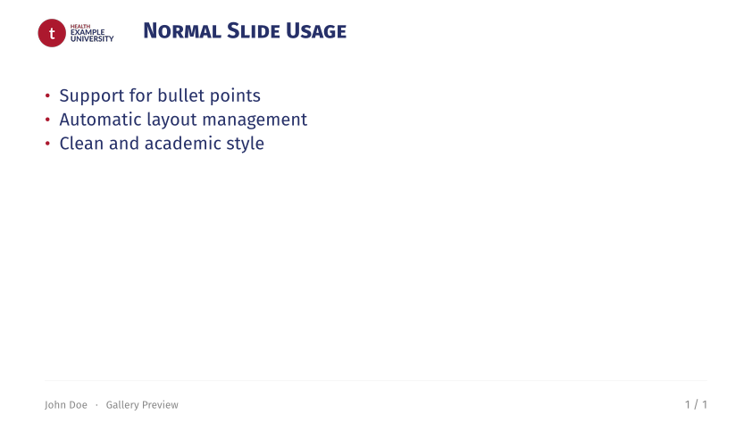
- `#focus-slide(body, subtitle: none)`: Highlight slide on solid theme background.
  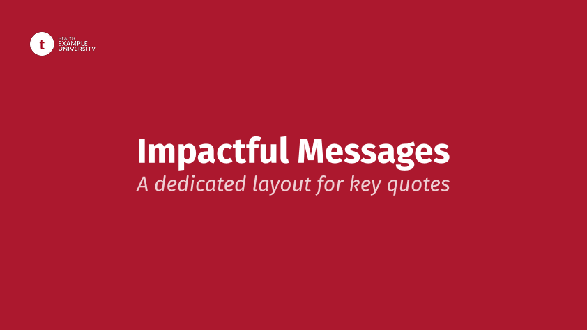
- `#figure-slide(fig, title: none, caption: none, ..)`: Centered figure slide.
  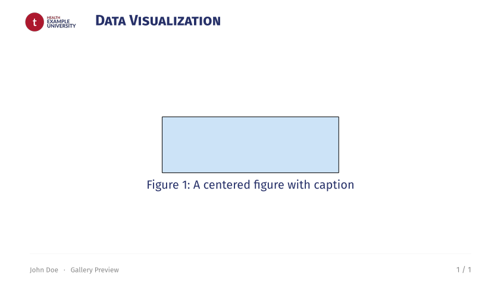
- `#equation-slide(equation, title: none, definitions: none, citation: none, ..)`: Large equation with "signature".
  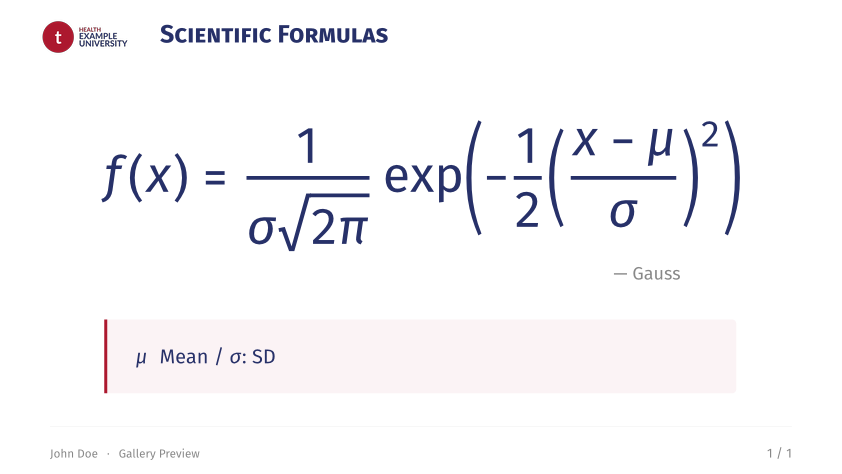
- `#acknowledgement-slide(people: (), institutions: (), ..)`: Thank-you slide.
  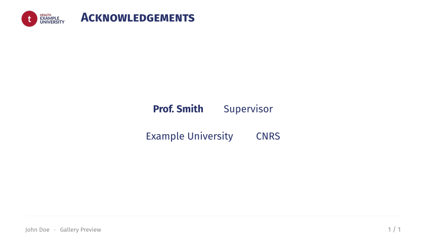
- `#ending-slide(title: none, subtitle: none, contact: ())`: Closing slide.
  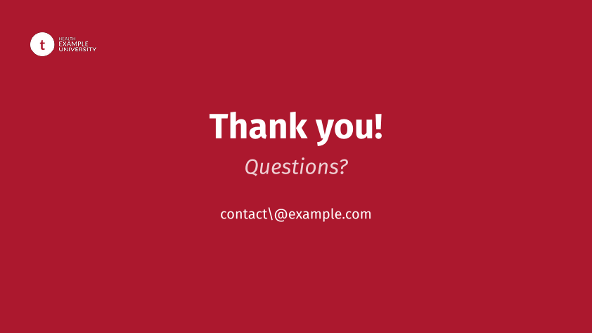

### Text Helpers
- `#alert[text]`: Highlighted bold text in primary color.
- `#muted[text]`: Gray secondary text.
- `#subtle[text]`: Light gray tertiary text.
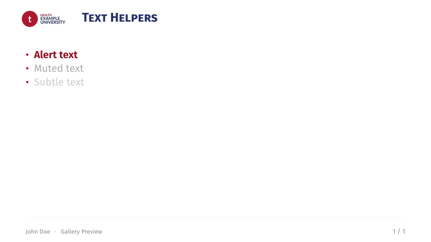

### Citations
- Inline and corner citations.
  `#cite-box("smith2023", position: "bottom-right")`
  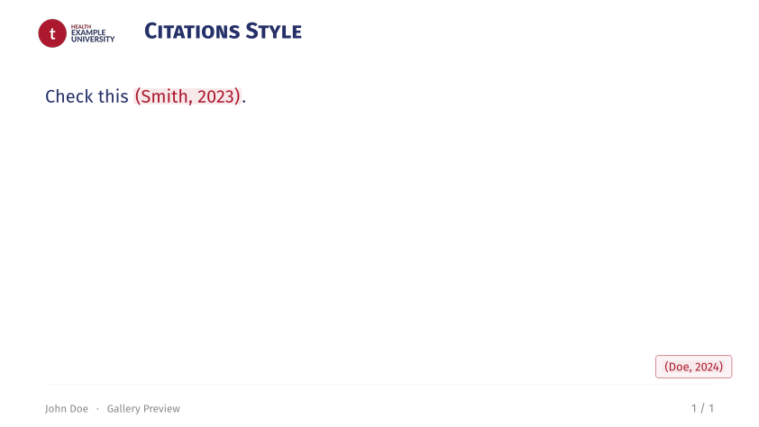

### Layout & Boxes
- `#two-col(left, right, columns: (1fr, 1fr))`: Balanced columns.
  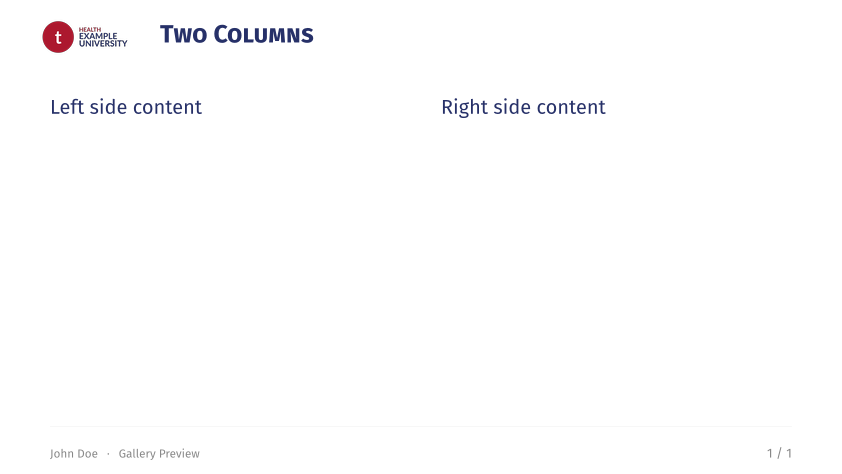
- `#three-col(left, center, right)`: Three column layout.
  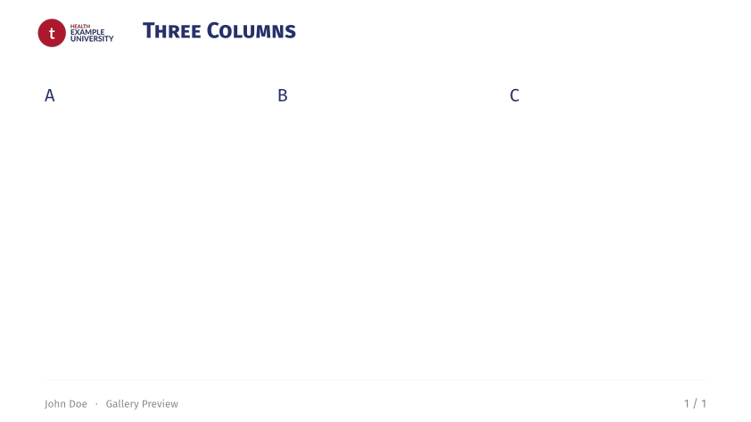
- `#grid-2x2(tl, tr, bl, br)`: Four-quadrant grid layout.
  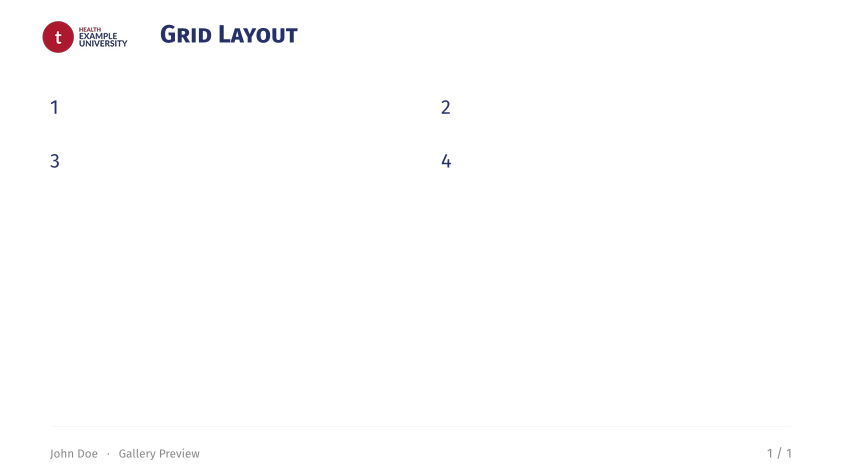
- **Boxes**: All boxes support the `fill-mode` parameter (`"outline"`, `"fill"`, `"full"`).
  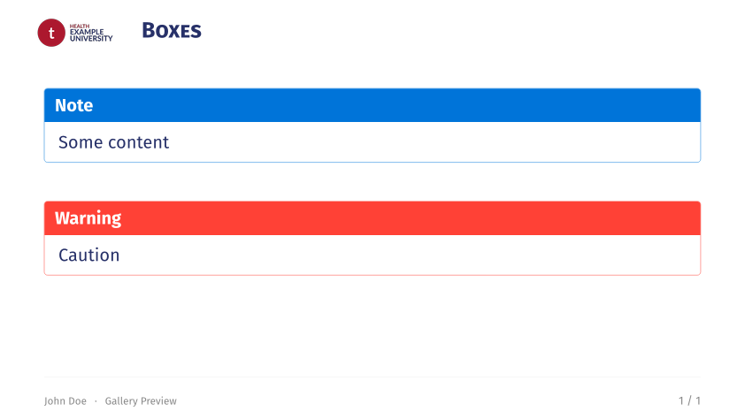
  - `#highlight-box(title, body)`: Blue university-styled box for key points.
  - `#alert-box(title, body)`: Red cautionary box for warnings.
  - `#example-box(title, body)`: Green academic box for examples.
  - `#algorithm-box(title, body)`: Monospace box for code/logic.
  - `#themed-block(title, body)`: Box automatically matching the theme color.

---

## Handout Mode & Notes

This package provides a dedicated **Handout Mode** (`handout: true`) designed for printing or distributing a static version of your presentation.

- **Animations Disabled**: All dynamic content (`pause`, `uncover`, `only`, etc.) is shown immediately on a single page per logical slide.
- **Physical Notes Pages**: When `handout` is enabled, any content provided via the `#note(body)` function will be rendered on a **new, dedicated page** following the corresponding slide. 

```typ
#slide(title: "My Slide")[
  Main content...
  
  #note[
    Additional details, references, or explanations 
    that should only appear in the handout version.
  ]
]
```

Multiple calls to `#note()` within the same slide will be concatenated, separated by a paragraph break.

---

## Credits

- **Underlying Packages**: Built with [presentate](https://typst.app/universe/package/presentate) and [navigator](https://typst.app/universe/package/navigator).
- **Inspiration**: Layout features were inspired by the [calmly-touying](https://typst.app/universe/package/calmly-touying) theme.

## Changelog

### v0.4.0

- **Breaking — appendix parameters renamed**: `annex-title`, `annex-main-title`, and `annex-numbering-format` are now `appendix-title`, `appendix-main-title`, and `appendix-numbering-format`, matching the public `appendix()` function. Default values changed from French (`[Annexe]`/`[Annexes]`) to English (`[Appendix]`/`[Appendices]`).
- **New parameter `title-smallcaps`** (default: `true`): Controls whether slide header titles are rendered in smallcaps. Set to `false` to preserve the original casing — useful for acronyms, proper nouns, or stylistic preference.
- **New parameter `part-title`** (default: `[Part]`): The label shown on part transition slides is now configurable. Previously hardcoded in French (`"Partie"`).
- **New parameter `progress-bar-height`** (default: `2pt`): Controls the height of the progress bar.
- **New parameter `equation-definitions-width`** (default: `85%`): Controls the width of the definitions block in `equation-slide`.
- **New parameter `transition-roadmap-width`** (default: `60%`): Controls the width of the roadmap block in section transition slides.
- **New parameter `code-font`** (default: `("Fira Code", "DejaVu Sans Mono")`): Specifies the monospace font used for code blocks and `#algorithm-box`. Can be overridden per-template call.
- **New parameter `font` in `algorithm-box`** (default: `none`, falls back to template `code-font`): Allows overriding the font for a specific algorithm box without changing the global template setting.
- **Automatic box title text color**: `#highlight-box`, `#alert-box`, `#example-box`, and `#themed-block` now automatically choose white or black title text based on the perceived luminance of the header background (ITU-R BT.601 coefficients), ensuring readability across all theme colors.
- **Bug fix — notes page titles**: When a slide title comes from a heading (i.e. no explicit `title:` argument to `#slide()`), the corresponding notes page in handout mode now displays the correct title instead of a blank one.
- **Bug fix — outline indentation**: The outline indentation is now computed relative to the mapping's minimum heading level, fixing misalignment when the mapping starts at a heading level greater than 1.
- **Bug fix — footer page counter**: The page number in the footer is now right-aligned without a fixed-width box, preventing clipping on high slide counts.
- **Internal — `resolve-current-slide-meta()`**: Slide metadata resolution is now centralised in a single helper used by both `base-header` and `base-footer`, eliminating duplicated query logic.

### v0.3.1
- **Math Font Customization**: Added `math-font` parameter to all templates.
- **Improved Math Rendering**: Fixed a bug where math fonts would fallback to serif when bold weight was requested (e.g. in `equation-slide`).
- **Standardized Defaults**: Sorbonne defaults to `Fira Math`, IPLESP defaults to `Noto Sans Math` for better visual consistency.

### v0.3.0
- **Native Handout Support**: Integrated `presentate`'s native handout mode.
- **Physical Notes**: Added `#note()` function to generate dedicated notes pages in handout mode. Successive calls to `#note()` are separated by paragraph breaks.
- **Outline Improvements**: 
  - Hidden page numbers and fill by default for a cleaner presentation look.
  - Automatic exclusion of appendix entries from the table of contents.

### v0.2.0
- **New template**: the IPLESP template was added, with the same features than the already available Sorbonne template
- **Dark mode**: all themes of all templates has a new dark-mode parameter

### v0.1.1
- **Fix**: Improved `max-length` option. It now automatically maps role names (`part`, `section`, `subsection`) to their corresponding heading levels for breadcrumb truncation.
- **Maintenance**: Minor internal optimizations.

## License

MIT License. See [LICENSE](LICENSE) for details.
