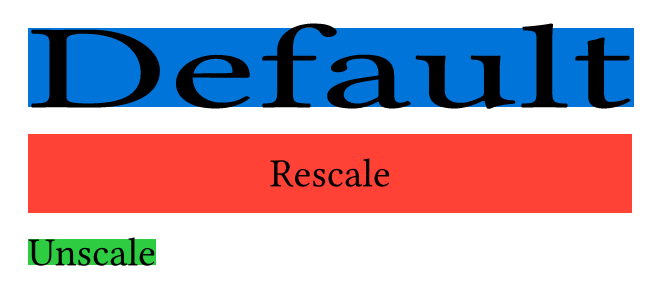
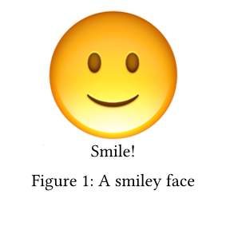

# Unscale

Unscale is a library for reversing scaling operations inside scale boxes.

Sometimes (particularly with diagrams) it is useful to be able to scale the entire object while avoiding scaling some internal element (such as text). This package helps with that.

## Examples
<!-- img width is set so the table gets evenly spaced by GitHubs css -->
### Basic Sample
<a href="gallery/basic.typ">
  
</a>

### Figure
<a href="gallery/figure.typ">
  
</a>

*Click on the example image to jump to the code.*

## Usage

The following code sets up your document to use this package:
```typst
#import "@preview/unscale:0.0.1": unscale, rescale, scale-rule

#show scale: scale-rule
```

You can then wrap whatever internal element you don't want to scale inside either `unscale` or `rescale`. These two functions are identical, except for their default values for the reflow argument. Choose between them depending on your desired effect.

This package is extremely simple and works by storing the `scale.x` and `scale.y` values in a state object, then reversing the scaling for the desired element.