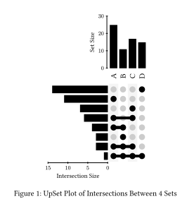

upsetter
========

upsetter is a package for rendering [UpSet plots](https://upset.app),
a way for visualizing intersections between many (> 3) sets.

## Features

 - Customizable orientation (vertical or horizontal)
 - Custom set labels
 - Multi-level sorting of intersections

## Usage

Here's an example of how to use this package:

```typ
#import "@preview/cetz:0.4.2"
#import "@preview/upsetter:0.1.0": plot as upset-plot

#context {
  let plot = upset-plot(
    width: 5,
    orientation: "v",
    (
      "A": 11,
      "B": 3,
      "C": 7,
      "D": 14,
      "A+B": 4,
      "A+C": 6,
      "A+B+C": 3,
      "A+B+C+D": 1
    )
  )

  figure(
    cetz.canvas(plot) + v(1em),
    caption: [UpSet Plot of Intersections Between 4 Sets]
  )
}
```

The code shown above will generate the following plot:

<div align="center">
  
</div>

For a description of all options available, you can read
the [manual](manual.pdf).
