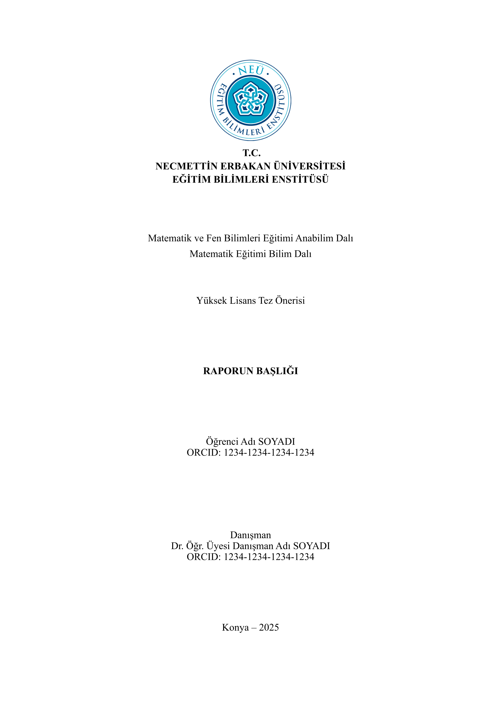
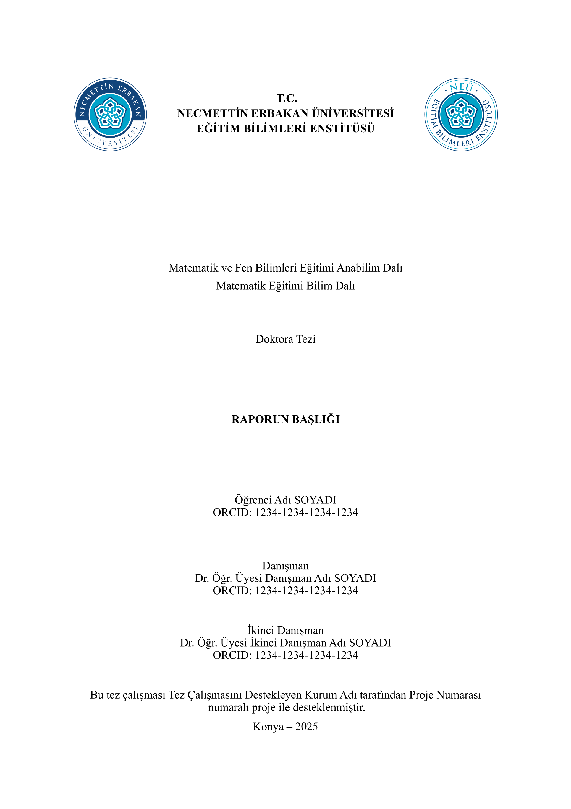
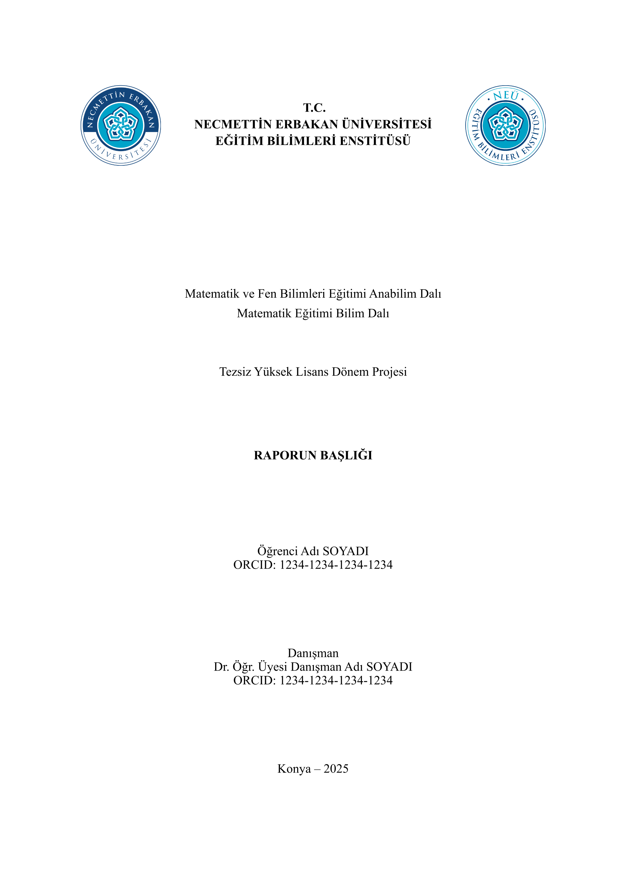
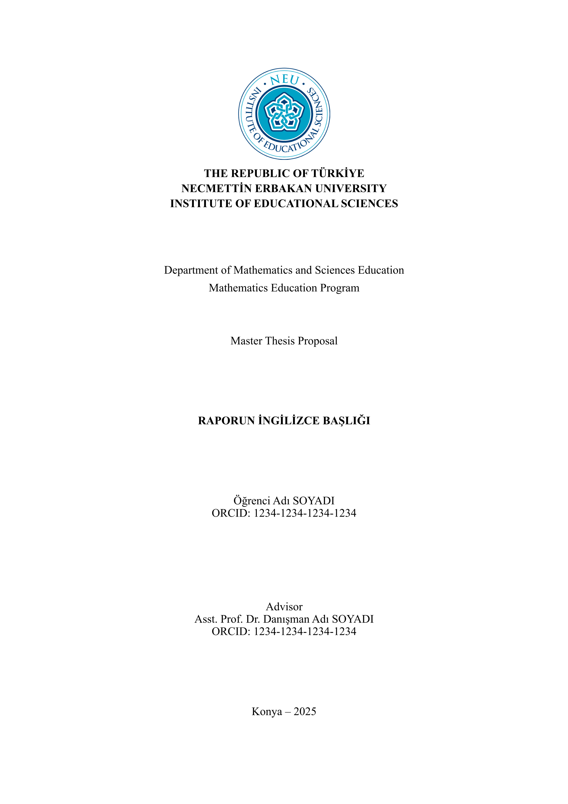
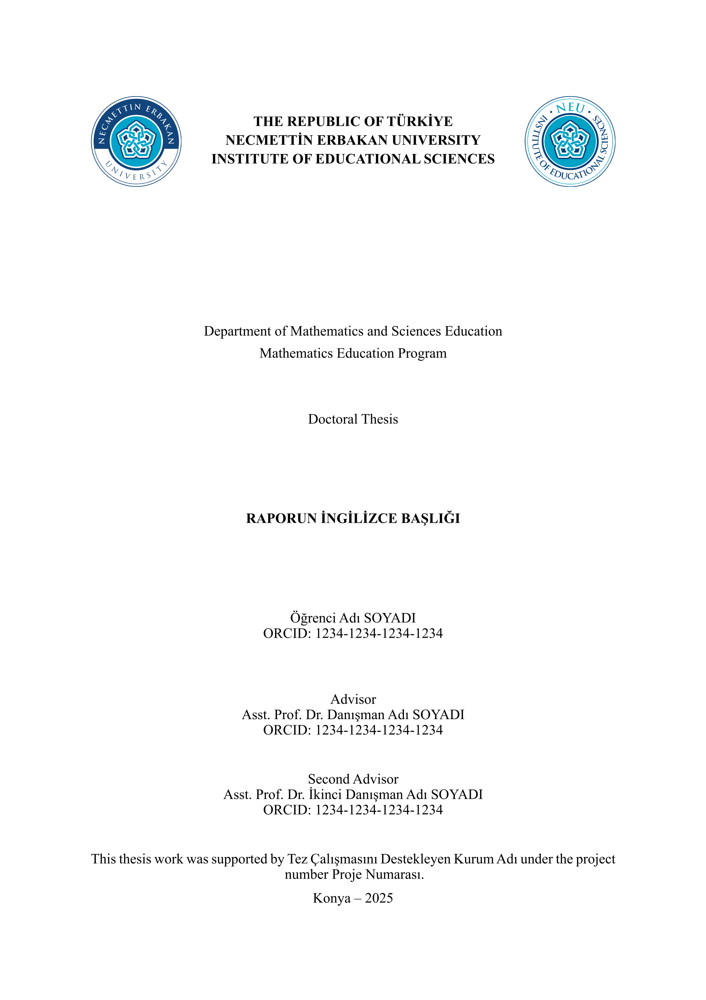
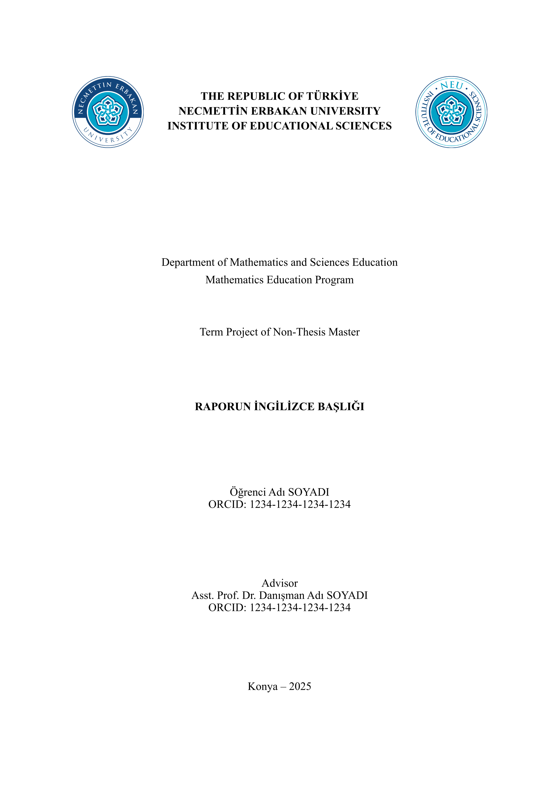

# utype-neuies-reports
[Necmettin Erbakan Üniversitesi Eğitim Bilimleri Enstitüsü](https://erbakan.edu.tr/tr/birim/egitim-bilimleri-enstitusu) lisansüstü eğitim için **RESMÎ OLMAYAN** tez önerisi, tez ve dönem projesi şablonudur. [**UNOFFICIAL** thesis proposal, thesis and term project template for graduate education at [Necmettin Erbakan University Institute of Educational Sciences](https://erbakan.edu.tr/tr/birim/egitim-bilimleri-enstitusu).]

## İçindekiler [Table of Contents]
<details>
  <summary>İçindekileri göstermek/gizlemek için tıklayınız [Click to show/hide the Table of Contents]</summary>

- [utype-neuies-reports](#utype-neuies-reports)
  - [İçindekiler \[Table of Contents\]](#i̇çindekiler-table-of-contents)
  - [Resmî Şablon Hakkında \[About the Official Template\]](#resmî-şablon-hakkında-about-the-official-template)
  - [Ön İzleme Görselleri \[Thumbnails\]](#ön-i̇zleme-görselleri-thumbnails)
    - [Türkçe \[Turkish\]](#türkçe-turkish)
    - [İngilizce \[English\]](#i̇ngilizce-english)
  - [Örnek Çıktılar \[Sample Outputs\]](#örnek-çıktılar-sample-outputs)
    - [Türkçe \[Turkish\]](#türkçe-turkish-1)
    - [İngilizce \[English\]](#i̇ngilizce-english-1)
  - [Türkçe \[Turkish\]](#türkçe-turkish-2)
    - [Teşekkür](#teşekkür)
    - [Kullanılan Paketler](#kullanılan-paketler)
    - [Özellikler](#özellikler)
    - [Kullanım](#kullanım)
      - [Kullanmaya Başlamak](#kullanmaya-başlamak)
      - [Şablon Yapısı](#şablon-yapısı)
      - [Yazı Tipi Hakkında Bilgilendirme](#yazı-tipi-hakkında-bilgilendirme)
      - [Alternatiflere sahip başlıklardaki alternatiflerden birini seçmek.](#alternatiflere-sahip-başlıklardaki-alternatiflerden-birini-seçmek)
    - [Kurulum](#kurulum)
      - [Gerekli Yazılımlar](#gerekli-yazılımlar)
      - [Çevrim İçi](#çevrim-i̇çi)
        - [Şablonu Typst.app Web Sitesinden Kullanmak](#şablonu-typstapp-web-sitesinden-kullanmak)
        - [Şablonu Tinymist Typst Visual Studio Code Uzantısıyla Kullanmak](#şablonu-tinymist-typst-visual-studio-code-uzantısıyla-kullanmak)
      - [Çevrim Dışı](#çevrim-dışı)
  - [İngilizce \[English\]](#i̇ngilizce-english-2)
    - [Acknowledgement](#acknowledgement)
    - [Packages Used](#packages-used)
    - [Features](#features)
    - [Usage](#usage)
      - [Getting Started](#getting-started)
      - [Template Structure](#template-structure)
      - [Information About Font](#information-about-font)
      - [Selecting one of the alternatives in headings with alternatives](#selecting-one-of-the-alternatives-in-headings-with-alternatives)
    - [Installation](#installation)
      - [Required Softwares](#required-softwares)
      - [Online](#online)
        - [Using the Template from the Typst.app Website](#using-the-template-from-the-typstapp-website)
        - [Using the Template with the Tinymist Typst Visual Studio Code Extension](#using-the-template-with-the-tinymist-typst-visual-studio-code-extension)
      - [Offline](#offline)

</details>

## Resmî Şablon Hakkında [About the Official Template]
Necmettin Erbakan Üniversitesi Eğitim Bilimleri Enstitüsü lisansüstü eğitim için **RESMÎ** tez önerisi, tez ve dönem projesi şablonları [Typst](https://typst.app/home/) ve [LaTeX](https://www.latex-project.org/) formatında bulunmamakta olup yalnızca "docx" uzantılı [Microsoft Word](https://www.microsoft.com/tr-tr/microsoft-365/word) şablonları bulunmaktadır. [Necmettin Erbakan University Institute of Educational Sciences does not have **OFFICIAL** thesis proposal, thesis and term project templates for graduate education in [Typst](https://typst.app/home/) and [LaTeX](https://www.latex-project.org/) format and only [Microsoft Word](https://www.microsoft.com/tr-tr/microsoft-365/word) templates with “docx” extension are available.]

Resmî kılavuz ve şablonlar aşağıdaki verilen bağlantılarda yer almaktadır: [Official guidelines and templates are available at the links provided below:]
- [Necmettin Erbakan Üniversitesi Eğitim Bilimleri Enstitüsü Tezli Yüksek Lisans için Kılavuz ve Şablonlar [Necmettin Erbakan University Institute of Educational Sciences Guidelines and Templates for Master's Degree with Thesis]](https://erbakan.edu.tr/tr/birim/egitim-bilimleri-enstitusu/sayfa/tezli-yuksek-lisans-kilavuzlari-ve-sablonlari)
- [Necmettin Erbakan Üniversitesi Eğitim Bilimleri Enstitüsü Doktora için Kılavuz ve Şablonlar [Necmettin Erbakan University Institute of Educational Sciences Guidelines and Templates for Doctorate (PhD)]](https://erbakan.edu.tr/tr/birim/egitim-bilimleri-enstitusu/sayfa/doktora-programi-kilavuz-ve-sablonlari)
- [Necmettin Erbakan Üniversitesi Eğitim Bilimleri Enstitüsü II. Öğretim Tezsiz Yüksek Lisans için Kılavuz ve Şablonlar [Necmettin Erbakan University Institute of Educational Sciences Guidelines and Templates for Evening Education Non-Thesis Master's Degree]](https://erbakan.edu.tr/tr/birim/egitim-bilimleri-enstitusu/sayfa/ii-ogretim-tezsiz-yuksek-lisans-kilavuz-ve-sablonlari)

## Ön İzleme Görselleri [Thumbnails]

### Türkçe [Turkish]
<p align="center">
    &nbsp;
    &nbsp;
    &nbsp;
</p>

### İngilizce [English]
<p align="center">
    &nbsp;
    &nbsp;
    &nbsp;
</p>

## Örnek Çıktılar [Sample Outputs]

### Türkçe [Turkish]
- [Tez Önerisi Örnek Çıktı](assets/sample-outputs/turkish/main_tez-onerisi-ornek-cikti.pdf)
- [Tez Örnek Çıktı](assets/sample-outputs/turkish/main_tez-ornek-cikti.pdf)
- [Dönem Projesi Örnek Çıktı](assets/sample-outputs/turkish/main_donem-projesi-ornek-cikti.pdf)

### İngilizce [English]
- [Thesis Proposal Sample Output](assets/sample-outputs/english/main_thesis-proposal-sample-output.pdf)
- [Thesis Sample Output](assets/sample-outputs/english/main_thesis-sample-output.pdf)
- [Term Project Sample Output](assets/sample-outputs/english/main_term-project-sample-output.pdf)

## Türkçe [Turkish]

### Teşekkür
Bu proje yazılmadan önce ve sonrasında aşağıdaki projeler incelenerek bazı durumlarda fikir almak için yararlanılmıştır:
- [typst-thesis-template](https://github.com/mrtz-j/typst-thesis-template): Moritz Jörg <@mrtz-j> ve Ole Tytlandsvik <@otytlandsvik>. ([Typst Universe Bağlantısı](https://typst.app/universe/package/modern-uit-thesis))
- [parcio-typst](https://github.com/xkevio/parcio-typst): Kevin Kulot <@xkevio>. ([Typst Universe Bağlantısı](https://typst.app/universe/package/parcio-thesis))
- [aiaa-typst](https://github.com/isaacew/aiaa-typst): <@isaacew> ve Alexander Von Moll <@avonmoll>. ([Typst Universe Bağlantısı](https://typst.app/universe/package/bamdone-aiaa))
- [ThesIST](https://github.com/tfachada/thesist): Tomás Fachada <@tfachada> ve ThesIST katkıda bulunanlar. ([Typst Universe Bağlantısı](https://typst.app/universe/package/thesist))

Bu projelerde emeği geçen herkese çok büyük teşekkürlerimi sunarım.

Ve ayrıca [Typst YouTube Oynatma Listesi](https://youtube.com/playlist?list=PLCO-MGSsHcdArXIfeOGoUwjH0oz8vMr8M&si=c_kTmN4FKmwdMitE) için <@isaacew>'e büyük teşekkürlerimi sunarım.

### Kullanılan Paketler
- Çoklu dil desteği sağlamak için. -> [Linguify](https://github.com/typst-community/linguify): <@jomaway>, <@SillyFreak> ve katkıda bulunanlar. ([Typst Universe Bağlantısı](https://typst.app/universe/package/linguify/))

Bu projelerde emeği geçen herkese çok büyük teşekkürlerimi sunarım.

### Özellikler
- [x] Tek şablonda tez, tez önerisi ve dönem projesi yazılabilir. Örneğin, tez önerinizi bitirdikten sonra bunun koddaki şablon ayarları kısmını (`#show: template-configurations.with(...)`) yorum satırı yaparak pasif hale getirdikten sonra tez için yeni bir şablon ayarı oluşturarak tezinizi yazmaya devam edebilirsiniz. Böylece, tek projede hem tez önerinizi hem de tezinizi yazabilir ve istediğiniz zaman istediğiniz çıktıyı elde edebilirsiniz.
- [x] ~%99 oranında otomatik olarak şablon kurallarına uygun olarak içeriği düzenler. Otomatik olarak henüz yapılamayan bazı durumlar aşağıdaki gibidir:
  - [ ] Şekillerin içerisinde alt şekillerin koyulması. Bu özellik için gerekli altyapının sağlanması beklenmektedir. Bunu yapmak için şimdilik [subpar](https://typst.app/universe/package/subpar) Typst Universe paketi kullanılabilir.
  - [ ] Tablo başlıkları otomatik olarak tekrar edememekte ve tekrar eden başlıkların ana başlıktan farklı olamamaktadır. Figür başlıklarının tekrar etmesi ve tekrar eden başlıkların ana başlıktan farklı olmasını sağlayacak özellikler gelene kadar tablolar bölünemez şeklinde kalmalıdır. Bu özellik için gerekli altyapının sağlanması beklenmektedir. Bunu yapmak için, şimdilik özel fonksiyon oluşturulabilir (Bakınız: https://github.com/typst/typst/issues/5057#issuecomment-2399903391).
  - [ ] Tabloların başlık satırlarının koyu yazılması sadece tablonun ilk satırı için otomatik olarak olmaktadır. Eğer tablonun başlık kısmı iki ya da daha fazla satırdan oluşuyorsa bu satırların içeriği elle (manuel) olarak koyu yazılması gerekmektedir. İleriki Typst sürümlerinde bunun otomatik olarak yapılması için gerekli altyapının sağlanması beklenmektedir.
  - [ ] Tabloların başlık kısmının üstündeki ve altındaki kenarlıklar otomatik olarak koyulmaktadır. Eğer tablonun başlık kısmı iki ya da daha fazla satırdan oluşuyorsa bu satırların arasındaki kenarlıkların elle (manuel) olarak koyulması gerekmektedir. İleriki Typst sürümlerinde bunun otomatik olarak yapılması için gerekli altyapının sağlanması beklenmektedir.
  - [ ] Tablonun açıklamasının yer aldığı son satırın genişliğinin yani kaç sütunun birleşimi kadar olacağını elle (manuel) olarak belirtmek gerekmektedir. İleriki Typst sürümlerinde bunun otomatik olarak yapılması için gerekli altyapının sağlanması beklenmektedir.
  - [ ] Tablonun açıklamasının yer aldığı son satırın altındaki kenarlığın elle (manuel) olarak kaldırılması gerekmektedir. İleriki Typst sürümlerinde bunun otomatik olarak yapılması için gerekli altyapının sağlanması beklenmektedir.
  - [ ] Tablonun açıklamasının yer aldığı son satırın içeriğinin sola hizalanmasını elle (manuel) olarak belirtmek gerekmektedir. İleriki Typst sürümlerinde bunun otomatik olarak yapılması için gerekli altyapının sağlanması beklenmektedir.
- [x] Tablo, şekil ve kod figürlerinin otomatik olarak numaralandırılması sağlanmaktadır. Araya yeni bir figür eklendiğinde numaralandırma otomatik olarak güncellenmektedir. Aynı şekilde, bu figürlere metin içinde yapılan atıflardaki numaralandırmalar da otomatik olarak güncellenmektedir.
- [x] Çoklu dil desteği (Türkçe ve İngilizce) vardır.
- [x] Açılır liste mantığında tanımlanmış bilgiler içerisinden seçim yapılabilmesi sağlanarak hata yapılması ihtimalini azaltmak.

### Kullanım

#### Kullanmaya Başlamak
Öncelikle, şablonu projeniz için içe aktarınız. Daha sonra, şablon ayarlarını giriniz.

**NOT:** Şablonu [Kurulum](#kurulum) başlığında bahsedildiği gibi kullandığınızda bu kısım otomatik olarak mevcut olacaktır. Sadece şablon ayarlarındaki bilgileri projenize göre güncellemeniz yeterlidir. Şablon ayarlarında yer alan parametrelerin değerlerinin nasıl girileceğiyle ilgili açıklamalar ilgili parametrenin bir üstündeki satırda yorum satırı olarak yer almaktadır.

<details>
  <summary>Kodu göstermek/gizlemek için tıklayınız</summary>

  ```typst
  // Şablonu, Kurulum başlığında bahsedilden durumlardan size uygun olana göre içe aktarınız:
  #import "@preview/utype-neuies-reports:1.0.0": (
    template-configurations,
    LANGUAGES,
    REPORT-TYPES,
    DEPARTMENTS,
    PROGRAMS,
    ACADEMIC-MEMBER-TITLES,
  )
  // NOT: Yukarıdaki durumlarda olduğu gibi içe aktarılan değişkenleri tek tek belirtmek yerine `#import "@preview/utype-neuies-reports:1.0.0": *` şeklinde tüm değişkenleri içe aktararak da yapabilirsiniz.

  // Şablon ayarlarını giriniz.
  #show: template-configurations.with(
    ...
  )
  ```

</details>

#### Şablon Yapısı

Aşağıdaki şemada şablon yapısını yer almaktadır. Burada, şablondaki klasör ve dosyaların hiyerarşik biçimde görebilirsiniz.

<details>
  <summary>Şemayı göstermek/gizlemek için tıklayınız</summary>

  ```
  template/                                                       <-- Şablon klasörü
  ├── assets/                                                     <-- Varlık dosyaları
  │   ├── bibliography-sources/                                   <-- Kaynakça kaynakları
  │   │   └── references.bib
  │   ├── csv-files/                                              <-- CSV veri dosyaları
  │   │   └── csv-table-data.csv
  │   ├── examples/                                               <-- Örnek dosyalar
  │   │   ├── code-figure-example.typ
  │   │   ├── image-figure-example.typ
  │   │   ├── math-equation-example.typ
  │   │   ├── quotation-example.typ
  │   │   ├── table-figure-example.typ
  │   │   └── table-figure-from-csv-example.typ
  │   ├── images/                                                 <-- Görsel dosyaları
  │   │   └── sample-image.png
  │   └── languages/                                              <-- Dil yapılandırması
  │       ├── english.toml
  │       └── turkish.toml
  └── sections/                                                   <-- Rapor bölümleri
      ├── 01-front/                                               <-- Ön kısım
      │   ├── abbreviations-text.typ
      │   ├── abstract-text-eng.typ
      │   ├── abstract-text-tur.typ
      │   ├── preface-text.typ
      │   └── symbols-text.typ
      ├── 02-main/                                                <-- Ana kısım
      │   ├── 01-introduction/                                    <-- Giriş alt kısmı
      │   │   ├── assumptions-text.typ
      │   │   ├── definitions-text.typ
      │   │   ├── introduction-text.typ
      │   │   ├── limitations-text.typ
      │   │   ├── statement-of-the-problem-text.typ
      │   │   └── the-purpose-of-the-study-text.typ
      │   ├── 02-literature-review/                               <-- Alan Yazın (İlgili Literatür) alt kısmı
      │   │   └── literature-review-text.typ
      │   ├── 03-methodology/                                     <-- Yöntem alt kısmı
      │   │   ├── data-analysis-text.typ
      │   │   ├── data-collection-process-text.typ
      │   │   ├── data-collection-tools-text.typ
      │   │   ├── methodology-text.typ
      │   │   ├── research-populations-and-sample-text.typ
      │   │   └── research-method-text.typ
      │   ├── 04-findings/                                        <-- Bulgular alt kısmı
      │   │   └── findings-text.typ
      │   └── 05-discussion-conclusion-and-suggestions/           <-- Tartışma, Sonuç ve Öneriler alt kısmı
      │   │   ├── conclusion-text.typ
      │   │   ├── discussion-conclusion-and-suggestions-text.typ
      │   │   ├── discussion-text.typ
      │   │   └── suggestions-text.typ
      └── 03-back/                                                <-- Arka kısım
          ├── expanded-turkish-abstract-text.typ                  <-- Genişletilmiş Türkçe Özet alt kısmı
          └── appendices/                                         <-- Ekler alt kısmı
              ├── appendices-text.typ
              ├── appendix-1-text.typ
              └── appendix-2-text.typ
  └── main.typ                                                    <-- Şablondan oluşturmaya başlama dosyası
  ```

</details>

#### Yazı Tipi Hakkında Bilgilendirme
Resmî şablonlarda metin için 'Times New Roman' ve matematiksel denklemler için 'Cambria Math' yazı tipi kullanılmaktadır. Bu yazı tipleri kapalı kaynak ve kişisel ve ticari kullanımları ücretli olup lisans satın alınması gerekmektedir. Bu yazı tipleri Windows ve Office 365 ile birlikte yüklü olarak gelir. Bu lisans durumundan dolayı [Typst.app](https://typst.app/) üzerinde yüklü olarak gelememektedir. 

Bu sorunu çözmek için, bahsedilen yazı tiplerinin neredeyse bire bir aynısı olan [TeX Gyre Termes](https://www.gust.org.pl/projects/e-foundry/tex-gyre/termes) ve [TeX Gyre Termes Math](https://www.gust.org.pl/projects/e-foundry/tg-math) yazı tipleri bahsedilen yazı tipleri mevcut olmadığında otomatik olarak kullanılacak şekilde ayarlanmıştır. [TeX Gyre Termes](https://www.gust.org.pl/projects/e-foundry/tex-gyre/termes) ve [TeX Gyre Termes Math](https://www.gust.org.pl/projects/e-foundry/tg-math) yazı tipleri [GUST yazı tipi lisansı (GFL)](https://www.gust.org.pl/projects/e-foundry/licenses/GUST-FONT-LICENSE.txt/view) altında lisanslanmış olup açık kaynak ve kişisel ve ticari kullanım için ücretsiz olduğundan [Typst.app](https://typst.app/) üzerinde yüklü olarak gelmektedir. Bu yüzden, şablonu [Typst.app](https://typst.app/) üzerinden kullananların bir şey yapmasına gerek yoktur. Ancak, **önerilmemekle birlikte**, yine de 'Times New Roman' ve 'Cambria Math' yazı tipini kullanmak istiyor ve **yasal olarak kullanma hakkına sahipseniz** ilgili yazı tiplerinin statik yazı tipi dosyalarını `/template/assets/fonts/times-new-roman/` ve `/template/assets/fonts/cambria-math/` klasörlerine yükleyebilirsiniz. Bunu yaptığınızda [Typst.app](https://typst.app/) otomatik olarak yazı tiplerini algılayacaktır (Bakınız: https://typst.app/docs/reference/text/text/#parameters-font).

Şablonu [Tinymist Typst](https://marketplace.visualstudio.com/items?itemName=myriad-dreamin.tinymist) ile kullananlar için, eğer 'Times New Roman' ve 'Cambria Math' bilgisayarınızda yüklü değilse [adresinde](https://erbakan.edu.tr/tr/birim/buyuk-veri-koordinatorlugu/sayfa/lisansli-yazilimlar) anlatıldığı gibi Microsoft Office 365 yazılımı yüklenerek bu yazı tiplerinin bilgisayarınıza yüklenmesi sağlanabilir. Alternatif olarak yukarıda bahsedilen [TeX Gyre Termes](https://www.gust.org.pl/projects/e-foundry/tex-gyre/termes) ve [TeX Gyre Termes Math](https://www.gust.org.pl/projects/e-foundry/tg-math) yazı tipleri de resmî web sitelerinden indirilip indirilen dosyaya farenin sol tuşuyla çift tıklandıktan sonra açılan pencerede 'Yükle' butonuna tıklanarak yüklenebilir.

#### Alternatiflere sahip başlıklardaki alternatiflerden birini seçmek.
Türkçe dilindeki başlıklar için `/template/assets/languages/turkish.toml`, İngilizce dilindeki başlıklar için `/template/assets/languages/english.toml` dosyasını açınız. Ardından, kullanmak istediğiniz başlık dışındaki başlıkları siliniz.

Örneğin, `/template/assets/languages/turkish.toml` dosyasında şu şekilde bir değişiklik yapılarak istenen başlık seçilebilir:

<details>
  <summary>Kodu göstermek/gizlemek için tıklayınız</summary>

```toml
[translations]
# Başlıklardan sadece birini kullanmak için parantez içinde olmayan ya da parantez içindeki ifadelerden birini seçip diğerlerini siliniz.
# Seçmeden önce:
#PREFACE = "ÖN SÖZ (TEŞEKKÜR)"
# Seçtikten sonra:
PREFACE = "ÖN SÖZ"
```

</details>

### Kurulum

#### Gerekli Yazılımlar
- [Typst.app](https://typst.app/): Typst'ın resmi kod düzenleyicisidir.

    YA DA

- [Visual Studio Code](https://code.visualstudio.com/): Typst kodlarını yazmak için kullanılabilen bir kod düzenleyicisidir.
- [Tinymist Typst Visual Studio Code Uzantısı](https://marketplace.visualstudio.com/items?itemName=myriad-dreamin.tinymist): Typst kodlarını yazarken yardımcı olan, eş zamanlı olarak çıktıyı görüntüleme imkânı sağlayan ve çıktıyı desteklenen formatlarda oluşturabilen bir uzantıdır.

#### Çevrim İçi

##### Şablonu [Typst.app](https://typst.app/) Web Sitesinden Kullanmak
Bu durumda internete her zaman bağlı olmanız gerekmektedir.

##### Şablonu [Tinymist Typst](https://marketplace.visualstudio.com/items?itemName=myriad-dreamin.tinymist) [Visual Studio Code](https://code.visualstudio.com/) Uzantısıyla Kullanmak
Bu durumda, ilk defa şablonu indirirken internete ihtiyaç vardır. İlk indirme işleminden sonra internete bağlı olmadan kullanılabilir ve şablonun farklı bir sürümünü indirmek veya yeni bir sürümüne geçmek istediğinizde anlık olarak internete ihtiyaç vardır. Sonrasında internete bağlı olmadan kullanmaya devam edilebilir.

Şablonu yukarıda bahsedilen araçlarla çevrim içi kullanmak için aşağıdaki gibi içe aktarma yapabilirsiniz:

**NOT:** [Tinymist Typst](https://marketplace.visualstudio.com/items?itemName=myriad-dreamin.tinymist) uzantısının 'Template Gallery'si üzerinden bir şablonu seçerek proje oluşturduğunuzda bu şekilde içe aktarma yapabilirsiniz.

<details>
  <summary>Kodu göstermek/gizlemek için tıklayınız</summary>

  ```typst
  #import "@preview/utype-neuies-reports:1.0.0": (
    template-configurations,
    LANGUAGES,
    REPORT-TYPES,
    DEPARTMENTS,
    PROGRAMS,
    ACADEMIC-MEMBER-TITLES,
  )
  // NOT: Yukarıdaki durumlarda olduğu gibi içe aktarılan değişkenleri tek tek belirtmek yerine `#import "@preview/utype-neuies-reports:1.0.0": *` şeklinde tüm değişkenleri içe aktararak da yapabilirsiniz.
  ```

</details>

#### Çevrim Dışı
Şablonu çevrim dışı kullanmak için [Tinymist Typst](https://marketplace.visualstudio.com/items?itemName=myriad-dreamin.tinymist) [Visual Studio Code](https://code.visualstudio.com/) uzantısını kullanabilirsiniz.

Şablonu [adresindeki](https://github.com/typst/packages/?tab=readme-ov-file#local-packages) bahsedilen konuma indirerek kullanıyorsanız aşağıdaki gibi içe aktarma yapabilirsiniz:

<details>
  <summary>Kodu göstermek/gizlemek için tıklayınız</summary>

  ```typst
  #import "@local/utype-neuies-reports:1.0.0": (
    template-configurations,
    LANGUAGES,
    REPORT-TYPES,
    DEPARTMENTS,
    PROGRAMS,
    ACADEMIC-MEMBER-TITLES,
  )
  // NOT: Yukarıdaki durumlarda olduğu gibi içe aktarılan değişkenleri tek tek belirtmek yerine `#import "@local/utype-neuies-reports:1.0.0": *` şeklinde tüm değişkenleri içe aktararak da yapabilirsiniz.
  ```

</details>

Şablonu, şablonun bütün dosyalarının bulunduğu [geliştiricinin GitHub deposu](https://github.com/ertugruluyar-github/utype-neuies-reports) üzerinden manuel olarak bilgisayarınızda istediğiniz herhangi bir konuma indirerek kullanıyorsanız aşağıdaki gibi içe aktarma yapabilirsiniz:

<details>
  <summary>Kodu göstermek/gizlemek için tıklayınız</summary>

  ```typst
  #import "/src/lib.typ": (
    template-configurations,
    LANGUAGES,
    REPORT-TYPES,
    DEPARTMENTS,
    PROGRAMS,
    ACADEMIC-MEMBER-TITLES,
  )
  // NOT: Yukarıdaki durumlarda olduğu gibi içe aktarılan değişkenleri tek tek belirtmek yerine `#import "/src/lib.typ": *` şeklinde tüm değişkenleri içe aktararak da yapabilirsiniz.
  ```

</details>

## İngilizce [English]

### Acknowledgement
Before and after writing this project, the following projects were examined and in some cases used for ideas:
- [typst-thesis-template](https://github.com/mrtz-j/typst-thesis-template): Moritz Jörg <@mrtz-j> and Ole Tytlandsvik <@otytlandsvik>. ([Typst Universe Link](https://typst.app/universe/package/modern-uit-thesis))
- [parcio-typst](https://github.com/xkevio/parcio-typst): Kevin Kulot <@xkevio>. ([Typst Universe Link](https://typst.app/universe/package/parcio-thesis))
- [aiaa-typst](https://github.com/isaacew/aiaa-typst): <@isaacew> and Alexander Von Moll <@avonmoll>. ([Typst Universe Link](https://typst.app/universe/package/bamdone-aiaa))
- [ThesIST](https://github.com/tfachada/thesist): Tomás Fachada <@tfachada> and ThesIST contributors. ([Typst Universe Link](https://typst.app/universe/package/thesist))

I sincerely thank everyone who contributed to these projects.

And also a big thank you to <@isaacew> for [Typst YouTube Playlist](https://youtube.com/playlist?list=PLCO-MGSsHcdArXIfeOGoUwjH0oz8vMr8M&si=c_kTmN4FKmwdMitE). It was very helpfull to start Typst.

### Packages Used
- To provide multi language support. -> [Linguify](https://github.com/typst-community/linguify): <@jomaway>, <@SillyFreak> and contributors. ([Typst Universe Link](https://typst.app/universe/package/linguify/))

I sincerely thank everyone who contributed to these projects.

### Features
- [x] It can be written thesis, thesis proposal and term project in a single template. For example, after completing your thesis proposal, you can comment out the template settings section in the code (`#show: template-configurations.with(...)`) and create a new template setting for the thesis and continue writing your thesis. Thus, you can write both your thesis proposal and your thesis in a single project and get the output you want at any time.
- [x] It automatically arranges the content in accordance with the template rules at a rate of ~%99. Some situations that cannot be done automatically yet are as follows:
  - [ ] Placing sub-figures inside figures. The necessary infrastructure is expected to be provided for this feature. For now, the [subpar](https://typst.app/universe/package/subpar) Typst Universe package can be used to do this.
  - [ ] Table captions cannot repeat automatically and repeated captions cannot be different from the main caption. Tables should remain non-splittable until there are features that allow figure captions to repeat and repeat captions to be different from the main caption. The necessary infrastructure is expected to be provided for this feature. For now, a custom function can be created to do this (see: https://github.com/typst/typst/issues/5057#issuecomment-2399903391).
  - [ ] Writing the header lines of tables in bold is only done automatically for the first line of the table. If the header part of the table consists of two or more lines, the content of these lines must be written in bold manually. The necessary infrastructure is expected to be provided in future versions of Typst to do this automatically.
  - [ ] The borders above and below the header part of the tables are automatically put in bold. If the header part of the table consists of two or more lines, the borders between these lines must be put in bold manually. The necessary infrastructure is expected to be provided in future versions of Typst to do this automatically.
  - [ ] It is necessary to manually specify the width of the last line containing the description of the table, that is, how many columns will be combined. The necessary infrastructure is expected to be provided in future versions of Typst to do this automatically.
  - [ ] The bottom border of the last line containing the description of the table must be removed manually. The necessary infrastructure is expected to be provided in future versions of Typst to do this automatically.
  - [ ] It is necessary to manually specify that the content of the last line containing the description of the table is left-aligned. The necessary infrastructure is expected to be provided in future versions of Typst to do this automatically.
- [x] Automatic numbering of table, image and code figures is provided. The numbering is automatically updated when a new figure is inserted. Likewise, the numbering of references to these figures in the text is also automatically updated.
- [x] Multi-language support (Turkish and English) is available.
- [x] Reducing the possibility of making mistakes by providing the ability to choose from the information defined in the logic of the drop-down list.

### Usage

#### Getting Started
First, import the template for your project. Then, enter the template configurations.

**NOTE:** When you use the template as mentioned in the [Installation](#installation) section, this part will be automatically available. You only need to update the information in the template configurations according to your project. Explanations on how to set the values of the parameters in the template configurations are given as a comment line on the line above the relevant parameter.

<details>
  <summary>Click to show/hide the code</summary>

  ```typst
  // Import the template according to the appropriate situation mentioned in the Installation section:
  #import "@preview/utype-neuies-reports:1.0.0": (
    template-configurations,
    LANGUAGES,
    REPORT-TYPES,
    DEPARTMENTS,
    PROGRAMS,
    ACADEMIC-MEMBER-TITLES,
  )
  // NOTE: As in the above cases, instead of specifying the imported variables individually, you can also do it by importing all variables as `#import "@preview/utype-neuies-reports:1.0.0": *`.

  // Enter the template configurations.
  #show: template-configurations.with(
    ...
  )
  ```

</details>

#### Template Structure

The diagram below shows the template structure. Here you can see the hierarchical format of folders and files in the template.

<details>
  <summary>Click to show/hide the diagram</summary>

  ```
  template/                                                       <-- Template directory
  ├── assets/                                                     <-- Asset files
  │   ├── bibliography-sources/                                   <-- Bibliography sources
  │   │   └── references.bib
  │   ├── csv-files/                                              <-- CSV data files
  │   │   └── csv-table-data.csv
  │   ├── examples/                                               <-- Example files
  │   │   ├── code-figure-example.typ
  │   │   ├── image-figure-example.typ
  │   │   ├── math-equation-example.typ
  │   │   ├── quotation-example.typ
  │   │   ├── table-figure-example.typ
  │   │   └── table-figure-from-csv-example.typ
  │   ├── images/                                                 <-- Image files
  │   │   └── sample-image.png
  │   └── languages/                                              <-- Language configuration
  │       ├── english.toml
  │       └── turkish.toml
  └── sections/                                                   <-- Report sections
      ├── 01-front/                                               <-- Front section
      │   ├── abbreviations-text.typ
      │   ├── abstract-text-eng.typ
      │   ├── abstract-text-tur.typ
      │   ├── preface-text.typ
      │   └── symbols-text.typ
      ├── 02-main/                                                <-- Main section
      │   ├── 01-introduction/                                    <-- Introduction subsection
      │   │   ├── assumptions-text.typ
      │   │   ├── definitions-text.typ
      │   │   ├── introduction-text.typ
      │   │   ├── limitations-text.typ
      │   │   ├── statement-of-the-problem-text.typ
      │   │   └── the-purpose-of-the-study-text.typ
      │   ├── 02-literature-review/                               <-- Literature review subsection
      │   │   └── literature-review-text.typ
      │   ├── 03-methodology/                                     <-- Methodology subsection
      │   │   ├── data-analysis-text.typ
      │   │   ├── data-collection-process-text.typ
      │   │   ├── data-collection-tools-text.typ
      │   │   ├── methodology-text.typ
      │   │   ├── research-populations-and-sample-text.typ
      │   │   └── research-method-text.typ
      │   ├── 04-findings/                                        <-- Findings subsection
      │   │   └── findings-text.typ
      │   └── 05-discussion-conclusion-and-suggestions/           <-- Discussion, conclusion and suggestions subsection
      │   │   ├── conclusion-text.typ
      │   │   ├── discussion-conclusion-and-suggestions-text.typ
      │   │   ├── discussion-text.typ
      │   │   └── suggestions-text.typ
      └── 03-back/                                                <-- Back section
          ├── expanded-turkish-abstract-text.typ                  <-- Expanded Turkish Abstract subsection
          └── appendices/                                         <-- Appendices subsection
              ├── appendices-text.typ
              ├── appendix-1-text.typ
              └── appendix-2-text.typ
  └── main.typ                                                    <-- Entry point file to start building from template
  ```

</details>

#### Information About Font
The official templates use 'Times New Roman' for text and 'Cambria Math' for mathematical equations. These fonts are closed source and personal and commercial use is paid and requires the purchase of a license. These fonts come installed with Windows and Office 365. Due to this license situation, they cannot be installed on [Typst.app](https://typst.app/). 

To solve this problem, [TeX Gyre Termes](https://www.gust.org.pl/projects/e-foundry/tex-gyre/termes) and [TeX Gyre Termes Math](https://www.gust.org.pl/projects/e-foundry/tg-math) fonts, which are almost identical to the mentioned fonts, are set to be used automatically when the mentioned fonts are not available. The [TeX Gyre Termes](https://www.gust.org.pl/projects/e-foundry/tex-gyre/termes) and [TeX Gyre Termes Math](https://www.gust.org.pl/projects/e-foundry/tg-math) fonts are licensed under the [GUST font license (GFL)](https://www.gust.org.pl/projects/e-foundry/licenses/GUST-FONT-LICENSE.txt/view) and come installed on the [Typst.app](https://typst.app/) as they are open source and free for personal and commercial use. Therefore, those using the template via [Typst.app](https://typst.app/) do not need to do anything. However, **though not recommended**, if you still want to use the 'Times New Roman' and 'Cambria Math' fonts and **legally have the right to do so**, you can upload the static font files for those fonts to the `/template/assets/fonts/times-new-roman/` and `/template/assets/fonts/cambria-math/` folders. When you do this [Typst.app](https://typst.app/) will automatically detect the fonts (see: https://typst.app/docs/reference/text/text/#parameters-font).

For those using the template with [Tinymist Typst](https://marketplace.visualstudio.com/items?itemName=myriad-dreamin.tinymist), if you do not have 'Times New Roman' and 'Cambria Math' installed on your computer, you can install Microsoft Office 365 software as described in [at](https://erbakan.edu.tr/tr/birim/buyuk-veri-koordinatorlugu/sayfa/lisansli-yazilimlar) to have these fonts installed on your computer. Alternatively, the fonts [TeX Gyre Termes](https://www.gust.org.pl/projects/e-foundry/tex-gyre/termes) and [TeX Gyre Termes Math](https://www.gust.org.pl/projects/e-foundry/tg-math) mentioned above can also be downloaded from their official websites and installed by double-clicking the downloaded file with the left mouse button and clicking the 'Install' button in the window that opens.

#### Selecting one of the alternatives in headings with alternatives
For Turkish language headings, open the `/template/assets/languages/turkish.toml` file. For English language headings, open the `/template/assets/languages/english.toml` file. Then, delete all headings except the one you want to use.

For example, in the `/template/assets/languages/turkish.toml` file, you can select the desired heading by making the following change:

<details>
  <summary>Click to show/hide the code</summary>

```toml
[translations]
# To use only one of the headings, select either the expression not in parentheses or one of the expressions in parentheses and delete the others.
# Before selection:
#PREFACE = "PREFACE (ACKNOWLEDGEMENTS)"
# After selection:
PREFACE = "PREFACE"
```

</details>

### Installation

#### Required Softwares
- [Typst.app](https://typst.app/): It is the official code editor of Typst.

    OR

- [Visual Studio Code](https://code.visualstudio.com/): It is a code editor that can be used to write Typst codes.
- [Tinymist Typst Visual Studio Code Extension](https://marketplace.visualstudio.com/items?itemName=myriad-dreamin.tinymist): It is an extension that helps when writing Typst code, allows you to view the output simultaneously and render the output in supported formats.

#### Online

##### Using the Template from the [Typst.app](https://typst.app/) Website
In this case, you need to be connected to the internet at all times.

##### Using the Template with the [Tinymist Typst](https://marketplace.visualstudio.com/items?itemName=myriad-dreamin.tinymist) [Visual Studio Code](https://code.visualstudio.com/) Extension
In this case, you need the internet when downloading the template for the first time. After the first download, it can be used without being connected to the internet, and you need the internet momentarily when you want to download a different version of the template or switch to a new version. Afterwards, you can continue to use it without being connected to the internet.

To use the template online with the tools mentioned above, you can import it as follows:

**NOTE:** When you create a project by selecting a template from the 'Template Gallery' of the [Tinymist Typst](https://marketplace.visualstudio.com/items?itemName=myriad-dreamin.tinymist) extension, you can import it in this way.

<details>
  <summary>Click to show/hide the code</summary>

  ```typst
  #import "@preview/utype-neuies-reports:1.0.0": (
    template-configurations,
    LANGUAGES,
    REPORT-TYPES,
    DEPARTMENTS,
    PROGRAMS,
    ACADEMIC-MEMBER-TITLES,
  )
  // NOTE: As in the above cases, instead of specifying the imported variables individually, you can also do it by importing all variables as `#import "@preview/utype-neuies-reports:1.0.0": *`.
  ```

</details>

#### Offline
You can use the [Tinymist Typst](https://marketplace.visualstudio.com/items?itemName=myriad-dreamin.tinymist) [Visual Studio Code](https://code.visualstudio.com/) extension to use the template offline.

If you are using the template by downloading it to the location mentioned [here](https://github.com/typst/packages/?tab=readme-ov-file#local-packages), you can import it as follows:

<details>
  <summary>Click to show/hide the code</summary>

  ```typst
  #import "@local/utype-neuies-reports:1.0.0": (
    template-configurations,
    LANGUAGES,
    REPORT-TYPES,
    DEPARTMENTS,
    PROGRAMS,
    ACADEMIC-MEMBER-TITLES,
  )
  // NOTE: As in the above cases, instead of specifying the imported variables individually, you can also do it by importing all variables as `#import "@local/utype-neuies-reports:1.0.0": *`.
  ```

</details>

If you are using the template by manually downloading it to any location on your computer from the [developer's GitHub repository](https://github.com/ertugruluyar-github/utype-neuies-reports) where all the template files are located, you can import it as follows:

<details>
  <summary>Click to show/hide the code</summary>

  ```typst
  #import "/src/lib.typ": (
    template-configurations,
    LANGUAGES,
    REPORT-TYPES,
    DEPARTMENTS,
    PROGRAMS,
    ACADEMIC-MEMBER-TITLES,
  )
  // NOTE: As in the above cases, instead of specifying the imported variables individually, you can also do it by importing all variables as `#import "/src/lib.typ": *`.
  ```

</details>
