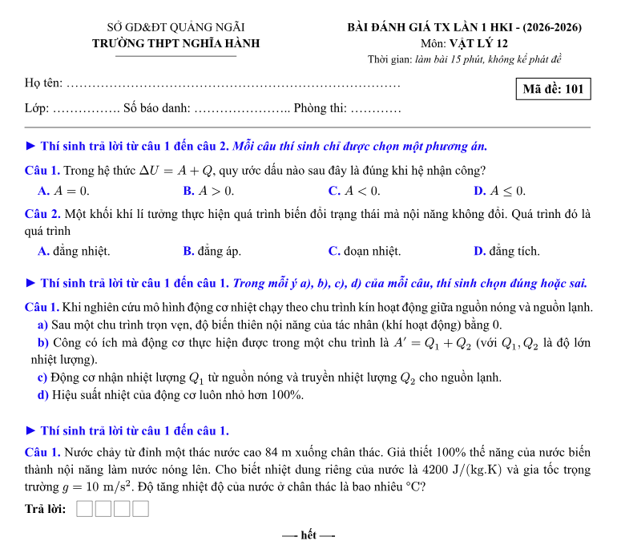
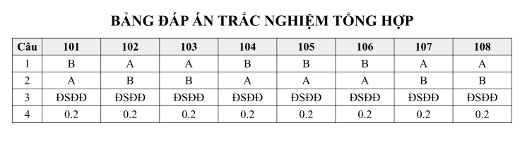
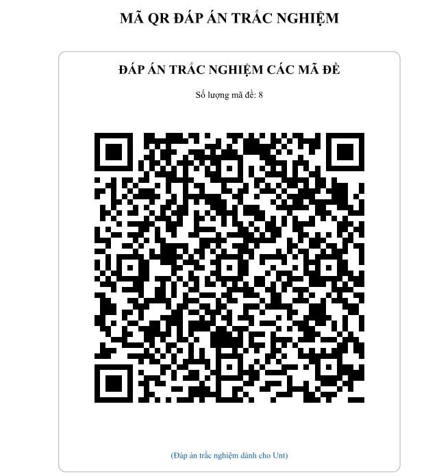

# v-exam: 0.1.0

Bộ công cụ biên soạn bài tập, tài liệu ôn tập và trộn đề thi trắc nghiệm / tự luận chuẩn định dạng Bộ Giáo dục & Đào tạo Việt Nam dành cho mọi môn học (Toán, Vật lý, Hóa học, Sinh học, Lịch sử, Địa lý, GDKT&PL, ...).

---

## 🚀 Tính năng nổi bật

- **Tự động trộn đề:** Trộn đảo phương án NLC, đảo ý $a, b, c, d$ của câu hỏi Đúng/Sai, hoán vị câu hỏi theo seed mã đề.
- **Tự động xuất bảng đáp án & mã QR:** Tạo bảng đáp án tổng hợp và mã QR cho phần mềm chấm thi tự động (như UNT, Chấm thi KC, ...).
- **Hỗ trợ câu hỏi chùm (Dữ kiện chung):** Tự động gom nhóm các câu hỏi con đi kèm đoạn văn cảnh/dữ kiện dùng chung mà không bị xáo rời rạc cho trường hợp câu hỏi chùm các môn.
- **Biên soạn bài tập nối tiếp (`exercise` / `bai-tap-in-line`):** Hỗ trợ biên soạn tài liệu giảng dạy, bài tập ôn tập chuyên đề có kèm lời giải chi tiết.

---

## 🖼️ Mẫu kết quả (Gallery)

<p align="center">
   <br>
   <br>
  
</p>

---

## 📦 Hướng dẫn sử dụng

### 1. Import thư viện

```typst
#import "@preview/v-exam:0.1.0": *
```

### 2. Định dạng ngân hàng câu hỏi

Ngân hàng câu hỏi được lưu dưới dạng mảng `array` các `dictionary`:

```typst
#let data = (
  // Câu hỏi đơn trắc nghiệm nhiều lựa chọn
  (
    type: "NLC",
    hv: none, // none: không có hình vẽ; hoặc image("đường dẫn"), canvas({})
    lv: 1, // lv: 1 - Nhận biết, 2 - Thông hiểu, 3 - Vận dụng
    nd: [Nội dung lời dẫn],
    pa: ([Phương án A], [Phương án B], [Phương án C], [Phương án D]),
    cot: 4, // cot: 1, 2 hoặc 4
    da: 0, // da: 0 - A, 1 - B, 2 - C, 3 - D
    lg: [Lời giải cho câu hỏi],
  ),
  // Câu hỏi chùm trắc nghiệm nhiều lựa chọn
  (
    type: "NLC",
    hv: none,
    lv: 1,
    is-chum: true,
    du-kien: [Nội dung dùng chung],
    cau-hoi-con: (
      (
        nd: [Nội dung lời dẫn câu hỏi 1],
        pa: ([Phương án A], [Phương án B], [Phương án C], [Phương án D]),
        cot: 4,
        da: 0,
        lg: [Lời giải cho câu hỏi 1],
      ),
      (
        nd: [Nội dung lời dẫn câu hỏi 2],
        pa: ([Phương án A], [Phương án B], [Phương án C], [Phương án D]),
        cot: 4,
        da: 0,
        lg: [Lời giải cho câu hỏi 2],
      ),
    ),
  ),
  // Câu hỏi đúng sai
  (
    type: "TF",
    hv: none,
    lv: 2,
    nd: [Lời dẫn của câu hỏi],
    ytf: (
      [nội dung ý a],
      [nội dung ý b],
      [nội dung ý c],
      [nội dung ý d],
    ),
    da: (1, 0, 1, 0), // 1 - đúng, 0 - sai
    lg: (
      [Lời giải cho ý a],
      [Lời giải cho ý b],
      [Lời giải cho ý c],
      [Lời giải cho ý d],
    ),
  ),
  // Câu hỏi trả lời ngắn đơn
  (
    type: "TLN",
    hv: none,
    lv: 2,
    nd: [Lời dẫn của câu hỏi],
    da: "1.25",
    lg: [Lời giải cho bài toán],
    dong_ke: 3,
  ),
  // Câu hỏi trả lời ngắn dạng chùm
  (
    type: "TLN",
    hv: none,
    lv: 1,
    is_chum: true,
    du_kien: [Nội dung dùng chung],
    cau_hoi_con: (
      (
        nd: [Nội dung lời dẫn câu hỏi 1],
        da: "12",
        lg: [Lời giải 1],
        dong_ke: 2,
      ),
      (
        nd: [Nội dung lời dẫn câu hỏi 2],
        da: "5",
        lg: [Lời giải 2],
        dong_ke: 2,
      ),
    ),
  ),
  // Câu hỏi tự luận
  (
    type: "TL",
    hv: none,
    lv: 2,
    nd: [Lời dẫn của câu hỏi],
    lg: [Lời giải cho bài toán],
    dong_ke: 5,
  ),
)
```

### 3. Biên soạn bài tập / Tài liệu ôn tập (`exercise` / `bai-tap-in-line`)

```typst
#import "@preview/v-exam:0.1.0": exercise, bai-tap-in-line

#exercise(
  data,
  cm: 1,
  num-nlc: (1, 0, 0),
  num-tf: (0, 1, 0),
  num-tln: (0, 1, 2),
  show-lg: true,
  seed: 123,
  theo-lv: true,
  dong-ke: 4,
)
```

### 4. Trộn đề thi

#### a) Trộn đề thi từ ngân hàng (`make-exam-matrix` / `tron-de-bank-level`)

Tạo các đề thi bằng cách rút ngẫu nhiên câu hỏi từ ngân hàng đề:

```typst
#let matrix = (
  (
    bank: data,
    NLC-dem: (1, 0, 0),
    tf-dem: (0, 1, 0),
    TLN-dem: (0, 1, 0),
    TL-dem: (0, 1, 0),
  ),
)

#let info = (
  so-gd: [SỞ GD VÀ ĐT QUẢNG NGÃI],
  truong: [TRƯỜNG THPT NGHĨA HÀNH],
  ky-thi: [KIỂM TRA GIỮA KỲ I],
  mon: [VẬT LÝ 12],
  thoi-gian: [45 phút],
  ds-ma-de: ("101", "102", "103", "104"),
)

// Gọi lệnh tạo đề:
#make-exam-matrix(matrix, info, show-lg: false, hien-thi-bang-dap-an: true, theo-lv: true)
// Hoặc alias tiếng Việt:
#tron-de-bank-level(matrix, info, show-lg: false, hienthi-bang-dap-an: true, theo-lv: true)
```

#### b) Trộn đề cùng nội dung (`make-exam-sync` / `tron-de-cung-noi-dung`)

Cùng một bộ câu hỏi nhưng xáo trộn vị trí câu và phương án giữa các mã đề:

```typst
#make-exam-sync(matrix, info, seed-goc: 2026, show-lg: false, hien-thi-bang-dap-an: true, theo-lv: false, xao-cau: true, xao-pa: true)
// Hoặc alias tiếng Việt:
#tron-de-cung-noi-dung(matrix, info, seed-goc: 2026, show-lg: false, hien-thi-bang-dap-an: true, theo-lv: false, xao-cau: true, xao-pa: true)
```

#### c) Trộn đề chỉ đảo ý/phương án (`make-exam-sub-only` / `tron-de-chi-y`)

Cố định thứ tự câu hỏi, chỉ hoán vị phương án hoặc các ý $a, b, c, d$:

```typst
#make-exam-sub-only(matrix, info, seed-goc: 2024, show-lg: false, hien-thi-bang-dap-an: true, tf-mode: "y-only", nlc-mode: "none", theo-lv: false)
// Hoặc alias tiếng Việt:
#tron-de-chi-y(matrix, info, seed-goc: 2024, show-lg: false, hien-thi-bang-dap-an: true, tf-mode: "y-only", nlc-mode: "none", theo-lv: false)
```

---

## 📜 Giấy phép

Phát hành theo giấy phép [MIT License](LICENSE).
