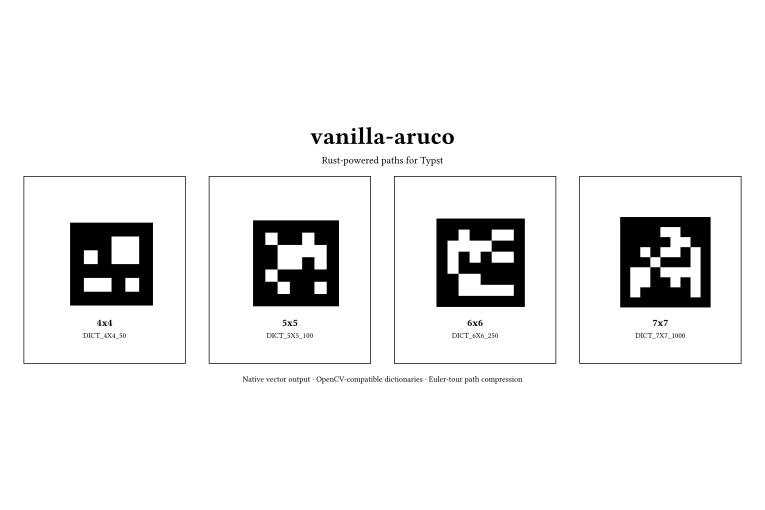

# vanilla-aruco

使用原生 Typst 矢量图形生成紧凑、可打印的 ArUco 码。包内使用 Rust/WASM
负责字典查找和边界路径优化，Typst 侧只保留一个公开入口：

> 开发说明：本项目在开发过程中大量使用了 LLM 辅助。将它用于生产环境或
> 安全关键场景前，请自行审阅并验证实现。

```typst
#import "@preview/vanilla-aruco:0.1.0": aruco

#aruco(23, size: 4cm)
#aruco(42, dictionary: "DICT_6X6_250", size: 4cm, rotation: 90)
```



## 特性

- 直接生成 `curve` 矢量路径，不经过栅格图像。
- Rust/WASM 实现暴露边图、Euler 回路和路径压缩。
- Typst 与 Rust 之间使用 CBOR 通信。
- 只有一个公开 API：`aruco`。
- 支持尺寸、quiet zone、旋转、前景色和背景色配置。

## 内置字典

内置码字兼容 OpenCV 的预定义 ArUco 字典：

- `DICT_4X4_{50,100,250,1000}`
- `DICT_5X5_{50,100,250,1000}`
- `DICT_6X6_{50,100,250,1000}`
- `DICT_7X7_{50,100,250,1000}`
- `DICT_ARUCO_ORIGINAL`
- `DICT_ARUCO_MIP_36h12`

通过 `dictionary: "DICT_6X6_250"` 选择字典。

## 示例

查看 [basic example](examples/basic.typ) 和简洁的黑白
[showcase](examples/showcase.typ)。打印或用于相机检测时建议保持默认的黑色前景。

## 实现原理

Rust 后端把黑色模块的暴露边转换成无向边图，按照直行/左转/右转优先级遍历，
使用 Hierholzer 算法拼接分支路径，再把共线边压缩成 `Horizontal` 和 `Vertical`
路径段。Typst 最后把它们组合成一个使用 even-odd 填充规则的 `curve`。

本包要求 Typst 0.13.0 或更新版本：`curve` 在 0.13 引入，CBOR 从 0.13
开始可以直接接收 bytes；Typst 0.15 移除了旧的 `.decode` 形式。

## 开发

```sh
cargo run --locked --manifest-path xtask/Cargo.toml -- build-wasm
cargo test --locked
typst compile --root . examples/showcase.typ /tmp/vanilla-aruco-showcase.pdf
```

CI 会在 push 和 pull request 时执行检查。Release 和 Typst packages 发布保持手动。

构建命令由无依赖的 Rust `xtask` 完成，实际的文件复制和进程调用使用 Rust
标准库，因此 Windows、macOS 和 Linux 使用同一套构建逻辑。

## 许可证

MIT。预定义字典数据的来源见 [NOTICE](NOTICE)。
