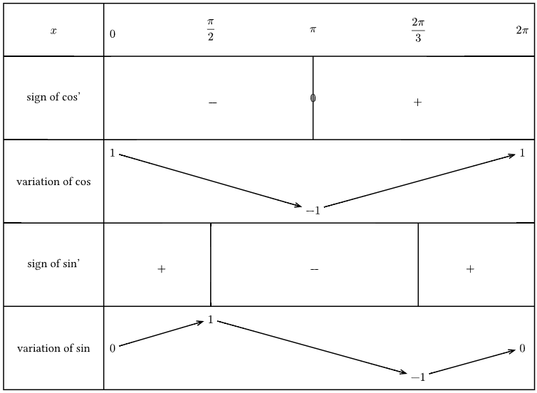
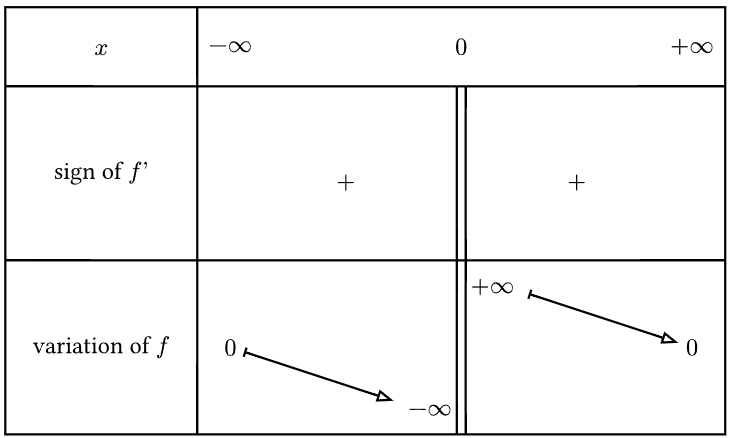

# VarTable

An easy way to render variation table on typst, built on [Cetz](https://github.com/cetz-package/cetz)\
The [documention](https://github.com/Le-foucheur/Typst-VarTable/blob/main/documentation.pdf)


```js
#import "@preview/Tabvar:0.2.0": tabvar
```
# Few examples

### Trigonometric functions
Turn this :
```js
#import "@preview/Tabvar:0.2.0": tabvar

#tabvar(
  init: (
    variable: $x$,
    label: (
      ([sign of cos’], "Sign"),
      ([variation of cos], "Variation"),
      ([sign of sin’], "Sign"),
      ([variation of sin], "Variation"),
    ),
  ),
  domain: ($0$, $ pi / 2 $, $ pi $, $ (2pi) / 3 $, $ 2 pi $),
  contents: (
    ($-$, (), ("0",$+$), ()),
    (
      (top, $1$),
      (),
      (bottom, $-1$),
      (),
      (top, $1$),
    ),
    ($+$, $-$, (), $+$),
    (
      (center, $0$),
      (top, $1$),
      (),
      (bottom, $-1$),
      (center, $0$),
    ),
  ),
)
```
Into this



### hyperbolic function $f(x) = 1/x $

```js
#import "@preview/Tabvar:0.1.0": tabvar

#tabvar(
  arrow-mark: (end: ">", start: "|"),
  init: (
    variable: $x$,
    label: (
      ([sign of $f’$], "Sign"),
      ([variation of $f$], "Variation"),
    ),
  ),
  domain: ($ -oo $, $ 0 $, $ +oo $),
  contents: (
    ($+$, ("||", $+$)),
    (
      (center, $0$),
      (bottom, top, "||", $ -oo $, $ +oo $),
      (center, $ 0 $),
    ),
  ),
)
```


## ·change log·

#### 0.2.0
- **Require :** typst version >= 0.13.0
- Now bluid on `Cetz 0.3.4` insted of fletcher
- rename stroke to table-style and now take the Cetz style type
- rename stroke-arrow to arrow-style and now take the Cetz style type
- rename arrow to arrow-mark and now take the Cetz mark type
- rename marks-line to line-style and now take the Cetz style type
- fix the bug (that was present on this readme)

#### 0.1.2 :
- Support `fletcher 0.5.2`

#### 0.1.1 :
- added customisation of separator bars between signs

##### 0.1.0 :
- publishing the package
