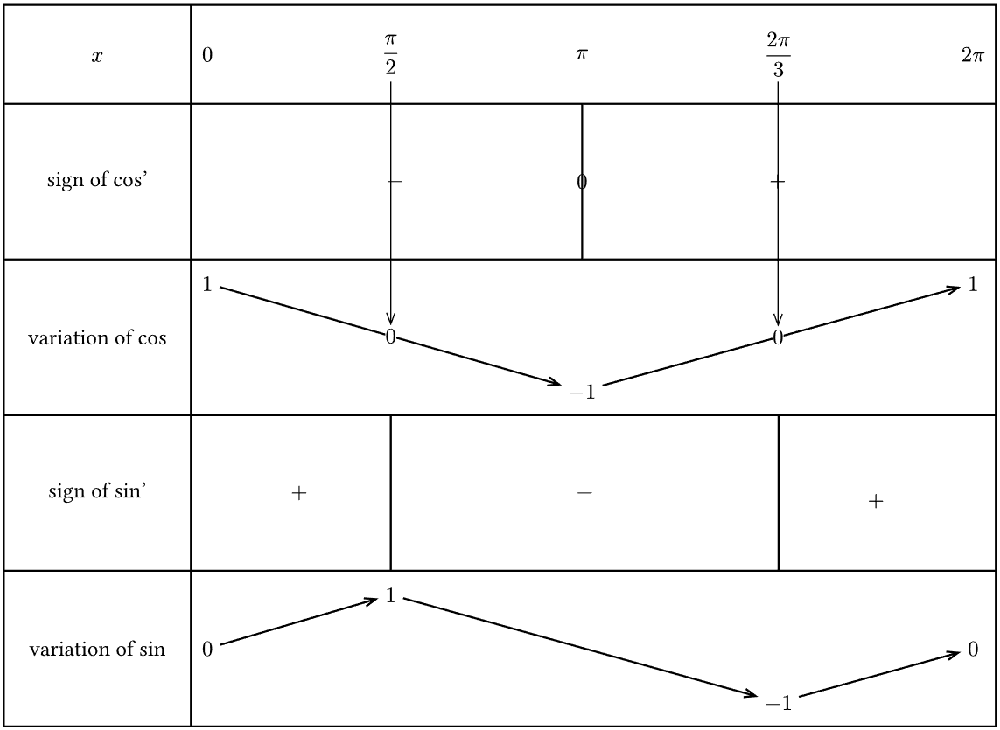
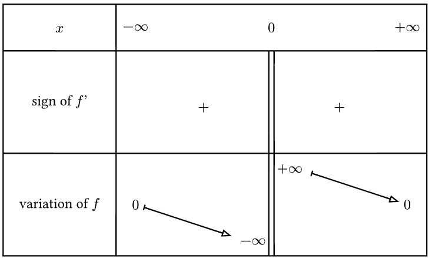
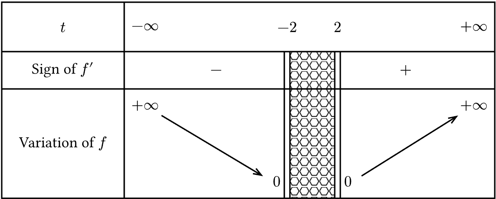

# VarTable 

An easy way to render variation table on typst, built on [Cetz](https://github.com/cetz-package/cetz)\
The [documention](https://github.com/Le-foucheur/Typst-VarTable/blob/main/documentation.pdf) ( English version )\
La [documention](https://github.com/Le-foucheur/Typst-VarTable/blob/main/documentationVF.pdf) ( Version française )


```js
#import "@preview/Tabvar:0.2.1": tabvar
```
# Few examples

### Trigonometric functions
Turn this :
```js
#import "@preview/Tabvar:0.2.1": tabvar

#tabvar(

  variable: $x$,
  label: (
    ([sign of cos’], "s"),
    ([variation of cos], "v"),
    ([sign of sin’], "s"),
    ([variation of sin], "v"),
  ),

  domain: ($0$, $ pi / 2 $, $ pi $, $ (2pi) / 3 $, $ 2 pi $),
  contents: (
    ($-$, (), ("0",$+$), ()),
    (
      (top, $1$),
      (),
      (bottom, $-1$),
      (),
      (top, $1$),
    ),
    ($+$, $-$, (), $+$),
    (
      (center, $0$),
      (top, $1$),
      (),
      (bottom, $-1$),
      (center, $0$),
    ),
  ),
  values: (
    ("arrow10.50%", $  $, $ 0 $, "f"),
    ("arrow12.49%", $  $, $ 0 $, "f"),
  )
)
```
Into this



### hyperbolic function $f(x) = 1/x $

```js
#import "@preview/Tabvar:0.2.1": tabvar

#tabvar(
  arrow-mark: (end: ">", start: "|"),
  variable: $x$,
  label: (
    ([sign of $f’$], "s"),
    ([variation of $f$], "v"),
  ),
  domain: ($ -oo $, $ 0 $, $ +oo $),
  contents: (
    ($+$, ("||", $+$)),
    (
      (center, $0$),
      (bottom, top, "||", $ -oo $, $ +oo $),
      (center, $ 0 $),
    ),
  ),
)
```


### A random function : $f(x) = \sqrt{x²-4}$ & $f'(x) = \frac {x} {\sqrt{x² - 4}}$

```js
#import "@preview/Tabvar:0.2.1": tabvar, hatch

#tabvar(
  variable: $t$,
  label: (
    ([Sign of $f’$], 1cm,"s"),
    ([Variation of $f$], "v"),
  ),
  hatching-style: hatch,
  domain: ($ -oo $,($ -2 $, 1cm),$ 2 $, $ +oo $),
  contents: (
    ( $ - $, "|h|", $ + $), 
    (
      (top, $ +oo $),
      (bottom,"|h", $ 0 $), 
      (bottom, "H|", $ 0 $),
      (top, $ +oo $)
    )
  )
)
```



## ·change log·

#### 0:2:1 :
- change "Variation" into "v"
- change "Sign" into "s"
- add the possibility to hatch some area 
- add the possibility to add some elements
- can change the table dimension
- support `Cetz 0.4.1`
- bug fix

#### 0.2.0 :
- **Require :** typst version >= 0.13.0
- Now bluid on `Cetz 0.3.4` insted of fletcher
- rename stroke to table-style and now take the Cetz style type
- rename stroke-arrow to arrow-style and now take the Cetz style type
- rename arrow to arrow-mark and now take the Cetz mark type
- rename marks-line to line-style and now take the Cetz style type
- fix the bug (that was present on this readme)

#### 0.1.2 :
- Support `fletcher 0.5.2`

#### 0.1.1 :
- added customisation of separator bars between signs

##### 0.1.0 :
- publishing the package
