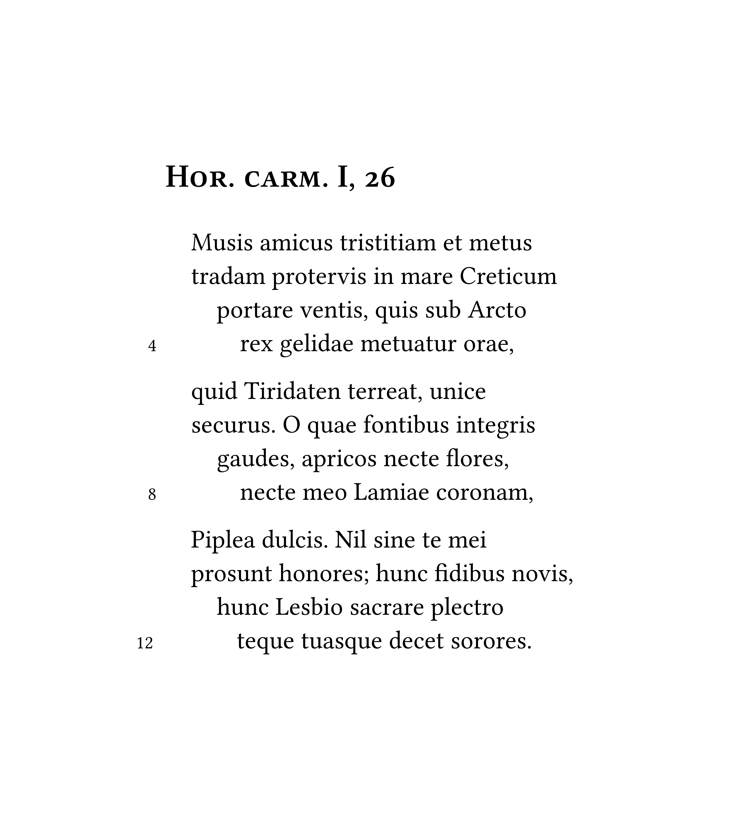

# verseatile

[](https://typst.app/universe/package/verseatile)
[](https://raw.githubusercontent.com/switchlex/verseatile/0.1.1/docs/manual.pdf)
[](./LICENSE)

verseatile is a small package for setting poetry with [Typst](https://github.com/typst/typst), capable of easily indenting and numbering verses while providing many options for customization.



## Getting started

To print a poem, simply use the #poem function:
```typst
#import "@preview/verseatile:0.1.1": *

#poem[Hor. carm. I, 26][

Musis amicus tristitiam et metus \
tradam protervis in mare Creticum \
portare ventis, quis sub Arcto \
rex gelidae metuatur orae,

quid Tiridaten terreat, unice \
securus. O quae fontibus integris \
gaudes, apricos necte flores, \
necte meo Lamiae coronam,

Piplea dulcis. Nil sine te mei \
prosunt honores; hunc fidibus novis, \
hunc Lesbio sacrare plectro \
teque tuasque decet sorores.

][0]
```

### Using indentpatterns

To configure the indentation of verses simply provide an indentpattern (such as 0012) as the thrid argument of the #poem function:

```typst
#poem[Hor. carm. I, 26][

Musis amicus tristitiam et metus \
tradam protervis in mare Creticum \
portare ventis, quis sub Arcto \
rex gelidae metuatur orae,

quid Tiridaten terreat, unice \
securus. O quae fontibus integris \
gaudes, apricos necte flores, \
necte meo Lamiae coronam,

Piplea dulcis. Nil sine te mei \
prosunt honores; hunc fidibus novis, \
hunc Lesbio sacrare plectro \
teque tuasque decet sorores.

][0012]
```

### Numbering verses

To display verse numbers toggle #show-verse-numbers:

```typst
#show-verse-numbers.update(true)
```

Verse numbers can also be customzied and set to number only every $n$-th verse:

```typst
#show <verse-number>: set text(
  size: 8pt)
#verse-number-modulo.update(2)
```

### Putting it all together

Utilizing both the indentpattern and numbering verses (while also customizing the style of the poemtitle) one might arrive at this simple, yet elegant rendition of our poem shown in the image at the beginning:

```typst
#import "@preview/verseatile:0.1.1": *

#show <poemtitle>: it => text(
  size: 14pt,
  weight: "medium",
  number-type: "old-style")[#smallcaps(it)]

#show-verse-numbers.update(true)
#show <verse-number>: set text(
  size: 8pt)
#verse-number-modulo.update(4)

#poem[Hor. carm. I, 26][

Musis amicus tristitiam et metus \
tradam protervis in mare Creticum \
portare ventis, quis sub Arcto \
rex gelidae metuatur orae,

quid Tiridaten terreat, unice \
securus. O quae fontibus integris \
gaudes, apricos necte flores, \
necte meo Lamiae coronam,

Piplea dulcis. Nil sine te mei \
prosunt honores; hunc fidibus novis, \
hunc Lesbio sacrare plectro \
teque tuasque decet sorores.

][0012]
```

## Advanced usage
For advanced usage such as customizing poemtitles, configuring inline poemtitles and printing cycles of poems confer [the manual](docs/manual.pdf).

## Changelog

### v.0.1.1

- New features
  - Made the distance between verse numbers and the poem configurable via `#verse-number-distance.update()`.
- Fixes
  - Reworked verse numbers to prevent them causing issues with indentation in certain constellations.
- Documentation
  - Updated the manual.

### v.0.1.0

Initial release.```

### Numbering verses

To display verse numbers toggle #show-verse-numbers:

```typst
#show-verse-numbers.update(true)
```

Verse numbers can also be customzied and set to number only every $n$-th verse:

```typst
#show <verse-number>: set text(
  size: 8pt)
#verse-number-modulo.update(2)
```

### Putting it all together

Utilizing both the indentpattern and numbering verses (while also customizing the style of the poemtitle) one might arrive at this simple, yet elegant rendition of our poem shown in the image at the beginning:

```typst
#import "@preview/verseatile:0.1.0": *

#show <poemtitle>: it => text(
  size: 14pt,
  weight: "medium",
  number-type: "old-style")[#smallcaps(it)]

#show-verse-numbers.update(true)
#show <verse-number>: set text(
  size: 8pt)
#verse-number-modulo.update(4)

#poem[Hor. carm. I, 26][

Musis amicus tristitiam et metus \
tradam protervis in mare Creticum \
portare ventis, quis sub Arcto \
rex gelidae metuatur orae,

quid Tiridaten terreat, unice \
securus. O quae fontibus integris \
gaudes, apricos necte flores, \
necte meo Lamiae coronam,

Piplea dulcis. Nil sine te mei \
prosunt honores; hunc fidibus novis, \
hunc Lesbio sacrare plectro \
teque tuasque decet sorores.

][0012]
```

## Advanced usage
For advanced usage such as customizing poemtitles, configuring inline poemtitles and printing cycles of poems confer [the manual](docs/manual.pdf).
