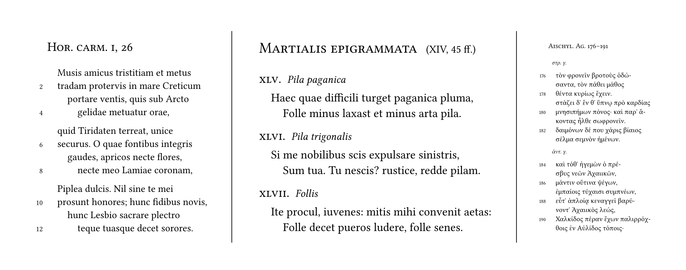

# verseatile

[](https://typst.app/universe/package/verseatile)
[](https://raw.githubusercontent.com/switchlex/verseatile/0.2.0/docs/manual.pdf)
[](./LICENSE)

verseatile is a small package for setting poetry with [Typst](https://github.com/typst/typst), capable of easily indenting and numbering verses while providing many options for customization.



## Getting started

To print a poem, simply use the #poem function:
```typst
#import "@preview/verseatile:0.2.0": *

#poem[Hor. carm. I, 26][

Musis amicus tristitiam et metus \
tradam protervis in mare Creticum \
portare ventis, quis sub Arcto \
rex gelidae metuatur orae,

quid Tiridaten terreat, unice \
securus. O quae fontibus integris \
gaudes, apricos necte flores, \
necte meo Lamiae coronam,

Piplea dulcis. Nil sine te mei \
prosunt honores; hunc fidibus novis, \
hunc Lesbio sacrare plectro \
teque tuasque decet sorores.

][0]
```

### Using indentpatterns

To configure the indentation of verses provide an indentpattern (such as 0012) as the thrid argument of the #poem function:

```typst
#poem[Hor. carm. I, 26][

Musis amicus tristitiam et metus \
tradam protervis in mare Creticum \
portare ventis, quis sub Arcto \
rex gelidae metuatur orae,

quid Tiridaten terreat, unice \
securus. O quae fontibus integris \
gaudes, apricos necte flores, \
necte meo Lamiae coronam,

Piplea dulcis. Nil sine te mei \
prosunt honores; hunc fidibus novis, \
hunc Lesbio sacrare plectro \
teque tuasque decet sorores.

][0012]
```

### Numbering verses

To display verse numbers toggle #show-verse-numbers:

```typst
#show-verse-numbers.update(true)
```

Verse numbers can also be set to number only every $n$-th verse:

```typst
#verse-number-modulo.update(2)
```

### Using presets

Presets are preconfigured style sets that can be used for simple and effective styling. To apply a preset use:

```typst
#show: preset-name
```

As of v.0.2.0 the following presets are included with the package:

- `classic`
  - `classic-headings`

### Putting it all together

Utilizing both the indentpattern and numbering verses while applying a preset, one might arrive at this simple, yet elegant rendition of our poem shown on the left in the [example image](examples/example.png) at the top of the page:

```typst
#import "@preview/verseatile:0.2.0": *

#show: preset-classic

#show-verse-numbers.update(true)
#verse-number-modulo.update(2)

#poem[Hor. carm. i, 26][

Musis amicus tristitiam et metus \
tradam protervis in mare Creticum \
portare ventis, quis sub Arcto \
gelidae metuatur orae,

quid Tiridaten terreat, unice \
securus. O quae fontibus integris \
gaudes, apricos necte flores, \
necte meo Lamiae coronam,

Piplea dulcis. Nil sine te mei \
prosunt honores; hunc fidibus novis, \
hunc Lesbio sacrare plectro \
teque tuasque decet sorores.

][0012]
```

## Advanced usage
For advanced usage such as inline poemtitles, interjections, dedications, splitting verses, setting cycles of poems as well as detailed options for customization confer the [manual](docs/manual.pdf).

## Changelog

### v.0.2.0

- New features:
  - Added presets.
  - Added interjections and dedications.
  - Added functionality to split verses via `#splitverse[]` and `#versesplit`.
  - Added subtitles for cycles and poems in cycles.
  - Made the indentation of the first verse of a stanza configurable via `#stanza-indent.update()`.
  - Made the starting verse number configurable via `#verse-numbers-start.update()`.
- Presets:
  - Added presets (`classic`, `classic-headings`).
- Fixes:
  - Reworked inline poemtitles to prevent false headings being displayed in the outline in certain constellations.
- Documentation:
  - Updated the manual.
  - Updated the readme.

### v.0.1.1

- New features:
  - Made the distance between verse numbers and the poem configurable via `#verse-number-distance.update()`.
- Fixes:
  - Reworked verse numbers to prevent them causing issues with indentation in certain constellations.
- Documentation:
  - Updated the manual.

### v.0.1.0

Initial release.
