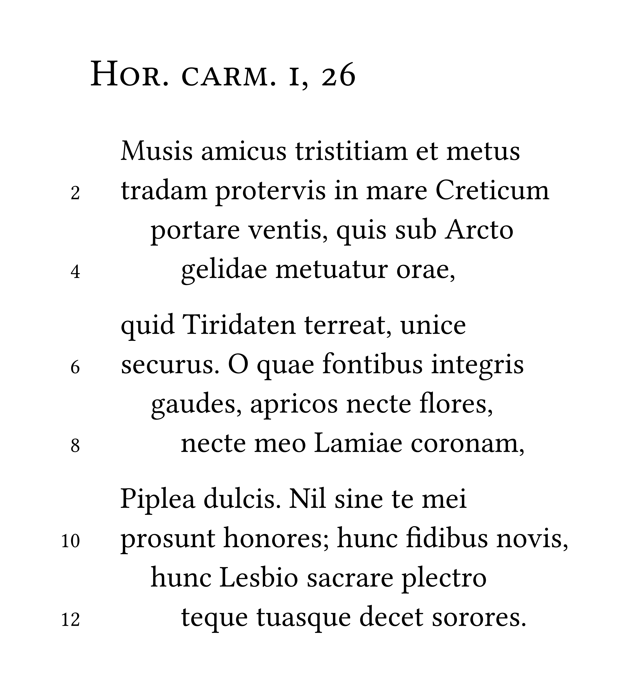
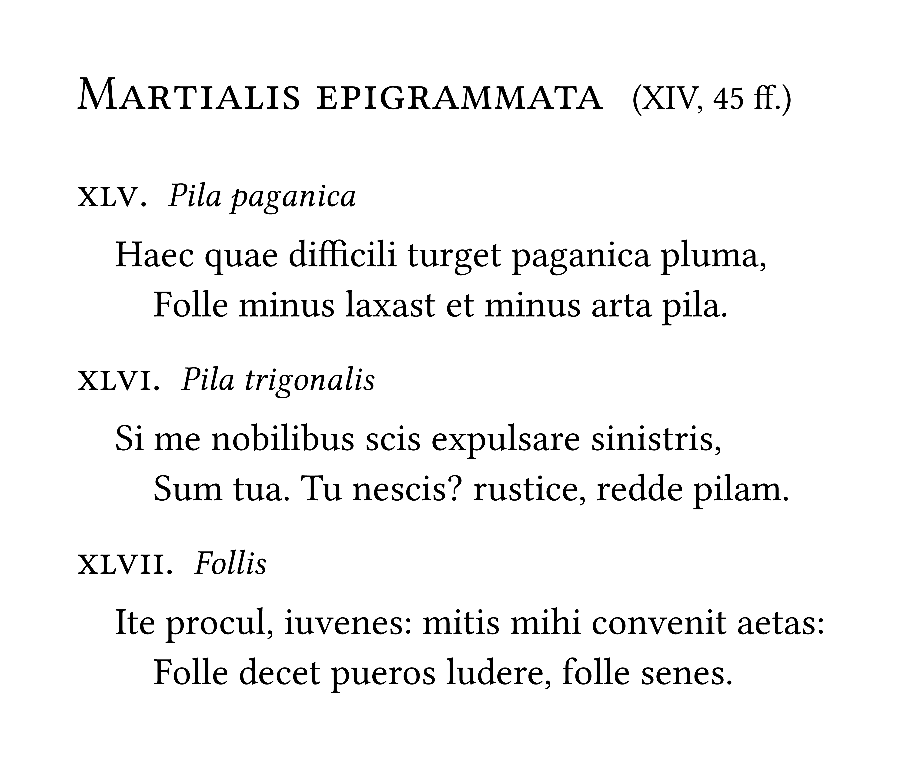
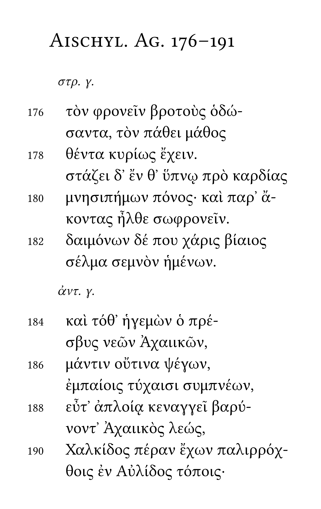

<div align="center">
  <picture>
    <source media="(prefers-color-scheme: dark)" srcset="docs/verseatile-logo-light.png">
    <source media="(prefers-color-scheme: light)" srcset="docs/verseatile-logo-dark.png">
    
  </picture>
</div>

<div align="center">

[](https://typst.app/universe/package/verseatile)
[](docs/manual.pdf)
[](./LICENSE)

</div>

---

<div align="center">
  
verseatile is a small package for setting poetry with [Typst](https://github.com/typst/typst), capable of easily indenting and numbering verses while providing many options for customization.

</div>

<table>
<tr>
  <td align="center" width="33%">
    <a href="examples/showcase-1.typ"></a>
  </td>
  <td align="center" width="33%">
    <a href="examples/showcase-2.typ"></a>
  </td>
  <td align="center" width="33%">
    <a href="examples/showcase-3.typ"></a>
  </td>
</tr>
</table>

<div align="center">
<sub> Click on any example to view the corresponding source code. </sub>
</div>

---

## Getting started

To print a poem, simply use the `#poem[poemtitle][poembody]` function:
```typst
#import "@preview/verseatile:0.2.2": *

#poem[Hor. carm. I, 26][
  Musis amicus tristitiam et metus \
  tradam protervis in mare Creticum \
  portare ventis, quis sub Arcto \
  rex gelidae metuatur orae,

  quid Tiridaten terreat, unice \
  securus. O quae fontibus integris \
  gaudes, apricos necte flores, \
  necte meo Lamiae coronam,

  Piplea dulcis. Nil sine te mei \
  prosunt honores; hunc fidibus novis, \
  hunc Lesbio sacrare plectro \
  teque tuasque decet sorores.]
```

### Using indentpatterns

To configure the indentation of verses provide an indentpattern (such as 0012) as the thrid argument of the `#poem[][]` function:

```typst
#poem[Hor. carm. I, 26][
  Musis amicus tristitiam et metus \
  tradam protervis in mare Creticum \
  portare ventis, quis sub Arcto \
  rex gelidae metuatur orae,

  quid Tiridaten terreat, unice \
  securus. O quae fontibus integris \
  gaudes, apricos necte flores, \
  necte meo Lamiae coronam,

  Piplea dulcis. Nil sine te mei \
  prosunt honores; hunc fidibus novis, \
  hunc Lesbio sacrare plectro \
  teque tuasque decet sorores.
][0012]
```

### Numbering verses

To display verse numbers toggle `#verse-numbering()`:

```typst
#verse-numbering(true)
```

Verse numbers can also be set to number only every n-th verse:

```typst
#verse-numbering(true, modulo: 2)
```

### Using presets

Presets are preconfigured style sets that can be used for simple and effective styling. To apply a preset use:

```typst
#show: preset-name
```

As of v.0.2.2 the following presets are included with the package:

- `classic`
  - `classic-headings`
- `elegant`
  - `elegant-headings`

### Putting it all together

Utilizing both the indentpattern and numbering verses while applying a preset, one might arrive at this simple, yet elegant rendition of our poem shown on the left in the [example image](examples/showcase-1.png) at the top of the page:

```typst
#import "@local/verseatile:0.2.2": *

#show: preset-classic

#verse-numbering(true, modulo: 2)

#poem[Hor. carm. i, 26][
  Musis amicus tristitiam et metus \
  tradam protervis in mare Creticum \
  portare ventis, quis sub Arcto \
  gelidae metuatur orae,

  quid Tiridaten terreat, unice \
  securus. O quae fontibus integris \
  gaudes, apricos necte flores, \
  necte meo Lamiae coronam,

  Piplea dulcis. Nil sine te mei \
  prosunt honores; hunc fidibus novis, \
  hunc Lesbio sacrare plectro \
  teque tuasque decet sorores.
][0012]
```

## Advanced usage

For advanced usage such as inline poemtitles, handling overhang for long verses, setting cycles of poems, interjections, dedications, splitting verses, as well as detailed options for customization confer the [manual](docs/manual.pdf).

## Changelog

### v.0.2.2

- New features:
  - Added functionality for more easily controlling options for indents, spacing and verse numbers via `#poem-options()` and `#verse-numbering()`.
  - Added functionality for handling overhang of long verses via `#overhang()`.
  - Added functionality for manually suppressing verse numbers via labeling verses with `<do-not-number>`.
  - Added dedications for cycles.
- Presets:
  - Added presets (`elegant`, `elegant-headings`).
- Fixes:
  - Completely rewrote the code for constructing the poembody introducing a modular tagging system.
  - Prevented issues with verse numbers when splitting verses over multiple stanzas.
  - Prevented issues with indentation when using stanza indents.
  - Made it obsolete to start or end the poembody with an empty line.
  - Made it optional to specify an indentpattern when using `#poem[][]`.
- Documentation:
  - Overhauled the manual.
- Backward compatibility: All versions (v.0.1.0 -- v.0.2.1). (Note the syntax changes for splitting verses!)

### v.0.2.1

- Fixes:
  - Prevented issues with interjections/split verses and verse numbers caused by the restructured code.
- Documentation:
  - Updated the manual.
- Backward compatibility: All versions (v.0.1.0 -- v.0.2.0).

### v.0.2.0

- New features:
  - Added presets.
  - Added interjections and dedications.
  - Added functionality to split verses via `#splitverse[]` and `#versesplit`.
  - Added subtitles for cycles and poems in cycles.
  - Made the indentation of the first verse of a stanza configurable via `#stanza-indent.update()`.
  - Made the starting verse number configurable via `#verse-numbers-start.update()`.
- Presets:
  - Added presets (`classic`, `classic-headings`).
- Fixes:
  - Prevented false headings being displayed in the outline when using inline poemtitles.
  - Restructered and commented the code.
- Documentation:
  - Updated the manual.
  - Updated the readme.
- Backward compatibility: All versions (v.0.1.0 -- v.0.1.1).

### v.0.1.1

- New features:
  - Made the distance between verse numbers and the poem configurable via `#verse-number-distance.update()`.
- Fixes:
  - Prevented issues with indentation when using verse numbers.
- Documentation:
  - Updated the manual.
- Backward compatibility: All versions (v.0.1.0).

### v.0.1.0

Initial release.
