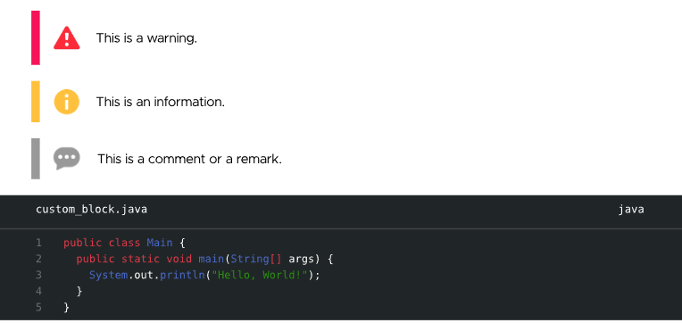

# Vibrant Color - Typst template

The Variant Color template is a Typst template that allows you to create reports with a vibrant color scheme. It was originally used for school reports, but it can be used for any type of report.

There are 4 different themes available : **blue**, **red**, **green** and **pastel**. It use the `vibrant-color` show rule.

## Table of contents

1. [Examples & Usage](#examples--usage)
1. [Fonts](#fonts)
1. [Notes](#notes)
1. [License](#license)
1. [Changelog](#changelog)

## Examples & Usage


| **Parameter**         | **Description**                                                                   | **Type**    | **Usage**                              |
| --------------------- | --------------------------------------------------------------------------------- | ----------- | -------------------------------------- |
| **title**             | Title of the report.                                                              | str         | "My Title"                             |
| **date**              | Date of the report mm/dd/yyyy. If lang is French, litteral date is supported.     | datetime    | datetime(day: 1, month: 2, year: 2025) |
| **theme**             | Theme color. 4 themes are actually supported : green, pastel, blue and red.       | str         | "pastel-theme"                         |
| **authors**           | Array of authors "LAST_NAME First_name". The first part is automatically in bold. | content     | ("DOE John", "SMITH Alice")            |
| **sub-authors**       | Group/team name, used on the footer when there is at least 2 authors.             | str         | "TEAM 1"                               |
| **subject**           | Topic of the report.                                                              | str         | "Mathematics"                          |
| **description**       | Description of the report.                                                        | str         | "My very cool report"                  |
| **bib-yaml**          | Path to a bib.yaml file for automatical bibliography.                             | str \| none | "./bib.yaml"                           |
| **lang**              | Language for the file corrector and the date (default is "fr").                   | str         | "fr"                                   |
| **heading-numbering** | Show heading numbering (default is false).                                        | bool        | false                                  |
| **image-cover**       | Optionnal path to an image to add on the cover.                                   | str \| none | "./images/cover.png"                   |
| **logo**              | Optionnal logo to display on cover and back.                                      | str \| none | "./images/logo.png"                    |

#### Example

A complete example illustrating the use of this template and all its features is available in the [github repository](https://github.com/SHAfoin/shafoin-typst-template/blob/main/example/example.pdf).

```typst

#import "@preview/vibrant-color-template:0.1.0": *

#show: doc => vibrant-color(
  theme: "green-theme",
  title: "My Report",
  authors: (
    "DOE John",
    "SMITH Alice",
  ),
  lang: "fr",
  sub-authors: "TEAM 1",
  description: "This is an example of how to use this template.",
  date: datetime(day: 10, month: 3, year: 2025),
  subject: "Mathematics",
  bib-yaml: "./example/refs.yaml",
  logo: "./example/my_logo.png",
  doc
)

== Step one

Do this

```

Additionnaly, custom blocks are available to show comments, warning and informations in a stylish way.

````typst

#warning("This is a warning.")

#info("This is an information.")

#comment("This is a comment or a remark.")

#codeblock(filename: "custom_block.java", line_number: true,
```java
public class Main {
  public static void main(String[] args) {
    System.out.println("Hello, World!");
  }
}
```)

````



## Fonts

For this template, the heading font is **Stretch Pro** with **Metropolis** for regular text. It is recommended to install those fonts for a better design.

> **\*Stretch Pro** is a particular font that has special effects on double letters (like "oo" or "ee"). It is an assumed choice to use this font, but it is not mandatory. If you want to use another font, you can change the `heading-fonts` variable in the template.\*

The fonts are all available on [the repository](https://github.com/SHAfoin/shafoin-typst-template/tree/main/font).

In case thoses fonts are not installed, the template will automatically use : **Arial** in the headings and in the body text.

## Notes

This template is being developed by Baptiste SALTEL in [this repository](https://github.com/SHAfoin/shafoin-typst-template).

Thanks to [RedPrismey](https://github.com/RedPrismey) for his help with bug fixes and improvements.

Special thanks to SkytAsul for inspiring in the creation on this template.

## License

The typst template is licensed under the [MIT license](https://github.com/SHAfoin/shafoin-typst-template/blob/main/LICENSE).

The fonts are licensed under their own licenses.

## Changelog

### 0.1.0

- Initial release
