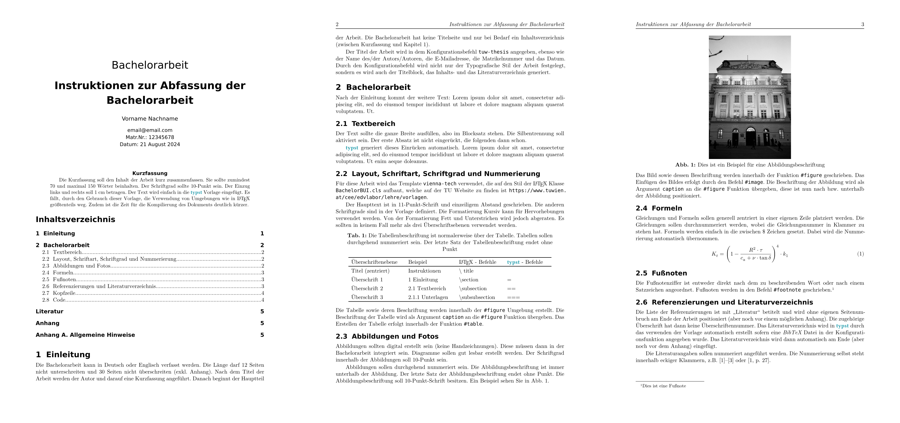

# The `vienna-tech` Template
<div align="center">Version 0.1.0</div>

This is a template, modeled after the LaTeX template provided by the Vienna University of Technology for Engineering Students. It is intended to be used as a starting point for writing Bachelor's or Master's theses, but can be adapted for other purposes as well. It shall be noted that this template is not an official template provided by the Vienna University of Technology, but rather a personal effort to provide a similar template in a new typesetting system.




## Getting Started

These instructions will help you set up the template on the typst web app. 

```typ
#import "@preview/vienna-tech:0.1.0": *

// Useing the configuration
#show: tuw-thesis.with(
  title: [Hier wird der Titel der Arbeit eingefügt.],
  thesis-type: [Bachelorarbeit],
  lang: "de",
  authors: (
    (
      name: "Vorname Nachname", 
      email: "email@email.com",
      matrnr: "12345678",
      date: datetime.today().display("[day] [month repr:long] [year]"),
    ),
  ),
  abstract: [Hier wird die Kurzfassung der Arbeit eingefügt.],
  bibliography: bibliography("bibliography.bib"), 
  appendix: [Hier wird der Anhang eingefügt.], 
    )
```

## Usage

These instructions will get you a copy of the project up and running on the typst web app. 

```bash
typst init @preview/vienna-tech:0.1.0
```

### Template overview

After setting up the template, you will have the following files:

- `main.typ`: the file which is used to compile the document
- `abstract.typ`: a file where you can put your abstract text
- `appendix.typ`: a file where you can put your appendix text
- `sections.typ`: a file which can include all your contents
- `refs.bib`: references

## Contribute to the template

Feel free to contribute to the template by opening a pull request. If you have any questions, feel free to open an issue.
Keep in mind that the release workflow is automated, and will be triggered by a push to the `main` branch.