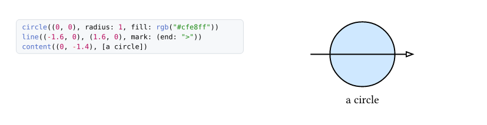

# visual-cetz

Show a CeTZ snippet **and its output**, side by side, from a single source.


```typ
#import "@preview/visual-cetz:0.1.0": ex

#ex(```
circle((0, 0), radius: 1, fill: rgb("#cfe8ff"))
line((-1.6, 0), (1.6, 0), mark: (end: ">"))
content((0, -1.4), [a circle])
```)
```



The point is that **the code you see is the code that ran**. Pasting a
snippet next to a picture of its result works for a month, then someone
fixes one and forgets the other, and the documentation starts lying. Here
there is one source: `ex()` takes a raw block, prints it verbatim, and
evaluates it. They cannot disagree.

## What you get

| | |
|---|---|
| `ex(src)` | a CeTZ canvas: code left, drawing right. `src` is the body of `cetz.canvas({ … })` — no need to write the canvas or the import |
| `exr(src)` | the same for **full Typst markup**, when the example produces something other than a figure |
| `note(body, title: …)` | a callout with a coloured rule |
| `api(sig, desc)` | a function signature with its one-line description |
| `with-scope(extra)` | add other libraries to the evaluation context |

Options on `ex`: `ratio` (share of the width taken by the code, 50 % by
default), `len` (canvas unit), `dbg` (draws CeTZ's own debug guides),
`scope`, and `style` (`fill`, `stroke`, `radius`, `size`).

## Using other libraries

`ex()` knows CeTZ only. Requiring `cetz-plot` or `cetz-venn` would force
their download on people who don't want them, and pin their versions. Add
them yourself:

```typ
#import "@preview/visual-cetz:0.1.0": ex, with-scope
#import "@preview/cetz-plot:0.1.4": plot

#let scope = with-scope((plot: plot))

#ex(scope: scope, ```
plot.plot(size: (5, 3), x-tick-step: 2, y-tick-step: 1, {
  plot.add(x => calc.sin(x), domain: (0, 6))
})
```)
```

## Two things worth knowing

**`eval` cannot see your imports.** It has no access to the file system
either. That is why the scope is passed explicitly, and why `exr()`
*displays* any `#import "@preview/…"` line but strips it before
evaluating — so the reader can copy the example, import line included,
while the rendering still works.

**Examples don't break across pages.** A snippet split with its code on one
page and its picture on the next says nothing, so the block is
`breakable: false`.

## The guide

This package was extracted from **Visual CeTZ**, a 51-page visual guide to
CeTZ 0.5.2 — 27 chapters, 200 examples, in the spirit of
[VisualTikZ](https://ctan.org/pkg/visualtikz).

**→ [`guide/Visual-CeTZ-0.5.2.pdf`](guide/Visual-CeTZ-0.5.2.pdf)**

Coordinates, shapes, styles, marks, anchors, groups, transforms, 3D,
boolean operations, decorations, angles, trees, palettes, vectors and
matrices, plotting and charts, Venn diagrams, SmartArt, and a chapter of
Euclidean geometry built from CeTZ primitives alone — triangle centres,
Euler line, nine-point circle, Simson, Napoleon, Ptolemy, conics.

The guide is built with this package, which is the honest test of it: its
sources are in `guide/`, and `guide/tpl.typ` imports
`@preview/visual-cetz:0.1.0` exactly as you would.

```sh
cd guide && typst compile main.typ
```

The guide is excluded from the downloaded bundle — it is 1.8 MB of PDF
against 8 kB of code — but stays browsable here on Universe.

## Licence
MIT

FERGOUS Abdelhak
