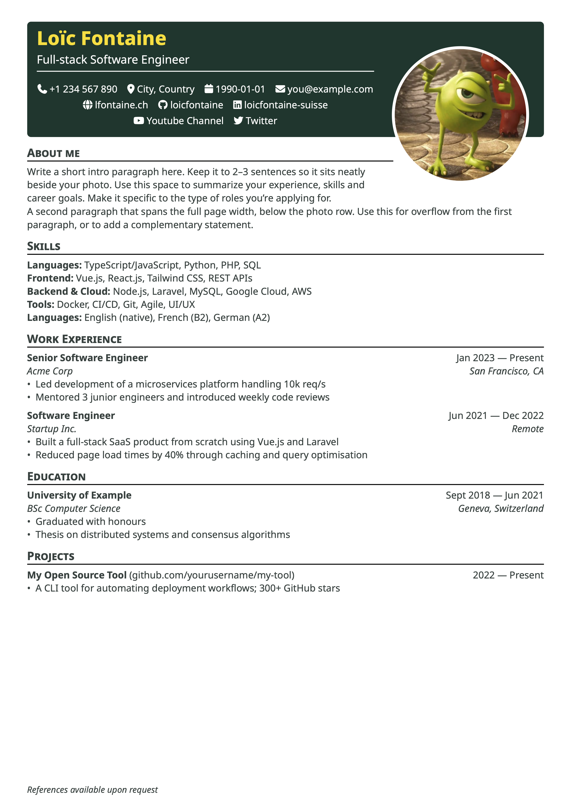

# vivid-cv

A clean and modern Typst resume template based on [Basic Resume](https://github.com/stuxf/basic-typst-resume-template), with a bold header banner, contact icons, and a flexible two-column intro section.

<p align="center">
  
</p>

## Features

- **ATS-friendly** — design-forward without sacrificing machine readability
- **Bold header banner** with name, title, and contact row
- **Font Awesome icons** for contact information (optional toggle)
- **Fully customizable colors** (header, name, headings, text, photo border)
- **Smart banner height estimation** based on contact items
- **Optional footer reference line** pinned at the bottom of the page
- **Section helpers** — `work`, `edu`, `project`, `certificates`, `extracurriculars`

## Quick start

Before compiling locally, install [Noto Sans](https://fonts.google.com/noto/specimen/Noto+Sans?preview.layout=grid&preview.script=Geor&query=Noto+sans) and the [Font Awesome fonts](https://fontawesome.com/download). On the Typst web app, upload their `.otf` files to a `fonts/` directory in your project. The Font Awesome import below is required when using custom icons.

```typst
#import "@preview/vivid-cv:0.1.1": *
#import "@preview/fontawesome:0.6.1": fa-icon

#show: resume.with(
  author: "Jane Doe",
  title: "Full-Stack Engineer",
  font: "Noto Sans",

  email: "jane@example.com",
  github: "janedoe",
  linkedin: "jane-doe",
  phone: "+1 234 567 890",
  location: "Zurich, Switzerland",
  personal-site: "janedoe.dev",
  custom: (
    (
      text: "@janedoe",
      icon: fa-icon("mastodon"),
      link: "https://mastodon.social/",
    ),
  ),

  about-title: "About me",
  about-beside: [
    Passionate engineer with 5+ years of experience
    building web applications from design to deployment.
  ],

  reference: "References available upon request",

  header-color: "#06332a",
  lang: "en",
)

== Work Experience

#work(
  title: "Senior Engineer",
  company: "Acme Corp",
  dates: dates-helper(start-date: "Jan 2022", end-date: "Present"),
  location: "Zurich, Switzerland",
)
- Led migration from monolith to microservices
```

## Parameters

### Identity & contact

| Parameter       | Type   | Default | Description                |
| --------------- | ------ | ------- | -------------------------- |
| `author`        | string | `""`    | Full name                  |
| `title`         | string | `""`    | Job title / tagline        |
| `pronouns`      | string | `""`    | Optional pronouns          |
| `birthdate`     | string | `""`    | Date of birth              |
| `location`      | string | `""`    | City, country              |
| `email`         | string | `""`    | Email                      |
| `phone`         | string | `""`    | Phone number               |
| `github`        | string | `""`    | GitHub username            |
| `linkedin`      | string | `""`    | LinkedIn username          |
| `personal-site` | string | `""`    | Website (without https://) |
| `orcid`         | string | `""`    | ORCID ID                   |
| `custom`        | array  | `()`    | Additional contact items   |

`custom` accepts a list of named tuples with `text`, `icon`, and `link`. The
`link` value is a prefix prepended to `text`, which is useful for links such as
social handles; set `icon` to `none` when no icon is needed.

```typst
custom: (
  (
    text: "janedoe",
    icon: fa-icon("youtube", solid: true),
    link: "https://youtube.com/@",
  ),
),
```

### Intro section

| Parameter      | Type    | Default      | Description                                            |
| -------------- | ------- | ------------ | ------------------------------------------------------ |
| `about-title`  | string  | `"About me"` | Section title (set `""` to hide)                       |
| `about-beside` | content | `[]`         | Text displayed beside the photo (~3 lines max)         |
| `about-below`  | content | `[]`         | Full-width text below the photo row (set `[]` to hide) |

### Photo

| Parameter    | Type   | Default              | Description                |
| ------------ | ------ | -------------------- | -------------------------- |
| `show-photo` | bool   | `true`               | Toggle photo column        |
| `photo`      | image  | `image("photo.jpg")` | Image function             |
| `photo-size` | length | `140pt`              | Diameter of circular photo |

### Colors

| Parameter       | Type   | Default     | Description              |
| --------------- | ------ | ----------- | ------------------------ |
| `header-color`  | string | `"#06332a"` | Banner background        |
| `name-color`    | string | `"#ffdf2b"` | Name color               |
| `heading-color` | string | `"#ffdf2b"` | Section heading color    |
| `text-color`    | string | `"#303f3c"` | Body text and link color |
| `photo-border`  | string | `"ffffff"`  | Photo border color       |

### Typography & layout

| Parameter           | Type       | Default       | Description                                   |
| ------------------- | ---------- | ------------- | --------------------------------------------- |
| `font`              | string     | `"Noto Sans"` | Font family                                   |
| `author-font-size`  | length     | `20pt`        | Name size                                     |
| `font-size`         | length     | `10pt`        | Body text size                                |
| `paper`             | string     | `"a4"`        | Paper size                                    |
| `lang`              | string     | `"en"`        | Language (affects hyphenation)                |
| `icon`              | bool       | `true`        | Enable Font Awesome icons                     |
| `reference`         | string     | `""`          | Footer line (empty = hidden)                  |
| `nb-lines-override` | int / none | `none`        | Number of contact rows to force in the banner |

## Section helpers

```typst
#work(title: "", company: "", dates: "", location: "")

#edu(institution: "", degree: "", dates: "", location: "", consistent: false)
// consistent: true → dates top-right, same layout as work entries

#project(role: "", name: "", url: "", dates: "")

#certificates(name: "", issuer: "", url: "", date: "")

#extracurriculars(activity: "", dates: "")

#dates-helper(start-date: "Jan 2020", end-date: "Present")
// → "Jan 2020 — Present" ; omit start-date for a single date
```

## Tips

**Multilingual support** — set `lang` for correct hyphenation and use any string for `about-title`:

```typst
lang: "fr",
about-title: "À propos",
```

**Two-paragraph intro** — use `about-beside` for a short text beside the photo, and `about-below` for a second paragraph spanning the full width below it:

```typst
about-beside: [Short intro that sits beside the photo.],
about-below:  [Longer second paragraph, full page width.],
```

**No photo** — set `show-photo: false` for a full-width layout.

**Banner height wrong?** — the template estimates the number of contact rows automatically. If a long URL or an unusual font causes a different number of rows to wrap, set `nb-lines-override` to the number of rows actually used:

```typst
nb-lines-override: 2,
```

## Fonts and icons

The template uses the [fontawesome](https://typst.app/universe/package/fontawesome/) Typst package for its contact icons. To render these icons locally, install the Font Awesome fonts on your system. You can download them from [Font Awesome](https://fontawesome.com/download).

When using the Typst web app, add a `fonts/` directory to your project and upload the `.otf` files from the Font Awesome download there. This makes the fonts available to the web compiler.

Custom contact icons use `fa-icon` from the same package. Import it in the file where you define your resume:

```typst
#import "@preview/fontawesome:0.6.1": fa-icon

custom: (
  (
    text: "@janedoe",
    icon: fa-icon("mastodon"),
    link: "https://mastodon.social/",
  ),
),
```

The example uses `Noto Sans`. If you compile locally with `font: "Noto Sans"`, install [Noto Sans](https://fonts.google.com/noto/specimen/Noto+Sans?preview.layout=grid&preview.script=Geor&query=Noto+sans) on your system. In the Typst web app, upload its font files to the same `fonts/` directory instead. You may choose another installed font by changing the `font` parameter.

**Local development** — before publishing, import directly from the source:

```typst
#import "../src/lib.typ": *
```

## Credits

Based on [Basic Resume](https://github.com/stuxf/basic-typst-resume-template) by stuxf, using the [fontawesome](https://typst.app/universe/package/fontawesome/) Typst package.

## License

MIT
