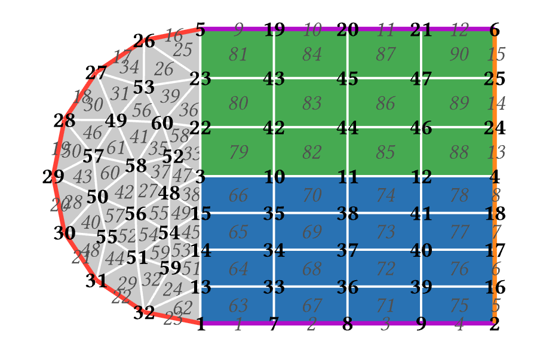
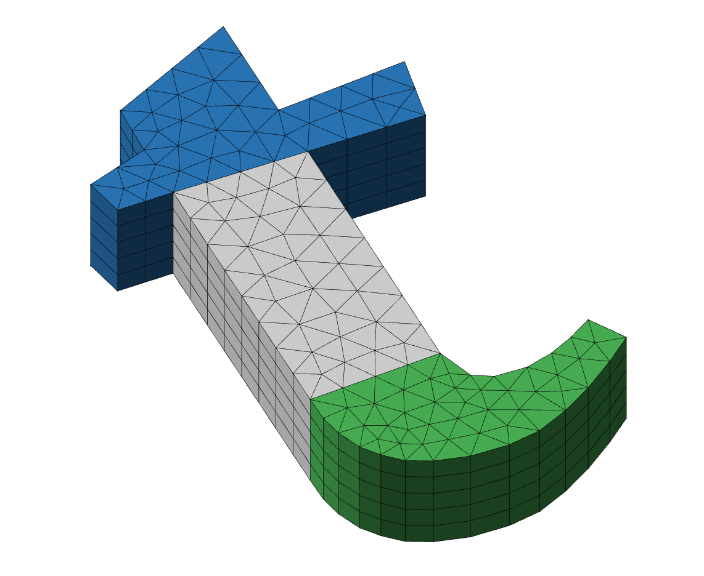

`vmesh` is a [Typst](https://github.com/typst/typst) package for visualizing [Gmsh](https://gmsh.info/) files.

## Usage

Export your mesh from Gmsh using the version 2.2 format:
```bash
gmsh typst.geo -2 -format msh2 -o typst.msh2
```

Then, import the package and visualize it in your document:

```typst
#import "@preview/vmesh:0.1.0": draw-mesh

#let mesh-data = read("assets/typst.msh2")

#figure(
  draw-mesh(
    mesh-data,
    width: 1.5cm,
  ),
)
```

## Examples

`vmesh` works with both 2D and 3D meshes.

[](examples/demo_2d.typ)

[](examples/demo_3d.typ)

## Configuration / Parameters

The `draw-mesh` function accepts the following parameters to customize your rendering:

| Parameter | Type | Default | Description |
| :--- | :--- | :--- | :--- |
| `mesh-data` | `dictionary` | **Required** | The parsed mesh dictionary from `parse-msh(read("..."))` or simply `read("...")` which the library parses internally. |
| `width`, `height` | `length` \| `auto` | `auto` | The dimensions of the rendered figure. |
| `mesh-stroke` | `stroke` | `0.5pt + white` | The line style for drawing the edges of the mesh. |
| `fill-elements` | `bool` | `true` | Whether to fill the 2D/3D faces of the mesh. |
| `color-map` | `dictionary` | *(built-in map)* | A dictionary mapping Domain IDs (strings) to a fill color. |
| `edge-stroke-map` | `dictionary` | `(:)` | A dictionary mapping Domain IDs (strings) to a custom edge stroke. |
| `pitch`, `yaw` | `angle` | `0deg` | 3D camera rotation angles. |
| `use-lighting` | `bool` | `true` | Enables automatic directional shading based on the camera view. |
| `light-direction` | `array` | `auto` | A 3-element array `(x, y, z)` overriding the directional light vector. |
| `show-axes` | `bool` | `false` | Displays the 3D coordinate triad (X/Y/Z). |
| `show-domain-ids` | `bool` | `false` | Renders floating text labels at the 3D center of mass for each physical group. |
| `show-node-ids` | `bool` | `false` | Renders the ID of every individual geometric node. |
| `show-element-ids` | `bool` | `false` | Renders the ID of every individual geometric element. |
| `id-size` | `length` | `6pt` | The font size used for all displayed IDs. |

## Dependencies
- [CeTZ](https://github.com/cetz-package/cetz)