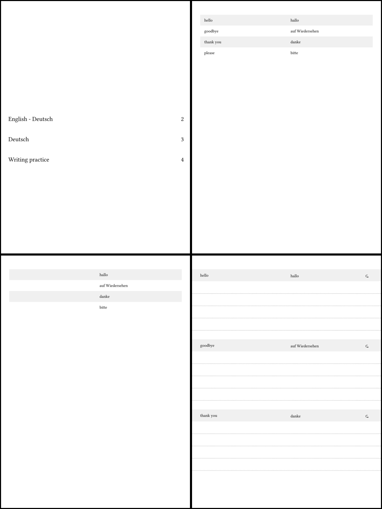

# Vocabulo - Vocabulary Training Pages

A [Typst](https://typst.app/) template to create vocabulary training pages,
geared towards paper tablets.

Based on a list of training words, the template creates an overview of the word
pairs. It also creates a section for each word pair with space to practice the
word.



### Features

- Custom sizes for paper tablets (margin for bar overlay)
- Variable number of practice lines
- Configurable colors
- Shuffle the words around

## Usage

### Basic Example

To get started use `typst init '@preview/vocabulo:0.2.0'`.
Then edit the `main.typ` and specify the words you want to train.

```typst
#import "@preview/vocabulo:0.2.0": *

#let words = (
  ("hello", "hallo"),
  ("goodbye", "auf Wiedersehen"),
  ("thank you", "danke"),
  ("please", "bitte"),
)

#show: vocabulo(
  words,
  ("English", "Deutsch"),  // (learning language, native language)
)
```

This will create training material optimized for the screen of a Remarkable
Paper Pro.

### Advanced Example

Define the `main.typ` file:

```typst
#import "@preview/vocabulo:0.2.0": *

#let filepath = sys.inputs.at("words", default: "words.csv")
#let words = csv(filepath)

#show: vocabulo(
  words,
  ("English", "Deutsch"),  // (learning language, native language)
  num-writing-lines: 6,
  seed: 40,
  theme: "blue",
)
```


With a file `day-one.csv`:
```csv
house, Haus
mouse, Maus
either, entweder
potato, Kartoffel
```

and a file `day-two.csv`:

```csv
garden, Garten
water, Wasser
bread, Brot
butter, Butter
```
create the PDFs with:

```sh
typst compile --input words=day-one.csv main.typ day-one.pdf
typst compile --input words=day-two.csv main.typ day-two.pdf
```

This overwrites the filepath variable and loads in the content of the files. So
it is not necessary to change the `main.typ` anymore, just provide a new set of
words to create new training material.

Also see [examples](examples) for a [minimal example](examples/minimal.typ)
([pdf](examples/minimal.pdf)) and one showing [more features](examples/full.typ)
([pdf](examples/full.pdf)).

### Template Content

The template will create different sections:
- Outline with links on the first page
- Table with only the left column filled
- Table with words
- Table with only the right column filled
- Tables for writing training

The intended flow is to open the document, jump to one of the tables not
containing both words, write in the missing words, compare with the full table,
and then go to the writing practice section.

This works best if the tables are short enough to fit on one page, but it will
also work across multiple pages.

### Parameters

- `words` (array): Vocabulary pairs loaded from CSV. Each pair should contain two columns: the word in the learning language and its translation in the native language.
- `langs` (tuple): A pair of language names as `(learning-language, native-language)`.
- `format` (string or tuple, default: `("remarkable", "paper-pro")`): Device or paper format. Can be:
  - Tuple format: `(manufacturer, model)` e.g., `("remarkable", "paper-pro")`, `("boox", "note-air5-c")`. See [@preview/slate-geometry](https://github.com/towoe/slate-geometry) for all available devices.
  - Standard paper sizes: `"a4"`, `"a5"`, `"a6"`, `"letter"`, etc.
- `flipped` (boolean, default: `false`): Rotate the page 90 degrees (landscape orientation)
- `num-writing-lines` (integer, default: `4`): Number of practice lines per word in the writing section
- `bar-pos` (string, default: `"top"`): Position of the device bar/margin. Options: `"top"`, `"bottom"`, `"left"`, `"right"`, or `none`
- `seed` (integer, optional): Random seed for shuffling word order. If provided, words will be shuffled consistently. Try different values to change the order.
- `theme` (string or dictionary, default: `"light"`): Color theme for the document
- `sections` (array, default: `("outline", "left", "full", "right", "writing")`): List of sections to include. Allows to customize the generated content.


### Themes

#### Predefined Themes

The template includes three built-in themes:

- `"light"`: Light theme with blue accents
- `"dark"`: Dark theme with muted blue accents
- `"blue"`: Light theme with blue accents
- `"green"`: Light theme with green accents

```typst
#show: vocabulo(
  words,
  ("English", "Deutsch"),
  theme: "green",
)
```

#### Custom Themes

You can create your own theme by providing a dictionary with the following required keys:

```typst
#let my-theme = (
  text: rgb("2c3e50"),           // Text color
  background: rgb("ecf0f1"),     // Main background color
  background-alt: rgb("d5dbdb"), // Alternate row background
  accent: rgb("f39c12"),         // Accent color (writing practice header)
  separator: rgb("95a5a6"),      // Separator lines color
)

#show: vocabulo(
  words,
  ("English", "Deutsch"),
  theme: my-theme,
)
```
