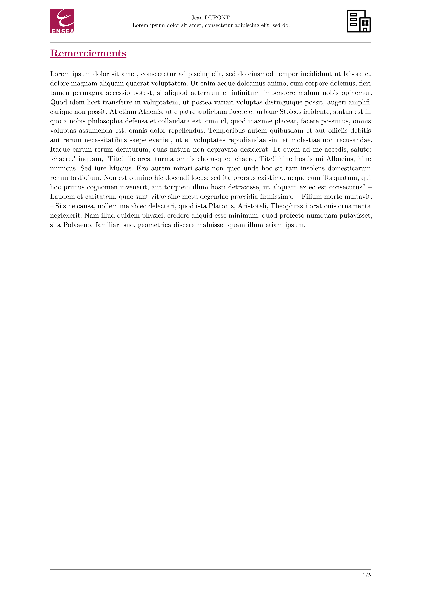

# ENSEA - Typst Internship Template (unofficial)

Unofficial template for internship reports at ENSEA, a French engineering school.

## Usage

Either use this template in the Typst web app:
```typst
#import "@preview/volt-internship-ensea:0.1.2": *
```
or use the command line to initialize a new project based on this template:
```typst
typst init @preview/volt-internship-ensea:0.1.2
```

## Default Values

| Parameter                | Default Value  | Description                            | Mandatory  |
|--------------------------|----------------|----------------------------------------|------------|
| `company-logo`            | `none`         | Path to the company logo               | ✅         |
| `authors`                | `none`         | Name(s) of the report author(s)        | ✅         |
| `student-info`            | `none`         | Information about the student(s)       | ✅         |
| `title`                  | `none`         | Title of the internship report         | ✅         |
| `internship-details`      | `none`         | Company name, location, duration, etc. | ✅         |
| `enable-list-figures`    | `true`         | Enable the list of figures             | ❌         |
| `enable-list-tables`     | `false`        | Enable the list of tables              | ❌         |
| `enable-glossary`         | `false`        | Enable the glossary                    | ❌         |
| `enable-abstract`         | `true`         | Enable the abstract                    | ❌         |
| `enable-bibliography`     | `true`         | Enable the bibliography                | ❌         |

## Example

```typst
#import "@preview/glossy:0.8.0": *
#show: init-glossary.with(yaml("glossary.yaml"), term-links: true)
#import "abstract.typ": *
#import "acknowledgements.typ": *
#import "appendices.typ": *

#import "@preview/volt-internship-ensea:0.1.2": *

#show: internship.with(
  abstract: abstract(),
  acknowledgements: acknowledgements(),
  appendices: annexes(),
  references: bibliography("references.bib", full: true),

  company-logo: image("media/logo.png"),
  authors: (
    "Jean DUPONT",
  ),
  student-info: [*Élève ingénieur en X#super[ème] année* #linebreak()
    Promotion 20XX #linebreak()
    Année 20XX/20XX],
  title: [#lorem(10)],
  internship-details: [Stage effectué du *1er mars au 30 août 2025*, au sein de la société *TechSolutions*, située à Paris.

    Sous la responsabilité de : #linebreak()
    - M. *Pierre LEFEVRE*, Directeur de la Stratégie #linebreak()
    - Mme *Marie DUBOIS*, Responsable des Opérations #linebreak()
  ],
  enable-list-figures: false,
  enable-bibliography: false,
)

= Introduction
#lorem(120)
```

<p align="center">
  
  
  <br/>
  
  
    <br/>
  
  
</p>

## Changelog

v0.1.2 : Fix import issue \
v0.1.1 : Fix import issue \
v0.1.0 : Initial release

## Contributions

If you find any issues or have suggestions for improvements, feel free to open an issue or submit a pull request. 

## License

The Typst template is licensed under the [MIT license](https://github.com/Dawod-G/ENSEA_Typst-Template/blob/main/LICENSE.md). This license does not apply to the ENSEA logo or associated image files, which remain the property of ENSEA.