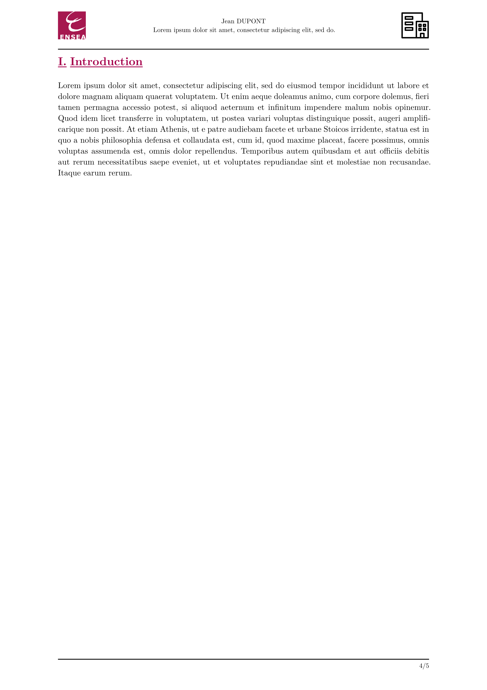
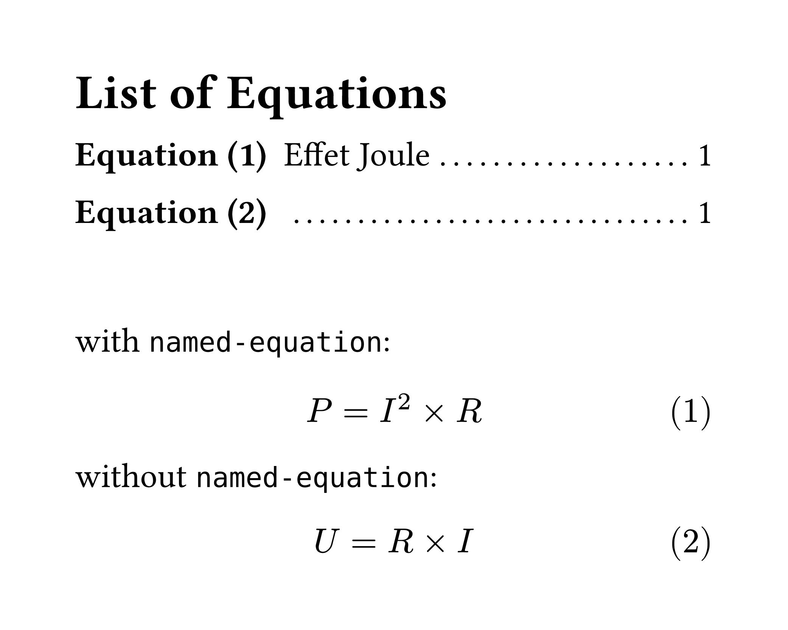

# ENSEA - Typst Internship Template (unofficial)

Unofficial template for internship reports at ENSEA, a French engineering school.

## README [here](https://github.com/Dawod-G/ENSEA_Typst-Template/blob/main/volt-internship-ensea/0.2.0/README.md)

## Usage

Either use this template in the Typst web app:
```typst
#import "@preview/volt-internship-ensea:0.2.0": *
```
or use the command line to initialize a new project based on this template:
```typst
typst init @preview/volt-internship-ensea:0.2.0
```

## Default Values

| Parameter                 | Default Value  | Description                             | Mandatory |
|---------------------------|----------------|-----------------------------------------|-----------|
| `company-logo`            | `none`         | Path to the company logo                | ✅        |
| `authors`                 | `none`         | Name(s) of the report author(s)         | ✅        |
| `student-info`            | `none`         | Information about the student(s)        | ✅        |
| `title`                   | `none`         | Title of the internship report          | ✅        |
| `internship-details`      | `none`         | Company name, location, duration, etc.  | ✅        |
| `enable-abstract`         | `true`         | Enable the abstract                     | ❌        |
| `enable-list-figures`     | `true`         | Enable the list of figures              | ❌        |
| `enable-list-tables`      | `false`        | Enable the list of tables               | ❌        |
| `enable-list-equations`   | `false`        | Enable the list of equations            | ❌        |
| `enable-list-appendices`  | `false`        | Enable the list of appendices           | ❌        |
| `enable-glossary`         | `false`        | Enable the glossary                     | ❌        |
| `enable-bibliography`     | `true`         | Enable the bibliography                 | ❌        |
| `enable-appendices`       | `true`         | Enable the appendices                   | ❌        |

## Example
```typst
#import "@preview/glossy:0.8.0": *
#show: init-glossary.with(yaml("glossary.yaml"), term-links: true)
#import "abstract.typ": *
#import "acknowledgements.typ": *
#import "appendices.typ": *

#import "@preview/volt-internship-ensea:0.2.0": *

#show: internship.with(
  abstract: abstract(),
  acknowledgements: acknowledgements(),
  appendices: annexes(),
  references: bibliography("references.bib", full: true),

  company-logo: image("media/logo.png"),
  authors: (
    "Jean DUPONT",
  ),
  student-info: [*Élève ingénieur en X#super[ème] année* #linebreak()
    Promotion 20XX #linebreak()
    Année 20XX/20XX],
  title: [#lorem(10)],
  internship-details: [Stage effectué du *1er mars au 30 août 2025*, au sein de la société *TechSolutions*, située à Paris.

    Sous la responsabilité de : #linebreak()
    - M. *Pierre LEFEVRE*, Directeur de la Stratégie #linebreak()
    - Mme *Marie DUBOIS*, Responsable des Opérations #linebreak()
  ],
  enable-list-figures: false,
  enable-bibliography: false,
)

= Introduction
#lorem(120)
```

<p align="center">
  
  
  <br/>
  
  
    <br/>
  
  
</p>

## Custom fonction
### `named-equation()`

The function `named-equation(equation, label, name)` associates a description and a label with an equation, allowing its name to be displayed in the list of equations.

```typst
#set math.equation(numbering: "(1)")

#outline(target: math.equation, title: "List of Equations") \

with `named-equation`:
#named-equation(
  $ P =I^2 times R $,
  <Effet-Joule>,
  [Effet Joule],
)

without `named-equation`:
$ U =R times I $
```

<p align="center">
  
</p>

### `abstract-config()`

The function `abstract-config(language, doc)` defines the border and background of the abstract based on the language parameter, which can take the values `FRENCH` or `ENGLISH`.

```typst
#abstract-config(language: "FRENCH")[
  #lorem(25)
]

#abstract-config(language: "ENGLISH")[
  #lorem(25)
]
```

<p align="center">
  
</p>

## Changelog

v0.2.0 :
- Add the function `named-equation()`  
- Add a list of equations and the variable `enable-list-equations`  
- Add equation numbering based on chapter (e.g., 1.1, 1.2, 2.1)  
- Add bold to equation numbering and figure prefix, and also to figure prefix in the list of tables and list of figures  
- Move the abstract just after the acknowledgements  
- Fix the link in the outline that isn't working  
- Fix appendices in outline for headings with level > 1  
- Fix groups in glossary  
- Fix heading spacing

v0.1.2 : Fix import issue  
v0.1.1 : Fix import issue  
v0.1.0 : Initial release

## Contributions

If you find any issues or have suggestions for improvements, feel free to open an issue or submit a pull request. 

## License

The Typst template is licensed under the [MIT license](https://github.com/Dawod-G/ENSEA_Typst-Template/blob/main/LICENSE.md). This license does not apply to the ENSEA logo or associated image files, which remain the property of ENSEA.